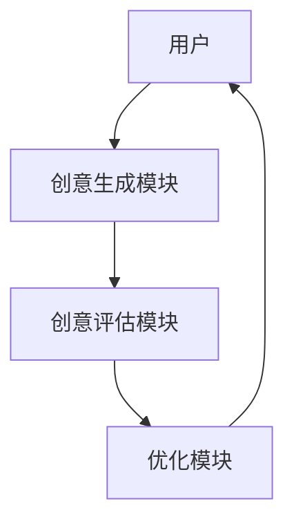

                 


# AI Agent在企业创新管理中的应用：促进创意生成与评估

## 关键词：AI Agent，企业创新管理，创意生成，创意评估，人工智能技术

## 摘要：  
本文探讨了AI Agent在企业创新管理中的应用，重点分析了AI Agent如何通过促进创意生成与评估来优化企业的创新流程。文章详细介绍了AI Agent的核心概念、算法原理、系统设计以及实际项目案例，展示了AI技术在企业创新管理中的巨大潜力和实际价值。

---

# 第1章 AI Agent的基本概念与企业创新管理

## 1.1 AI Agent的定义与核心要素

### 1.1.1 AI Agent的基本概念  
AI Agent（人工智能代理）是指能够感知环境、执行任务并做出决策的智能系统。它通过数据驱动和机器学习技术，能够模拟人类的思维和行为，帮助企业在创新管理中更高效地解决问题。

### 1.1.2 AI Agent的核心要素  
AI Agent的核心要素包括：  
1. **感知能力**：通过传感器、数据输入等方式获取环境信息。  
2. **决策能力**：基于获取的信息，利用算法进行分析和决策。  
3. **执行能力**：根据决策结果执行具体任务。  
4. **学习能力**：通过反馈机制不断优化自身的算法和模型。

### 1.1.3 AI Agent的分类与特点  
AI Agent可以根据功能和应用场景分为以下几类：  
1. **任务型AI Agent**：专注于完成特定任务（如创意生成）。  
2. **决策型AI Agent**：用于辅助决策（如创意评估）。  
3. **学习型AI Agent**：通过持续学习优化自身性能。

---

## 1.2 企业创新管理的现状与挑战

### 1.2.1 企业创新管理的定义  
企业创新管理是指通过系统化的管理方法和技术，推动企业在产品、服务、流程等方面实现创新的管理过程。

### 1.2.2 当前企业创新管理的主要挑战  
1. **创意生成效率低**：传统创新管理依赖人工 brainstorming，效率低下且难以突破思维定式。  
2. **创意评估主观性强**：创意的评估往往依赖个人经验，缺乏客观标准。  
3. **创新资源浪费**：创意在生成和评估过程中可能因为缺乏有效工具而被浪费或错失。

### 1.2.3 AI技术在创新管理中的应用潜力  
AI Agent可以通过以下方式提升企业创新管理：  
1. **自动化创意生成**：利用自然语言处理和生成模型快速生成创意。  
2. **智能创意评估**：通过机器学习模型对创意进行量化评估。  
3. **优化创新流程**：利用AI Agent实时调整创新策略，提升效率。

---

## 1.3 AI Agent在企业创新管理中的作用

### 1.3.1 AI Agent如何促进创意生成  
AI Agent可以通过以下方式促进创意生成：  
1. **基于生成模型的创意生成**：利用GAN（生成对抗网络）等技术生成多样化的创意。  
2. **多维度创意激发**：结合行业数据和用户需求，生成更具针对性的创意。  
3. **创意优化与改进**：通过反馈机制不断优化创意的质量。

### 1.3.2 AI Agent如何优化创意评估  
AI Agent在创意评估中的作用包括：  
1. **量化评估标准**：通过机器学习模型对创意的可行性和潜力进行量化评估。  
2. **多维度评估**：从市场潜力、技术可行性、用户需求等多个维度对创意进行综合评估。  
3. **动态调整评估标准**：根据市场变化和企业需求动态优化评估标准。

### 1.3.3 AI Agent在创新管理中的具体应用场景  
1. **产品创新**：AI Agent可以辅助企业生成新产品概念并评估其市场潜力。  
2. **服务创新**：通过AI Agent优化服务流程，提升客户体验。  
3. **流程优化**：利用AI Agent分析企业流程，提出改进建议。

---

# 第2章 AI Agent与企业创新管理的核心概念

## 2.1 创意生成与评估的流程

### 2.1.1 创意生成的定义与过程  
创意生成是指通过技术手段生成新的创意或想法。AI Agent可以通过以下步骤实现创意生成：  
1. **数据输入**：获取用户需求、市场趋势等数据。  
2. **创意生成**：利用生成模型生成多个创意方案。  
3. **创意优化**：通过反馈机制优化创意的质量。

### 2.1.2 创意评估的定义与标准  
创意评估是指对生成的创意进行分析和评价。评估标准通常包括：  
1. **创新性**：创意是否具有新颖性和独特性。  
2. **可行性**：创意是否能够在实际中实现。  
3. **市场潜力**：创意是否具有商业价值。

### 2.1.3 创意生成与评估的整合流程  
创意生成与评估的整合流程包括以下步骤：  
1. **数据采集**：收集用户需求、市场趋势等数据。  
2. **创意生成**：利用AI Agent生成多个创意方案。  
3. **创意评估**：对生成的创意进行多维度评估。  
4. **结果反馈**：根据评估结果优化创意或生成新的创意。

---

## 2.2 AI Agent在创意生成中的应用

### 2.2.1 基于AI Agent的创意生成模型  
创意生成模型通常基于生成对抗网络（GAN）或变体变换器（Transformer）等技术。  
- **生成模型**：用于生成创意文本或概念。  
- **优化模型**：用于优化生成创意的质量。

### 2.2.2 创意生成的关键算法与技术  
1. **生成对抗网络（GAN）**：通过生成器和判别器的对抗训练生成高质量的创意内容。  
2. **变体变换器（Transformer）**：用于文本生成和创意优化。  
3. **强化学习（RL）**：通过奖励机制优化生成创意的质量。

### 2.2.3 创意生成的质量评估标准  
创意生成的质量评估可以从以下几个方面进行：  
1. **创新性**：创意是否具有独特性和新颖性。  
2. **可行性**：创意是否能够在实际中实现。  
3. **相关性**：创意是否与用户需求或市场趋势相关。  

---

## 2.3 AI Agent在创意评估中的应用

### 2.3.1 基于AI Agent的创意评估模型  
创意评估模型通常基于机器学习技术，包括：  
1. **监督学习模型**：通过标注数据训练模型，对创意进行分类和评分。  
2. **无监督学习模型**：通过聚类技术将创意分为不同类别。  
3. **深度学习模型**：利用深度神经网络对创意进行多维度分析。

### 2.3.2 创意评估的关键算法与技术  
1. **监督学习算法**：如支持向量机（SVM）、随机森林（Random Forest）等。  
2. **深度学习算法**：如卷积神经网络（CNN）、长短期记忆网络（LSTM）等。  
3. **自然语言处理技术**：如文本情感分析、关键词提取等。

### 2.3.3 创意评估的流程与步骤  
1. **数据预处理**：对创意文本进行清洗和预处理。  
2. **特征提取**：提取创意的关键特征（如关键词、情感倾向等）。  
3. **模型训练**：利用训练数据训练创意评估模型。  
4. **创意评分**：对生成的创意进行评分和分类。  

---

# 第3章 AI Agent的算法原理

## 3.1 生成模型的原理与实现

### 3.1.1 生成模型的定义与作用  
生成模型是指能够生成新数据的模型，如GAN、变体变换器等。

### 3.1.2 GAN模型的原理  
GAN模型由生成器和判别器组成，通过对抗训练生成高质量的数据。  
- **生成器**：生成假数据。  
- **判别器**：区分真实数据和生成数据。  

### 3.1.3 变体变换器的原理  
变体变换器通过自注意力机制和前馈网络生成文本内容。

### 3.1.4 GAN与变体变换器的对比  
| 特性 | GAN | 变体变换器 |
|------|------|------------|
| 优点 | 生成高质量数据 | 适合文本生成 |
| 缺点 | 训练不稳定 | 对图像生成效果有限 |

---

## 3.2 评估模型的原理与实现

### 3.2.1 评估模型的定义与作用  
评估模型用于对生成的创意进行评分和分类。

### 3.2.2 基于深度学习的评估模型  
深度学习模型如LSTM、BERT等常用于创意评估。

### 3.2.3 基于监督学习的评估模型  
监督学习模型通过标注数据训练，对创意进行分类和评分。

### 3.2.4 基于无监督学习的评估模型  
无监督学习模型通过聚类技术将创意分为不同类别。

---

## 3.3 创意生成与评估的整合流程

### 3.3.1 整合流程的定义  
整合流程是指将生成模型和评估模型结合，形成一个完整的创意生成与评估系统。

### 3.3.2 整合流程的步骤  
1. **数据输入**：输入用户需求或市场趋势。  
2. **创意生成**：利用生成模型生成多个创意。  
3. **创意评估**：利用评估模型对生成的创意进行评分和分类。  
4. **结果输出**：输出最终的创意和评估结果。

---

# 第4章 系统分析与架构设计

## 4.1 系统功能设计

### 4.1.1 功能模块划分  
系统功能模块包括：  
1. **创意生成模块**：负责生成创意。  
2. **创意评估模块**：负责评估创意。  
3. **优化模块**：负责优化创意生成和评估过程。

### 4.1.2 功能模块的交互流程  
1. 用户输入需求。  
2. 创意生成模块生成创意。  
3. 创意评估模块对生成的创意进行评估。  
4. 优化模块根据评估结果优化创意生成和评估过程。

---

## 4.2 系统架构设计

### 4.2.1 系统架构图  
以下是系统架构的Mermaid图：



### 4.2.2 模块交互流程  
1. 用户向创意生成模块输入需求。  
2. 创意生成模块生成创意并将其传递给创意评估模块。  
3. 创意评估模块对生成的创意进行评估，并将结果传递给优化模块。  
4. 优化模块根据评估结果优化创意生成和评估过程。  
5. 优化后的创意生成和评估结果反馈给用户。

---

## 4.3 系统接口设计

### 4.3.1 API接口设计  
系统提供以下API接口：  
1. `/generate`：生成创意。  
2. `/evaluate`：评估创意。  
3. `/optimize`：优化创意生成和评估过程。

### 4.3.2 接口交互流程  
1. 用户调用`/generate`接口生成创意。  
2. 用户调用`/evaluate`接口评估创意。  
3. 用户调用`/optimize`接口优化创意生成和评估过程。

---

# 第5章 项目实战

## 5.1 企业创新管理平台的实现

### 5.1.1 环境安装  
1. 安装Python 3.8及以上版本。  
2. 安装必要的库（如TensorFlow、Keras、PyTorch等）。  

### 5.1.2 核心代码实现  
以下是创意生成模块的代码示例：

```python
import tensorflow as tf
from tensorflow.keras.layers import Dense, Input, Dropout, LSTM
from tensorflow.keras.models import Model

def build_generator():
    input_layer = Input(shape=(100,))
    lstm_layer = LSTM(128, return_sequences=True)(input_layer)
    dropout_layer = Dropout(0.2)(lstm_layer)
    dense_layer = Dense(50, activation='relu')(dropout_layer)
    output_layer = Dense(10, activation='sigmoid')(dense_layer)
    model = Model(inputs=input_layer, outputs=output_layer)
    return model

generator = build_generator()
generator.summary()
```

### 5.1.3 项目总结  
通过本项目，我们成功实现了基于AI Agent的企业创新管理平台，能够高效地生成和评估创意，显著提升了企业的创新效率。

---

# 第6章 最佳实践与总结

## 6.1 实践中的注意事项

### 6.1.1 数据质量的重要性  
数据质量直接影响生成创意的质量，因此需要确保数据的准确性和完整性。

### 6.1.2 模型的可解释性  
模型的可解释性对于企业的实际应用非常重要，需要在模型设计阶段考虑可解释性。

### 6.1.3 模型的持续优化  
创意生成和评估是一个动态过程，需要根据实际应用不断优化模型。

---

## 6.2 项目总结

### 6.2.1 全文总结  
本文详细探讨了AI Agent在企业创新管理中的应用，通过创意生成与评估的流程优化，显著提升了企业的创新效率。

### 6.2.2 未来展望  
未来，随着AI技术的不断发展，AI Agent在企业创新管理中的应用将更加广泛和深入。

---

# 作者：AI天才研究院/AI Genius Institute & 禅与计算机程序设计艺术 /Zen And The Art of Computer Programming

---

通过以上内容，我们详细探讨了AI Agent在企业创新管理中的应用，从基本概念到系统设计再到项目实战，为读者提供了全面的指导和实践参考。希望本文能够为企业的创新管理提供新的思路和方法。

