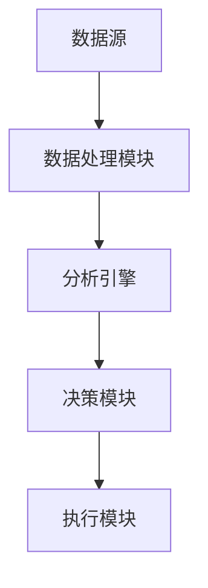

                 


# AI Agent在企业危机预警与应急响应中的关键作用

> 关键词：AI Agent, 企业危机预警, 应急响应, 人工智能, 危机管理, 智能代理

> 摘要：本文探讨了AI Agent在企业危机预警与应急响应中的关键作用。通过分析AI Agent的核心概念、算法原理、系统架构以及实际案例，展示了AI Agent如何通过智能化手段提升企业的危机应对能力，优化应急响应流程，降低企业风险。

---

## 第1章: 企业危机预警与应急响应的背景与问题描述

### 1.1 问题背景

#### 1.1.1 企业危机的定义与分类
企业危机是指在企业运营过程中，由于内外部因素的突发性事件或潜在风险，可能导致企业声誉、财务、法律或其他方面的严重损失。常见的企业危机包括：

1. **市场危机**：市场需求骤减、竞争加剧等。
2. **运营危机**：供应链中断、生产事故等。
3. **声誉危机**：负面新闻、客户投诉等。
4. **法律危机**：诉讼、合规问题等。

#### 1.1.2 危机对企业的影响与后果
企业危机往往会导致以下后果：

1. **经济损失**：销售额下降、成本增加、罚款等。
2. **声誉损失**：客户信任度下降，品牌形象受损。
3. **法律责任**：可能面临诉讼或行政处罚。
4. **员工士气下降**：员工信心受挫，影响工作效率。

#### 1.1.3 解决思路
传统的危机管理依赖于人工分析和经验判断，存在以下问题：

1. **反应速度慢**：人工分析需要时间，可能导致危机扩大。
2. **信息不全面**：依赖单点数据，难以全面评估风险。
3. **决策不确定性**：缺乏数据支持，决策可能存在偏差。

引入AI Agent可以有效弥补这些不足，通过实时数据监测、智能分析和自动化响应，提升危机管理的效率和准确性。

---

## 第2章: AI Agent的核心概念与原理

### 2.1 AI Agent的原理与机制

#### 2.1.1 AI Agent的基本原理
AI Agent是一种智能代理系统，能够感知环境、分析信息、做出决策并执行操作。在企业危机管理中，AI Agent通过以下步骤实现预警与应急响应：

1. **数据采集**：从企业内外部数据源收集相关信息。
2. **数据分析**：利用机器学习算法对数据进行建模、预测和分类。
3. **决策制定**：基于分析结果生成应对策略。
4. **执行操作**：自动化执行预定义的响应措施。

#### 2.1.2 危机预警与应急响应的逻辑流程
AI Agent的危机管理流程如下：

1. **实时监控**：持续监测企业内外部数据，包括市场动态、社交媒体舆情、供应链状态等。
2. **风险评估**：通过算法分析潜在风险，评估其严重性和影响范围。
3. **预警触发**：当风险超过预设阈值时，触发预警机制，通知相关人员。
4. **应急响应**：根据预警信息，快速制定应对方案并执行。

#### 2.1.3 AI Agent的决策机制与算法
AI Agent的决策机制基于多种算法，包括：

1. **监督学习**：用于分类任务，如舆情分类。
2. **无监督学习**：用于异常检测，如供应链异常检测。
3. **强化学习**：用于动态决策，如动态调整应急策略。

---

## 第3章: AI Agent在企业危机预警中的应用

### 3.1 基于时间序列分析的危机预警模型

#### 3.1.1 模型原理
时间序列分析是一种常用的数据挖掘技术，通过分析历史数据的模式，预测未来的趋势。AI Agent可以基于时间序列分析，预测企业的潜在风险。

#### 3.1.2 算法实现
以下是一个基于ARIMA（自回归积分滑动平均模型）的时间序列分析示例：

```python
from statsmodels.tsa.arima_model import ARIMA
import numpy as np

# 示例数据：企业销售额时间序列
data = [100, 120, 110, 130, 140, 150, 160, 170, 180, 190]

# 拟合ARIMA模型
model = ARIMA(data, order=(1, 1, 1))
model_fit = model.fit(disp=0)

# 预测下一个时间点的值
next_value, _ = model_fit.forecast(1)
print("预测值：", next_value[0])
```

#### 3.1.3 应用场景
时间序列分析适用于以下场景：

1. **销售预测**：预测未来的销售额，提前调整生产计划。
2. **供应链预测**：预测原材料需求，优化库存管理。
3. **舆情预测**：预测公众对企业行为的反应，提前制定应对策略。

---

## 第4章: 应急响应中的AI Agent实现

### 4.1 基于规则的应急响应系统

#### 4.1.1 系统设计
应急响应系统通常包括以下模块：

1. **数据采集模块**：实时采集企业内外部数据。
2. **风险评估模块**：分析数据，评估风险级别。
3. **决策模块**：根据风险级别，生成应急响应策略。
4. **执行模块**：自动化执行应急措施。

#### 4.1.2 系统实现
以下是一个简单的应急响应系统实现示例：

```python
# 数据采集模块
import requests

def get_external_data():
    # 示例：获取社交媒体舆情数据
    response = requests.get("http://example.com/api/sentiment")
    return response.json()

# 风险评估模块
def assess_risk(data):
    # 示例：评估舆情风险
    if data['sentiment_score'] < -0.5:
        return "高风险"
    elif data['sentiment_score'] < 0:
        return "中风险"
    else:
        return "低风险"

# 决策模块
def generate_response(risk_level):
    if risk_level == "高风险":
        return "立即采取公关措施，降低负面影响"
    elif risk_level == "中风险":
        return "加强监控，准备应对方案"
    else:
        return "继续监测，无需立即行动"

# 执行模块
def execute_response(action):
    # 示例：发送通知邮件
    print(f"执行操作：{action}")

# 主程序
data = get_external_data()
risk_level = assess_risk(data)
response_action = generate_response(risk_level)
execute_response(response_action)
```

---

## 第5章: AI Agent在企业危机管理中的系统设计

### 5.1 系统架构设计

#### 5.1.1 系统组成
AI Agent系统主要包括以下组件：

1. **数据源**：企业内外部数据源，如数据库、API接口等。
2. **数据处理模块**：对数据进行清洗、转换和存储。
3. **分析引擎**：基于机器学习算法进行风险评估和预测。
4. **决策模块**：根据分析结果生成应急响应策略。
5. **执行模块**：自动化执行预定义的操作。

#### 5.1.2 系统架构图


---

## 第6章: 项目实战——构建企业危机预警与应急响应系统

### 6.1 项目概述
本项目旨在构建一个基于AI Agent的企业危机预警与应急响应系统，实现对企业潜在风险的实时监测和自动化应对。

### 6.2 项目实现

#### 6.2.1 环境搭建
- 安装Python和必要的库（如NumPy、Pandas、Scikit-learn、Statsmodels）。

#### 6.2.2 核心功能实现
- 数据采集模块：从企业数据库和外部API获取数据。
- 风险评估模块：基于机器学习算法进行风险预测。
- 决策模块：根据风险级别生成应急响应策略。
- 执行模块：自动化执行预定义的操作。

#### 6.2.3 代码示例
以下是一个简单的风险评估模块实现：

```python
from sklearn.ensemble import RandomForestClassifier
import pandas as pd

# 示例数据：企业运营数据
data = pd.DataFrame({
    'feature1': [1, 2, 3, 4, 5],
    'feature2': [5, 4, 3, 2, 1],
    'label': [0, 1, 0, 1, 0]
})

# 训练随机森林模型
model = RandomForestClassifier()
model.fit(data[['feature1', 'feature2']], data['label'])

# 预测新样本
new_sample = pd.DataFrame({
    'feature1': [3],
    'feature2': [4]
})
prediction = model.predict(new_sample[['feature1', 'feature2']])
print("预测结果：", prediction[0])
```

---

## 第7章: 最佳实践与总结

### 7.1 最佳实践
1. **数据质量**：确保数据的准确性和完整性，数据预处理是关键。
2. **模型选择**：根据具体场景选择合适的算法，避免过度复杂的模型。
3. **系统监控**：实时监控系统的运行状态，及时发现并解决问题。

### 7.2 小结
本文详细探讨了AI Agent在企业危机预警与应急响应中的关键作用，从理论到实践，展示了如何通过智能化手段提升企业的危机应对能力。

### 7.3 注意事项
- AI Agent系统需要持续优化，根据实际情况调整模型和策略。
- 系统的安全性和隐私保护是重中之重，确保数据不被滥用。

### 7.4 拓展阅读
1. 《Data Mining: Concepts and Techniques》
2. 《机器学习实战》
3. 《企业风险管理：从战略到操作》

---

作者：AI天才研究院 & 禅与计算机程序设计艺术

