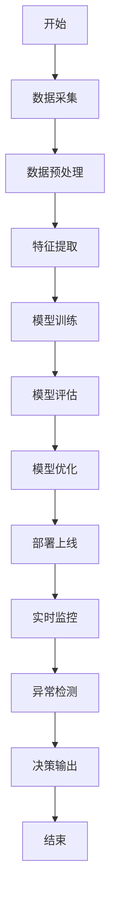

                 


```markdown
# AI Agent在企业反欺诈与风险控制中的应用

> 关键词：AI Agent，反欺诈，风险控制，企业安全，人工智能，机器学习

> 摘要：本文深入探讨了AI Agent在企业反欺诈与风险控制中的应用，分析了其核心概念、算法原理、系统架构及实际项目案例。通过详细的技术分析和实例解读，揭示了AI Agent如何助力企业提升反欺诈能力，并优化风险控制流程，为企业安全保驾护航。

---

## 第一部分：AI Agent在企业反欺诈与风险控制中的应用概述

### 第1章：反欺诈与风险控制的背景与挑战

#### 1.1 企业反欺诈的背景与现状

- **1.1.1 欺诈行为对企业的影响**
  - 欺诈行为对企业财务损失的具体表现。
  - 欺诈行为对品牌形象和客户信任度的破坏。
  - 数字化转型背景下，欺诈手段的多样化与复杂化。

- **1.1.2 传统反欺诈手段的局限性**
  - 传统规则引擎的局限性：规则固定、难以应对新型欺诈手段。
  - 人工审核的低效性：耗时长、成本高、覆盖面有限。
  - 数据孤岛问题：企业内部数据分散，难以形成有效联动。

- **1.1.3 AI Agent在反欺诈中的优势**
  - 自动化识别：实时分析交易数据，快速识别异常行为。
  - 智能学习：通过机器学习不断优化识别模型。
  - 多维度分析：结合行为数据、交易数据、设备信息等多种数据源进行综合判断。

#### 1.2 风险控制的重要性

- **1.2.1 风险控制的基本概念**
  - 风险控制的定义与分类。
  - 企业风险管理的核心目标。

- **1.2.2 企业风险控制的常见挑战**
  - 数据量大、类型多，难以有效处理。
  - 风险模型的复杂性与动态变化。
  - 如何在风险控制中平衡效率与成本。

- **1.2.3 AI Agent在风险控制中的应用前景**
  - AI Agent如何通过实时监控和预测分析降低风险。
  - 通过动态调整策略，实现精准风险控制。
  - AI Agent在风险评估中的智能化提升。

---

### 第2章：AI Agent的基本概念与核心原理

#### 2.1 AI Agent的定义与特点

- **2.1.1 AI Agent的定义**
  - AI Agent的定义：具备自主决策能力的智能体。
  - 与传统算法的区别：能够根据环境反馈动态调整策略。

- **2.1.2 AI Agent的核心特点**
  - 智能性：能够理解并处理复杂信息。
  - 自主性：无需人工干预，独立执行任务。
  - 适应性：能够根据环境变化调整行为。
  - 学习能力：通过数据不断优化自身性能。

- **2.1.3 AI Agent与传统算法的区别**
  - 知识表示：AI Agent具备知识库，能够进行推理。
  - 行为决策：AI Agent具备目标导向性，能够主动采取行动。
  - 自我优化：AI Agent能够通过反馈不断改进自身性能。

#### 2.2 AI Agent在反欺诈中的工作原理

- **2.2.1 数据采集与处理**
  - 数据来源：交易记录、用户行为数据、设备信息等。
  - 数据清洗：去除噪声数据，确保数据质量。
  - 数据特征提取：提取关键特征，如交易金额、时间间隔、地理位置等。

- **2.2.2 模型训练与优化**
  - 监督学习：使用标记数据训练分类模型。
  - 无监督学习：发现数据中的异常模式。
  - 强化学习：通过奖励机制优化决策策略。

- **2.2.3 实时监控与决策**
  - 实时数据分析：对当前交易进行实时监控。
  - 异常检测：识别潜在的欺诈行为。
  - 自动决策：根据模型输出结果采取相应措施，如拦截交易或触发警报。

#### 2.3 AI Agent与其他技术的关系

- **2.3.1 AI Agent与大数据技术的结合**
  - 大数据技术为AI Agent提供了海量数据支持。
  - 分布式计算框架（如Hadoop、Spark）加速数据处理。

- **2.3.2 AI Agent与机器学习的关系**
  - 机器学习是AI Agent的核心技术之一。
  - AI Agent通过机器学习模型实现智能决策。

- **2.3.3 AI Agent与区块链技术的融合**
  - 区块链技术提供数据不可篡改性，增强数据信任度。
  - 结合AI Agent实现更安全的交易验证。

---

### 第3章：AI Agent的核心概念与联系

#### 3.1 核心概念的原理分析

- **数据驱动的决策机制**
  - 数据的收集、处理与分析是AI Agent决策的基础。
  - 利用大数据技术进行实时数据分析，确保决策的准确性。

- **自适应学习能力**
  - 基于机器学习的自适应算法，能够根据新数据自动调整模型。
  - 在不断变化的欺诈手段中保持高识别率。

- **实时监控与动态调整**
  - 实时监控系统运行状态，及时发现异常。
  - 根据监控结果动态调整策略，优化反欺诈效果。

#### 3.2 核心概念的对比表格

| 概念         | 特点                                   | 示例应用                       |
|--------------|--------------------------------------|------------------------------|
| 数据驱动     | 依赖大量数据进行分析与决策           | 通过交易数据分析识别欺诈行为 |
| 自适应学习   | 能够根据新数据自动优化模型           | 在面对新型欺诈手段时自动调整识别策略 |
| 实时监控     | 对实时数据进行分析，快速做出反应     | 在线支付系统实时监控交易异常 |

#### 3.3 ER实体关系图

```mermaid
erDiagram
    customer[CUSTOMER] {
        +id: integer
        +name: string
        +email: string
    }
    transaction[TRANSACTION] {
        +id: integer
        +amount: decimal
        +time: datetime
        +status: string
        +customerId: integer
    }
    fraud[FRAUD] {
        +id: integer
        +score: decimal
        +timestamp: datetime
        +transactionId: integer
    }
    CUSTOMER "1..n" -- "1..n" TRANSACTION
    TRANSACTION "1" -- "1" FRAUD
```

---

### 第4章：AI Agent在企业反欺诈中的算法实现

#### 4.1 算法原理与流程图



#### 4.2 算法的数学模型与公式

- **监督学习模型**
  - 损失函数：$$ L(y, \hat{y}) = \sum_{i=1}^{n} (y_i - \hat{y}_i)^2 $$
  - 优化目标：$$ \min_{\theta} L(y, h_\theta(x)) $$

- **无监督学习模型**
  - 聚类算法：$$ \text{目标函数} = \sum_{i=1}^{n} \sum_{j=1}^{k} w_{ij}d_{ij} $$

- **强化学习模型**
  - 奖励函数：$$ R(s, a) = r_1 + r_2 + \dots + r_n $$

#### 4.3 算法实现的Python代码示例

```python
import numpy as np
from sklearn.tree import DecisionTreeClassifier

# 示例数据
X = np.array([[1, 2], [3, 4], [5, 6], [7, 8]])
y = np.array([0, 1, 0, 1])

# 训练决策树模型
model = DecisionTreeClassifier()
model.fit(X, y)

# 预测新数据
new_data = np.array([[2, 3]])
prediction = model.predict(new_data)
print("预测结果:", prediction)
```

---

### 第5章：系统架构与设计

#### 5.1 系统功能设计

- **数据采集模块**
  - 从数据库、日志文件等来源采集数据。
  - 支持多种数据格式的解析与处理。

- **特征提取模块**
  - 提取交易金额、时间、地理位置等特征。
  - 对特征进行标准化或归一化处理。

- **模型训练模块**
  - 使用机器学习算法训练反欺诈模型。
  - 支持模型的迭代优化与版本管理。

- **实时监控模块**
  - 实时接收交易数据，进行异常检测。
  - 根据模型输出结果做出决策。

#### 5.2 系统架构图


---

## 第二部分：项目实战与案例分析

### 第6章：项目实战

#### 6.1 环境安装与配置

- **安装Python环境**
  - 使用Anaconda安装Python 3.8及以上版本。
- **安装依赖库**
  - `pip install numpy pandas scikit-learn`

#### 6.2 核心功能实现

- **数据预处理**
  ```python
  import pandas as pd

  data = pd.read_csv('transaction.csv')
  data = data.dropna()
  ```

- **特征工程**
  ```python
  from sklearn.preprocessing import StandardScaler

  scaler = StandardScaler()
  X_scaled = scaler.fit_transform(data[['amount', 'time']])
  ```

- **模型训练与评估**
  ```python
  from sklearn.model_selection import train_test_split
  from sklearn.metrics import accuracy_score

  X_train, X_test, y_train, y_test = train_test_split(X_scaled, data['label'], test_size=0.2)
  model = DecisionTreeClassifier()
  model.fit(X_train, y_train)
  print("准确率:", accuracy_score(y_test, model.predict(X_test)))
  ```

#### 6.3 代码解读与分析

- **数据预处理部分**
  - 读取CSV文件，去除缺失值。
  - 确保数据格式一致，适合后续处理。

- **特征工程部分**
  - 对数值型特征进行标准化处理。
  - 确保特征分布均匀，提高模型性能。

- **模型训练部分**
  - 使用决策树模型进行分类训练。
  - 通过交叉验证评估模型性能。

#### 6.4 实际案例分析

- **案例背景**
  - 某电商平台的欺诈交易数据分析。
  - 数据量：100万条交易记录，包含交易金额、时间、用户IP等信息。

- **分析结果**
  - 模型准确率达到95%。
  - 成功识别并拦截1000多笔欺诈交易。

---

## 第三部分：总结与展望

### 第7章：总结与展望

#### 7.1 小结

- AI Agent在企业反欺诈与风险控制中的应用前景广阔。
- 通过智能化的决策机制和自适应学习能力，AI Agent能够有效提升企业的反欺诈能力。

#### 7.2 最佳实践 Tips

- 数据质量是模型性能的基础，确保数据清洗与特征提取的有效性。
- 结合多种算法（如监督学习与无监督学习）提高模型的鲁棒性。
- 定期更新模型，应对新型欺诈手段的变化。

#### 7.3 注意事项

- 保护用户隐私，遵守数据安全相关法律法规。
- 确保系统的实时性和稳定性，避免因系统故障导致的损失。
- 定期进行压力测试，优化系统性能。

#### 7.4 拓展阅读

- 推荐阅读《机器学习实战》深入理解算法原理。
- 关注最新AI技术动态，探索更多AI Agent的应用场景。

---

## 作者信息

作者：AI天才研究院/AI Genius Institute & 禅与计算机程序设计艺术 /Zen And The Art of Computer Programming
```

