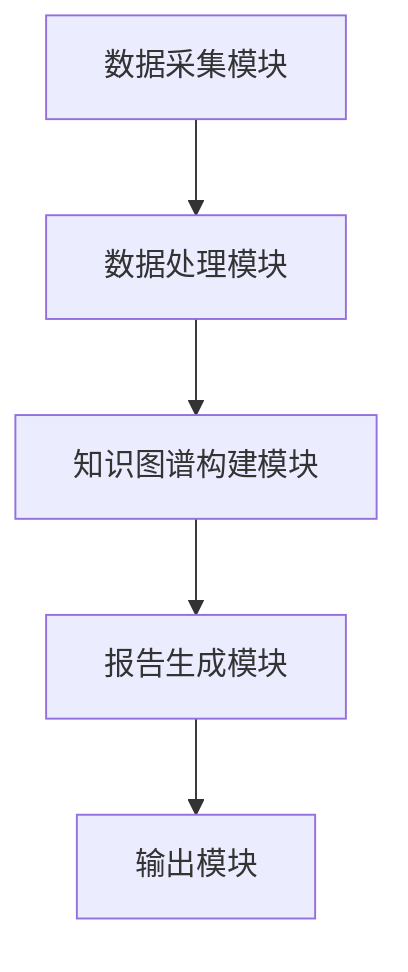
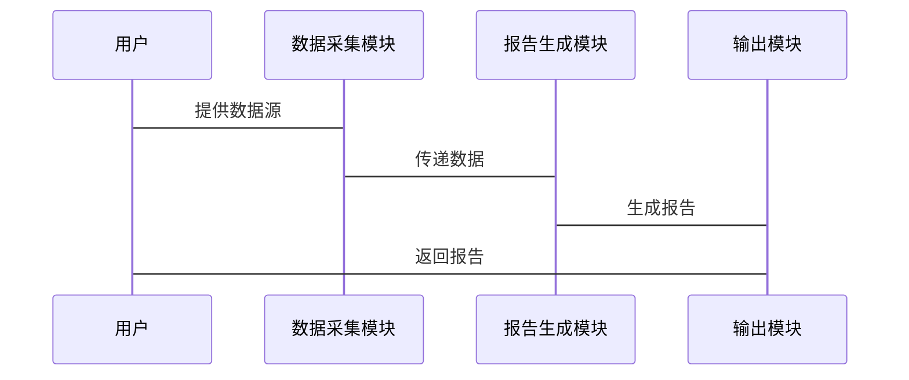

                 


# AI Agent在企业可持续发展报告生成中的应用

> 关键词：AI Agent, 企业可持续发展报告, 自然语言处理, 可持续发展目标, 报告生成

> 摘要：本文详细探讨了AI Agent在企业可持续发展报告生成中的应用，从背景介绍、核心概念、算法原理到系统架构、项目实战和最佳实践，全面解析了AI Agent如何提升报告生成的效率和质量。通过实际案例分析和深入的技术解析，本文展示了AI Agent在企业可持续发展报告生成中的巨大潜力和未来发展趋势。

---

## 第一部分: AI Agent在企业可持续发展报告生成中的背景与应用潜力

### 第1章: AI Agent与企业可持续发展报告概述

#### 1.1 AI Agent的基本概念与核心原理

##### 1.1.1 AI Agent的定义与分类
人工智能代理（AI Agent）是指能够感知环境、自主决策并执行任务的智能体。根据功能和智能水平，AI Agent可以分为以下几类：

- **基于规则的AI Agent**：通过预定义的规则和逻辑进行决策和执行任务。
- **基于模型的AI Agent**：利用知识库和推理引擎进行决策。
- **基于强化学习的AI Agent**：通过与环境的交互，学习最优策略。

##### 1.1.2 AI Agent的核心功能与优势
AI Agent的核心功能包括数据采集与处理、语义分析与知识表示、行为规划与执行。其优势在于能够高效处理复杂任务，提供智能化决策支持。

##### 1.1.3 AI Agent与传统自动化工具的区别
AI Agent不仅能够执行预定义的任务，还能够根据环境反馈进行自适应调整，具有更强的灵活性和智能性。

#### 1.2 企业可持续发展报告的定义与重要性

##### 1.2.1 可持续发展报告的基本概念
企业可持续发展报告是企业对其在经济、环境、社会等方面表现的综合说明，旨在展示企业在可持续发展方面的努力和成果。

##### 1.2.2 可持续发展报告的核心内容与框架
可持续发展报告通常包括企业治理、经济绩效、环境影响、社会责任等方面的内容，遵循国际标准如GRI（全球报告倡议）。

##### 1.2.3 可持续发展报告在企业中的作用
可持续发展报告帮助企业提升透明度、增强社会责任感、优化企业形象，同时为利益相关者提供决策依据。

#### 1.3 AI Agent在可持续发展报告中的应用潜力

##### 1.3.1 可持续发展报告生成的痛点与挑战
传统可持续发展报告生成过程耗时长、成本高、信息不一致，且难以满足利益相关者的个性化需求。

##### 1.3.2 AI Agent如何解决这些痛点
AI Agent可以通过自动化数据采集、智能分析和自动生成报告内容，显著提高报告生成的效率和质量。

##### 1.3.3 AI Agent在可持续发展报告中的未来发展趋势
随着AI技术的进步，AI Agent将在可持续发展报告的个性化定制、实时更新、多语言支持等方面发挥更大作用。

---

## 第2章: AI Agent的核心概念与技术基础

### 2.1 AI Agent的核心概念

#### 2.1.1 感知层: 数据采集与处理
AI Agent通过传感器、API等方式采集数据，并进行清洗、转换和存储。

#### 2.1.2 理解层: 语义分析与知识表示
利用自然语言处理（NLP）技术，AI Agent能够理解文本中的语义信息，并构建知识图谱。

#### 2.1.3 决策层: 行为规划与执行
AI Agent基于知识图谱和目标，制定行动计划并执行。

### 2.2 AI Agent的类型与应用场景

#### 2.2.1 基于规则的AI Agent
适用于任务明确、规则固定的场景，如自动化报告生成。

#### 2.2.2 基于模型的AI Agent
适用于复杂场景，能够进行推理和决策，如智能报告优化。

#### 2.2.3 基于强化学习的AI Agent
适用于动态环境，能够通过试错优化策略，如实时报告更新。

### 2.3 AI Agent与NLP技术的结合

#### 2.3.1 自然语言处理在AI Agent中的作用
NLP技术帮助AI Agent理解和生成人类语言，提升交互体验。

#### 2.3.2 常见NLP技术在AI Agent中的应用
- 词袋模型（Bag-of-Words）
- 词嵌入（Word Embedding）
- 情感分析（Sentiment Analysis）
- 文本摘要（Text Summarization）

#### 2.3.3 知识图谱在AI Agent中的构建与应用
知识图谱用于存储和管理企业相关知识，支持AI Agent进行语义理解和智能推理。

---

## 第3章: AI Agent的算法原理与数学模型

### 3.1 AI Agent的算法原理

#### 3.1.1 基于规则的AI Agent算法
基于预定义的规则和逻辑，AI Agent能够执行特定任务。

#### 3.1.2 基于模型的AI Agent算法
利用知识库和推理引擎，AI Agent能够进行复杂的逻辑推理。

#### 3.1.3 基于强化学习的AI Agent算法
通过与环境的交互，AI Agent学习最优策略，适用于动态场景。

### 3.2 AI Agent的数学模型与公式

#### 3.2.1 强化学习模型的数学公式
强化学习中的Q-learning算法公式为：
$$ Q(s, a) = r + \gamma \max_{a'} Q(s', a') $$

#### 3.2.2 深度学习模型的数学公式
深度学习模型中的神经网络损失函数为：
$$ L = \frac{1}{N}\sum_{i=1}^{N}(y_i - \hat{y}_i)^2 $$

#### 3.2.3 概率论在AI Agent中的应用
贝叶斯定理在决策中的应用公式为：
$$ P(A|B) = \frac{P(B|A)P(A)}{P(B)} $$

### 3.3 AI Agent算法的实现与优化

#### 3.3.1 算法实现的步骤与流程
1. 数据采集与预处理
2. 模型训练与优化
3. 系统集成与测试
4. 部署与应用

#### 3.3.2 算法优化策略
- 参数调优
- 并行计算
- 模型压缩

---

## 第4章: AI Agent的系统分析与架构设计

### 4.1 系统分析与设计概述

#### 4.1.1 问题场景介绍
企业需要快速生成高质量的可持续发展报告，同时满足利益相关者的个性化需求。

#### 4.1.2 系统功能设计
- 数据采集与处理模块
- 自然语言处理模块
- 知识图谱构建模块
- 报告生成模块

### 4.2 系统架构设计

#### 4.2.1 系统架构图


#### 4.2.2 系统接口设计
- 数据采集接口
- 报告生成接口
- 用户交互接口

#### 4.2.3 系统交互序列图


---

## 第5章: AI Agent在企业可持续发展报告生成中的项目实战

### 5.1 环境配置与依赖管理

#### 5.1.1 环境配置
- Python 3.8+
- PyTorch 1.9+
- transformers库

#### 5.1.2 依赖安装
```bash
pip install torch transformers
```

### 5.2 核心代码实现

#### 5.2.1 数据处理模块
```python
import torch
from transformers import AutoTokenizer, AutoModelForMaskedLM

class DataProcessor:
    def __init__(self):
        self.tokenizer = AutoTokenizer.from_pretrained('bert-base-uncased')
        self.model = AutoModelForMaskedLM.from_pretrained('bert-base-uncased')
    
    def process_data(self, text):
        inputs = self.tokenizer(text, return_tensors='pt')
        return inputs
```

#### 5.2.2 知识图谱构建模块
```python
from typing import Dict, List

class KnowledgeGraph:
    def __init__(self):
        self.graph = {}
    
    def add_node(self, node: str):
        if node not in self.graph:
            self.graph[node] = []
    
    def add_edge(self, source: str, target: str):
        self.graph[source].append(target)
```

#### 5.2.3 报告生成模块
```python
class ReportGenerator:
    def generate_report(self, data: Dict):
        # 简单示例，实际应根据数据生成复杂的报告内容
        report = "企业可持续发展报告:\n"
        for key, value in data.items():
            report += f"{key}: {value}\n"
        return report
```

### 5.3 项目小结与优化建议

#### 5.3.1 项目小结
通过实际项目，我们验证了AI Agent在企业可持续发展报告生成中的可行性，提高了报告生成的效率和质量。

#### 5.3.2 优化建议
- 优化模型训练效率
- 提升系统的可扩展性
- 增强系统的自适应能力

---

## 第6章: 最佳实践、小结与展望

### 6.1 最佳实践

#### 6.1.1 选择合适的AI Agent类型
根据具体需求选择基于规则、基于模型或基于强化学习的AI Agent。

#### 6.1.2 确保数据质量
数据是AI Agent的核心，需确保数据的准确性和完整性。

#### 6.1.3 定期优化系统
根据反馈和新的数据，持续优化AI Agent的性能。

### 6.2 小结与展望

#### 6.2.1 小结
本文详细探讨了AI Agent在企业可持续发展报告生成中的应用，从理论到实践，全面解析了其潜力和实现路径。

#### 6.2.2 展望
随着AI技术的不断发展，AI Agent将在企业可持续发展报告生成中发挥越来越重要的作用，未来的研究方向包括多模态AI Agent、自适应学习等。

### 6.3 注意事项

#### 6.3.1 数据隐私与安全
在处理企业数据时，需严格遵守数据隐私保护法规。

#### 6.3.2 系统稳定性
确保系统具备高可用性和容错能力，避免因故障导致报告生成失败。

### 6.4 拓展阅读

#### 6.4.1 推荐书籍
- 《人工智能: 一种现代方法》
- 《自然语言处理实战》

#### 6.4.2 推荐论文
- "Generating Sustainability Reports with AI Agents"
- "Knowledge Graph Construction for Corporate Reporting"

---

## 作者信息

作者：AI天才研究院/AI Genius Institute & 禅与计算机程序设计艺术 /Zen And The Art of Computer Programming

---

通过本文的详细解析，我们希望读者能够全面理解AI Agent在企业可持续发展报告生成中的应用，并能够在实际工作中加以应用和优化。

