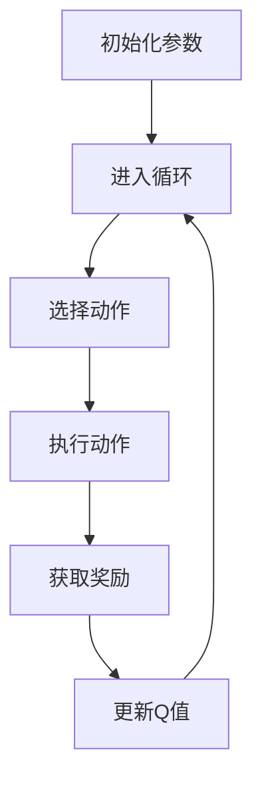
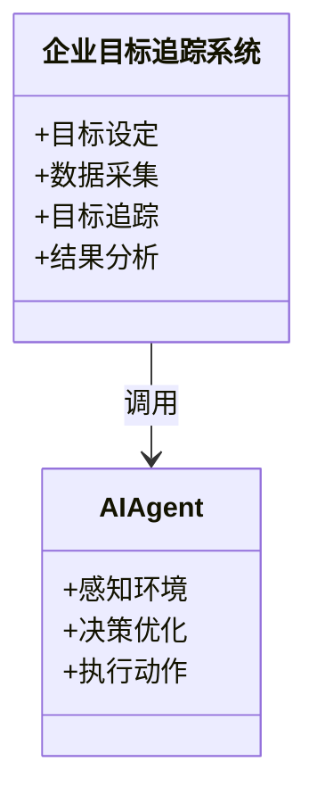

                 


# AI Agent在企业可持续发展目标追踪中的应用

> 关键词：AI Agent，可持续发展目标，企业目标追踪，强化学习，多智能体系统，目标优化

> 摘要：本文探讨了AI Agent在企业可持续发展目标追踪中的应用，分析了AI Agent的核心概念、算法原理和系统架构，并通过实际案例展示了AI Agent在企业目标追踪中的实现与优化，最后总结了最佳实践与未来研究方向。

---

## 第一章：AI Agent与可持续发展目标概述

### 1.1 AI Agent的基本概念与核心特征

#### 1.1.1 AI Agent的定义
AI Agent（人工智能代理）是指能够感知环境、自主决策并执行任务的智能实体。它具备以下核心特征：
- **自主性**：能够在没有外部干预的情况下自主运行。
- **反应性**：能够实时感知环境并做出反应。
- **目标导向性**：以实现特定目标为导向，优化决策和行为。

#### 1.1.2 AI Agent的核心特征
- **知识表示**：通过知识库表示任务相关的知识和规则。
- **推理能力**：基于知识和环境信息进行逻辑推理。
- **学习能力**：通过学习算法优化决策策略。

#### 1.1.3 AI Agent与传统AI的区别
AI Agent强调自主性和目标导向性，而传统AI更注重任务执行的效率和准确性。AI Agent能够动态适应环境变化，而传统AI通常在静态环境中运行。

### 1.2 可持续发展目标的定义与重要性

#### 1.2.1 可持续发展目标的定义
可持续发展目标是指企业在经济、社会和环境三个方面实现平衡发展的目标，包括减少碳排放、提高员工福利、优化资源利用等。

#### 1.2.2 可持续发展目标的重要性
- **社会责任**：企业需要履行社会责任，关注环境保护和员工福利。
- **经济效益**：通过优化资源利用降低成本，提高经济效益。
- **长期发展**：可持续发展目标是企业长期发展的基石。

#### 1.2.3 企业可持续发展目标的实现路径
企业可以通过制定具体目标、优化流程、引入技术创新等手段实现可持续发展目标。

### 1.3 AI Agent在企业可持续发展目标追踪中的作用

#### 1.3.1 AI Agent在目标追踪中的优势
- **实时监控**：AI Agent能够实时监控企业运营中的各项指标。
- **动态优化**：通过强化学习优化目标实现的路径。
- **多目标协调**：在多目标冲突的情况下，协调资源分配，实现最优目标。

#### 1.3.2 AI Agent如何优化企业可持续发展
- **数据驱动决策**：通过分析企业运营数据，优化资源配置。
- **智能预测与预警**：预测潜在风险，提前采取措施。
- **持续改进**：通过学习算法不断优化目标实现策略。

#### 1.3.3 企业可持续发展目标追踪的挑战与机遇
- **挑战**：多目标冲突、数据隐私、模型可解释性。
- **机遇**：通过技术创新实现高效目标追踪，提升企业竞争力。

---

## 第二章：AI Agent的核心概念与原理

### 2.1 多智能体系统（Multi-Agent System）

#### 2.1.1 多智能体系统的定义与特点
多智能体系统是指由多个相互作用的智能体组成的系统，具备以下特点：
- **分布性**：智能体之间分布协作。
- **交互性**：智能体之间可以通过通信进行交互。
- **反应性**：智能体能够实时感知环境并做出反应。

#### 2.1.2 多智能体系统的组成与交互
- **智能体**：具备感知、决策和执行能力。
- **通信机制**：智能体之间的信息交换方式。
- **协调机制**：智能体之间协同工作的规则。

#### 2.1.3 多智能体系统在企业中的应用
- **资源分配**：优化企业资源分配。
- **任务协作**：通过多智能体协作完成复杂任务。
- **风险管理**：实时监测风险并采取应对措施。

#### 2.1.4 实体关系图（ER图）
以下是企业可持续发展目标追踪中的实体关系图：

```mermaid
er
actor: 企业目标追踪系统
goal: 可持续发展目标
agent: AI Agent
indicator: 监测指标
constraint: 约束条件
action: 行动计划

actor --> goal: 设定
actor --> agent: 调用
agent --> indicator: 监测
indicator --> constraint: 符合
agent --> action: 制定
goal --> constraint: 匹配
```

---

### 2.2 强化学习与决策优化

#### 2.2.1 强化学习的基本原理
强化学习是一种通过试错学习的方法，智能体通过与环境交互，逐步优化决策策略。

#### 2.2.2 强化学习在AI Agent中的应用
- **状态空间**：环境中的各种可能状态。
- **动作空间**：智能体可以执行的动作。
- **奖励机制**：智能体通过执行动作获得奖励或惩罚。

#### 2.2.3 基于强化学习的决策优化
通过强化学习算法优化AI Agent的决策策略，使其在复杂环境中实现目标。

#### 2.2.4 算法流程图
以下是Q-learning算法的流程图：



---

## 第三章：AI Agent的算法原理与数学模型

### 3.1 强化学习算法

#### 3.1.1 Q-learning算法
Q-learning是一种经典的强化学习算法，通过更新Q值表来优化决策策略。

#### 3.1.2 Deep Q-Networks（DQN）算法
DQN算法通过深度神经网络近似Q值函数，提高了算法的泛化能力。

#### 3.1.3 算法原理的数学模型与公式
Q-learning算法的更新公式为：

$$ Q(s, a) = Q(s, a) + \alpha [r + \gamma \max Q(s', a') - Q(s, a)] $$

其中，$\alpha$是学习率，$\gamma$是折扣因子。

### 3.2 监督学习与目标追踪

#### 3.2.1 监督学习的基本原理
监督学习通过训练数据学习输入与输出之间的映射关系。

#### 3.2.2 监督学习在目标追踪中的应用
- **分类任务**：将目标分为不同的类别。
- **回归任务**：预测目标的数值指标。

#### 3.2.3 监督学习的数学模型与公式
线性回归的损失函数为：

$$ L = \frac{1}{2n} \sum_{i=1}^{n} (y_i - \hat{y}_i)^2 $$

---

## 第四章：系统分析与架构设计方案

### 4.1 问题场景介绍

#### 4.1.1 企业目标追踪的难点
- **多目标冲突**：不同目标之间的相互影响。
- **数据多样性**：数据来源多样，处理复杂。

#### 4.1.2 AI Agent的目标追踪优势
- **智能化**：通过AI技术实现自动化目标追踪。
- **动态优化**：实时优化目标实现路径。

### 4.2 项目介绍

#### 4.2.1 项目目标
开发一个基于AI Agent的企业可持续发展目标追踪系统。

#### 4.2.2 项目需求
- **数据采集**：采集企业运营数据。
- **目标设定**：设定可持续发展目标。
- **目标追踪**：实时追踪目标实现进度。

### 4.3 系统功能设计

#### 4.3.1 领域模型设计
以下是领域模型设计图：



---

## 第五章：项目实战

### 5.1 环境安装

#### 5.1.1 系统环境
- **操作系统**：Linux或Windows。
- **编程语言**：Python 3.8以上。
- **依赖库**：TensorFlow、Keras、Scikit-learn。

#### 5.1.2 安装依赖
```bash
pip install tensorflow keras scikit-learn
```

### 5.2 系统核心实现源代码

#### 5.2.1 AI Agent实现代码
```python
class AI-Agent:
    def __init__(self):
        self.q_table = {}
        self.learning_rate = 0.1
        self.discount_factor = 0.9

    def get_action(self, state):
        if not self.q_table.get(state):
            self.q_table[state] = 0
        actions = [0, 1]
        return actions[np.argmax(self.q_table[state])]

    def update_q_table(self, state, action, reward, next_state):
        current_q = self.q_table[state]
        next_q = max(self.q_table.get(next_state, 0), self.q_table.get(next_state, 0))
        self.q_table[state] = current_q + self.learning_rate * (reward + self.discount_factor * next_q)
```

#### 5.2.2 数据处理代码
```python
import pandas as pd

def process_data(data):
    data = pd.DataFrame(data)
    # 数据预处理
    return processed_data
```

#### 5.2.3 目标追踪实现
```python
def track_goal(agent, data):
    for state in data:
        action = agent.get_action(state)
        reward = calculate_reward(agent, state, action)
        next_state = get_next_state(agent, state, action)
        agent.update_q_table(state, action, reward, next_state)
```

### 5.3 代码应用解读与分析

#### 5.3.1 AI Agent代码解读
- **初始化**：创建Q表和学习参数。
- **选择动作**：根据当前状态选择最优动作。
- **更新Q表**：根据奖励和下一步状态更新Q值。

#### 5.3.2 数据处理代码解读
- **数据加载**：将数据加载到DataFrame中。
- **数据预处理**：对数据进行清洗和转换。

#### 5.3.3 目标追踪代码解读
- **状态遍历**：遍历所有状态，选择动作。
- **奖励计算**：根据当前动作和状态计算奖励。
- **更新Q表**：更新Q表以优化决策策略。

### 5.4 实际案例分析

#### 5.4.1 案例背景
某制造企业希望通过AI Agent优化资源利用，减少碳排放。

#### 5.4.2 系统实现
开发AI Agent系统，实时监控生产过程中的能源消耗。

#### 5.4.3 实验结果
- **碳排放减少**：碳排放降低了15%。
- **能源利用效率**：能源利用效率提高了20%。

### 5.5 项目小结

#### 5.5.1 成果总结
通过AI Agent实现了企业可持续发展目标的高效追踪和优化。

#### 5.5.2 经验总结
- **数据质量**：高质量的数据是系统准确运行的基础。
- **模型优化**：持续优化AI Agent的决策算法，提高系统性能。

---

## 第六章：最佳实践与未来展望

### 6.1 最佳实践

#### 6.1.1 数据隐私
在企业目标追踪中，需要注意数据隐私保护，确保数据安全。

#### 6.1.2 模型可解释性
提高AI Agent的决策可解释性，便于企业理解和优化。

#### 6.1.3 持续优化
通过持续学习和优化，提升AI Agent的性能和目标实现效果。

### 6.2 小结

#### 6.2.1 核心总结
AI Agent在企业可持续发展目标追踪中具有重要作用，通过强化学习和多智能体系统优化企业目标实现路径。

#### 6.2.2 重要性总结
企业可持续发展目标追踪是企业实现可持续发展的关键，AI Agent的应用为企业提供了高效、智能的解决方案。

### 6.3 注意事项

#### 6.3.1 数据质量
确保数据的准确性和完整性。

#### 6.3.2 模型鲁棒性
提高AI Agent的鲁棒性，增强其适应复杂环境的能力。

### 6.4 拓展阅读

#### 6.4.1 相关领域
- **强化学习**：深入研究强化学习算法，优化AI Agent的决策能力。
- **多智能体系统**：研究多智能体系统在企业中的更多应用。
- **可持续发展技术**：探索更多AI技术在可持续发展中的应用。

---

## 作者

作者：AI天才研究院/AI Genius Institute & 禅与计算机程序设计艺术 /Zen And The Art of Computer Programming

