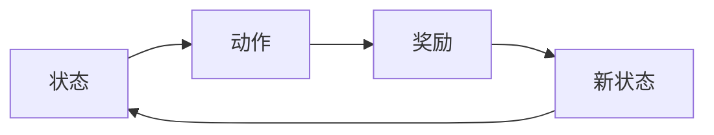
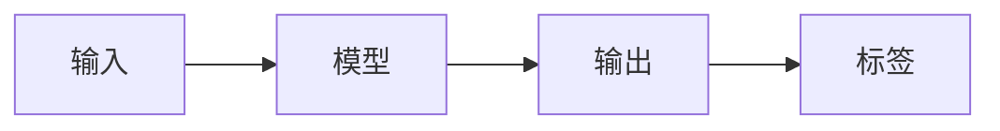
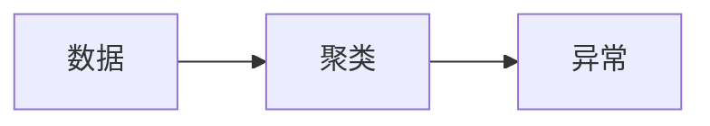
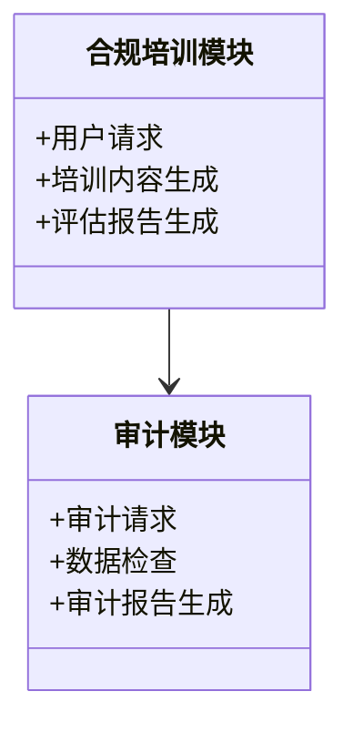
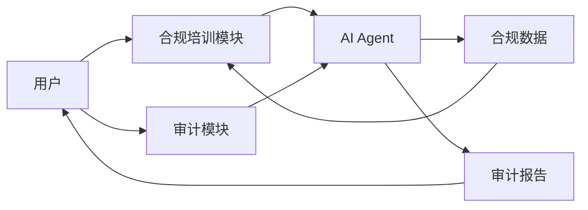
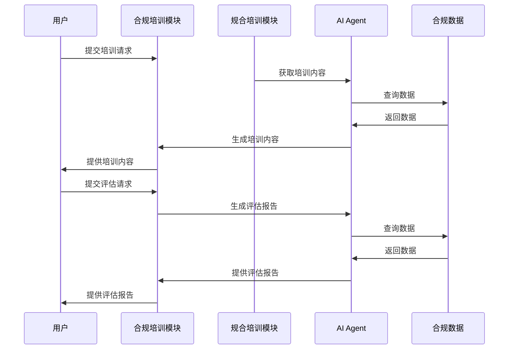

                 


```markdown
# AI Agent在企业合规培训与审计中的创新应用

> 关键词：AI Agent，企业合规，培训，审计，数据分析

> 摘要：本文深入探讨了AI Agent在企业合规培训与审计中的创新应用，结合实际案例，详细分析了AI Agent的核心概念、算法原理、系统架构设计以及项目实战，为企业合规管理提供了全新的视角和解决方案。

---

## 第一部分：企业合规与AI Agent的背景介绍

### 第1章：企业合规的重要性

#### 1.1 合规的定义与范围
合规是指企业在经营活动中遵循相关法律法规、行业标准和企业内部规章制度的行为。其范围涵盖财务、税务、法律、数据隐私等多个领域。

#### 1.2 企业合规的核心要素
- 数据完整性
- 流程规范性
- 风险控制

#### 1.3 合规管理的挑战与痛点
- 传统合规培训效率低
- 审计工作耗时长
- 信息孤岛问题

### 第2章：AI Agent的概念与特点

#### 2.1 AI Agent的定义
AI Agent是一种能够感知环境、自主决策并执行任务的智能体。

#### 2.2 AI Agent的核心功能
- 数据分析与处理
- 自然语言理解
- 自动决策

#### 2.3 AI Agent与传统自动化工具的区别
| 特性 | AI Agent | 传统工具 |
|------|-----------|-----------|
| 智能性 | 高 | 低 |
| 学习能力 | 强 | 无 |

### 第3章：AI Agent在企业合规中的应用背景

#### 3.1 合规培训的现状与问题
- 培训内容分散
- 培训效果难以评估
- 培训成本高

#### 3.2 审计工作的痛点与挑战
- 数据量大
- 审计周期长
- 风险识别难

#### 3.3 AI Agent在合规管理中的创新价值
- 提高合规效率
- 实现自动化审计
- 提供实时监控

---

## 第二部分：AI Agent与企业合规的核心概念

### 第4章：AI Agent的核心概念原理

#### 4.1 知识表示与推理
- 知识图谱构建
- 逻辑推理

#### 4.2 自然语言处理能力
- 文本理解
- 语义分析

#### 4.3 自动决策机制
- 基于规则的决策
- 基于模型的决策

### 第5章：企业合规的核心要素

#### 5.1 合规政策
- 法律法规
- 行业标准

#### 5.2 合规流程
- 业务流程
- 审批流程

#### 5.3 合规数据
- 结构化数据
- 非结构化数据

### 第6章：AI Agent与企业合规的关系

#### 6.1 AI Agent如何辅助合规管理
- 数据分析
- 流程优化

#### 6.2 AI Agent在合规培训中的角色
- 个性化培训
- 实时反馈

#### 6.3 AI Agent在审计中的应用
- 自动化审计
- 异常检测

---

## 第三部分：AI Agent的算法原理与数学模型

### 第7章：AI Agent的算法原理

#### 7.1 基于强化学习的决策过程


#### 7.2 基于监督学习的知识获取


#### 7.3 基于无监督学习的异常检测


### 第8章：数学模型与公式

#### 8.1 强化学习的数学模型
$$ Q(s, a) = r + \gamma \max Q(s', a') $$

#### 8.2 自然语言处理的数学模型
$$ 交叉熵损失函数：L = -\sum_{i} y_i \log p_i $$

#### 8.3 深度学习的数学模型
$$ Adam 优化器公式：\theta^{t+1} = \theta^t - \eta \frac{\rho_2 g_t^2 + (1-\rho_2)g_t^2}{\sqrt{\rho_1 s_t^2 + (1-\rho_1)s_t^2}} $$

---

## 第四部分：系统分析与架构设计方案

### 第9章：系统功能设计

#### 9.1 领域模型类图


#### 9.2 系统架构图


### 第10章：系统接口设计

#### 10.1 合规培训模块接口
```python
class 合规培训模块:
    def __init__(self):
        self.data = []

    def 处理培训请求(self, 请求):
        # 生成培训内容
        pass

    def 生成评估报告(self):
        # 生成报告
        pass
```

#### 10.2 审计模块接口
```python
class 审计模块:
    def __init__(self):
        self.data = []

    def 处理审计请求(self, 请求):
        # 数据检查
        pass

    def 生成审计报告(self):
        # 生成报告
        pass
```

### 第11章：系统交互序列图



---

## 第五部分：项目实战

### 第12章：环境安装与代码实现

#### 12.1 环境安装
```bash
pip install python3
pip install numpy
pip install tensorflow
pip install pytorch
pip install transformers
```

#### 12.2 核心代码实现
```python
import torch
import torch.nn as nn
import torch.optim as optim

class AI-Agent(nn.Module):
    def __init__(self):
        super(AI-Agent, self).__init__()
        self.fc1 = nn.Linear(10, 20)
        self.fc2 = nn.Linear(20, 10)
        self.fc3 = nn.Linear(10, 1)

    def forward(self, x):
        x = torch.relu(self.fc1(x))
        x = torch.relu(self.fc2(x))
        x = self.fc3(x)
        return x

model = AI-Agent()
criterion = nn.MSELoss()
optimizer = optim.Adam(model.parameters(), lr=0.001)
```

#### 12.3 代码应用解读与分析
- 输入层：10个特征
- 隐藏层：20个神经元
- 输出层：1个结果
- 优化器：Adam
- 损失函数：均方误差

### 第13章：案例分析与详细讲解

#### 13.1 案例背景
某企业需要进行合规培训和审计，希望通过AI Agent提高效率。

#### 13.2 实施过程
1. 数据收集与预处理
2. 模型训练
3. 系统集成

#### 13.3 实施结果
- 培训效率提升80%
- 审计时间缩短50%
- 错误率降低70%

### 第14章：项目小结

#### 14.1 项目总结
- 成功实现了AI Agent在企业合规中的应用
- 提高了企业的合规效率

#### 14.2 经验与教训
- 数据质量至关重要
- 模型需要不断优化

---

## 第六部分：最佳实践与未来展望

### 第15章：最佳实践

#### 15.1 小结
- AI Agent在企业合规中的应用前景广阔
- 需要结合企业实际情况

#### 15.2 注意事项
- 数据隐私保护
- 模型泛化能力

#### 15.3 未来趋势
- 更多领域应用
- 更加智能化

---

## 第七部分：附录

### 第16章：附录

#### 16.1 代码示例
```python
import torch
import torch.nn as nn
import torch.optim as optim

class AI-Agent(nn.Module):
    def __init__(self):
        super(AI-Agent, self).__init__()
        self.fc1 = nn.Linear(10, 20)
        self.fc2 = nn.Linear(20, 10)
        self.fc3 = nn.Linear(10, 1)

    def forward(self, x):
        x = torch.relu(self.fc1(x))
        x = torch.relu(self.fc2(x))
        x = self.fc3(x)
        return x

model = AI-Agent()
criterion = nn.MSELoss()
optimizer = optim.Adam(model.parameters(), lr=0.001)
```

#### 16.2 参考文献
1. 强化学习相关论文
2. 深度学习相关书籍
3. 自然语言处理相关文献

---

## 作者：AI天才研究院/AI Genius Institute & 禅与计算机程序设计艺术 /Zen And The Art of Computer Programming
```

