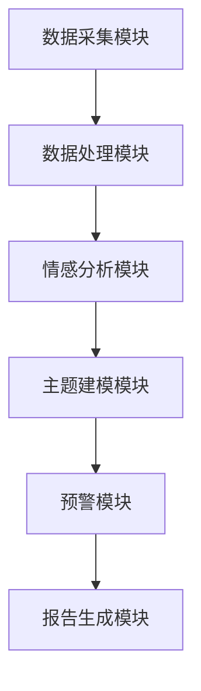
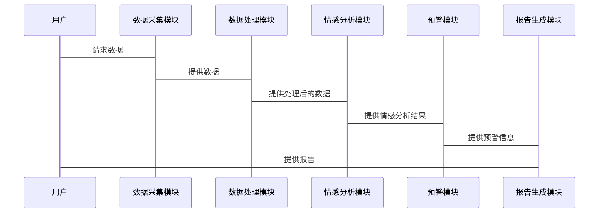

                 


# AI Agent在企业品牌声誉监控与危机预警中的应用

**关键词**：AI Agent, 品牌声誉, 危机预警, 自然语言处理, 情感分析, 机器学习

**摘要**：本文详细探讨了AI Agent在企业品牌声誉监控与危机预警中的应用，从核心概念、算法原理到系统架构设计，再到项目实战与最佳实践，全面解析了如何利用AI技术提升品牌声誉管理的效率与准确性。文章结合实际案例，深入分析了AI Agent在实时数据处理、情感分析、主题建模及危机预警中的具体应用，并提供了详细的代码实现和系统架构设计方案。

---

## 第一部分: 问题背景与核心概念

### 第1章: 问题背景与核心概念

#### 1.1 问题背景
##### 1.1.1 企业品牌声誉的重要性
企业的品牌声誉是企业在市场中的核心竞争力之一。良好的品牌声誉能够提升客户信任度、吸引潜在客户、增强市场地位，而负面声誉则可能导致客户流失、市场份额下降甚至企业声誉的坍塌。

##### 1.1.2 品牌声誉管理的挑战
随着社交媒体的普及，企业声誉的传播速度和影响范围显著增加。传统的品牌声誉管理方式依赖人工监控和分析，效率低下且容易遗漏关键信息。此外，海量的数据来源（如社交媒体评论、新闻报道、客户反馈等）使得人工处理变得几乎不可能。

##### 1.1.3 危机预警的必要性
危机预警是品牌声誉管理的核心任务之一。通过及时发现潜在的危机信号（如负面评论的激增、客户投诉的集中爆发等），企业可以迅速采取措施，避免危机的扩大化，最大限度地减少损失。

#### 1.2 问题描述
##### 1.2.1 品牌声誉监控的定义
品牌声誉监控是指通过收集和分析与企业相关的数据（如社交媒体评论、新闻报道、客户评价等），评估企业品牌在市场中的形象和声誉。

##### 1.2.2 危机预警的核心目标
危机预警的核心目标是通过实时监控和分析数据，识别潜在的危机信号，并提前发出预警，以便企业能够迅速采取应对措施。

##### 1.2.3 当前品牌声誉管理的痛点
- 数据来源广泛且复杂，难以高效处理。
- 人工分析效率低，容易遗漏关键信息。
- 危机信号的识别依赖于经验，缺乏系统性和准确性。

#### 1.3 问题解决与边界
##### 1.3.1 AI Agent在品牌声誉管理中的作用
AI Agent（人工智能代理）通过自动化数据处理、智能分析和实时预警，能够显著提升品牌声誉监控的效率和准确性。

##### 1.3.2 AI Agent的核心优势
- **自动化处理**：AI Agent能够自动收集、分析和处理海量数据。
- **智能分析**：利用自然语言处理（NLP）和机器学习技术，AI Agent能够准确识别情感倾向和主题。
- **实时预警**：通过实时监控和分析数据，AI Agent能够快速识别潜在危机信号并发出预警。

##### 1.3.3 问题解决的边界与外延
AI Agent主要用于品牌声誉监控和危机预警，但其应用范围可以扩展到其他领域，如客户关系管理、市场分析等。

#### 1.4 核心概念与结构
##### 1.4.1 AI Agent的定义与特点
AI Agent是一种能够感知环境、自主决策并执行任务的智能系统。其特点包括自主性、反应性、目标导向和学习能力。

##### 1.4.2 品牌声誉监控的系统架构
品牌声誉监控系统通常包括数据采集、数据处理、情感分析、预警模块和报告生成模块。

##### 1.4.3 核心要素与组成关系
- **数据源**：社交媒体评论、新闻报道、客户评价等。
- **数据处理**：数据清洗、去重、标注。
- **情感分析**：识别文本的情感倾向（正面、负面、中性）。
- **主题建模**：识别文本的主题和关键词。
- **预警模块**：基于情感分析和主题建模的结果，识别潜在危机信号。

---

## 第二部分: AI Agent的核心原理与算法

### 第2章: AI Agent的核心原理

#### 2.1 AI Agent的基本原理
##### 2.1.1 AI Agent的定义与分类
AI Agent可以分为基于规则的代理和基于机器学习的代理。基于规则的代理依赖预定义的规则进行决策，而基于机器学习的代理则通过学习数据来自动优化决策策略。

##### 2.1.2 AI Agent的核心算法
AI Agent的核心算法包括自然语言处理（NLP）、情感分析、主题建模和机器学习算法（如支持向量机、随机森林、神经网络等）。

##### 2.1.3 AI Agent与传统算法的区别
AI Agent的核心优势在于其能够自主感知环境并动态调整策略，而传统算法通常需要人工干预。

#### 2.2 AI Agent在品牌声誉监控中的应用
##### 2.2.1 自然语言处理(NLP)的核心作用
NLP技术用于文本的分词、词性标注、句法分析和语义理解，是情感分析和主题建模的基础。

##### 2.2.2 情感分析与语义理解
情感分析用于识别文本的情感倾向，语义理解用于理解文本的深层含义。

##### 2.2.3 实时监控与预警机制
通过实时监控数据流，AI Agent能够快速识别潜在的危机信号，并通过预警模块通知相关人员。

#### 2.3 核心算法原理
##### 2.3.1 基于情感分析的危机预警模型
- **数据预处理**：清洗数据，去除停用词和标点符号。
- **特征提取**：提取文本的关键词和情感倾向。
- **情感分析**：使用机器学习算法（如支持向量机）对文本进行情感分类。
- **预警机制**：当负面评论的比例超过阈值时，触发预警。

##### 2.3.2 基于主题模型的舆论分析
- **主题建模**：使用LDA（隐含主题模型）识别文本的主题。
- **舆论分析**：结合主题分布和情感倾向，分析舆论的总体趋势。

##### 2.3.3 基于规则与机器学习的混合算法
- **规则匹配**：识别特定关键词（如“投诉”、“差评”）。
- **机器学习模型**：使用随机森林对文本进行分类。

#### 2.4 算法对比与优化
##### 2.4.1 基于规则的模型与机器学习模型的对比
- **基于规则的模型**：简单易实现，但容易漏掉隐含信息。
- **机器学习模型**：能够捕捉复杂的模式，但需要大量数据支持。

##### 2.4.2 算法优化的关键点
- **特征选择**：选择对情感分类有较大影响的特征。
- **模型调优**：通过交叉验证优化模型参数。

##### 2.4.3 算法的可解释性与鲁棒性
- **可解释性**：基于规则的模型具有较高的可解释性。
- **鲁棒性**：机器学习模型在数据分布变化时表现更稳定。

#### 2.5 本章小结

---

## 第三部分: 系统分析与架构设计

### 第3章: 系统分析与架构设计

#### 3.1 问题场景介绍
##### 3.1.1 品牌声誉监控的典型场景
- 社交媒体评论监控
- 新闻报道分析
- 客户评价分析

##### 3.1.2 危机预警的触发条件
- 负面评论激增
- 关键词频繁出现
- 情感倾向突然转向负面

##### 3.1.3 系统的用户需求分析
- 实时监控与预警
- 自动生成分析报告
- 可视化界面

#### 3.2 系统功能设计
##### 3.2.1 数据采集模块
- 数据源：社交媒体API、新闻网站爬虫、客户评价数据库
- 数据格式：文本数据

##### 3.2.2 数据处理模块
- 数据清洗：去除无效信息
- 数据去重：避免重复数据
- 数据标注：标注情感倾向

##### 3.2.3 情感分析模块
- 情感分类：正面、负面、中性
- 主题建模：识别关键词和主题

##### 3.2.4 预警模块
- 预警规则：设定阈值
- 预警通知：邮件、短信、系统提醒

##### 3.2.5 报告生成模块
- 自动生成报告：包含情感分析结果、主题分析结果、预警记录
- 可视化展示：图表形式

#### 3.3 系统架构设计
##### 3.3.1 系统架构图


##### 3.3.2 接口设计
- 数据采集模块接口：提供API接口，接收数据源配置
- 情感分析模块接口：提供API接口，接收文本数据，返回情感分类结果
- 预警模块接口：提供API接口，接收分析结果，触发预警

##### 3.3.3 交互序列图


#### 3.4 本章小结

---

## 第四部分: 项目实战与代码实现

### 第4章: 项目实战

#### 4.1 项目介绍
##### 4.1.1 项目目标
实现一个基于AI Agent的品牌声誉监控与危机预警系统。

##### 4.1.2 项目框架
- 数据采集模块：使用Python的requests库和BeautifulSoup库
- 数据处理模块：使用NLTK库
- 情感分析模块：使用TextBlob库
- 预警模块：使用Flask框架

#### 4.2 核心代码实现
##### 4.2.1 数据采集模块
```python
import requests
from bs4 import BeautifulSoup

def fetch_data(url):
    response = requests.get(url)
    soup = BeautifulSoup(response.text, 'html.parser')
    return [text for text in soup.find_all('div', class_='comment') if text]
```

##### 4.2.2 情感分析模块
```python
from textblob import TextBlob

def sentiment_analysis(text):
    blob = TextBlob(text)
    return blob.sentiment.polarity
```

##### 4.2.3 预警模块
```python
from flask import Flask, request
import smtplib

app = Flask(__name__)

@app.route('/alert', methods=['POST'])
def send_alert():
    data = request.json
    if data['sentiment'] < -0.5:
        send_email("Negative sentiment detected")
    return "Alert sent"

def send_email(message):
    server = smtplib.SMTP('smtp.example.com', 587)
    server.starttls()
    server.login('user@example.com', 'password')
    server.sendmail('user@example.com', 'alert@example.com', message)
    server.quit()

if __name__ == '__main__':
    app.run()
```

#### 4.3 代码应用解读与分析
##### 4.3.1 数据采集模块
- 使用requests库获取网页内容
- 使用BeautifulSoup库解析网页内容，提取评论数据

##### 4.3.2 情感分析模块
- 使用TextBlob库对文本进行情感分析，返回情感倾向值
- 情感倾向值范围为[-1, 1]，-1表示完全负面，1表示完全正面

##### 4.3.3 预警模块
- 使用Flask框架搭建一个简单的API接口
- 当情感倾向值小于-0.5时，触发邮件预警

#### 4.4 实际案例分析与详细讲解剖析
##### 4.4.1 案例背景
假设某企业需要监控其品牌在社交媒体上的声誉。

##### 4.4.2 数据采集
从社交媒体API获取评论数据，清洗数据并提取关键词。

##### 4.4.3 情感分析
使用TextBlob对评论进行情感分析，识别负面评论。

##### 4.4.4 预警触发
当负面评论的比例超过阈值时，触发邮件预警，并生成分析报告。

#### 4.5 本章小结

---

## 第五部分: 最佳实践与扩展

### 第5章: 最佳实践

#### 5.1 小结
##### 5.1.1 核心知识点回顾
- AI Agent的基本原理
- 品牌声誉监控的系统架构
- 情感分析与主题建模的应用

#### 5.2 注意事项
##### 5.2.1 数据隐私与合规性
在处理客户数据时，需要注意数据隐私和合规性问题。

##### 5.2.2 模型的可解释性
在实际应用中，模型的可解释性非常重要，尤其是在需要向管理层解释预警结果时。

##### 5.2.3 模型的鲁棒性
需要确保模型在数据分布变化时仍然能够正常工作。

#### 5.3 拓展阅读
##### 5.3.1 推荐书籍
- 《Python机器学习实战》
- 《自然语言处理入门》

##### 5.3.2 推荐论文
- "A survey on aspect-based sentiment analysis"
- "Topic modeling with LDA: A tutorial"

#### 5.4 本章小结

---

## 第六部分: 总结

### 第6章: 总结

#### 6.1 项目总结
通过本文的介绍，我们了解了AI Agent在企业品牌声誉监控与危机预警中的应用。从系统架构设计到算法实现，再到实际案例分析，我们详细探讨了如何利用AI技术提升品牌声誉管理的效率和准确性。

#### 6.2 展望
随着AI技术的不断发展，品牌声誉监控与危机预警系统将更加智能化和自动化。未来的研究方向包括如何进一步提高模型的可解释性和鲁棒性，以及如何将AI Agent技术应用到更多领域。

#### 6.3 结语
AI Agent的应用不仅能够帮助企业更好地管理品牌声誉，还能够为企业提供更高效、更精准的决策支持。希望本文能够为读者提供有价值的参考和启发。

---

## 作者：AI天才研究院/AI Genius Institute & 禅与计算机程序设计艺术 /Zen And The Art of Computer Programming

---

**注**：以上内容为《AI Agent在企业品牌声誉监控与危机预警中的应用》的技术博客文章的详细目录和内容结构，具体内容可以根据实际需求进行调整和补充。

