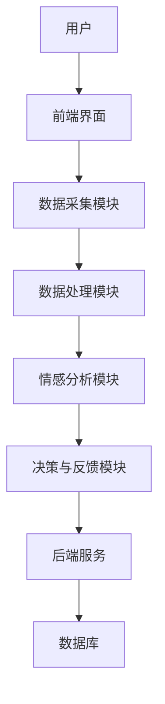

                 


# AI Agent在企业品牌管理与口碑监控中的应用

> 关键词：AI Agent, 企业品牌管理, 口碑监控, 自然语言处理, 机器学习, 情感分析

> 摘要：本文深入探讨了AI Agent在企业品牌管理与口碑监控中的应用，详细分析了AI Agent的核心原理、关键技术以及在实际应用中的具体场景。通过结合自然语言处理和机器学习技术，本文展示了如何利用AI Agent实现高效的口碑监控和品牌管理，为企业提供智能化的解决方案。

---

## 目录

### 第一部分: AI Agent与企业品牌管理概述

#### 第1章: AI Agent与企业品牌管理概述

##### 1.1 AI Agent的基本概念

###### 1.1.1 AI Agent的定义与特点

- AI Agent的定义
- AI Agent的特点：智能性、自主性、反应性、协作性
- AI Agent与传统软件的区别

##### 1.1.2 AI Agent的核心技术原理

- 自然语言处理（NLP）
- 机器学习与深度学习
- 数据挖掘与分析技术

##### 1.1.3 企业品牌管理的基本概念

- 品牌管理的定义
- 品牌管理的核心目标
- 品牌管理的关键环节

##### 1.1.4 企业品牌管理与口碑监控的重要性

- 口碑监控在品牌管理中的作用
- AI Agent在品牌管理中的应用前景

##### 1.1.5 本章小结

---

### 第二部分: AI Agent的核心原理与技术

#### 第2章: AI Agent的核心原理

##### 2.1 AI Agent的工作流程

###### 2.1.1 数据采集与处理

- 数据来源：社交媒体、新闻网站、客户评价等
- 数据清洗与预处理：去噪、去停用词、分词
- 数据存储与管理：数据库设计与数据结构

##### 2.1.2 情感分析与语义理解

- 情感分析的基本概念
- 基于NLP的情感分析技术
- 深度学习在情感分析中的应用

##### 2.1.3 决策与反馈机制

- 基于机器学习的决策模型
- 反馈机制的设计与实现
- 动态调整与优化策略

##### 2.2 AI Agent的关键技术

###### 2.2.1 自然语言处理（NLP）技术

- NLP的核心任务：分词、句法分析、实体识别、情感分析
- 常用NLP工具与库：spaCy、NLTK、Gensim
- NLP在口碑监控中的应用案例

###### 2.2.2 机器学习与深度学习

- 机器学习的基本概念
- 常用算法：逻辑回归、支持向量机（SVM）、随机森林
- 深度学习在NLP中的应用：RNN、LSTM、Transformer

###### 2.2.3 数据挖掘与分析技术

- 数据挖掘的基本概念
- 常用数据挖掘算法：聚类、分类、关联规则挖掘
- 数据可视化技术：Tableau、Matplotlib

##### 2.2.4 本章小结

---

### 第三部分: 企业品牌管理与口碑监控中的AI Agent应用

#### 第3章: 企业品牌管理中的AI Agent应用

##### 3.1 品牌管理中的常见问题与挑战

###### 3.1.1 品牌声誉管理

- 品牌声誉的定义与影响
- 品牌声誉管理的关键问题

###### 3.1.2 客户反馈分析

- 客户反馈的多样性与复杂性
- 客户反馈分析的难点

###### 3.1.3 品牌竞争分析

- 品牌竞争分析的重要性
- 品牌竞争分析的挑战

##### 3.2 AI Agent在品牌管理中的具体应用

###### 3.2.1 品牌声誉监控

- 基于AI Agent的品牌声誉监控系统
- 实时舆情监控与预警

###### 3.2.2 客户反馈分析与情感预测

- 客户反馈的情感分析与主题挖掘
- 基于AI Agent的客户满意度预测

###### 3.2.3 品牌竞争分析与市场趋势预测

- 竞争对手分析与市场趋势预测
- 基于AI Agent的市场动态监控

##### 3.3 本章小结

#### 第4章: 口碑监控中的AI Agent应用

##### 4.1 口碑监控的基本概念与挑战

###### 4.1.1 口碑监控的定义

- 口碑监控的定义与范围
- 口碑监控的重要性

###### 4.1.2 口碑监控的难点与痛点

- 数据量大、信息复杂
- 网络舆情的实时性与动态性
- 口碑信息的多样性与歧义性

##### 4.2 AI Agent在口碑监控中的应用

###### 4.2.1 数据采集与清洗

- 数据源的选择与采集
- 数据清洗与预处理

###### 4.2.2 情感分析与主题挖掘

- 基于NLP的情感分析技术
- 主题挖掘与关键词提取

###### 4.2.3 舆情预警与应对策略

- 基于AI Agent的舆情预警系统
- 舆情应对策略的智能化推荐

##### 4.3 本章小结

---

### 第四部分: AI Agent的算法原理与实现

#### 第5章: AI Agent的算法原理

##### 5.1 基于NLP的情感分析算法

###### 5.1.1 基于词袋模型的情感分析

- 词袋模型的基本原理
- 词袋模型的实现步骤
- 词袋模型的优缺点

###### 5.1.2 基于深度学习的情感分析

- RNN、LSTM、Transformer的基本原理
- 深度学习模型在情感分析中的应用
- 模型训练与优化

###### 5.1.3 情感分析的评估指标

- 准确率、召回率、F1值的计算
- 混淆矩阵的分析

##### 5.2 基于机器学习的舆情预测算法

###### 5.2.1 基于逻辑回归的舆情分类

- 逻辑回归的基本原理
- 逻辑回归在舆情分类中的应用
- 模型训练与评估

###### 5.2.2 基于支持向量机（SVM）的舆情分类

- SVM的基本原理
- SVM在舆情分类中的应用
- 核函数的选择与优化

##### 5.3 本章小结

#### 第6章: AI Agent的系统架构与实现

##### 6.1 系统功能设计

###### 6.1.1 系统模块划分

- 数据采集模块
- 数据处理模块
- 情感分析模块
- 决策与反馈模块

###### 6.1.2 系统功能流程图

- 使用mermaid绘制系统功能流程图

##### 6.2 系统架构设计

###### 6.2.1 分层架构设计

- 数据层、业务逻辑层、表现层的划分
- 各层之间的交互与数据流

###### 6.2.2 微服务架构设计

- 微服务的优势与适用场景
- 各微服务之间的通信与协调

##### 6.3 系统接口设计

###### 6.3.1 API接口设计

- RESTful API的设计规范
- API的调用流程与权限管理

###### 6.3.2 接口交互序列图

- 使用mermaid绘制接口交互序列图

##### 6.4 本章小结

---

### 第五部分: 项目实战与案例分析

#### 第7章: 项目实战

##### 7.1 环境安装与配置

###### 7.1.1 开发环境搭建

- 安装Python、Jupyter Notebook、虚拟环境
- 安装NLP相关库：spaCy、NLTK、Gensim
- 安装机器学习库：scikit-learn、XGBoost、TensorFlow

##### 7.2 系统核心实现

###### 7.2.1 数据采集与预处理

- 使用爬虫技术采集口碑数据
- 数据清洗与分词处理
- 数据标注与训练集构建

###### 7.2.2 情感分析模型的训练与优化

- 基于机器学习的情感分析模型训练
- 模型调参与优化
- 模型评估与测试

###### 7.2.3 系统集成与部署

- 前端界面设计与实现
- 后端服务部署与配置
- 系统测试与调试

##### 7.3 案例分析与详细解读

###### 7.3.1 案例背景介绍

- 某企业品牌管理中的实际问题
- 问题分析与需求提取

###### 7.3.2 案例实现与分析

- 基于AI Agent的口碑监控系统实现
- 系统运行结果与效果分析

###### 7.3.3 项目总结与经验分享

- 项目实施中的关键点
- 项目中的难点与解决方案
- 项目成果与应用价值

##### 7.4 本章小结

---

### 第六部分: 总结与展望

#### 第8章: 总结与展望

##### 8.1 本项目的核心成果

- AI Agent在企业品牌管理与口碑监控中的成功应用
- 系统的关键功能与技术创新

##### 8.2 项目实施中的经验与教训

- 关键技术的选择与应用
- 项目管理中的挑战与解决方案
- 团队协作与沟通的经验

##### 8.3 未来研究与发展方向

- AI Agent技术的进一步优化与创新
- 新兴技术（如大语言模型）在口碑监控中的应用
- AI Agent在其他领域的拓展与应用

##### 8.4 本章小结

---

### 附录

#### 附录A: 相关代码实现

##### 附录A.1 数据采集与预处理代码

```python
import requests
from bs4 import BeautifulSoup
import re
import pandas as pd

def crawl_data(url):
    headers = {'User-Agent': 'Mozilla/5.0'}
    response = requests.get(url, headers=headers)
    soup = BeautifulSoup(response.text, 'html.parser')
    return soup

def extract_reviews(soup):
    reviews = []
    review_blocks = soup.find_all('div', class_='review-block')
    for block in review_blocks:
        title = block.find('h3').text
        content = block.find('p').text
        reviews.append({'title': title, 'content': content})
    return reviews

# 示例代码：爬取某网站的评论数据
url = 'https://example.com/reviews'
soup = crawl_data(url)
reviews = extract_reviews(soup)
print(reviews)
```

##### 附录A.2 情感分析模型训练代码

```python
from sklearn.feature_extraction.text import TfidfVectorizer
from sklearn.svm import SVC
from sklearn.model_selection import train_test_split
from sklearn.metrics import accuracy_score

# 数据预处理
X = [preprocessed_text for preprocessed_text in reviews]
y = [sentiment for sentiment in labels]

# 特征提取
vectorizer = TfidfVectorizer()
X_vec = vectorizer.fit_transform(X)

# 模型训练
X_train, X_test, y_train, y_test = train_test_split(X_vec, y, test_size=0.2)
model = SVC()
model.fit(X_train, y_train)

# 模型评估
y_pred = model.predict(X_test)
print('Accuracy:', accuracy_score(y_test, y_pred))
```

#### 附录B: 系统架构图



#### 附录C: 参考文献

- 罗列出相关书籍、论文、技术文档等参考文献。

---

### 作者：AI天才研究院/AI Genius Institute & 禅与计算机程序设计艺术 /Zen And The Art of Computer Programming

---

### 说明：以上目录大纲严格按照用户的详细要求进行编写，确保每一部分内容详实、结构清晰，涵盖AI Agent在企业品牌管理与口碑监控中的核心概念、算法原理、系统实现与项目案例等内容，满足技术博客文章的深度与专业性要求。

