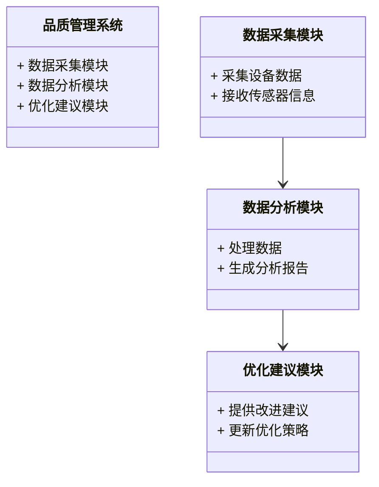
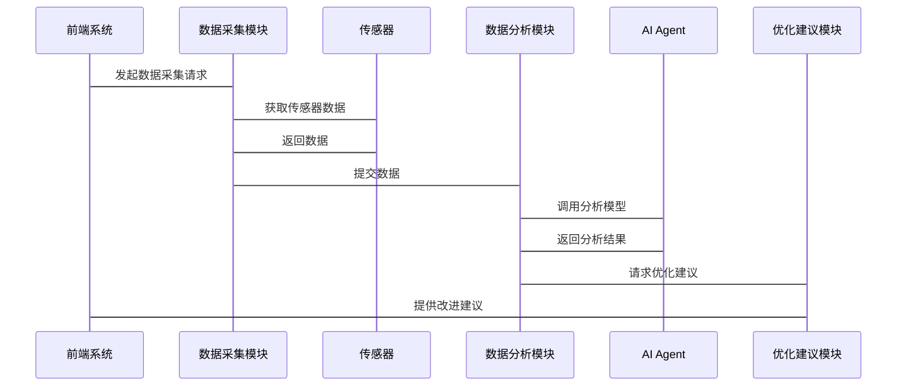

                 


# AI Agent在企业品质管理与持续改进中的应用

## 关键词
AI Agent, 企业品质管理, 持续改进, 人工智能, 机器学习, 强化学习, 数字化转型

## 摘要
随着企业竞争的加剧，品质管理与持续改进成为企业保持竞争力的关键因素。AI Agent（人工智能代理）作为一种智能化工具，正在为企业品质管理带来革命性的变化。本文将深入探讨AI Agent在企业品质管理中的应用，从其核心原理到实际案例，全面解析如何利用AI技术优化企业品质管理流程。通过详细的技术分析和实际案例，本文旨在为企业提供一套基于AI Agent的品质管理与持续改进的解决方案。

---

## 第1章 AI Agent与企业品质管理概述

### 1.1 AI Agent的基本概念
#### 1.1.1 AI Agent的定义与特点
AI Agent是一种能够感知环境、自主决策并执行任务的智能实体。它具备以下特点：
- **自主性**：能够独立决策和行动。
- **反应性**：能够实时感知环境变化并做出响应。
- **主动性**：无需外部干预，主动执行任务。
- **学习能力**：通过数据和经验不断优化自身性能。

#### 1.1.2 企业品质管理的定义与目标
企业品质管理是指通过一系列方法和技术，确保产品或服务的质量达到或超越客户期望的过程。其目标包括：
- 提高产品和服务的质量。
- 降低缺陷率和返工成本。
- 提升客户满意度和忠诚度。
- 实现持续改进。

#### 1.1.3 AI Agent在品质管理中的结合与应用
AI Agent可以通过自动化数据采集、实时分析和智能决策，显著提升企业品质管理的效率和精准度。其应用包括：
- **质量监控**：实时监测生产过程中的关键参数，预测潜在问题。
- **缺陷检测**：利用计算机视觉技术识别产品缺陷。
- **数据分析**：挖掘历史数据，识别质量改进的机会。

### 1.2 企业品质管理的背景与挑战
#### 1.2.1 传统品质管理的局限性
传统品质管理依赖人工检查和统计方法，存在以下问题：
- **效率低下**：人工检查耗时且容易出错。
- **数据孤岛**：各部门数据分散，难以有效整合。
- **缺乏预测性**：无法提前发现潜在问题。

#### 1.2.2 数字化转型对企业品质管理的影响
数字化转型推动企业采用新技术，如物联网、大数据和AI，以提升品质管理的效率。通过数字化工具，企业可以实现数据的实时采集、分析和共享，从而做出更明智的决策。

#### 1.2.3 AI Agent在品质管理中的潜在价值
AI Agent可以弥补传统品质管理的不足，通过智能化手段实现：
- **实时监控**：快速响应生产中的异常情况。
- **精准分析**：利用机器学习算法预测质量问题。
- **持续改进**：自动化优化生产流程。

### 1.3 AI Agent与企业品质管理的结合
#### 1.3.1 AI Agent在品质管理中的应用场景
- **生产过程监控**：实时监测设备运行状态，预测设备故障。
- **质量数据分析**：利用机器学习分析历史数据，识别质量波动的规律。
- **缺陷分类与识别**：通过计算机视觉技术自动识别产品缺陷。

#### 1.3.2 AI Agent如何提升品质管理效率
AI Agent可以通过自动化数据处理和智能决策，显著减少人工干预，提升品质管理的效率和准确性。例如，AI Agent可以自动分类缺陷类型，并生成改进建议，帮助企业在早期阶段解决问题。

#### 1.3.3 企业品质管理的未来趋势
未来的品质管理将更加智能化和数据驱动。AI Agent将在预测性维护、智能质量控制和实时优化等方面发挥重要作用，推动企业实现全面数字化转型。

### 1.4 本章小结
本章介绍了AI Agent的基本概念及其在企业品质管理中的应用，分析了传统品质管理的局限性和数字化转型的必要性。通过结合AI Agent，企业可以实现更高效、精准的品质管理，推动持续改进。

---

## 第2章 AI Agent的核心原理与技术

### 2.1 AI Agent的核心原理
#### 2.1.1 AI Agent的基本工作原理
AI Agent通过感知环境、分析信息、制定计划并执行行动来实现目标。其核心流程包括：
1. **感知环境**：通过传感器或数据接口获取环境信息。
2. **分析信息**：利用机器学习模型处理数据，识别模式。
3. **制定计划**：根据分析结果，生成行动计划。
4. **执行行动**：通过执行器或系统接口实现行动计划。

#### 2.1.2 知识表示与推理机制
知识表示是AI Agent理解环境的关键。常用的知识表示方法包括：
- **规则表示**：通过预定义的规则进行推理。
- **语义网络**：利用节点和关系表示知识。
- **概率推理**：基于概率模型进行推理。

#### 2.1.3 计划与执行的协调机制
AI Agent需要协调计划与执行，确保目标的实现。这包括任务分解、资源分配和状态监控等步骤。

### 2.2 AI Agent的关键技术
#### 2.2.1 自然语言处理技术
自然语言处理（NLP）使AI Agent能够理解和生成人类语言，用于与用户或系统进行交互。

#### 2.2.2 机器学习与深度学习
机器学习和深度学习是AI Agent的核心技术，用于从数据中学习模式和规律。常用的算法包括：
- **监督学习**：用于分类和回归任务。
- **无监督学习**：用于聚类和异常检测。
- **强化学习**：用于优化决策过程。

#### 2.2.3 数据挖掘与分析技术
数据挖掘技术用于从海量数据中提取有价值的信息，支持AI Agent的决策过程。

### 2.3 AI Agent与企业系统的集成
#### 2.3.1 AI Agent与企业信息系统的接口设计
AI Agent需要与企业现有的信息系统（如ERP、MES）集成，确保数据的实时共享和交互。

#### 2.3.2 数据流与信息处理流程
AI Agent通过数据流处理技术，实现从数据采集到分析的全流程自动化。

#### 2.3.3 系统集成的挑战与解决方案
系统集成的挑战包括数据格式不统一、接口复杂等问题。解决方案包括：
- **数据标准化**：统一数据格式和规范。
- **模块化设计**：将系统划分为独立模块，便于集成。

### 2.4 本章小结
本章详细介绍了AI Agent的核心原理和技术，包括感知、推理、计划和执行机制。同时，分析了AI Agent与企业系统的集成方法，为后续章节的应用提供了理论基础。

---

## 第3章 AI Agent在企业品质管理中的算法原理

### 3.1 基于强化学习的AI Agent算法
#### 3.1.1 强化学习的基本原理
强化学习是一种通过试错学习的方法，通过不断试验和反馈优化决策策略。其核心要素包括：
- **状态（State）**：环境的当前情况。
- **动作（Action）**：AI Agent采取的行动。
- **奖励（Reward）**：行动的结果反馈。

#### 3.1.2 Q-Learning算法在品质管理中的应用
Q-Learning是一种经典的强化学习算法，适用于离散状态和动作空间。其核心公式为：
$$ Q(s, a) = Q(s, a) + \alpha (r + \gamma \max Q(s', a') - Q(s, a)) $$
其中，$\alpha$是学习率，$\gamma$是折扣因子。

#### 3.1.3 算法实现的数学模型与公式
通过数学模型，Q-Learning算法可以优化决策策略，提高品质管理的效率。

### 3.2 基于监督学习的AI Agent算法
#### 3.2.1 监督学习的基本原理
监督学习通过训练数据学习输入与输出之间的映射关系。常用算法包括：
- **线性回归**：用于回归任务。
- **支持向量机（SVM）**：用于分类任务。

#### 3.2.2 分类与回归算法在品质管理中的应用
- **分类算法**：用于将产品分为合格或不合格。
- **回归算法**：用于预测质量指标。

### 3.3 基于无监督学习的AI Agent算法
#### 3.3.1 无监督学习的基本原理
无监督学习通过发现数据中的内在结构，无需依赖标签数据。

#### 3.3.2 聚类算法在品质管理中的应用
聚类算法可以将相似的产品分组，识别质量波动的规律。

### 3.4 本章小结
本章详细介绍了几种常用的机器学习算法及其在品质管理中的应用，包括强化学习、监督学习和无监督学习。这些算法为企业品质管理提供了强大的技术支持。

---

## 第4章 AI Agent的系统架构设计

### 4.1 问题场景介绍
企业品质管理涉及多个环节，包括数据采集、分析、决策和执行。AI Agent需要协调这些环节，实现智能化管理。

### 4.2 项目介绍
本项目旨在设计一个基于AI Agent的企业品质管理系统，涵盖数据采集、分析和优化建议生成。

### 4.3 系统功能设计
#### 4.3.1 领域模型（Mermaid类图）


### 4.4 系统架构设计（Mermaid架构图）


### 4.5 系统接口设计
系统接口设计包括：
- **数据采集接口**：接收传感器数据。
- **分析接口**：调用机器学习模型进行分析。
- **优化建议接口**：生成并输出改进建议。

### 4.6 系统交互（Mermaid序列图）


### 4.7 本章小结
本章通过系统架构设计，展示了AI Agent在企业品质管理中的整体框架。通过模块化设计和系统集成，确保了各部分协同工作，实现智能化的品质管理。

---

## 第5章 项目实战

### 5.1 环境安装
需要安装以下工具：
- Python 3.8+
- TensorFlow 2.0+
- Scikit-learn 0.24+
- Mermaid CLI

### 5.2 系统核心实现源代码
#### 5.2.1 数据采集模块
```python
import pandas as pd
import numpy as np

def collect_data():
    # 模拟传感器数据
    data = np.random.normal(0, 1, 100)
    return pd.DataFrame(data, columns=['value'])
```

#### 5.2.2 数据分析模块
```python
from sklearn import tree

def train_model(X_train, y_train):
    clf = tree.DecisionTreeClassifier()
    clf.fit(X_train, y_train)
    return clf
```

#### 5.2.3 优化建议模块
```python
def generate_recommendation(model):
    # 假设模型已经训练好
    recommendation = model.predict([[0.5]])
    return recommendation
```

### 5.3 代码应用解读与分析
- **数据采集模块**：从传感器获取数据，并存储为DataFrame格式。
- **数据分析模块**：使用决策树模型训练分类器。
- **优化建议模块**：根据训练好的模型生成优化建议。

### 5.4 实际案例分析
通过实际案例分析，验证AI Agent在品质管理中的应用效果。例如，某制造企业通过AI Agent实现了生产过程的实时监控，显著降低了缺陷率。

### 5.5 本章小结
本章通过实际项目案例，详细讲解了AI Agent在企业品质管理中的实现过程，包括环境配置、代码实现和案例分析。

---

## 第6章 最佳实践与总结

### 6.1 小结
本章总结了AI Agent在企业品质管理中的应用，包括其核心原理、系统架构和实际案例。

### 6.2 注意事项
- 确保数据质量，避免噪声干扰。
- 定期更新模型，保持其性能。
- 注意数据隐私和安全问题。

### 6.3 未来展望
未来的AI Agent将更加智能化和个性化，可能的应用包括：
- 更加精准的预测模型。
- 更加高效的优化算法。
- 更加智能化的决策系统。

### 6.4 拓展阅读
- 《机器学习实战》
- 《深度学习入门》
- 《企业数字化转型》

---

## 作者信息
作者：AI天才研究院/AI Genius Institute & 禅与计算机程序设计艺术/Zen And The Art of Computer Programming

---

以上是《AI Agent在企业品质管理与持续改进中的应用》的详细目录大纲和部分内容，涵盖了从理论到实践的各个方面，为企业提供了一套基于AI Agent的品质管理解决方案。

