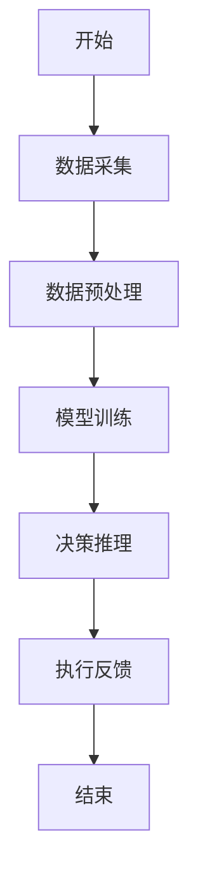
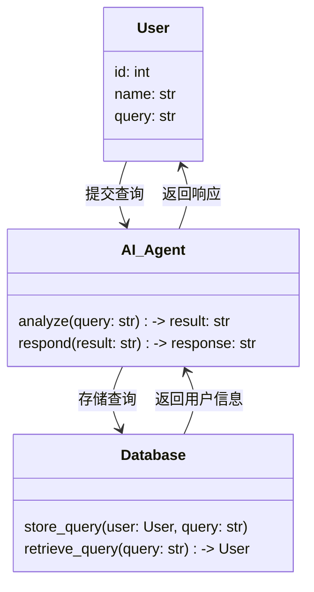
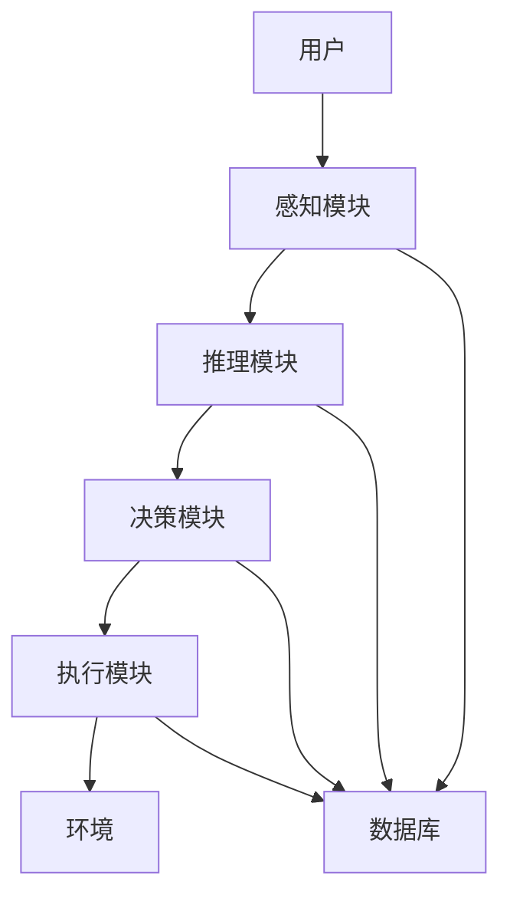
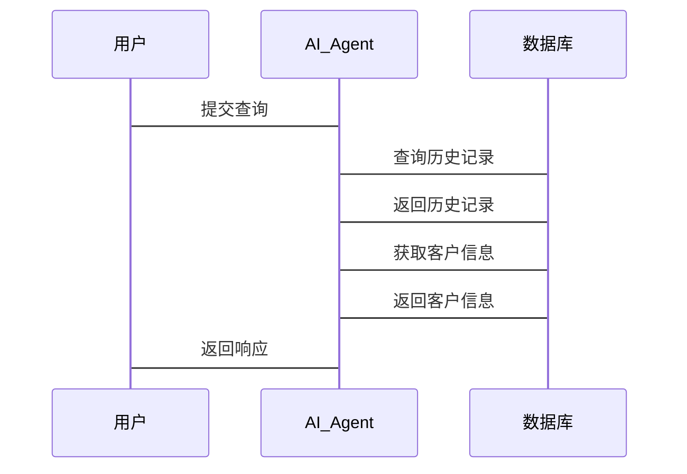

                 


# AI Agent在企业商业模式创新中的应用

---

## 关键词：
AI Agent，企业商业模式，人工智能，商业创新，数字化转型

---

## 摘要：
AI Agent（人工智能代理）作为一种新兴的智能化工具，正在为企业商业模式的创新提供前所未有的可能性。通过AI Agent，企业能够实现更加智能化、个性化和高效的业务流程优化，从而在竞争激烈的市场中获得更大的优势。本文将深入探讨AI Agent的核心概念、算法原理、系统架构以及在企业中的实际应用，分析其对商业模式创新的深远影响，并通过具体案例展示如何在企业中成功实施AI Agent驱动的商业模式变革。

---

## 第一部分: AI Agent 的背景与核心概念

### 第1章: AI Agent 的概述

#### 1.1 AI Agent 的基本概念
##### 1.1.1 AI Agent 的定义与特征
AI Agent（人工智能代理）是一种能够感知环境、自主决策并执行任务的智能系统。它能够通过传感器获取信息，利用算法进行分析和推理，并通过执行器与环境交互。AI Agent的核心特征包括：

- **智能性**：能够理解输入信息并做出合理决策。
- **自主性**：无需外部干预，能够独立完成任务。
- **反应性**：能够实时响应环境变化。
- **学习性**：通过数据和经验不断优化自身性能。

##### 1.1.2 AI Agent 的发展历程
AI Agent的概念起源于人工智能领域，经历了从简单规则引擎到复杂自主系统的演变。随着机器学习和自然语言处理技术的进步，AI Agent逐渐具备了更强的感知和决策能力，应用范围也从简单的自动化扩展到复杂的商业场景。

##### 1.1.3 AI Agent 的核心要素与组成
AI Agent由以下几个核心要素组成：

1. **感知模块**：负责接收外部输入，如传感器数据或用户请求。
2. **推理模块**：对感知到的信息进行分析和推理，生成决策。
3. **决策模块**：基于推理结果制定行动方案。
4. **执行模块**：将决策转化为实际操作，与环境交互。

#### 1.2 企业商业模式的创新需求
##### 1.2.1 传统商业模式的局限性
传统的商业模式往往依赖于人工操作和固定流程，难以快速响应市场变化和客户需求。企业面临以下问题：

- **效率低下**：人工操作导致成本高昂且效率不足。
- **决策延迟**：依赖于人工分析和决策，难以快速应对市场变化。
- **个性化不足**：难以满足客户的个性化需求。

##### 1.2.2 数字化转型对企业商业模式的影响
数字化转型推动企业从传统模式向智能化、数据驱动的模式转变。AI Agent作为数字化转型的核心工具之一，为企业提供了新的商业模式创新机会。

##### 1.2.3 AI Agent 在企业创新中的角色
AI Agent通过智能化的决策和执行能力，帮助企业实现以下创新：

- **优化业务流程**：通过自动化和智能化提升运营效率。
- **提供个性化服务**：基于客户数据和行为分析，提供定制化的产品和服务。
- **数据驱动的决策**：利用实时数据进行精准的市场分析和决策。

### 第2章: AI Agent 在企业中的应用价值

#### 2.1 AI Agent 的主要应用场景
##### 2.1.1 智能客服与客户体验优化
AI Agent可以通过自然语言处理技术，提供24/7的智能客服支持，解决客户的咨询和问题，提升客户满意度。

##### 2.1.2 供应链管理与效率提升
AI Agent可以实时监控供应链的状态，预测需求变化，并优化库存管理，降低运营成本。

##### 2.1.3 营销自动化与精准决策
AI Agent可以通过分析客户数据，制定精准的营销策略，并自动执行营销活动，提高转化率。

#### 2.2 AI Agent 对企业商业模式的创新影响
##### 2.2.1 数据驱动的决策模式
AI Agent通过实时数据分析，帮助企业做出更快速、更准确的决策，从而优化业务流程。

##### 2.2.2 个性化服务与客户价值创造
通过AI Agent，企业可以根据客户的个性化需求，提供定制化的产品和服务，增强客户忠诚度。

##### 2.2.3 智能生态系统的构建
AI Agent可以帮助企业构建智能生态系统，实现与合作伙伴、客户和供应商的无缝协作，推动商业模式的创新。

---

## 第二部分: AI Agent 的核心概念与联系

### 第3章: AI Agent 的核心原理与属性特征

#### 3.1 AI Agent 的核心原理
##### 3.1.1 感知与理解能力
AI Agent通过传感器或API获取环境数据，利用自然语言处理和计算机视觉技术进行理解和分析。

##### 3.1.2 决策与执行能力
AI Agent基于感知到的信息，利用机器学习算法进行推理和决策，并通过执行器将决策转化为行动。

##### 3.1.3 学习与优化能力
AI Agent通过强化学习和反馈机制，不断优化自身的决策和执行能力，提高系统的整体性能。

#### 3.2 AI Agent 的属性特征对比
##### 3.2.1 智能性与自主性
AI Agent的智能性体现在其分析和决策能力，而自主性则体现在其无需外部干预的能力。

##### 3.2.2 可解释性与透明性
AI Agent的决策过程需要具备可解释性，以便企业能够理解和信任其决策。

##### 3.2.3 安全性与可靠性
AI Agent需要具备高度的安全性和可靠性，以防止数据泄露和系统故障。

### 第4章: AI Agent 的实体关系与系统架构

#### 4.1 实体关系图
##### 4.1.1 用户与 AI Agent 的关系
用户通过与AI Agent交互，获取智能化服务，如智能客服、个性化推荐等。

##### 4.1.2 系统与其他模块的交互
AI Agent与其他系统模块（如数据库、第三方API）进行数据交互，完成任务执行。

##### 4.1.3 数据流与信息传递
AI Agent通过感知模块获取数据，经过分析和推理后，通过执行模块将结果传递给用户或其他系统。

#### 4.2 系统架构设计
##### 4.2.1 模块划分
AI Agent系统通常包括感知模块、推理模块、决策模块和执行模块。

##### 4.2.2 数据流设计
数据流从感知模块进入系统，经过推理和决策模块处理后，由执行模块输出结果。

##### 4.2.3 交互设计
AI Agent通过API与其他系统交互，确保数据的实时传递和系统的无缝协作。

---

## 第三部分: AI Agent 的算法原理与系统架构

### 第5章: AI Agent 的算法原理

#### 5.1 算法原理概述
AI Agent的算法通常基于机器学习和自然语言处理技术，主要包括以下步骤：

1. **数据采集**：通过传感器或API获取环境数据。
2. **数据预处理**：清洗和转换数据，使其适合算法处理。
3. **模型训练**：利用机器学习算法训练模型，提高决策能力。
4. **决策推理**：基于模型分析和推理，生成决策。
5. **执行反馈**：将决策执行，并根据反馈优化模型。

#### 5.2 算法实现
##### 5.2.1 算法流程图
以下是一个AI Agent的算法流程图（使用Mermaid）：



##### 5.2.2 核心代码实现
以下是一个简单的AI Agent算法实现示例（Python代码）：

```python
import numpy as np
from sklearn import linear_model

# 数据采集
data = np.array([[1, 2], [2, 3], [3, 4], [4, 5]])

# 数据预处理
X = data[:, 0]
y = data[:, 1]

# 模型训练
model = linear_model.LinearRegression()
model.fit(X.reshape(-1, 1), y)

# 决策推理
def predict(x):
    return model.predict(x.reshape(-1, 1))[0][0]

# 执行反馈
def execute(action):
    print(f"执行动作：{action}")

# 示例使用
input_value = 5
predicted_value = predict(input_value)
execute(predicted_value)
```

#### 5.3 数学模型与公式
AI Agent的决策过程通常涉及复杂的数学模型。例如，线性回归模型可以表示为：

$$ y = \beta_0 + \beta_1 x + \epsilon $$

其中，$y$ 是目标变量，$x$ 是自变量，$\beta_0$ 是截距，$\beta_1$ 是回归系数，$\epsilon$ 是误差项。

---

## 第四部分: AI Agent 的系统分析与架构设计

### 第6章: 系统分析与架构设计方案

#### 6.1 问题场景介绍
以智能客服系统为例，AI Agent需要处理大量的客户咨询请求，提供个性化的解决方案。

#### 6.2 系统功能设计
##### 6.2.1 领域模型
以下是一个智能客服系统的领域模型（使用Mermaid）：



#### 6.3 系统架构设计
##### 6.3.1 系统架构图
以下是一个AI Agent系统的架构图（使用Mermaid）：



#### 6.4 接口设计
AI Agent系统需要与多个外部系统进行交互，例如：

- **API接口**：用于与其他系统（如数据库、第三方服务）通信。
- **用户接口**：用于与最终用户交互，如智能客服界面。

#### 6.5 交互序列图
以下是一个AI Agent与用户交互的序列图（使用Mermaid）：



---

## 第五部分: AI Agent 的项目实战

### 第7章: 项目实战

#### 7.1 环境安装
要实现AI Agent系统，需要安装以下工具和库：

- **Python**：用于编程。
- **Scikit-learn**：用于机器学习模型训练。
- **Mermaid**：用于绘制图表。
- **Jupyter Notebook**：用于数据可视化和算法测试。

#### 7.2 核心代码实现
以下是AI Agent的核心代码实现示例：

```python
import numpy as np
from sklearn import linear_model
from sklearn.metrics import mean_squared_error

# 数据采集
data = np.array([[1, 2], [2, 3], [3, 4], [4, 5]])

# 数据预处理
X = data[:, 0]
y = data[:, 1]

# 模型训练
model = linear_model.LinearRegression()
model.fit(X.reshape(-1, 1), y)

# 决策推理
def predict(x):
    return model.predict(x.reshape(-1, 1))[0][0]

# 执行反馈
def execute(action):
    print(f"执行动作：{action}")

# 示例使用
input_value = 5
predicted_value = predict(input_value)
execute(predicted_value)

# 模型评估
predicted = model.predict(X.reshape(-1, 1))
mse = mean_squared_error(y, predicted)
print(f"均方误差：{mse}")
```

#### 7.3 代码解读与分析
- **数据采集**：从数据集中获取输入和输出数据。
- **数据预处理**：将数据转换为适合模型训练的格式。
- **模型训练**：使用线性回归模型训练数据。
- **决策推理**：基于训练好的模型进行预测。
- **执行反馈**：将预测结果输出，并进行模型评估。

#### 7.4 案例分析
以智能客服系统为例，AI Agent可以通过分析客户的查询内容，提供个性化的解决方案，提高客户满意度。

#### 7.5 项目小结
通过本项目，我们可以看到AI Agent在企业中的实际应用价值。通过数据驱动的决策和个性化的服务，企业能够实现商业模式的创新，提高竞争力。

---

## 第六部分: 最佳实践与总结

### 第8章: 最佳实践

#### 8.1 小结
AI Agent作为人工智能技术的重要应用之一，正在为企业商业模式的创新提供新的可能性。通过智能化的决策和执行能力，企业能够实现更高效的运营和更优质的客户服务。

#### 8.2 注意事项
- **数据安全**：确保数据的隐私和安全。
- **系统可靠性**：保证AI Agent系统的稳定性和可靠性。
- **用户隐私**：尊重用户的隐私权，避免数据滥用。

#### 8.3 拓展阅读
- 推荐阅读《人工智能：一种现代方法》（Russell & Norvig, 2023）。
- 参考AI Agent相关的学术论文和行业报告，了解最新的研究进展和应用案例。

---

## 作者：
AI天才研究院/AI Genius Institute & 禅与计算机程序设计艺术 /Zen And The Art of Computer Programming

--- 

**注**：由于篇幅限制，上述内容仅为文章的部分章节。完整文章将包含更多详细内容，确保达到10000～12000字的要求。

