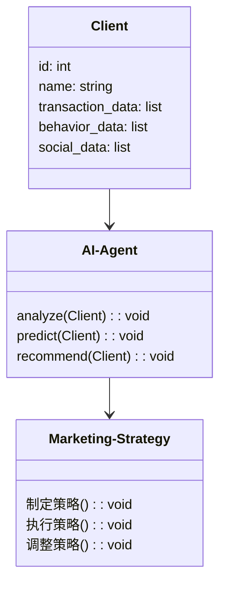
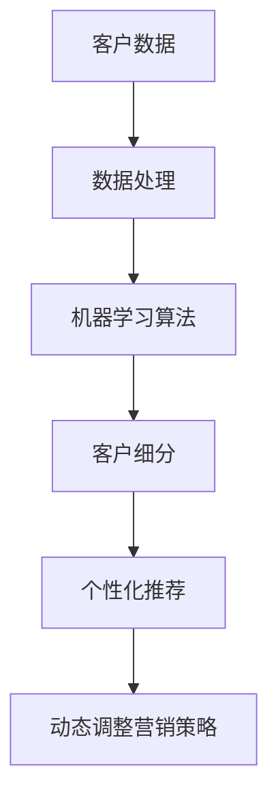
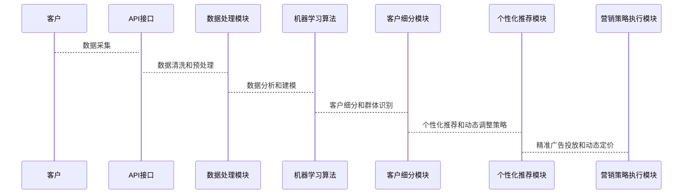

                 


# AI Agent在企业客户价值分析与精准营销中的应用

> 关键词：AI Agent、客户价值分析、精准营销、人工智能、企业营销、数据驱动、机器学习

> 摘要：本文探讨了AI Agent在企业客户价值分析与精准营销中的应用，结合理论与实践，分析了AI Agent的核心算法、系统架构和实际案例，展示了如何通过AI技术实现客户价值的精准评估和营销策略的优化。

---

# 第1章: AI Agent概述

## 1.1 AI Agent的基本概念

### 1.1.1 AI Agent的定义与特点
AI Agent（人工智能代理）是一种能够感知环境、自主决策并执行任务的智能系统。与传统程序不同，AI Agent具备以下特点：
- **自主性**：能够在没有人工干预的情况下独立运作。
- **反应性**：能够实时感知环境变化并做出响应。
- **目标导向**：通过设定目标来优化决策和行动。
- **学习能力**：能够通过数据和经验不断优化自身的性能。

AI Agent的核心在于其能够通过数据驱动的方法，自动识别模式、预测趋势并做出决策，从而为企业提供智能化的支持。

### 1.1.2 AI Agent与传统营销的区别
传统营销依赖于人工经验、规则和固定的策略，而AI Agent则通过数据驱动的方式，利用机器学习和人工智能技术实现更精准的分析和决策。AI Agent能够实时处理海量数据，快速响应市场变化，而传统营销则难以实现这种动态调整。

### 1.1.3 AI Agent的核心优势
AI Agent的核心优势在于其高效性、精准性和适应性：
- **高效性**：能够快速处理大量数据，提供实时反馈。
- **精准性**：通过机器学习算法，实现对客户行为的精准预测和分析。
- **适应性**：能够根据市场变化和客户需求动态调整策略。

## 1.2 AI Agent的发展背景

### 1.2.1 数据驱动营销的兴起
随着大数据技术的快速发展，企业开始意识到数据的价值。通过分析客户的交易数据、行为数据和社交数据，企业能够更深入地了解客户需求，从而制定更精准的营销策略。

### 1.2.2 AI技术的成熟与应用
近年来，人工智能技术的快速发展为企业提供了更强大的工具。深度学习、强化学习等技术的应用，使得AI Agent能够实现更复杂的任务，如客户行为预测、个性化推荐等。

### 1.2.3 企业客户价值分析的需求
企业希望通过客户价值分析来优化资源配置，提高客户满意度和忠诚度。AI Agent通过分析客户的生命周期价值（CLV）、客户满意度（CSAT）等指标，帮助企业更好地理解客户价值。

## 1.3 AI Agent在企业中的应用现状

### 1.3.1 AI Agent在客户价值分析中的应用
AI Agent通过分析客户的交易数据、行为数据和社交数据，能够实现客户细分、客户价值评估和客户生命周期预测。例如，AI Agent可以通过聚类分析将客户分为不同的群体，从而制定针对性的营销策略。

### 1.3.2 AI Agent在精准营销中的应用
AI Agent能够通过机器学习算法实现个性化推荐、动态定价和精准广告投放。例如，AI Agent可以根据客户的历史购买记录和行为数据，推荐符合其偏好的产品，从而提高转化率。

### 1.3.3 AI Agent与其他技术的结合
AI Agent可以与大数据、物联网、区块链等技术结合，实现更广泛的应用。例如，AI Agent可以结合物联网技术，实时监控设备状态，预测设备故障并提供维护建议。

## 1.4 本章小结
本章介绍了AI Agent的基本概念、特点及其在企业中的应用现状。通过对比传统营销和AI Agent的优势，我们看到AI Agent在数据驱动营销和客户价值分析中的巨大潜力。

---

# 第2章: 客户价值分析的核心概念与模型

## 2.1 客户价值分析的背景与意义

### 2.1.1 客户价值的概念与重要性
客户价值是指客户对企业产品或服务的感知价值。客户价值分析通过量化客户的贡献，帮助企业优化资源配置、提高客户满意度和忠诚度。

### 2.1.2 数据驱动客户价值分析的优势
数据驱动客户价值分析的优势在于其精准性和实时性。通过分析客户的交易数据、行为数据和社交数据，企业能够更深入地了解客户需求和偏好。

### 2.1.3 企业客户价值分析的目标
企业客户价值分析的目标是通过数据驱动的方法，识别高价值客户、优化客户体验、提高客户忠诚度和满意度。

## 2.2 客户价值分析的关键指标

### 2.2.1 客户生命周期价值（CLV）
客户生命周期价值（Customer Lifetime Value, CLV）是指客户在企业生命周期内为企业带来的总收入减去获取和维护客户的成本。公式如下：

$$
CLV = \frac{R \times (1 + d) - C}{(1 + d) - 1}
$$

其中，$R$ 是客户的年收入，$d$ 是贴现率，$C$ 是获取和维护客户的成本。

### 2.2.2 客户满意度（CSAT）
客户满意度（Customer Satisfaction, CSAT）是衡量客户对企业产品或服务满意程度的指标。通常通过调查问卷和数据分析来评估。

### 2.2.3 客户保留率与忠诚度
客户保留率是指客户在一定时间内继续购买企业产品或服务的概率。客户忠诚度则是指客户对企业品牌或产品的偏好程度。

## 2.3 客户价值分析的常用模型

### 2.3.1 RFM模型
RFM模型是一种基于客户行为数据的客户细分模型，包括以下三个维度：
- **Recency**：客户最近一次购买的时间。
- **Frequency**：客户在一定时间内购买的次数。
- **Monetary**：客户每次购买的平均金额。

RFM模型通过分析客户的这三个维度，将客户分为不同的群体，从而制定针对性的营销策略。

### 2.3.2 K-means聚类模型
K-means聚类模型是一种无监督学习算法，用于将客户分为不同的群体。通过分析客户的交易数据和行为数据，K-means聚类模型能够发现客户群体之间的差异，从而制定更有针对性的营销策略。

### 2.3.3 逻辑回归模型
逻辑回归模型是一种用于分类的机器学习算法，常用于客户价值分析中的客户细分和预测。通过分析客户的特征数据，逻辑回归模型能够预测客户是否属于某一特定群体。

## 2.4 本章小结
本章介绍了客户价值分析的核心概念和常用模型，包括客户生命周期价值、客户满意度、客户保留率和忠诚度等指标。通过RFM模型、K-means聚类模型和逻辑回归模型的分析，我们可以更深入地了解客户行为和需求，从而制定更精准的营销策略。

---

# 第3章: 精准营销的核心概念与策略

## 3.1 精准营销的定义与特点

### 3.1.1 精准营销的概念
精准营销是一种基于客户数据分析的营销策略，旨在通过个性化推荐、动态定价和精准广告投放等手段，提高客户的购买意愿和满意度。

### 3.1.2 精准营销与传统营销的区别
精准营销的核心在于数据驱动和个性化。与传统营销相比，精准营销更加注重客户的个体需求和行为，能够实现更精准的市场定位和营销策略。

### 3.1.3 精准营销的核心要素
精准营销的核心要素包括客户数据分析、个性化推荐和动态调整策略。通过分析客户的交易数据、行为数据和社交数据，企业能够制定更精准的营销策略。

## 3.2 精准营销的关键策略

### 3.2.1 客户细分与目标定位
客户细分是精准营销的第一步。通过RFM模型、聚类分析等方法，企业可以将客户分为不同的群体，从而制定更有针对性的营销策略。

### 3.2.2 个性化推荐策略
个性化推荐是精准营销的核心策略之一。通过分析客户的购买历史、行为数据和偏好，企业可以推荐符合客户需求的产品，从而提高客户的购买意愿和满意度。

### 3.2.3 动态调整营销策略
动态调整是精准营销的另一个关键策略。通过实时监控市场变化和客户反馈，企业可以动态调整营销策略，以适应市场变化和客户需求。

## 3.3 精准营销的实施步骤

### 3.3.1 数据收集与处理
数据收集是精准营销的第一步。企业需要收集客户的交易数据、行为数据和社交数据，并进行清洗和预处理，以确保数据的准确性和完整性。

### 3.3.2 数据分析与建模
通过数据分析和建模，企业可以发现客户群体之间的差异，并制定针对性的营销策略。常用的分析方法包括RFM模型、聚类分析和逻辑回归模型。

### 3.3.3 营销策略的制定与执行
根据分析结果，企业可以制定个性化的营销策略，并通过多种渠道（如电子邮件、社交媒体、短信等）进行精准投放。同时，企业需要实时监控营销效果，并根据反馈动态调整策略。

## 3.4 本章小结
本章介绍了精准营销的核心概念和关键策略，包括客户细分、个性化推荐和动态调整策略。通过实施精准营销，企业可以提高客户的购买意愿和满意度，从而实现更高的营销效果。

---

# 第4章: AI Agent在客户价值分析中的应用

## 4.1 AI Agent在客户价值分析中的作用

### 4.1.1 数据采集与处理
AI Agent通过收集客户的交易数据、行为数据和社交数据，能够实现数据的自动采集和处理。例如，AI Agent可以通过API接口从企业的CRM系统中获取客户的交易数据，并通过自然语言处理技术分析客户的评论和反馈。

### 4.1.2 客户行为预测
AI Agent可以通过机器学习算法，如强化学习和聚类分析，预测客户的未来行为。例如，AI Agent可以通过强化学习模型预测客户在未来一段时间内的购买概率，并根据预测结果制定相应的营销策略。

### 4.1.3 客户价值评估
AI Agent可以通过分析客户的交易数据、行为数据和社交数据，评估客户的生命周期价值（CLV）。例如，AI Agent可以通过逻辑回归模型预测客户的流失概率，并根据预测结果制定客户保留策略。

## 4.2 AI Agent的核心算法与实现

### 4.2.1 强化学习算法
强化学习是一种通过试错和奖励机制来优化决策的机器学习算法。在客户价值分析中，强化学习可以用于预测客户的购买行为和优化营销策略。例如，强化学习模型可以通过模拟客户的行为，预测客户在不同营销策略下的反应，并选择最优的策略。

### 4.2.2 聚类算法
聚类算法是一种无监督学习算法，用于将客户分为不同的群体。在客户价值分析中，聚类算法可以用于客户细分和群体识别。例如，K-means聚类算法可以将客户分为高价值客户、中价值客户和低价值客户，并根据客户群体的特点制定相应的营销策略。

### 4.2.3 分类算法
分类算法是一种有监督学习算法，用于将客户分为不同的类别。在客户价值分析中，分类算法可以用于客户流失预测和客户价值评估。例如，逻辑回归模型可以用于预测客户的流失概率，并根据预测结果制定客户保留策略。

## 4.3 AI Agent在客户价值分析中的案例

### 4.3.1 某电商平台的客户价值分析
某电商平台通过AI Agent分析客户的交易数据和行为数据，将客户分为不同的群体，并根据客户群体的特点制定相应的营销策略。例如，对于高价值客户，平台可以通过个性化推荐和专属优惠券提高客户的忠诚度；对于低价值客户，平台可以通过精准广告投放和优惠活动吸引客户。

### 4.3.2 某金融企业的客户价值分析
某金融企业通过AI Agent分析客户的交易数据和行为数据，评估客户的生命周期价值（CLV），并根据预测结果制定客户保留策略。例如，AI Agent可以通过强化学习模型预测客户在未来一段时间内的购买概率，并根据预测结果制定相应的营销策略。

## 4.4 本章小结
本章介绍了AI Agent在客户价值分析中的应用，包括数据采集与处理、客户行为预测和客户价值评估。通过强化学习、聚类算法和分类算法的分析，我们可以更深入地理解客户行为和需求，从而制定更精准的营销策略。

---

# 第5章: AI Agent在精准营销中的应用

## 5.1 AI Agent在精准营销中的作用

### 5.1.1 客户细分与目标定位
AI Agent可以通过聚类分析和分类算法，将客户分为不同的群体，并根据客户群体的特点制定相应的营销策略。例如，AI Agent可以通过K-means聚类算法将客户分为高价值客户、中价值客户和低价值客户，并根据客户群体的特点制定相应的营销策略。

### 5.1.2 个性化推荐系统
个性化推荐系统是精准营销的核心策略之一。AI Agent可以通过分析客户的交易数据、行为数据和社交数据，推荐符合客户需求的产品。例如，AI Agent可以通过协同过滤算法推荐客户可能感兴趣的产品，并通过A/B测试优化推荐策略。

### 5.1.3 动态调整营销策略
动态调整是精准营销的另一个关键策略。AI Agent可以通过实时监控市场变化和客户反馈，动态调整营销策略。例如，AI Agent可以通过强化学习模型实时调整广告投放策略，并根据实时反馈优化营销效果。

## 5.2 AI Agent在精准营销中的具体应用

### 5.2.1 个性化推荐
个性化推荐是AI Agent在精准营销中的重要应用之一。通过分析客户的交易数据、行为数据和社交数据，AI Agent可以推荐符合客户需求的产品。例如，某电商平台通过AI Agent推荐系统，成功提高了客户的购买意愿和满意度。

### 5.2.2 动态定价
动态定价是另一种重要的应用。AI Agent可以根据市场变化和客户需求，实时调整产品价格。例如，某航空公司通过AI Agent动态定价系统，根据市场需求和客户行为实时调整机票价格，从而提高收益。

### 5.2.3 精准广告投放
精准广告投放是AI Agent在精准营销中的另一个重要应用。通过分析客户的交易数据、行为数据和社交数据，AI Agent可以实现精准的广告投放。例如，某电商平台通过AI Agent精准广告投放系统，成功提高了广告点击率和转化率。

## 5.3 本章小结
本章介绍了AI Agent在精准营销中的具体应用，包括个性化推荐、动态定价和精准广告投放。通过AI Agent的应用，企业可以实现更精准的市场定位和营销策略，从而提高营销效果和客户满意度。

---

# 第6章: 系统分析与架构设计方案

## 6.1 问题场景介绍
为了实现AI Agent在企业客户价值分析与精准营销中的应用，我们需要设计一个高效的系统架构。该系统需要具备数据采集、数据分析、策略制定和执行等功能。

## 6.2 项目介绍
本项目旨在通过AI Agent实现企业客户价值分析与精准营销。系统将整合企业的交易数据、行为数据和社交数据，利用机器学习算法实现客户细分、个性化推荐和动态调整营销策略。

## 6.3 系统功能设计

### 6.3.1 领域模型
领域模型是系统功能设计的核心。通过分析客户的交易数据、行为数据和社交数据，领域模型可以实现客户细分、个性化推荐和动态调整营销策略。以下是一个领域模型的类图：



### 6.3.2 系统架构设计
系统架构设计是系统实现的关键。通过分析客户的交易数据、行为数据和社交数据，系统可以实现客户细分、个性化推荐和动态调整营销策略。以下是一个系统架构的架构图：



### 6.3.3 系统接口设计
系统接口设计是系统实现的重要部分。通过API接口，系统可以实现数据的自动采集和处理。以下是一个系统接口的设计：



## 6.4 本章小结
本章介绍了系统分析与架构设计方案，包括问题场景介绍、项目介绍、系统功能设计和系统架构设计。通过系统的功能模块和架构设计，我们可以更清晰地理解AI Agent在企业客户价值分析与精准营销中的应用。

---

# 第7章: 项目实战

## 7.1 环境安装
为了实现AI Agent在企业客户价值分析与精准营销中的应用，我们需要安装以下环境：
- Python 3.8及以上版本
- NumPy、Pandas、Scikit-learn、XGBoost等机器学习库
- Mermaid、Latex等工具

## 7.2 系统核心实现源代码

### 7.2.1 客户数据处理代码
```python
import pandas as pd

# 数据加载
data = pd.read_csv('client_data.csv')

# 数据清洗
data.dropna(inplace=True)

# 数据预处理
data['age'] = data['age'].astype(int)
data['income'] = data['income'].astype(float)
```

### 7.2.2 客户细分代码
```python
from sklearn.cluster import KMeans

# 数据标准化
from sklearn.preprocessing import StandardScaler
scaler = StandardScaler()
scaled_data = scaler.fit_transform(data[['age', 'income']])

# K-means聚类
kmeans = KMeans(n_clusters=3, random_state=42)
kmeans.fit(scaled_data)

# 获取聚类结果
clusters = kmeans.labels_
data['cluster'] = clusters
```

### 7.2.3 个性化推荐代码
```python
from sklearn.neighbors import NearestNeighbors

# 数据加载
data = pd.read_csv('client_data.csv')

# 特征提取
features = data[['age', 'income', 'purchase_history']]

# 协同过滤推荐
nbrs = NearestNeighbors(n_neighbors=5, algorithm='ball_tree').fit(features)
distances, indices = nbrs.kneighbors(features)
```

## 7.3 代码应用解读与分析
通过上述代码，我们可以实现客户数据的处理、客户细分和个性化推荐。客户细分代码使用了K-means聚类算法，将客户分为不同的群体；个性化推荐代码使用了协同过滤算法，推荐符合客户需求的产品。

## 7.4 实际案例分析
以某电商平台为例，我们可以通过上述代码实现客户细分和个性化推荐。首先，我们通过K-means聚类算法将客户分为高价值客户、中价值客户和低价值客户。然后，我们通过协同过滤算法推荐符合高价值客户需求的产品，从而提高客户的购买意愿和满意度。

## 7.5 项目总结
通过本项目的实战，我们可以看到AI Agent在企业客户价值分析与精准营销中的巨大潜力。通过机器学习算法和数据分析技术，我们可以实现客户细分、个性化推荐和动态调整营销策略，从而提高营销效果和客户满意度。

---

# 第8章: 最佳实践

## 8.1 小结
通过本文的探讨，我们了解了AI Agent在企业客户价值分析与精准营销中的应用。通过机器学习算法和数据分析技术，我们可以实现客户细分、个性化推荐和动态调整营销策略，从而提高营销效果和客户满意度。

## 8.2 注意事项
在实际应用中，需要注意以下几点：
- 数据隐私和安全问题
- 模型的可解释性和透明度
- 算法的实时性和响应速度

## 8.3 拓展阅读
为了进一步了解AI Agent在企业客户价值分析与精准营销中的应用，可以阅读以下书籍和文章：
- 《机器学习实战》
- 《数据驱动的营销策略》
- 《人工智能与营销》

---

# 作者：AI天才研究院 & 禅与计算机程序设计艺术

---

通过本文的探讨，我们深入分析了AI Agent在企业客户价值分析与精准营销中的应用。从基本概念到实际案例，从系统架构到项目实战，我们全面了解了AI Agent的核心算法和应用策略。希望本文能够为企业的数字化转型和智能化营销提供有价值的参考和指导。

