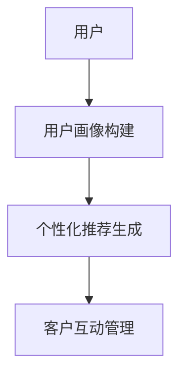

                 


# AI Agent在企业客户体验个性化推荐中的角色

> **关键词**：AI Agent, 个性化推荐, 客户体验, 机器学习, 深度学习, 系统架构, 实战项目

> **摘要**：本文探讨了AI Agent在企业客户体验中的角色，特别是在个性化推荐系统中的应用。文章详细分析了AI Agent的基本概念、核心算法、系统架构设计以及实际项目中的应用，通过理论与实践结合的方式，展示了AI Agent如何提升企业客户体验。

---

# 第1章: AI Agent的基本概念与背景

## 1.1 AI Agent的定义与特点

### 1.1.1 AI Agent的定义
AI Agent（人工智能代理）是指能够感知环境、自主决策并执行任务的智能体。它通过数据驱动的方式，为用户提供智能化的服务。

### 1.1.2 AI Agent的核心特点
- **自主性**：能够自主决策，无需人工干预。
- **反应性**：能够实时感知环境变化并做出反应。
- **主动性**：主动为用户提供服务，而不是被动响应。
- **学习能力**：通过机器学习不断优化自身行为。

### 1.1.3 AI Agent与传统推荐系统的区别
- **传统推荐系统**：基于规则或统计方法，推荐结果较固定。
- **AI Agent**：通过机器学习动态优化推荐结果，更具个性化和实时性。

---

## 1.2 企业客户体验中的个性化推荐

### 1.2.1 客户体验的定义与重要性
客户体验是指客户在整个与企业互动过程中所感受到的情感和体验。良好的客户体验能够提升客户满意度和忠诚度。

### 1.2.2 个性化推荐的背景与需求
个性化推荐是通过分析客户行为和偏好，提供符合其需求的产品或服务推荐。在大数据时代，个性化推荐已成为企业提升客户体验的重要手段。

### 1.2.3 AI Agent在个性化推荐中的作用
AI Agent通过实时分析客户数据，动态调整推荐策略，提供更精准的个性化推荐。

---

## 1.3 本章小结
本章介绍了AI Agent的基本概念、特点，以及其在企业客户体验中的应用背景和作用。

---

# 第2章: AI Agent在客户体验中的应用场景

## 2.1 自然语言处理在客户体验中的应用

### 2.1.1 NLP的基本概念
自然语言处理（NLP）是让计算机理解和生成人类语言的技术。

### 2.1.2 NLP在客户反馈分析中的应用
通过NLP技术分析客户反馈，提取情感倾向和关键词，帮助企业了解客户满意度。

### 2.1.3 NLP在客户互动中的应用
AI Agent可以通过NLP技术实现智能对话，为客户提供实时帮助。

## 2.2 情感分析在客户体验中的应用

### 2.2.1 情感分析的定义与方法
情感分析是指通过文本分析技术，判断文本中的情感倾向（正面、负面、中性）。

### 2.2.2 情感分析在客户反馈中的应用
通过分析客户评论的情感倾向，帮助企业识别客户痛点。

### 2.2.3 情感分析在客户互动中的应用
AI Agent可以根据客户情感倾向调整沟通策略，提供更贴心的服务。

## 2.3 个性化推荐在客户体验中的应用

### 2.3.1 个性化推荐的定义与方法
个性化推荐是基于客户行为和偏好，提供定制化的产品或服务推荐。

### 2.3.2 基于协同过滤的推荐算法
协同过滤是一种基于用户行为相似性的推荐方法。

### 2.3.3 基于深度学习的推荐算法
深度学习推荐算法通过神经网络模型捕捉用户行为的复杂模式。

---

## 2.4 本章小结
本章探讨了AI Agent在客户体验中的应用场景，包括NLP、情感分析和个性化推荐。

---

# 第3章: AI Agent的核心算法与技术

## 3.1 基于协同过滤的推荐算法

### 3.1.1 协同过滤的基本原理
协同过滤通过分析用户行为相似性，推荐相似用户的物品。

### 3.1.2 基于用户的协同过滤
基于用户行为相似性进行推荐。

### 3.1.3 基于物品的协同过滤
基于物品相似性进行推荐。

---

## 3.2 基于深度学习的推荐算法

### 3.2.1 基于神经网络的推荐算法
通过神经网络模型捕捉用户行为的复杂模式。

### 3.2.2 基于序列的推荐算法
基于用户行为序列进行推荐，如时间序列模型。

### 3.2.3 基于图的推荐算法
通过图结构分析用户和物品之间的关系。

---

## 3.3 深度学习模型在推荐系统中的应用

### 3.3.1 基于Transformer的推荐模型
Transformer模型通过自注意力机制捕捉用户行为的全局信息。

### 3.3.2 基于GNN的推荐模型
图神经网络（GNN）通过图结构分析用户和物品的关系。

### 3.3.3 基于强化学习的推荐模型
强化学习通过试错机制优化推荐策略。

---

## 3.4 本章小结
本章详细介绍了AI Agent的核心算法，包括协同过滤和深度学习算法，并分析了它们在推荐系统中的应用。

---

# 第4章: AI Agent的系统架构设计

## 4.1 系统功能设计

### 4.1.1 用户画像构建
通过收集用户数据，构建用户画像，用于个性化推荐。

### 4.1.2 个性化推荐生成
基于用户画像，生成个性化推荐结果。

### 4.1.3 客户互动管理
管理客户与AI Agent之间的互动，提升客户体验。

---

## 4.2 系统架构设计

### 4.2.1 系统架构图（Mermaid）


### 4.2.2 接口设计
- **输入接口**：接收用户行为数据。
- **输出接口**：输出个性化推荐结果。

### 4.2.3 交互流程
用户发起请求 -> 系统分析用户数据 -> 生成推荐结果 -> 返回推荐结果。

---

## 4.3 本章小结
本章设计了AI Agent的系统架构，包括功能设计、架构图和交互流程。

---

# 第5章: 项目实战

## 5.1 环境安装

### 5.1.1 安装Python
```bash
python --version
```

### 5.1.2 安装依赖库
```bash
pip install numpy pandas scikit-learn
```

---

## 5.2 系统核心实现

### 5.2.1 用户画像构建
```python
import pandas as pd

# 加载数据
data = pd.read_csv('user_data.csv')

# 构建用户画像
user_profile = data.groupby('user_id').agg('mean')
```

### 5.2.2 个性化推荐生成
```python
from sklearn.metrics.pairwise import cosine_similarity

# 计算相似性
similarity_matrix = cosine_similarity(user_profile)
```

---

## 5.3 实际案例分析

### 5.3.1 案例背景
某电商平台希望通过AI Agent提升客户体验。

### 5.3.2 数据分析
通过分析用户行为数据，构建用户画像。

### 5.3.3 算法实现
基于协同过滤算法生成个性化推荐。

---

## 5.4 本章小结
本章通过实际案例展示了AI Agent在个性化推荐系统中的应用。

---

# 第6章: 系统优化与部署

## 6.1 模型优化

### 6.1.1 参数调整
调整模型参数，优化推荐效果。

### 6.1.2 模型评估
通过准确率、召回率等指标评估模型性能。

---

## 6.2 系统安全

### 6.2.1 数据加密
对用户数据进行加密处理。

### 6.2.2 权限控制
设置权限控制，确保系统安全。

---

## 6.3 性能调优

### 6.3.1 并行计算
通过并行计算优化系统性能。

### 6.3.2 缓存优化
优化缓存策略，提升系统响应速度。

---

## 6.4 云部署

### 6.4.1 云平台选择
选择合适的云平台进行部署。

### 6.4.2 部署流程
编写部署脚本，实现自动化部署。

---

## 6.5 本章小结
本章讨论了系统优化与部署，包括模型优化、系统安全和云部署。

---

# 第7章: 总结与展望

## 7.1 总结

### 7.1.1 核心内容回顾
本文探讨了AI Agent在企业客户体验中的角色，特别是在个性化推荐系统中的应用。

### 7.1.2 最佳实践
建议企业在实际应用中结合AI Agent提升客户体验。

---

## 7.2 展望

### 7.2.1 未来发展趋势
随着技术进步，AI Agent在客户体验中的应用将更加智能化和个性化。

### 7.2.2 拓展方向
未来可以探索AI Agent在更多场景中的应用，如智能客服、精准营销等。

---

## 7.3 本章小结
本章总结了全文内容，并展望了AI Agent在客户体验中的未来发展方向。

---

# 作者

**作者**：AI天才研究院/AI Genius Institute & 禅与计算机程序设计艺术 /Zen And The Art of Computer Programming

