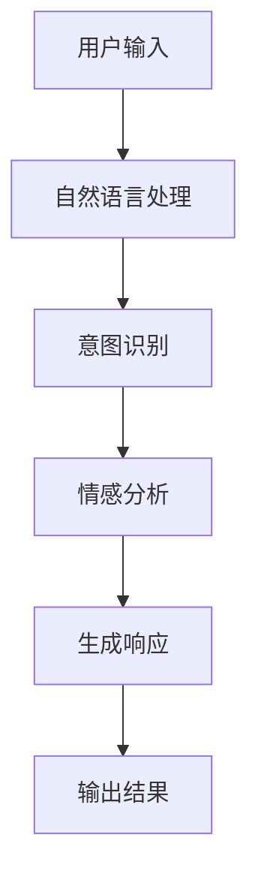
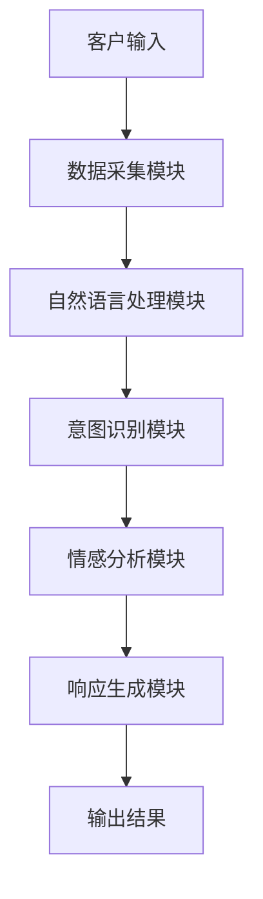

                 


# AI Agent在企业客户服务质量监控与提升中的实时应用

## 关键词：AI Agent, 客户服务质量, 实时监控, 自然语言处理, 机器学习, 情感分析, 智能客服系统

## 摘要：  
本文详细探讨了AI Agent在企业客户服务质量监控与提升中的实时应用。通过分析客户服务质量监控的痛点，介绍了AI Agent的核心概念、算法原理、系统架构及实际应用案例。文章还提供了最佳实践建议，帮助企业在实际应用中更好地提升客户体验。

---

## 第一部分：AI Agent在企业客户服务质量监控与提升中的实时应用概述

## 第1章：问题背景与核心概念

### 1.1 问题背景

#### 1.1.1 企业客户服务质量的重要性
客户服务质量是企业成功的关键因素之一。高质量的客户服务能够提高客户满意度、客户忠诚度和企业的声誉。在当今竞争激烈的市场环境中，客户体验已成为区分企业优劣的重要指标。

#### 1.1.2 当前客户服务质量监控的痛点
传统的客户服务质量监控方法存在以下问题：
- **效率低**：人工监控需要大量时间和资源。
- **精准度低**：人工监控容易受到主观因素的影响，导致结果不准确。
- **实时性差**：传统方法无法实现实时监控和快速响应。

#### 1.1.3 AI Agent在客户服务质量提升中的作用
AI Agent（人工智能代理）是一种能够自动执行任务的智能系统，能够实时监控和分析客户服务质量，帮助企业在第一时间发现问题并采取措施。

---

### 1.2 问题描述

#### 1.2.1 客户服务质量监控的复杂性
客户服务质量监控涉及多个维度，包括客户满意度、响应时间、问题解决效率等。这些维度相互关联，使得监控过程复杂且具有挑战性。

#### 1.2.2 现有解决方案的局限性
传统的解决方案主要依赖人工监控和简单的规则引擎，难以应对复杂多变的客户需求和场景。

#### 1.2.3 AI Agent的实时应用需求
随着技术的进步，AI Agent能够实时分析客户互动数据，提供精准的监控和反馈，从而帮助企业提升客户服务质量。

---

### 1.3 问题解决

#### 1.3.1 AI Agent的核心功能
AI Agent的核心功能包括：
- **实时监控**：实时分析客户互动数据。
- **智能分析**：利用自然语言处理和机器学习技术进行情感分析和意图识别。
- **自动响应**：根据分析结果生成智能回复，提供解决方案。

#### 1.3.2 AI Agent如何实现客户服务质量监控
AI Agent通过以下步骤实现客户服务质量监控：
1. 收集客户互动数据。
2. 使用自然语言处理技术进行意图识别和情感分析。
3. 根据分析结果生成响应并实时反馈。

#### 1.3.3 AI Agent在提升客户体验中的具体应用
AI Agent可以通过以下方式提升客户体验：
- 提供24/7的实时支持。
- 快速响应客户需求，减少客户等待时间。
- 根据客户情绪提供个性化服务。

---

### 1.4 AI Agent的边界与外延

#### 1.4.1 AI Agent的应用范围
AI Agent主要应用于客户服务领域，包括电话客服、在线客服、社交媒体客服等。

#### 1.4.2 AI Agent与其他技术的区分
AI Agent与传统客服系统的主要区别在于其智能化和自动化能力。AI Agent能够通过学习和优化提升服务质量，而传统系统仅依赖预设规则。

#### 1.4.3 AI Agent的未来发展
AI Agent将朝着更加智能化、个性化和自适应的方向发展，进一步提升客户体验和企业效率。

---

## 第2章：AI Agent的核心概念与联系

### 2.1 核心概念原理

#### 2.1.1 AI Agent的基本原理
AI Agent通过自然语言处理（NLP）和机器学习（ML）技术，分析客户互动数据，识别客户需求和情绪，从而提供智能响应。

#### 2.1.2 自然语言处理在AI Agent中的应用
自然语言处理技术用于解析客户的文本和语音输入，提取意图和情感信息。

#### 2.1.3 机器学习在客户服务质量监控中的作用
机器学习用于训练模型，识别客户情感和意图，并预测客户满意度。

---

### 2.2 核心概念对比表格

| 对比维度 | 传统客服系统 | AI Agent |
|----------|--------------|----------|
| 处理速度 | 慢          | 快        |
| 精准度   | 低          | 高        |
| 可扩展性 | 有限        | 强        |

---

### 2.3 ER实体关系图

```mermaid
erd
    Customer
    ServiceAgent
    Interaction
    Customer -> Interaction: 提出问题
    ServiceAgent -> Interaction: 提供解决方案
```

---

## 第3章：AI Agent的算法原理

### 3.1 算法原理概述

#### 3.1.1 基于自然语言处理的意图识别
意图识别是通过分析客户的文本或语音输入，识别其意图的过程。例如，客户说“我遇到了支付问题”，系统识别其意图是“支付问题”。

#### 3.1.2 基于机器学习的情感分析
情感分析用于识别客户的情绪，例如，客户说“我对这个服务很不满意”，系统识别其情感为“负面”。

#### 3.1.3 基于深度学习的对话生成
对话生成是根据客户需求和情感，生成合适的回复。例如，客户提到支付问题，系统生成“请提供您的订单号，我将帮助您解决支付问题”。

---

### 3.2 算法流程图



---

### 3.3 算法实现细节

#### 情感分析的数学模型
情感分析通常使用文本表示模型，例如词袋模型或词嵌入模型。以下是情感分析的简单数学模型：

$$
f(x) = \sum_{i=1}^{n} w_i x_i + b
$$

其中，$x_i$是文本的特征向量，$w_i$是权重，$b$是偏置。

---

## 第4章：AI Agent的系统分析与架构设计

### 4.1 系统运行场景

#### 4.1.1 客户与AI Agent的交互流程
1. 客户提出问题。
2. AI Agent接收输入并进行解析。
3. AI Agent生成响应并反馈给客户。

#### 4.1.2 系统功能设计
- **数据采集**：实时采集客户互动数据。
- **数据处理**：解析数据并提取意图和情感。
- **决策与响应**：根据分析结果生成智能回复。

---

### 4.2 系统架构设计



---

## 第5章：AI Agent的项目实战

### 5.1 环境安装

#### 5.1.1 Python环境安装
安装Python和必要的库：
```bash
pip install numpy pandas scikit-learn transformers
```

#### 5.1.2 AI Agent代码实现
以下是简单的AI Agent代码示例：

```python
import numpy as np
from sklearn.feature_extraction.text import TfidfVectorizer
from sklearn.naive_bayes import MultinomialNB

# 数据集
X = ["I have a problem with my order", "Can you help me with payment?", "I'm satisfied with the service"]
y = ["problem", "payment", "satisfaction"]

# 特征提取
vectorizer = TfidfVectorizer()
X_vec = vectorizer.fit_transform(X)

# 模型训练
model = MultinomialNB()
model.fit(X_vec, y)

# 预测
new_X = ["I have a question about my order"]
new_X_vec = vectorizer.transform(new_X)
predicted = model.predict(new_X_vec)
print(predicted)
```

---

### 5.2 代码解读与分析

#### 5.2.1 特征提取
使用TF-IDF向量化方法提取文本特征。

#### 5.2.2 模型训练
使用朴素贝叶斯算法进行分类，训练意图识别模型。

#### 5.2.3 应用案例分析
通过实际案例分析，展示AI Agent在客户服务质量监控中的应用效果。

---

## 第6章：AI Agent的最佳实践与小结

### 6.1 最佳实践

#### 6.1.1 系统集成
将AI Agent与企业现有的客户关系管理系统（CRM）集成，实现数据共享和协同工作。

#### 6.1.2 模型优化
定期优化模型，提高意图识别和情感分析的准确率。

#### 6.1.3 人员培训
对客户服务人员进行AI Agent使用的培训，确保系统顺利运行。

---

### 6.2 小结

AI Agent通过实时监控和智能分析，显著提升了企业客户服务质量。本文详细介绍了AI Agent的核心概念、算法原理和系统架构，并通过实际案例展示了其应用价值。

---

## 作者：AI天才研究院/AI Genius Institute & 禅与计算机程序设计艺术 /Zen And The Art of Computer Programming

---

**感谢您的阅读！如果对AI Agent的应用感兴趣，可以进一步研究相关技术和案例。**

