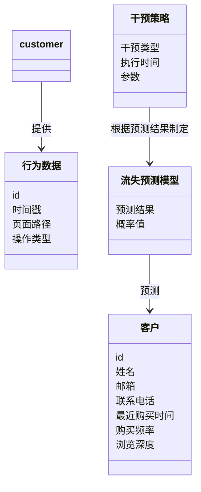

                 


# AI Agent在企业客户流失预警与精准干预中的应用

## 关键词：AI Agent，客户流失预警，精准干预，机器学习，数据驱动决策

## 摘要：  
本文探讨了AI Agent在企业客户流失预警与精准干预中的应用，结合实际案例和系统设计，详细分析了如何通过AI技术实现客户流失的早期识别与干预。文章从问题背景、核心概念、算法原理到系统架构、项目实战等方面进行了全面阐述，提供了从理论到实践的完整解决方案。

---

# 第一部分：AI Agent与企业客户流失预警概述

## 第1章：AI Agent与客户流失预警的背景与问题

### 1.1 客户流失问题的背景与重要性

#### 1.1.1 企业客户流失的定义与影响
客户流失是指客户不再与企业进行交易或减少交易频率的现象。客户流失不仅影响企业的收入，还会增加获取新客户的成本，降低企业的市场竞争力。研究表明，留住现有客户的成本远低于获取新客户，因此客户流失预警与干预是企业运营中的核心问题。

#### 1.1.2 客户流失对企业经营的核心影响
- 收入减少：流失客户直接导致收入下降。
- 市场份额流失：客户流失可能被竞争对手抢走，影响企业的市场地位。
- 客户获取成本增加：重新获取新客户需要投入更多资源。
- 品牌形象受损：客户流失可能影响企业的声誉。

#### 1.1.3 AI技术在客户管理中的应用潜力
AI技术可以通过分析客户行为数据，识别潜在流失风险，并制定精准干预策略，从而提高客户保留率。AI Agent作为AI技术的重要应用，能够实时分析客户行为，提供个性化的服务，降低客户流失风险。

### 1.2 AI Agent的基本概念与特点

#### 1.2.1 AI Agent的定义与核心功能
AI Agent是一种能够感知环境、自主决策并执行任务的智能代理。在客户流失预警中，AI Agent可以实时分析客户行为数据，识别潜在流失信号，并根据预设策略进行干预。

#### 1.2.2 AI Agent在客户管理中的优势
- 实时性：AI Agent可以实时分析客户行为数据，快速识别潜在流失风险。
- 精准性：基于机器学习算法，AI Agent能够精准预测客户流失概率，并制定个性化干预策略。
- 自适应性：AI Agent可以根据客户行为的变化动态调整预测模型和干预策略。

#### 1.2.3 AI Agent与传统客户管理工具的对比
传统客户管理工具主要依赖人工分析和规则-based的预警系统，存在效率低、精准度不足的问题。AI Agent通过机器学习和大数据分析，能够实现更高效、更精准的客户流失预警与干预。

### 1.3 企业客户流失预警的核心问题

#### 1.3.1 客户流失的预测与干预难点
- 数据复杂性：客户流失受多种因素影响，包括客户行为、市场环境、产品特性等，数据复杂且多维。
- 动态性：客户行为和市场环境不断变化，需要实时调整预测模型和干预策略。
- 干预效果评估：如何评估干预措施的有效性，优化干预策略。

#### 1.3.2 AI Agent在客户流失预警中的作用
AI Agent可以通过分析多源数据，识别潜在流失风险，并制定个性化干预策略，从而提高客户保留率。

#### 1.3.3 问题解决的边界与外延
AI Agent的应用范围不仅限于客户流失预警，还可以扩展到客户满意度提升、客户生命周期管理等领域。

### 1.4 本章小结

---

## 第2章：AI Agent与客户流失预警的核心概念

### 2.1 AI Agent的核心原理

#### 2.1.1 AI Agent的感知与决策机制
AI Agent通过感知环境（客户行为数据）并基于预设目标（降低客户流失率）进行决策，执行干预措施（如发送优惠券、提供个性化服务）。

#### 2.1.2 基于数据驱动的客户行为分析
AI Agent通过分析客户的行为数据（如购买频率、投诉记录、浏览行为等），识别潜在流失风险。

#### 2.1.3 多模态数据融合与特征提取
AI Agent可以整合结构化数据（如交易记录）和非结构化数据（如社交媒体评论），通过特征提取技术识别关键影响因素。

### 2.2 客户流失预警的关键要素

#### 2.2.1 客户行为数据的特征分解
- 时间序列特征：如最近一次购买时间、购买频率。
- 行为模式特征：如浏览深度、点击率。
- 社交特征：如社交媒体互动频率、情感分析。

#### 2.2.2 客户流失风险评估模型
基于机器学习算法（如逻辑回归、随机森林）构建客户流失概率模型，评估客户的流失风险。

#### 2.2.3 精准干预策略的制定与执行
根据客户流失风险评估结果，制定个性化干预策略，如优惠券发放、个性化推荐、客户关怀等。

### 2.3 AI Agent与客户流失预警的系统架构

#### 2.3.1 系统功能模块的划分
- 数据采集模块：收集客户行为数据。
- 特征提取模块：提取客户行为特征。
- 预测模型模块：构建客户流失概率模型。
- 干预策略模块：制定并执行干预策略。

#### 2.3.2 数据流与信息处理流程
- 数据采集：从数据库、社交媒体等多源数据源获取客户数据。
- 数据预处理：清洗、整合、特征提取。
- 模型训练：基于机器学习算法训练客户流失概率模型。
- 预警与干预：根据模型预测结果，触发干预措施。

#### 2.3.3 系统的可扩展性与灵活性
系统设计应具备可扩展性，能够适应数据规模和业务需求的变化，支持多种干预策略和模型优化。

### 2.4 本章小结

---

## 第3章：数据采集与特征工程

### 3.1 数据采集的多样性与挑战

#### 3.1.1 多源数据的整合与清洗
- 数据源：CRM系统、电商平台、社交媒体等。
- 数据清洗：处理缺失值、异常值、重复数据。

#### 3.1.2 数据质量评估与预处理
- 数据质量评估：评估数据的完整性、一致性、准确性。
- 数据预处理：数据标准化、归一化、特征工程。

#### 3.1.3 数据安全与隐私保护
- 数据加密：保护客户数据的安全。
- 隐私保护：遵守数据隐私法规（如GDPR）。

### 3.2 客户行为特征的提取与分析

#### 3.2.1 时间序列特征提取
- 最近一次购买时间。
- 购买频率（如每月购买次数）。
- 购买间隔时间。

#### 3.2.2 用户行为模式识别
- 浏览深度：客户在网站上的平均页面浏览数。
- 点击率：客户点击产品链接的比例。
- 加入购物车的比例。

#### 3.2.3 关键特征的筛选与权重分配
- 特征筛选：使用特征重要性分析方法筛选关键特征。
- 权重分配：根据特征对客户流失的影响程度分配权重。

### 3.3 基于AI Agent的特征工程优化

#### 3.3.1 自动特征提取与优化算法
- 自动特征提取：基于机器学习算法自动提取特征。
- 特征优化：使用特征选择算法优化特征集。

#### 3.3.2 特征选择的策略与方法
- 基于树模型的特征重要性分析。
- 基于线性模型的系数分析。

#### 3.3.3 特征工程对模型性能的影响
- 特征工程可以显著提高模型的准确性和稳定性。
- 通过特征工程可以降低模型的过拟合风险。

### 3.4 本章小结

---

## 第4章：AI Agent的算法原理与实现

### 4.1 基于监督学习的客户流失预测

#### 4.1.1 算法选择与模型构建
- 算法选择：逻辑回归、随机森林、梯度提升树（如XGBoost）。
- 数据分割：训练集、验证集、测试集。
- 模型训练：基于训练数据训练模型。

#### 4.1.2 模型评估与优化
- 评估指标：准确率、召回率、F1分数。
- 调参优化：使用网格搜索或随机搜索优化模型参数。

#### 4.1.3 模型部署与实时预测
- 模型部署：将模型部署到生产环境，实时接收客户行为数据，预测客户流失概率。

### 4.2 基于机器学习的特征工程与模型优化

#### 4.2.1 特征工程的优化策略
- 使用PCA进行降维。
- 使用特征组合技术创建新特征。

#### 4.2.2 模型优化方法
- 使用集成学习（如Bagging、Boosting）提高模型性能。
- 使用模型调优技术（如早停法）防止过拟合。

#### 4.2.3 模型的解释性分析
- 使用SHAP值解释模型决策。
- 可视化模型特征重要性。

### 4.3 本章小结

---

## 第5章：系统分析与架构设计方案

### 5.1 问题场景介绍

#### 5.1.1 项目背景
- 某电商平台希望通过AI Agent技术实现客户流失预警与精准干预。

#### 5.1.2 项目目标
- 实时监控客户行为，预测客户流失概率。
- 根据预测结果，触发精准干预措施。

### 5.2 系统功能设计

#### 5.2.1 领域模型设计
- 使用mermaid绘制领域模型类图。



#### 5.2.2 系统架构设计
- 使用mermaid绘制系统架构图。


### 5.3 系统接口设计

#### 5.3.1 API接口设计
- API接口：提供客户行为数据接口、流失预测接口、干预策略接口。

#### 5.3.2 数据流设计
- 数据流：从客户端到数据库，经过API网关，进入服务层，调用模型训练层进行预测。

### 5.4 系统交互设计

#### 5.4.1 客户端与系统交互
- 客户端发送客户行为数据到API网关。
- API网关调用服务层进行预测。
- 服务层调用模型训练层进行预测，返回预测结果。
- 根据预测结果，触发干预策略。

#### 5.4.2 干预策略的执行
- 根据预测结果，执行干预策略（如发送优惠券、提供个性化推荐）。

### 5.5 本章小结

---

## 第6章：项目实战

### 6.1 环境安装与配置

#### 6.1.1 环境要求
- 操作系统：Windows/Mac/Linux
- Python版本：3.6+
- 依赖库：pandas、numpy、scikit-learn、xgboost、flask

#### 6.1.2 环境配置
- 安装Python依赖库。
- 配置开发环境（如PyCharm、Jupyter Notebook）。

### 6.2 系统核心实现源代码

#### 6.2.1 数据预处理代码

```python
import pandas as pd
import numpy as np

# 加载数据
data = pd.read_csv('customer_behavior.csv')

# 数据清洗
data.dropna(inplace=True)
data = data.drop_duplicates()

# 特征工程
from sklearn.preprocessing import StandardScaler
scaler = StandardScaler()
scaled_features = scaler.fit_transform(data[['购买频率', '浏览深度', '购买间隔']])

# 数据分割
from sklearn.model_selection import train_test_split
X_train, X_test, y_train, y_test = train_test_split(scaled_features, data['流失标记'], test_size=0.2, random_state=42)
```

#### 6.2.2 模型训练代码

```python
# 训练模型
from xgboost import XGBClassifier
model = XGBClassifier(n_estimators=100, learning_rate=0.1, max_depth=6)
model.fit(X_train, y_train)

# 模型评估
from sklearn.metrics import accuracy_score, recall_score, f1_score
y_pred = model.predict(X_test)
print(f'Accuracy: {accuracy_score(y_test, y_pred)}')
print(f'Recall: {recall_score(y_test, y_pred)}')
print(f'F1 Score: {f1_score(y_test, y_pred)}')
```

#### 6.2.3 干预策略实现

```python
# 定义干预策略
def trigger_intervention(customer_id, probability):
    if probability > 0.7:
        # 发送优惠券
        print(f'发送优惠券给客户{customer_id}')
    elif probability > 0.5:
        # 提供个性化推荐
        print(f'为客户提供个性化推荐{customer_id}')
    else:
        # 提供客户关怀
        print(f'向客户{customer_id}发送关怀邮件')
```

### 6.3 代码应用解读与分析

#### 6.3.1 数据预处理代码解读
- 数据加载：从CSV文件加载客户行为数据。
- 数据清洗：删除缺失值和重复数据。
- 特征工程：对购买频率、浏览深度、购买间隔进行标准化处理。

#### 6.3.2 模型训练代码解读
- 模型选择：使用XGBoost算法训练客户流失概率模型。
- 模型评估：使用准确率、召回率、F1分数评估模型性能。

#### 6.3.3 干预策略实现解读
- 根据模型预测结果，触发不同的干预措施。

### 6.4 实际案例分析与详细讲解

#### 6.4.1 案例背景
某电商平台希望通过AI Agent技术实现客户流失预警与精准干预。

#### 6.4.2 数据分析
通过数据分析，识别出客户流失的主要因素包括购买频率下降、浏览深度降低、投诉处理不及时等。

#### 6.4.3 模型优化
通过模型优化，提高了客户流失预测的准确率和召回率。

#### 6.4.4 干预策略实施
根据模型预测结果，触发不同的干预措施，如发送优惠券、提供个性化推荐、客户关怀等。

### 6.5 本章小结

---

## 第7章：总结与展望

### 7.1 总结

#### 7.1.1 核心内容回顾
- AI Agent在客户流失预警中的应用。
- 数据采集与特征工程的重要性。
- 机器学习算法在客户流失预测中的应用。

#### 7.1.2 最佳实践 tips
- 数据质量是模型性能的基础。
- 特征工程是模型优化的关键。
- 干预策略的制定需要结合业务场景。

### 7.2 展望

#### 7.2.1 未来研究方向
- 更加复杂的机器学习算法（如深度学习）的应用。
- 多模态数据的融合与分析。
- 实时预测与干预的优化。

#### 7.2.2 拓展阅读
- 《机器学习实战》
- 《深度学习》
- 《数据挖掘导论》

### 7.3 本章小结

---

## 作者：AI天才研究院/AI Genius Institute & 禅与计算机程序设计艺术/Zen And The Art of Computer Programming

---

通过以上章节的详细设计，我们可以看到AI Agent在企业客户流失预警与精准干预中的应用是一个复杂但具有巨大潜力的领域。从数据采集到模型训练，从系统设计到项目实战，每一步都需要精心设计和优化。希望本文能为相关领域的读者提供有价值的参考和启示。

