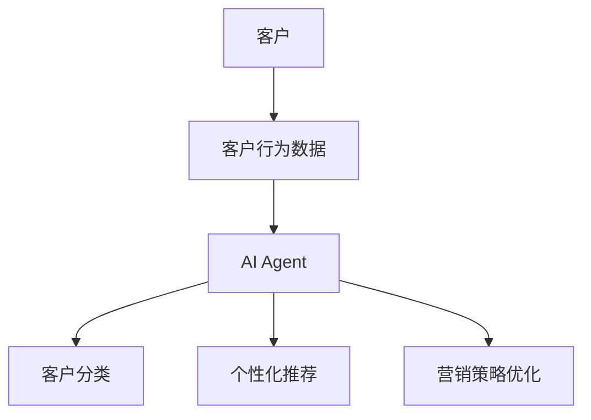
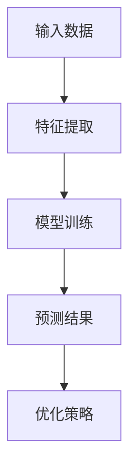
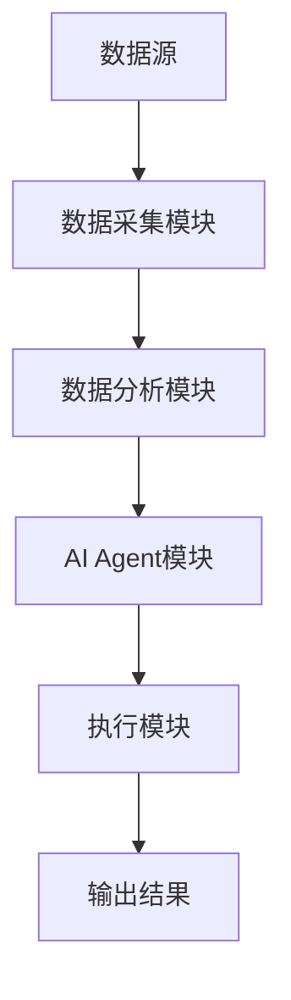

                 


# AI Agent在企业客户生命周期价值最大化中的应用

> 关键词：AI Agent，客户生命周期价值，企业客户管理，智能决策，人工智能算法

> 摘要：本文探讨了AI Agent在企业客户生命周期价值最大化中的应用，从理论基础到实际应用，系统地分析了AI Agent如何通过智能决策、数据驱动的方法优化客户管理流程，实现客户价值的最大化。文章结合具体案例，详细阐述了AI Agent的算法原理、系统架构设计和项目实现，为企业的智能化客户管理提供了实践指导。

---

## 第1章：AI Agent与客户生命周期管理概述

### 1.1 问题背景

#### 1.1.1 企业客户管理的痛点
在现代商业环境中，客户管理是企业运营的核心之一。然而，传统客户管理方法存在以下痛点：
- 数据孤岛：客户信息分散在不同系统中，难以整合和分析。
- 人工干预过多：客户分类、营销策略制定等环节依赖人工经验，效率低且主观性强。
- 客户流失风险高：缺乏对客户行为的实时分析，难以及时采取挽留措施。
- 客户体验不足：个性化服务不足，客户感知价值低。

#### 1.1.2 客户生命周期价值的重要性
客户生命周期价值（Customer Lifetime Value, CLV）是企业在整个客户关系期间内从客户那里获得的总收入减去相关成本。提升CLV是企业实现长期增长的关键，主要体现在：
- 提高客户 retention率。
- 增加客户 spending。
- 降低客户 acquisition成本。
- 优化资源分配。

#### 1.1.3 AI Agent在客户管理中的作用
AI Agent（人工智能代理）通过自动化、智能化的方式优化客户管理流程：
- **实时分析**：实时监控客户行为，预测需求和潜在风险。
- **个性化服务**：基于客户数据，提供个性化推荐和定制化服务。
- **智能决策**：通过数据驱动的决策，优化客户分类和营销策略。
- **自动化执行**：自动触发营销活动、客户关怀等操作。

### 1.2 问题描述

#### 1.2.1 客户生命周期的定义
客户生命周期包括以下几个阶段：
1. **获取阶段**：吸引新客户。
2. **激活阶段**：促使新客户进行首次购买或使用。
3. **留存阶段**：提高客户粘性和活跃度。
4. **增长阶段**：增加客户的消费频率和金额。
5. **衰退阶段**：客户逐渐减少互动，最终流失。

#### 1.2.2 客户流失的挑战
客户流失是企业的一大损失，主要挑战包括：
- 预测客户流失的难度。
- 及时采取挽留措施。
- 分析流失原因并优化策略。

#### 1.2.3 提升客户价值的目标
通过AI Agent，企业可以：
- 提高客户满意度和忠诚度。
- 增加客户的生命周期价值。
- 优化资源配置，降低管理成本。

### 1.3 问题解决

#### 1.3.1 AI Agent的核心功能
AI Agent在客户管理中的核心功能包括：
- **数据采集**：实时采集客户行为数据。
- **数据分析**：通过机器学习算法分析数据，识别客户行为模式。
- **决策支持**：基于分析结果，提供优化建议。
- **自动化执行**：根据决策结果，自动执行营销活动或客户关怀。

#### 1.3.2 数据驱动的客户管理
数据是AI Agent的核心，企业需要：
- **数据整合**：将分散在不同系统中的客户数据整合到一个平台。
- **数据清洗**：清理数据中的噪声和冗余信息。
- **数据建模**：构建客户行为模型，预测客户行为和需求。

#### 1.3.3 AI Agent的实现路径
AI Agent的实现路径包括：
1. 数据采集与整合。
2. 数据分析与建模。
3. AI Agent的设计与训练。
4. 系统集成与部署。

### 1.4 边界与外延

#### 1.4.1 AI Agent的应用范围
AI Agent主要应用于以下场景：
- 客户分类与细分。
- 个性化推荐。
- 客户流失预测与挽留。
- 自动化营销。

#### 1.4.2 与传统客户管理的区别
与传统客户管理相比，AI Agent的优势在于：
- 高度自动化。
- 数据驱动的决策。
- 实时响应。

#### 1.4.3 未来的扩展方向
AI Agent在客户管理中的未来发展方向包括：
- 更强的自主学习能力。
- 多模态数据处理能力。
- 更高的决策透明度和可解释性。

#### 1.5 概念结构与核心要素

- **核心概念结构图**


- **核心要素分析**
    - **客户**：目标对象。
    - **客户行为数据**：客户与企业互动的记录。
    - **AI Agent**：智能决策系统。
    - **客户分类**：基于数据的客户分组。
    - **个性化推荐**：针对客户的定制化服务。
    - **营销策略优化**：数据驱动的营销策略。

---

## 第2章：AI Agent的核心原理

### 2.1 AI Agent的原理

#### 2.1.1 强化学习机制
强化学习是一种通过试错方式优化决策的算法，适用于动态环境中的客户管理。例如：
- **Q-learning算法**：通过状态-动作-奖励机制优化客户互动策略。

#### 2.1.2 监督学习的应用
监督学习适用于客户分类和预测任务，例如：
- **随机森林**：用于客户流失预测。
- **逻辑回归**：用于客户 churn 预测。

#### 2.1.3 深度学习的整合
深度学习在客户画像和需求预测中具有优势，例如：
- **神经网络**：用于识别客户行为模式。

#### 2.1.4 算法流程图


---

## 第3章：客户生命周期管理的属性特征

### 3.1 客户生命周期的属性

| **属性**       | **描述**                                                                 |
|-----------------|--------------------------------------------------------------------------|
| 获取阶段        | 吸引新客户                                                                 |
| 激活阶段        | 促使客户首次购买或使用                                                     |
| 留存阶段        | 提高客户活跃度和忠诚度                                                     |
| 增长阶段        | 增加客户消费频率和金额                                                     |
| 衰退阶段        | 客户逐渐减少互动，最终流失                                                 |

---

## 第4章：AI Agent在客户管理中的应用案例

### 4.1 案例背景

#### 4.1.1 项目目标
通过AI Agent优化某电商平台的客户管理流程，提升客户生命周期价值。

#### 4.1.2 数据来源
- 用户行为日志。
- 订单数据。
- 用户属性数据。

#### 4.1.3 实施步骤
1. 数据清洗与预处理。
2. 客户行为分析。
3. AI Agent设计与训练。
4. 系统集成与测试。

---

## 第5章：系统分析与架构设计

### 5.1 问题场景介绍

#### 5.1.1 项目目标
设计一个基于AI Agent的客户管理系统，实现客户分类、个性化推荐和营销策略优化。

#### 5.1.2 系统功能设计

- **数据采集模块**：实时采集客户行为数据。
- **数据分析模块**：对数据进行清洗、建模和分析。
- **AI Agent模块**：基于模型生成决策和推荐。
- **执行模块**：根据决策结果执行营销活动或客户关怀。

#### 5.1.3 系统架构设计



---

## 第6章：项目实战

### 6.1 环境安装

#### 6.1.1 安装Python和相关库
```bash
pip install numpy pandas scikit-learn tensorflow
```

#### 6.1.2 安装Jupyter Notebook
```bash
pip install jupyter
```

---

## 第7章：总结与展望

### 7.1 总结
本文详细探讨了AI Agent在企业客户生命周期价值最大化中的应用，从理论到实践，系统地分析了AI Agent如何优化客户管理流程。通过具体案例，展示了AI Agent在客户分类、个性化推荐和营销策略优化中的实际应用。

### 7.2 未来展望
AI Agent在客户管理中的应用前景广阔，未来的发展方向包括：
- 更强的自主学习能力。
- 多模态数据处理能力。
- 更高的决策透明度和可解释性。

---

## 作者：AI天才研究院/AI Genius Institute & 禅与计算机程序设计艺术 /Zen And The Art of Computer Programming

