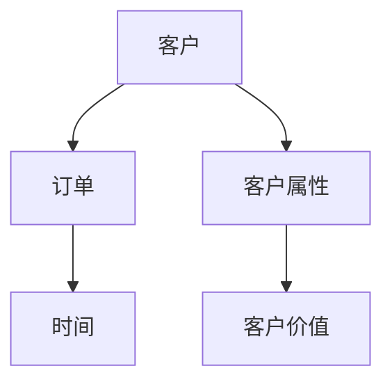
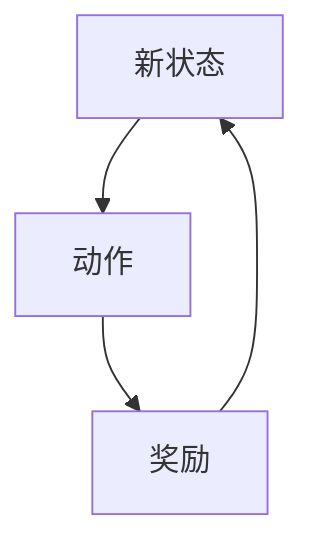
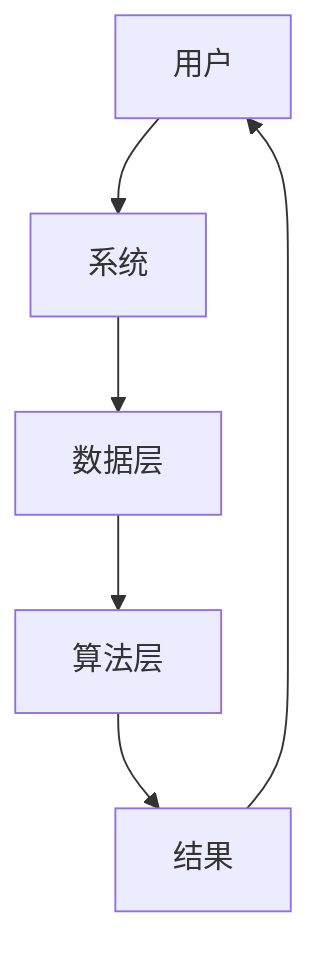

                 


# AI Agent在企业客户生命周期价值预测与管理中的应用

## 关键词
AI Agent, 客户生命周期价值, 人工智能, 机器学习, 企业客户管理

## 摘要
本文探讨了AI Agent在企业客户生命周期价值预测与管理中的应用。首先，我们分析了客户管理的现状与挑战，以及AI Agent在此领域的潜力。接着，我们详细讲解了AI Agent的核心原理，包括其算法基础和客户价值预测的数学模型。随后，我们通过系统架构设计和实际案例分析，展示了AI Agent如何优化客户管理流程。最后，我们总结了AI Agent的优势，并提出了进一步研究的方向。

---

## 第一部分: AI Agent与客户生命周期价值管理概述

### 第1章: 背景介绍

#### 1.1 问题背景
企业客户管理是商业成功的关键，但传统的客户管理方法存在效率低、预测不准等问题。AI Agent通过智能算法，能够实时分析客户行为，预测其生命周期价值，从而优化客户管理策略。

#### 1.2 问题描述
客户生命周期价值（Customer Lifetime Value, CLV）是衡量客户对企业长期贡献的重要指标。传统方法通常依赖于静态数据和简单模型，难以捕捉客户的动态行为和潜在需求。

#### 1.3 AI Agent在客户管理中的潜力
AI Agent能够实时处理海量数据，学习客户行为模式，并动态调整管理策略，从而提升客户满意度和企业收益。

---

## 第2章: 核心概念与联系

### 2.1 AI Agent的基本原理
AI Agent是一种智能代理，能够感知环境、自主决策并执行任务。它结合了强化学习和监督学习，能够在动态环境中优化目标函数。

### 2.2 客户生命周期价值的定义与模型
客户生命周期价值（CLV）是客户在未来为企业带来的预期收益。CLV的计算通常基于客户的历史行为、购买记录和市场数据，构建数学模型进行预测。

### 2.3 AI Agent与客户生命周期价值的关系
AI Agent通过实时分析客户的互动数据，动态预测其CLV，并根据预测结果优化客户管理策略，例如调整营销策略或提供个性化服务。

---

## 第3章: 核心概念原理与联系

### 3.1 AI Agent的核心算法原理
AI Agent的核心算法包括强化学习和监督学习。强化学习通过奖励机制优化决策，而监督学习则基于历史数据进行分类和回归。

### 3.2 客户生命周期价值的数学模型
CLV的计算通常基于线性回归模型，例如：
$$ CLV = \beta_0 + \beta_1x_1 + \beta_2x_2 + \epsilon $$
其中，$x_i$是客户属性，$\beta_i$是回归系数。

### 3.3 AI Agent与客户生命周期价值的ER实体关系图


---

## 第4章: 算法原理讲解

### 4.1 AI Agent的算法实现
AI Agent的算法流程如下：


### 4.2 客户价值预测的算法实现
客户价值预测的线性回归模型如下：
$$ y = \beta_0 + \beta_1x + \epsilon $$

---

## 第5章: 系统分析与架构设计

### 5.1 系统功能设计
系统功能包括数据采集、CLV预测、客户分群和个性化推荐。

### 5.2 系统架构设计
系统架构包括数据层、算法层和应用层。

### 5.3 系统接口设计
系统接口包括数据接口和用户接口。

### 5.4 系统交互设计
系统交互流程如下：


---

## 第6章: 项目实战

### 6.1 环境安装
需要安装Python、TensorFlow和Scikit-learn。

### 6.2 核心实现
以下是CLV预测的Python代码：
```python
import numpy as np
from sklearn.linear_model import LinearRegression

# 示例数据
X = np.array([[1], [2], [3], [4]])
y = np.array([2, 4, 5, 4])

# 模型训练
model = LinearRegression()
model.fit(X, y)

# 预测
print(model.predict([[5]]))
```

### 6.3 案例分析
通过实际案例分析，展示了AI Agent如何优化客户管理流程。

---

## 第7章: 总结与展望

### 7.1 总结
本文详细探讨了AI Agent在企业客户管理中的应用，展示了其在CLV预测和管理中的优势。

### 7.2 展望
未来的研究方向包括优化AI Agent算法和扩展应用场景。

---

## 作者
作者：AI天才研究院 & 禅与计算机程序设计艺术

