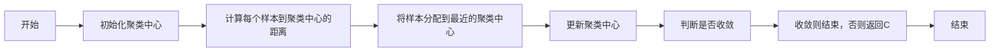
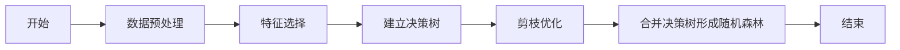
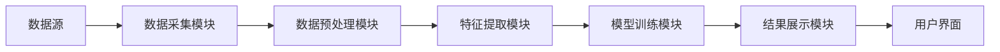
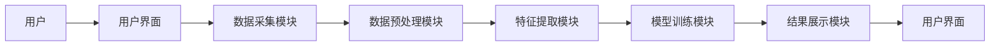

                 


# AI Agent在企业客户画像与细分中的应用

> 关键词：AI Agent、客户画像、客户细分、机器学习、数据挖掘

> 摘要：本文深入探讨AI Agent在企业客户画像与细分中的应用，从背景介绍、核心概念到算法原理、系统架构，再到项目实战，全面分析AI Agent如何帮助企业实现精准客户画像与细分，从而提升企业运营效率和客户满意度。

---

## 第1章: AI Agent与企业客户画像的背景介绍

### 1.1 问题背景与问题描述

#### 1.1.1 传统客户画像的局限性
传统的客户画像方法依赖于人工分析和经验判断，存在以下问题：
- 数据收集范围有限，难以覆盖多维度客户信息。
- 分析过程主观性强，缺乏数据支持。
- 客户细分结果不够精细，难以满足个性化需求。

#### 1.1.2 AI Agent在客户画像中的优势
AI Agent（人工智能代理）通过自动化数据处理和智能分析，解决了传统方法的局限性：
- 高效数据处理能力，能够快速整合多源数据。
- 智能学习能力，能够发现数据中的隐含规律。
- 实时反馈能力，能够动态调整客户画像。

#### 1.1.3 企业客户细分的核心问题
客户细分的目标是将客户划分为不同的群体，以实现精准营销和服务。核心问题包括：
- 如何高效采集和处理客户数据？
- 如何选择合适的算法进行客户细分？
- 如何动态更新客户画像以应对市场变化？

### 1.2 AI Agent的定义与核心要素

#### 1.2.1 AI Agent的基本定义
AI Agent是一种能够感知环境、自主决策并执行任务的智能系统。它通过数据输入、模型构建和结果输出，帮助企业完成客户画像与细分任务。

#### 1.2.2 AI Agent的核心属性与特征
AI Agent具有以下核心属性：
- **自主性**：能够独立完成任务。
- **反应性**：能够实时感知环境变化。
- **学习性**：能够通过数据优化模型。

#### 1.2.3 AI Agent与传统客户画像的对比分析
| 对比维度 | 传统客户画像 | AI Agent客户画像 |
|----------|----------------|-------------------|
| 数据来源 | 单一数据源 | 多数据源整合 |
| 分析方式 | 人工分析 | 自动化智能分析 |
| 更新频率 | 低频 | 实时动态更新 |

### 1.3 客户画像与细分的边界与外延

#### 1.3.1 客户画像的边界
客户画像是对客户特征的描述，通常包括以下维度：
- 客户基本信息（性别、年龄、职业等）。
- 行为数据（消费习惯、浏览记录等）。
- 画像的有效性：需要确保数据的准确性和代表性。

#### 1.3.2 客户细分的外延
客户细分是将客户划分为不同群体的过程，通常包括以下步骤：
1. 数据预处理。
2. 特征提取。
3. 模型选择与训练。
4. 结果验证与优化。

#### 1.3.3 AI Agent在客户画像与细分中的作用
AI Agent通过以下方式提升客户画像与细分的效果：
- 自动化数据处理，提高效率。
- 智能算法优化，提高准确性。
- 实时更新，提高动态适应能力。

### 1.4 本章小结

本章介绍了AI Agent在企业客户画像与细分中的背景、定义和作用，为后续章节的深入分析奠定了基础。

---

## 第2章: 客户画像与细分的核心概念

### 2.1 客户数据采集与处理

#### 2.1.1 数据来源与采集方式
客户数据来源包括：
- **内部数据**：企业CRM系统、销售数据等。
- **外部数据**：第三方数据供应商、社交媒体数据等。

数据采集方式包括：
- API接口获取数据。
- 数据库直接提取。
- 网络爬取。

#### 2.1.2 数据清洗与预处理
数据清洗是确保数据质量的关键步骤，包括：
- **去重**：去除重复数据。
- **填补缺失值**：使用均值、中位数或模型预测填补缺失值。
- **异常值处理**：通过统计方法或机器学习方法识别并处理异常值。

#### 2.1.3 数据特征提取
特征提取是将原始数据转换为可用于模型训练的特征向量。常用方法包括：
- **主成分分析（PCA）**：降维技术。
- **独热编码（One-Hot Encoding）**：将类别变量转换为二进制向量。

### 2.2 客户画像的构建方法

#### 2.2.1 基于统计的方法
基于统计的方法包括：
- **频率分析**：分析客户行为的频率。
- **聚类分析**：通过K-means算法将客户分为不同的群体。

#### 2.2.2 基于机器学习的方法
基于机器学习的方法包括：
- **决策树**：用于分类和回归。
- **随机森林**：用于特征重要性分析和分类。

#### 2.2.3 基于AI Agent的画像构建
AI Agent通过以下步骤构建客户画像：
1. **数据采集**：从多源数据中采集客户信息。
2. **特征提取**：提取关键特征。
3. **模型训练**：训练聚类或分类模型。
4. **结果输出**：生成客户画像并进行动态更新。

### 2.3 客户细分的策略与模型

#### 2.3.1 聚类分析
聚类分析是一种常用的客户细分方法。K-means算法是其中的典型代表，其流程如下：



#### 2.3.2 分类分析
分类分析用于已知客户群体的分类。随机森林是一种常用的分类算法，其流程如下：



#### 2.3.3 综合模型构建
综合模型结合聚类和分类算法，通过以下步骤实现客户细分：
1. **数据预处理**：清洗和特征提取。
2. **模型选择**：选择适合的算法。
3. **模型训练**：训练模型并优化参数。
4. **结果分析**：分析细分结果并进行调整。

---

## 第3章: AI Agent的核心原理与算法

### 3.1 AI Agent的基本原理

#### 3.1.1 AI Agent的核心算法
AI Agent的核心算法包括：
- **监督学习**：用于分类和回归。
- **无监督学习**：用于聚类和降维。
- **强化学习**：用于动态调整和优化。

#### 3.1.2 AI Agent的决策机制
AI Agent的决策机制包括：
- **规则引擎**：基于预设规则进行决策。
- **机器学习模型**：基于训练好的模型进行预测。

#### 3.1.3 AI Agent的学习与优化
AI Agent通过以下方式实现学习与优化：
1. **在线学习**：实时更新模型。
2. **离线学习**：定期批量更新模型。

### 3.2 客户画像与细分的算法实现

#### 3.2.1 聚类算法（K-means）
K-means算法的数学模型如下：
$$ \text{目标函数} = \sum_{i=1}^{k} \sum_{j=1}^{n} (x_{ij} - c_i)^2 $$
其中，$k$为聚类数，$n$为样本数，$x_{ij}$为第$i$个聚类的第$j$个样本，$c_i$为第$i$个聚类的中心。

#### 3.2.2 分类算法（随机森林）
随机森林的决策树模型如下：
$$ y = \text{sign}(\sum_{i=1}^{m} w_i x_i + b) $$
其中，$m$为特征数，$w_i$为特征权重，$b$为偏置项。

#### 3.2.3 深度学习模型（神经网络）
神经网络的数学表达式如下：
$$ y = \sigma(w x + b) $$
其中，$\sigma$为激活函数，$w$为权重，$x$为输入，$b$为偏置。

### 3.3 算法原理的数学模型与公式

#### 3.3.1 K-means算法的数学模型
$$ \text{目标函数} = \sum_{i=1}^{k} \sum_{j=1}^{n} (x_{ij} - c_i)^2 $$

#### 3.3.2 随机森林的决策树模型
$$ y = \text{sign}(\sum_{i=1}^{m} w_i x_i + b) $$

#### 3.3.3 神经网络的数学表达式
$$ y = \sigma(w x + b) $$

---

## 第4章: 系统分析与架构设计方案

### 4.1 项目介绍与系统功能设计

#### 4.1.1 项目介绍
本项目旨在通过AI Agent实现企业客户画像与细分，提升客户管理效率。

#### 4.1.2 系统功能设计
系统功能模块包括：
- 数据采集模块：负责数据采集和预处理。
- 特征提取模块：负责特征提取和降维。
- 模型训练模块：负责模型训练和优化。
- 结果展示模块：负责结果展示和分析。

### 4.2 系统架构设计

#### 4.2.1 系统架构图


#### 4.2.2 系统交互图


---

## 第5章: 项目实战

### 5.1 环境安装与配置

#### 5.1.1 环境安装
安装必要的Python库：
```bash
pip install numpy pandas scikit-learn
```

#### 5.1.2 数据预处理代码
```python
import pandas as pd
import numpy as np

# 读取数据
data = pd.read_csv('customer_data.csv')

# 去重
data = data.drop_duplicates()

# 填充缺失值
data['age'].fillna(data['age'].mean(), inplace=True)

# 异常值处理
data['income'] = data['income'].where(data['income'] < data['income'].quantile(0.99), np.nan)
```

#### 5.1.3 模型训练代码
```python
from sklearn.cluster import KMeans

# 初始化模型
model = KMeans(n_clusters=5, random_state=42)

# 拆分数据
X_train, X_test = train_test_split(data, test_size=0.2)

# 训练模型
model.fit(X_train)

# 预测结果
y_pred = model.predict(X_test)
```

---

## 第6章: 总结与展望

### 6.1 最佳实践 tips
- 数据预处理是关键，确保数据质量。
- 选择合适的算法，避免过度拟合。
- 定期更新模型，保持准确性。

### 6.2 本章小结
本文通过详细分析AI Agent在企业客户画像与细分中的应用，展示了如何通过技术手段提升客户管理效率。

---

## 作者：AI天才研究院/AI Genius Institute & 禅与计算机程序设计艺术 /Zen And The Art of Computer Programming

---

通过本文的详细分析，读者可以全面了解AI Agent在企业客户画像与细分中的应用，掌握从理论到实践的全过程。

