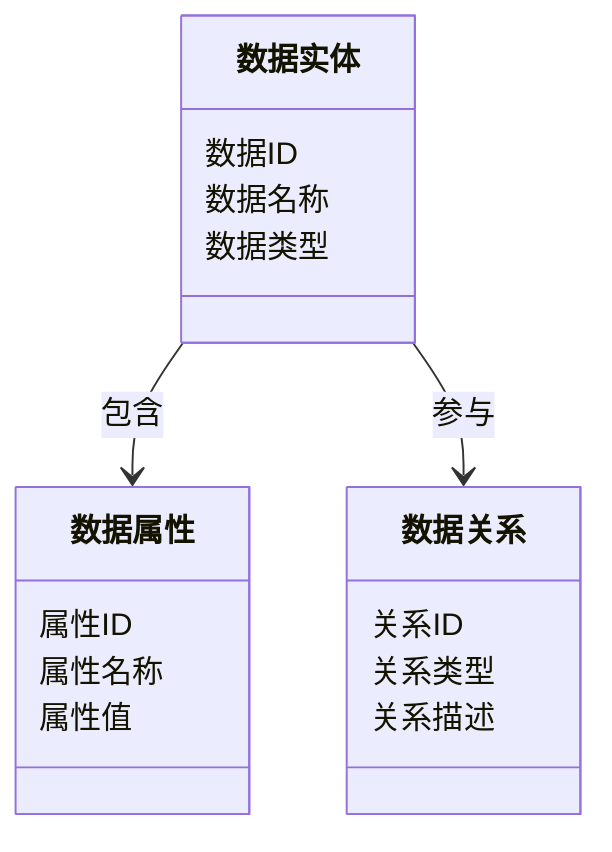
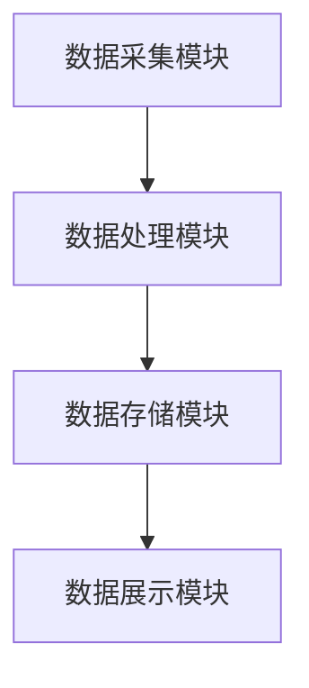
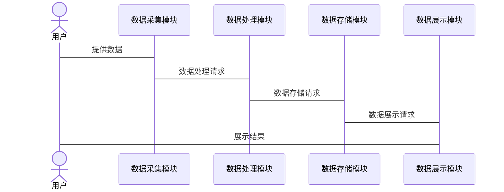

                 


# AI Agent在企业数据质量管理与治理中的全面应用

## 关键词：
AI Agent, 数据质量管理, 企业数据治理, 生成式AI, 强化学习, 数据流治理, 实体关系图

## 摘要：
随着企业数据规模的不断扩大，数据质量管理的重要性日益凸显。AI Agent作为一种智能化的数据治理工具，通过生成式AI和强化学习等技术，能够高效地解决数据清洗、标准化、去重等问题。本文从AI Agent的基本概念出发，结合数据质量管理的理论与方法，详细探讨AI Agent在数据治理中的应用，包括算法原理、系统架构设计和项目实战，为企业数据质量管理提供新的思路和解决方案。

---

## 第一部分: AI Agent与企业数据质量管理概述

## 第1章: AI Agent与数据质量管理概述

### 1.1 数据质量管理的背景与挑战
#### 1.1.1 数据质量管理的定义与重要性
数据质量管理（Data Quality Management, DQM）是指通过一系列方法和技术，确保数据的准确性、完整性、一致性和及时性。随着企业数字化转型的推进，数据成为企业最重要的资产之一，数据质量直接影响企业的决策和运营效率。

#### 1.1.2 企业数据质量管理的核心问题
企业在数据质量管理中面临的主要问题包括：
- 数据冗余与不一致性：同一数据在不同系统中存在多种表示形式。
- 数据缺失与不完整：部分数据未被记录或记录不完整。
- 数据污染与错误：数据中存在错误或不合理的值。
- 数据孤岛：数据分散在不同系统中，难以统一管理。

#### 1.1.3 数据质量管理的边界与外延
数据质量管理不仅关注数据本身的准确性，还涉及数据的存储、处理和使用过程中的规范性。其外延包括数据治理、数据安全和数据隐私保护。

### 1.2 AI Agent的定义与特点
#### 1.2.1 AI Agent的基本概念
AI Agent（人工智能代理）是一种能够感知环境并采取行动以实现目标的智能实体。它可以是一个软件程序，也可以是一个硬件设备，通过与环境交互来完成特定任务。

#### 1.2.2 AI Agent的核心属性与特征
AI Agent具有以下核心属性：
1. **自主性**：能够在没有外部干预的情况下自主决策。
2. **反应性**：能够感知环境并实时调整行为。
3. **目标导向**：通过实现目标来驱动行为。
4. **学习能力**：能够通过经验改进自身的性能。

#### 1.2.3 AI Agent与传统数据治理工具的对比
| 特性         | 传统数据治理工具 | AI Agent |
|--------------|------------------|-----------|
| 智能性       | 较低             | 高         |
| 自适应性     | 较差             | 强         |
| 处理复杂性   | 有限             | 无限       |
| 学习能力     | 无               | 有         |

### 1.3 AI Agent在数据质量管理中的作用
#### 1.3.1 数据质量管理中的问题识别
AI Agent可以通过自然语言处理（NLP）和机器学习（ML）技术，从大量数据中识别潜在问题，如重复数据、错误格式等。

#### 1.3.2 AI Agent在数据清洗与优化中的应用
AI Agent可以自动清洗数据，包括去重、格式转换、填补缺失值等操作，显著提高数据处理效率。

#### 1.3.3 AI Agent在数据治理中的价值
AI Agent能够协助制定数据治理策略，监控数据质量，并提供改进建议，从而实现数据的全生命周期管理。

### 1.4 本章小结
本章介绍了数据质量管理的基本概念、核心问题以及AI Agent的定义和特点，重点探讨了AI Agent在数据质量管理中的作用和价值。

---

## 第2章: 数据质量管理的理论与方法

### 2.1 数据质量管理的理论基础
#### 2.1.1 数据质量管理的定义与目标
数据质量管理的目标是确保数据的准确性、完整性和一致性，为企业决策提供可靠的数据支持。

#### 2.1.2 数据质量管理的核心原则
- 数据的可追溯性：确保数据来源可追溯。
- 数据的规范性：遵循统一的数据标准。
- 数据的及时性：保证数据的实时性。

#### 2.1.3 数据质量管理的框架与模型
数据质量管理通常包括数据收集、数据清洗、数据存储、数据处理和数据使用的五个阶段。

### 2.2 数据质量管理的主要方法
#### 2.2.1 数据清洗方法
数据清洗包括去除重复数据、填补缺失值和纠正错误数据等步骤。

#### 2.2.2 数据标准化方法
数据标准化包括数据格式统一、数据编码标准化和数据分类标准化。

#### 2.2.3 数据去重与合并方法
数据去重可以通过哈希算法和聚类算法实现，数据合并则通过关联规则和数据匹配技术完成。

### 2.3 数据质量管理的挑战与解决方案
#### 2.3.1 数据质量管理的主要挑战
- 数据量大：企业数据通常非常庞大，难以处理。
- 数据多样性：数据来源多样化，增加了处理的复杂性。
- 数据动态性：数据不断变化，需要实时处理。

#### 2.3.2 AI Agent在数据质量管理中的解决方案
AI Agent可以通过自动化学习和优化算法，实时处理数据质量问题，显著提高数据处理效率。

#### 2.3.3 数据质量管理的未来发展趋势
随着AI技术的不断进步，数据质量管理将更加智能化和自动化，AI Agent将在其中发挥越来越重要的作用。

### 2.4 本章小结
本章详细介绍了数据质量管理的理论基础、主要方法以及面临的挑战，重点探讨了AI Agent在解决数据质量管理问题中的作用。

---

## 第3章: AI Agent的核心概念与原理

### 3.1 AI Agent的结构与功能
#### 3.1.1 AI Agent的组成模块
AI Agent通常包括感知模块、决策模块、执行模块和学习模块。

#### 3.1.2 AI Agent的功能特点
- 智能感知：能够感知环境并获取相关信息。
- 自主决策：能够根据感知信息做出决策。
- 自适应学习：能够通过经验改进自身性能。

#### 3.1.3 AI Agent与数据质量管理的结合
AI Agent可以通过分析数据质量和数据使用情况，优化数据处理流程，提升数据管理水平。

### 3.2 数据质量管理中的AI Agent模型
#### 3.2.1 数据质量管理模型的构建
数据质量管理模型包括数据输入、数据处理、数据输出和数据评估四个阶段。

#### 3.2.2 AI Agent在数据质量管理中的实体关系图（ER图）

```mermaid
er
  actor: 数据管理用户
  entity: 数据实体
  attribute: 数据属性
  relationship: 数据关系
  actor --> entity: 提供数据
  entity --> attribute: 包含属性
  entity --> relationship: 参与关系
```

### 3.3 AI Agent的数据流与治理流程
#### 3.3.1 数据流的定义
数据流是指数据从输入到输出的流动过程，包括数据收集、数据处理和数据存储三个阶段。

#### 3.3.2 数据治理流程
数据治理流程包括数据收集、数据清洗、数据标准化、数据存储和数据使用五个阶段。

### 3.4 本章小结
本章详细介绍了AI Agent的结构与功能，以及在数据质量管理中的应用，重点探讨了数据流与治理流程的设计。

---

## 第4章: AI Agent的算法原理

### 4.1 生成式AI在数据质量管理中的应用
#### 4.1.1 生成式AI的基本原理
生成式AI通过生成对抗网络（GAN）和变分自编码器（VAE）等技术生成高质量数据。

#### 4.1.2 数据清洗与优化的生成式模型
生成式AI可以通过生成对抗网络（GAN）生成干净数据，用于数据清洗和优化。

#### 4.1.3 数据生成的数学模型
生成式AI的核心模型包括生成器和判别器，其损失函数可以表示为：

$$ \mathcal{L} = \mathbb{E}_{x,y}[\log D(x,y)] + \mathbb{E}_{z}[\log (1-D(G(z),y))] $$

其中，$D(x,y)$ 是判别器对输入数据的判断概率，$G(z,y)$ 是生成器生成的数据。

### 4.2 强化学习在数据治理中的应用
#### 4.2.1 强化学习的基本原理
强化学习通过智能体与环境的交互，学习最优策略以最大化累积奖励。

#### 4.2.2 数据治理中的强化学习模型
强化学习可以用于数据清洗、数据标准化和数据去重等任务，其奖励函数可以表示为：

$$ R(s,a) = \mathbb{E}[r(s,a)] $$

其中，$s$ 是当前状态，$a$ 是智能体采取的动作，$r(s,a)$ 是奖励值。

#### 4.2.3 强化学习的数据治理流程
强化学习可以通过状态转移和动作选择，优化数据治理流程，提高数据处理效率。

### 4.3 生成式AI与强化学习的结合
#### 4.3.1 生成式AI与强化学习的协同作用
生成式AI可以生成高质量数据，强化学习可以优化数据治理策略，两者结合可以显著提高数据处理效率。

#### 4.3.2 组合算法的数学模型
组合算法可以通过联合优化生成式AI和强化学习模型，实现数据治理的最优解。

### 4.4 本章小结
本章详细介绍了生成式AI和强化学习在数据质量管理中的应用，重点探讨了算法原理和数学模型。

---

## 第5章: AI Agent的系统分析与架构设计

### 5.1 系统分析
#### 5.1.1 问题场景介绍
企业数据质量管理中，数据清洗、标准化和去重等问题需要高效解决。

#### 5.1.2 项目介绍
本项目旨在通过AI Agent实现企业数据质量管理的自动化和智能化。

### 5.2 系统功能设计
#### 5.2.1 领域模型
领域模型包括数据实体、数据属性和数据关系三部分。



#### 5.2.2 系统架构设计
系统架构包括数据采集模块、数据处理模块、数据存储模块和数据展示模块。



#### 5.2.3 系统接口设计
系统接口包括数据输入接口、数据处理接口和数据输出接口。

### 5.3 系统交互流程
#### 5.3.1 系统交互流程
系统交互流程包括数据输入、数据处理和数据输出三个阶段。



### 5.4 本章小结
本章详细介绍了AI Agent系统的分析与架构设计，重点探讨了系统功能设计和交互流程。

---

## 第6章: AI Agent的项目实战

### 6.1 环境安装
#### 6.1.1 系统环境
建议使用Python 3.8及以上版本，安装TensorFlow和Keras库。

#### 6.1.2 工具安装
安装必要的工具，包括Python、TensorFlow和Keras。

### 6.2 系统核心实现
#### 6.2.1 数据采集模块实现
数据采集模块可以通过API接口获取数据，代码如下：

```python
import requests

def fetch_data(url):
    response = requests.get(url)
    return response.json()
```

#### 6.2.2 数据处理模块实现
数据处理模块包括数据清洗和数据标准化功能，代码如下：

```python
import pandas as pd

def clean_data(df):
    df.drop_duplicates(inplace=True)
    df.dropna(inplace=True)
    return df
```

#### 6.2.3 数据存储模块实现
数据存储模块可以使用数据库存储数据，代码如下：

```python
import sqlite3

def save_data(df, db_name):
    conn = sqlite3.connect(db_name)
    df.to_sql('data_table', con=conn, if_exists='replace')
    conn.close()
```

#### 6.2.4 数据展示模块实现
数据展示模块可以通过可视化工具展示数据，代码如下：

```python
import matplotlib.pyplot as plt

def plot_data(df):
    plt.hist(df['数值'], bins=10)
    plt.show()
```

### 6.3 案例分析与实现
#### 6.3.1 案例背景
某企业需要清洗和标准化客户数据，包括去重、格式转换和填补缺失值。

#### 6.3.2 案例实现
通过AI Agent实现数据清洗和标准化，代码如下：

```python
import pandas as pd

# 数据采集
data = fetch_data('http://example.com/api')

# 数据清洗
cleaned_data = clean_data(pd.DataFrame(data))

# 数据存储
save_data(cleaned_data, 'data.db')

# 数据展示
plot_data(cleaned_data)
```

### 6.4 项目总结
本项目通过AI Agent实现了企业数据质量管理的自动化和智能化，显著提高了数据处理效率。

### 6.5 本章小结
本章通过实际案例详细介绍了AI Agent的项目实战，重点探讨了环境安装、系统实现和案例分析。

---

## 第7章: AI Agent在数据质量管理中的最佳实践

### 7.1 最佳实践
#### 7.1.1 数据质量管理的注意事项
- 数据质量管理需要结合企业实际需求进行定制化设计。
- 数据质量管理需要持续优化，不断改进数据处理流程。

#### 7.1.2 AI Agent的使用建议
- AI Agent需要结合具体业务场景进行优化。
- AI Agent的性能需要定期评估和优化。

### 7.2 小结
AI Agent在企业数据质量管理中具有重要的应用价值，其智能化和自动化的特点能够显著提高数据处理效率。

### 7.3 注意事项
- 数据质量管理需要遵循企业数据治理规范。
- AI Agent的使用需要遵守数据隐私保护法律法规。

### 7.4 拓展阅读
建议读者阅读以下书籍和论文，深入了解AI Agent和数据质量管理的相关知识：
- 《数据质量管理：方法与实践》
- 《生成式AI在数据处理中的应用》
- 《强化学习与数据治理》

### 7.5 本章小结
本章总结了AI Agent在数据质量管理中的最佳实践，重点提出了注意事项和拓展阅读建议。

---

## 作者：AI天才研究院/AI Genius Institute & 禅与计算机程序设计艺术 /Zen And The Art of Computer Programming

---

通过以上目录大纲，我们可以看到，文章内容涵盖了AI Agent在企业数据质量管理中的各个方面，从理论到实践，从算法到系统设计，全面而深入地探讨了AI Agent的应用。文章结构清晰，逻辑连贯，内容丰富，能够为读者提供有价值的知识和实践指导。

