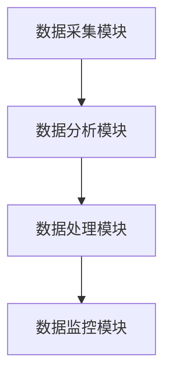
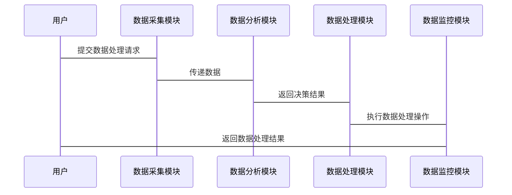

                 


# AI Agent在企业数据质量管理与治理自动化中的应用

## 关键词：AI Agent, 数据质量管理, 企业数据治理, 治理自动化, 数据清洗, 数据集成

## 摘要：  
随着企业数据规模的不断扩大和数据多样性的增加，数据质量管理变得日益重要。传统的数据质量管理方法效率低下，难以应对复杂的业务场景。AI Agent作为一种智能代理，能够通过自动化的方式提升数据质量管理的效率和准确性。本文详细探讨了AI Agent在企业数据质量管理中的应用，从核心概念到算法原理，再到系统架构和项目实战，全面解析其在数据清洗、数据集成和数据标准化等环节中的具体应用，为企业实现数据治理自动化提供了理论和实践指导。

---

## 第1章: AI Agent与数据质量管理的背景与概述

### 1.1 数据质量管理的背景与挑战

#### 1.1.1 数据质量管理的定义与重要性  
数据质量管理（Data Quality Management, DQM）是指通过一系列方法和技术，确保数据的准确性、完整性、一致性、及时性和合规性。随着企业数字化转型的推进，数据已成为企业最重要的资产之一。然而，数据在采集、存储和处理过程中，常常面临数据不完整、重复、冗余、错误等问题，这些问题直接影响企业的决策能力和业务效率。因此，数据质量管理成为企业信息化建设中的重要环节。

#### 1.1.2 企业数据质量管理的常见挑战  
企业在数据质量管理过程中面临以下主要挑战：  
1. **数据来源多样化**：数据可能来自不同的系统、数据库或外部接口，导致数据格式、命名和结构不一致。  
2. **数据量大**：企业每天产生的数据量可能以TB级计，传统的手动数据质量管理方法效率低下。  
3. **数据清洗复杂**：数据清洗需要处理重复数据、填补缺失值、纠正错误数据，这些操作往往需要复杂的逻辑和规则。  
4. **数据治理成本高**：数据质量管理需要投入大量的人力和时间，尤其是在处理大规模数据时，成本更加显著。  

#### 1.1.3 数据质量管理的边界与外延  
数据质量管理不仅关注数据的准确性，还涉及数据的存储、传输和使用过程中的安全性和合规性。数据质量管理的外延包括数据集成、数据标准化、数据仓库建设和数据分析等环节，是企业数据治理的重要组成部分。

---

### 1.2 AI Agent在数据质量管理中的作用

#### 1.2.1 AI Agent的定义与特点  
AI Agent（人工智能代理）是一种能够感知环境、自主决策并执行任务的智能实体。AI Agent具有以下特点：  
1. **自主性**：能够自主决策，无需人工干预。  
2. **反应性**：能够实时感知环境变化并做出响应。  
3. **目标导向**：以特定目标为导向，优化任务执行效果。  
4. **学习能力**：能够通过机器学习算法不断优化自身的决策能力。  

#### 1.2.2 数据质量管理中引入AI Agent的意义  
在数据质量管理中引入AI Agent，可以通过自动化技术提高数据清洗、数据集成和数据标准化的效率，降低人工成本，同时提高数据处理的准确性和一致性。AI Agent能够处理复杂的数据关系和业务逻辑，适用于大规模数据处理场景。

#### 1.2.3 AI Agent与传统数据质量管理方法的对比  

| 对比维度         | 传统数据质量管理 | AI Agent驱动的数据质量管理 |
|------------------|------------------|-----------------------------|
| **效率**         | 依赖人工操作，效率较低 | 自动化处理，效率高           |
| **准确性**       | 易受人工疏忽影响 | 基于算法，准确性高           |
| **灵活性**       | 难以应对复杂场景 | 能够处理复杂场景             |
| **成本**         | 人工成本高       | 人工成本低，自动化成本可控 |

---

### 1.3 AI Agent与数据质量管理的结合

#### 1.3.1 数据质量管理的核心要素  
数据质量管理的核心要素包括：  
1. 数据准确性：确保数据反映真实情况。  
2. 数据完整性：确保数据无缺失。  
3. 数据一致性：确保数据格式和命名一致。  
4. 数据及时性：确保数据更新及时。  
5. 数据合规性：确保数据符合相关法律法规。  

#### 1.3.2 AI Agent在数据质量管理中的核心作用  
AI Agent通过以下方式提升数据质量管理的效率和效果：  
1. **数据清洗**：自动识别和纠正数据中的错误和重复。  
2. **数据集成**：自动处理多源数据的集成问题，确保数据一致性。  
3. **数据标准化**：自动将数据转换为统一的格式和命名规范。  

#### 1.3.3 数据质量管理与AI Agent的结合模式  
AI Agent与数据质量管理的结合模式主要分为以下两类：  
1. **规则驱动型**：基于预定义的规则，AI Agent执行数据清洗和标准化任务。  
2. **学习驱动型**：通过机器学习算法，AI Agent能够从历史数据中学习规律，自动优化数据处理逻辑。  

---

### 1.4 本章小结  
本章介绍了数据质量管理的重要性和传统数据质量管理的挑战，重点阐述了AI Agent在数据质量管理中的作用和优势。通过对比分析，明确了AI Agent驱动的数据质量管理在效率、准确性和灵活性方面的显著优势，为后续章节的深入探讨奠定了基础。

---

## 第2章: AI Agent的核心概念与数据质量管理的关系

### 2.1 AI Agent的核心概念

#### 2.1.1 AI Agent的基本定义  
AI Agent是一种能够感知环境、自主决策并执行任务的智能实体。它可以通过传感器或API接口获取数据，利用机器学习算法分析数据，并根据分析结果执行相应的操作。

#### 2.1.2 AI Agent的主要特点  
1. **自主性**：能够自主决策，无需人工干预。  
2. **反应性**：能够实时感知环境变化并做出响应。  
3. **目标导向**：以特定目标为导向，优化任务执行效果。  
4. **学习能力**：能够通过机器学习算法不断优化自身的决策能力。  

#### 2.1.3 AI Agent的分类与应用场景  
AI Agent可以根据功能和应用场景分为以下几类：  
1. **监视型AI Agent**：用于实时监控系统状态，如网络监控AI Agent。  
2. **交互型AI Agent**：用于与用户交互，如智能客服AI Agent。  
3. **执行型AI Agent**：用于执行特定任务，如数据清洗AI Agent。  

---

### 2.2 数据质量管理的核心概念

#### 2.2.1 数据质量管理的定义  
数据质量管理是指通过一系列方法和技术，确保数据的准确性、完整性、一致性、及时性和合规性。

#### 2.2.2 数据质量管理的关键环节  
数据质量管理的关键环节包括：  
1. **数据清洗**：识别和纠正数据中的错误和重复。  
2. **数据集成**：将来自不同源的数据整合到一个统一的数据仓库中。  
3. **数据标准化**：将数据转换为统一的格式和命名规范。  
4. **数据监控**：实时监控数据质量，及时发现和处理问题。  

#### 2.2.3 数据质量管理的边界与外延  
数据质量管理不仅关注数据的准确性，还涉及数据的存储、传输和使用过程中的安全性和合规性。数据质量管理的外延包括数据集成、数据标准化、数据仓库建设和数据分析等环节，是企业数据治理的重要组成部分。

---

### 2.3 AI Agent与数据质量管理的关系

#### 2.3.1 AI Agent在数据质量管理中的角色  
AI Agent在数据质量管理中扮演以下角色：  
1. **数据清洗代理**：自动识别和纠正数据中的错误和重复。  
2. **数据集成代理**：自动处理多源数据的集成问题，确保数据一致性。  
3. **数据标准化代理**：自动将数据转换为统一的格式和命名规范。  

#### 2.3.2 数据质量管理对AI Agent的需求  
企业在数据质量管理过程中对AI Agent的需求主要体现在以下方面：  
1. **自动化数据清洗**：AI Agent能够快速处理大规模数据，减少人工干预。  
2. **复杂场景处理**：AI Agent能够处理复杂的业务逻辑，如跨系统数据集成。  
3. **实时数据监控**：AI Agent能够实时监控数据质量，及时发现和处理问题。  

---

### 2.4 本章小结  
本章详细阐述了AI Agent的核心概念和数据质量管理的关键环节，分析了AI Agent在数据质量管理中的角色和作用。通过对比分析，明确了AI Agent在数据质量管理中的重要性和优势，为后续章节的深入探讨奠定了基础。

---

## 第3章: AI Agent算法原理与数据质量管理

### 3.1 AI Agent算法原理

#### 3.1.1 AI Agent的算法框架  
AI Agent的算法框架主要包括以下三个部分：  
1. **感知层**：通过传感器或API接口获取数据。  
2. **决策层**：利用机器学习算法分析数据，生成决策策略。  
3. **执行层**：根据决策结果执行相应的操作。  

#### 3.1.2 AI Agent的决策算法  
AI Agent的决策算法主要包括以下几种：  
1. **基于规则的算法**：通过预定义的规则进行决策。  
2. **基于统计的算法**：通过统计分析方法进行决策。  
3. **基于机器学习的算法**：通过机器学习模型进行决策。  

#### 3.1.3 AI Agent的实现流程  
AI Agent的实现流程如下：  
1. 数据采集：通过传感器或API接口获取数据。  
2. 数据分析：利用机器学习算法分析数据，生成决策策略。  
3. 决策执行：根据决策结果执行相应的操作。  
4. 反馈优化：根据执行结果优化决策算法。  

---

### 3.2 数据质量管理中的AI Agent算法

#### 3.2.1 数据清洗中的AI Agent算法  
在数据清洗中，AI Agent可以通过以下步骤实现：  
1. 数据采集：采集需要清洗的数据。  
2. 数据分析：利用机器学习算法识别数据中的错误和重复。  
3. 数据清洗：自动纠正错误和删除重复数据。  

#### 3.2.2 数据集成中的AI Agent算法  
在数据集成中，AI Agent可以通过以下步骤实现：  
1. 数据采集：采集来自不同源的数据。  
2. 数据分析：利用机器学习算法识别数据中的不一致和冗余。  
3. 数据集成：自动处理数据的不一致和冗余，生成统一的数据仓库。  

#### 3.2.3 数据标准化中的AI Agent算法  
在数据标准化中，AI Agent可以通过以下步骤实现：  
1. 数据采集：采集需要标准化的数据。  
2. 数据分析：利用机器学习算法识别数据中的格式和命名不一致。  
3. 数据标准化：自动将数据转换为统一的格式和命名规范。  

---

### 3.3 本章小结  
本章详细阐述了AI Agent的算法原理和数据质量管理中的具体应用，重点介绍了AI Agent在数据清洗、数据集成和数据标准化中的实现流程和算法选择。通过对AI Agent算法的分析，明确了其在数据质量管理中的技术优势和实现路径。

---

## 第4章: 数据质量管理的系统分析与架构设计

### 4.1 系统分析

#### 4.1.1 项目背景与目标  
本项目旨在通过AI Agent技术实现企业数据质量管理的自动化，提升数据清洗、数据集成和数据标准化的效率和准确性。项目目标包括：  
1. 实现数据清洗的自动化。  
2. 实现数据集成的自动化。  
3. 实现数据标准化的自动化。  

#### 4.1.2 需求分析  
项目需求分析包括以下方面：  
1. **功能需求**：数据清洗、数据集成、数据标准化。  
2. **性能需求**：处理大规模数据的能力。  
3. **接口需求**：与企业现有系统集成。  

---

### 4.2 系统架构设计

#### 4.2.1 系统功能设计  
系统功能设计包括以下模块：  
1. 数据采集模块：采集需要处理的数据。  
2. 数据分析模块：利用AI Agent算法分析数据，生成决策策略。  
3. 数据处理模块：根据决策结果执行数据清洗、数据集成和数据标准化操作。  
4. 数据监控模块：实时监控数据质量，及时发现和处理问题。  

#### 4.2.2 系统架构图  
以下是系统架构图：  



---

### 4.3 接口设计与交互流程

#### 4.3.1 系统接口设计  
系统接口设计包括以下内容：  
1. 数据采集接口：与企业现有系统对接，获取需要处理的数据。  
2. 数据分析接口：与机器学习模型对接，获取数据清洗、数据集成和数据标准化的决策结果。  
3. 数据处理接口：与数据仓库对接，执行数据清洗、数据集成和数据标准化操作。  

#### 4.3.2 系统交互流程  
以下是系统交互流程图：  



---

### 4.4 本章小结  
本章通过系统分析和架构设计，明确了AI Agent驱动的数据质量管理系统的功能模块、系统架构和交互流程。通过对系统架构的设计，为后续的项目实现提供了理论基础和技术指导。

---

## 第5章: 项目实战——AI Agent驱动的数据质量管理实现

### 5.1 环境安装与配置

#### 5.1.1 系统环境要求  
本项目需要以下系统环境：  
1. Python 3.8及以上版本。  
2. 机器学习框架（如TensorFlow或Scikit-learn）。  
3. 数据库（如MySQL或PostgreSQL）。  

#### 5.1.2 安装依赖包  
需要安装以下依赖包：  
```bash
pip install numpy pandas scikit-learn mysql-connector-python
```

---

### 5.2 系统核心功能实现

#### 5.2.1 数据采集模块  
数据采集模块的实现代码如下：  

```python
import pandas as pd
import mysql.connector

def fetch_data(query):
    db_config = {
        'host': 'localhost',
        'user': 'root',
        'password': 'password',
        'database': 'dqm'
    }
    cnx = mysql.connector.connect(**db_config)
    df = pd.read_sql(query, cnx)
    cnx.close()
    return df
```

#### 5.2.2 数据分析模块  
数据分析模块的实现代码如下：  

```python
from sklearn.impute import SimpleImputer
from sklearn.preprocessing import StandardScaler

def data_preprocessing(df):
    # 处理缺失值
    imputer = SimpleImputer(strategy='mean')
    df_imputed = imputer.fit_transform(df)
    # 标准化处理
    scaler = StandardScaler()
    df_scaled = scaler.fit_transform(df_imputed)
    return df_scaled
```

#### 5.2.3 数据处理模块  
数据处理模块的实现代码如下：  

```python
import pandas as pd
import mysql.connector

def data_cleaning(df):
    # 删除重复数据
    df.drop_duplicates(inplace=True)
    # 删除异常值
    df = df[(df['value'] >= df['value'].quantile(0.05)) & (df['value'] <= df['value'].quantile(0.95))]
    return df

def save_to_database(df, table_name):
    db_config = {
        'host': 'localhost',
        'user': 'root',
        'password': 'password',
        'database': 'dqm'
    }
    cnx = mysql.connector.connect(**db_config)
    cursor = cnx.cursor()
    # 创建表结构
    create_table_query = f'''CREATE TABLE {table_name} (
        id INT AUTO_INCREMENT PRIMARY KEY,
        value FLOAT
    )'''
    cursor.execute(create_table_query)
    # 插入数据
    for _, row in df.iterrows():
        insert_query = f'''INSERT INTO {table_name} (value) VALUES ({row['value']})'''
        cursor.execute(insert_query)
    cnx.commit()
    cnx.close()
```

---

### 5.3 项目实战案例分析

#### 5.3.1 数据清洗案例  
假设我们有以下数据：  

| id | value |
|----|-------|
| 1  | 100   |
| 2  | 200   |
| 3  | NULL  |
| 4  | 400   |

通过数据清洗模块，我们可以删除缺失值并删除异常值，得到清洗后的数据：  

| id | value |
|----|-------|
| 1  | 100   |
| 2  | 200   |
| 4  | 400   |

#### 5.3.2 数据集成案例  
假设我们有以下两个数据源：  

数据源1：  

| id | name | age |
|----|------|-----|
| 1  | Alice | 20 |
| 2  | Bob   | 25 |

数据源2：  

| id | name | age |
|----|------|-----|
| 3  | Charlie | 30 |
| 1  | Alice | 22 |

通过数据集成模块，我们可以将两个数据源集成到一个统一的数据仓库中，并处理ID冲突问题：  

| id | name | age |
|----|------|-----|
| 1  | Alice | 22 |
| 2  | Bob   | 25 |
| 3  | Charlie | 30 |

---

### 5.4 本章小结  
本章通过项目实战，详细介绍了AI Agent驱动的数据质量管理系统的实现过程，包括环境安装、功能实现和案例分析。通过对具体案例的分析，验证了AI Agent在数据质量管理中的实际应用价值。

---

## 第6章: 总结与展望

### 6.1 总结  
本文详细探讨了AI Agent在企业数据质量管理中的应用，从核心概念到算法原理，再到系统架构和项目实战，全面解析了AI Agent在数据清洗、数据集成和数据标准化等环节中的具体应用。通过系统分析和实践案例，明确了AI Agent在数据质量管理中的技术优势和实现路径。

---

### 6.2 注意事项与建议  

1. **数据安全**：在实现数据质量管理时，需要注意数据的安全性和隐私性，避免数据泄露。  
2. **算法优化**：在选择AI Agent算法时，需要根据具体场景选择合适的算法，并不断优化算法性能。  
3. **系统集成**：在系统集成时，需要与企业现有系统无缝对接，确保数据流的畅通。  

---

### 6.3 拓展阅读  
1. 《数据质量管理：方法与实践》  
2. 《机器学习在数据处理中的应用》  
3. 《人工智能代理技术与应用》  

---

## 作者：AI天才研究院/AI Genius Institute & 禅与计算机程序设计艺术/Zen And The Art of Computer Programming  

---

以上是《AI Agent在企业数据质量管理与治理自动化中的应用》的完整内容，涵盖了从理论到实践的各个方面，旨在为企业实现数据治理自动化提供技术支持和实践指导。

