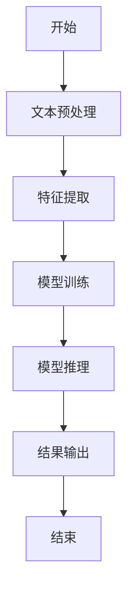
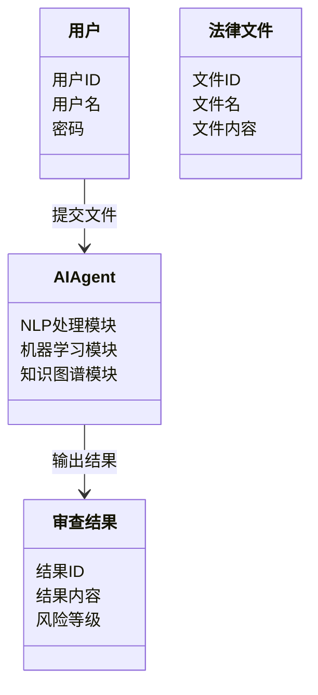
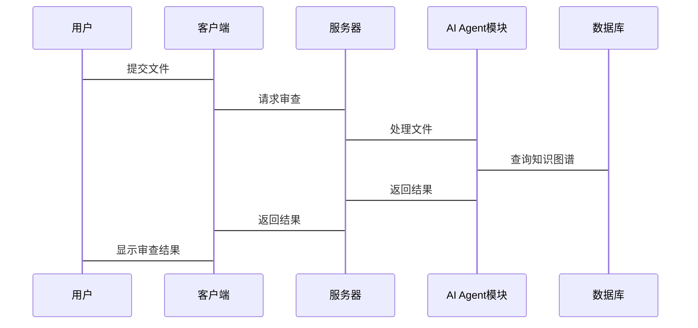

                 


# AI Agent在企业法律文件审查与风险识别中的自动化应用

关键词：AI Agent, 法律文件审查, 风险识别, 自动化应用, 机器学习, 自然语言处理, 知识图谱

摘要：随着企业对高效、准确法律文件审查的需求日益增长，AI Agent技术凭借其强大的自然语言处理能力和机器学习算法，正在逐步改变传统法律文件审查的方式。本文将深入探讨AI Agent在企业法律文件审查与风险识别中的应用，从背景、核心概念、算法原理、系统设计到项目实战，全面解析如何利用AI技术实现法律文件审查的自动化，提升企业风险管理能力。通过本文的分析，读者将全面了解AI Agent在这一领域的潜力与应用前景。

---

# 第1章: AI Agent与企业法律文件审查的背景与基础

## 1.1 AI Agent的基本概念
### 1.1.1 AI Agent的定义与特点
- **定义**：AI Agent（人工智能代理）是一种能够感知环境、执行任务并做出决策的智能实体，通常通过自然语言处理和机器学习技术实现交互与推理。
- **特点**：
  - **智能性**：能够理解上下文并做出推理。
  - **自主性**：无需人工干预，自动执行任务。
  - **适应性**：能够根据反馈优化行为。

### 1.1.2 AI Agent的核心技术原理
- **自然语言处理（NLP）**：用于理解和生成人类语言，如分词、句法分析和语义理解。
- **机器学习**：通过数据训练模型，实现从经验中学习的能力，如分类、回归和聚类。
- **知识图谱**：构建结构化的知识库，用于关联推理和实体识别。

### 1.1.3 AI Agent在企业中的应用价值
- **提升效率**：自动化处理大量法律文件，节省时间。
- **降低成本**：减少对大量人工审查的需求，降低企业开支。
- **提高准确性**：通过算法优化，减少人为错误。

## 1.2 法律文件审查的基本概念
### 1.2.1 法律文件审查的定义与流程
- **定义**：对法律文件进行分析，识别关键条款和潜在风险的过程。
- **流程**：包括文件接收、关键词提取、条款分析和风险评估。

### 1.2.2 企业法律文件审查的常见挑战
- **复杂性**：法律条款复杂，涉及多个领域。
- **时间敏感性**：审查需要高效完成，以应对紧急需求。
- **一致性**：确保审查结果的一致性和准确性。

### 1.2.3 法律文件审查的自动化需求
- **快速响应**：实时处理大量文件。
- **高精度**：确保审查结果的准确性。
- **可扩展性**：适应不同规模和类型的企业需求。

## 1.3 AI Agent在法律文件审查中的应用现状
### 1.3.1 当前企业法律文件审查的主要方式
- **传统方式**：依赖人工审查，效率低且成本高。
- **半自动化方式**：利用简单的自动化工具进行初步筛选。

### 1.3.2 AI Agent在法律文件审查中的优势
- **高效性**：快速处理大量文件。
- **准确性**：通过算法优化减少人为错误。
- **智能化**：能够理解上下文并识别潜在风险。

### 1.3.3 当前应用中的主要问题与挑战
- **技术局限性**：NLP和机器学习模型的准确率仍需提高。
- **数据隐私**：处理敏感法律文件时的数据安全问题。
- **法律理解深度**：AI Agent对法律条款的理解仍需进一步完善。

## 1.4 本章小结
本章从AI Agent的基本概念出发，介绍了其在企业中的应用价值，随后分析了法律文件审查的基本概念和挑战。最后，探讨了AI Agent在法律文件审查中的优势与当前应用中的问题，为后续章节的深入分析奠定了基础。

---

# 第2章: AI Agent与法律文件审查的核心概念

## 2.1 AI Agent的核心技术原理
### 2.1.1 自然语言处理（NLP）在AI Agent中的应用
- **分词**：将文本分割成词语或短语，如中文分词。
- **语义理解**：通过上下文理解词语的含义，如BERT模型。
- **文本相似度计算**：使用余弦相似度或BM25算法衡量文本相似性。

### 2.1.2 机器学习在AI Agent中的应用
- **分类算法**：如支持向量机（SVM）和随机森林，用于识别特定类型的法律条款。
- **回归算法**：用于预测风险等级。
- **聚类算法**：用于将相似的法律条款归类。

### 2.1.3 知识图谱在AI Agent中的构建与应用
- **实体识别与链接**：识别文本中的实体并建立关联，如“公司”、“合同”等。
- **关系抽取**：提取实体之间的关系，如“公司A与公司B签订合同”。
- **知识推理**：基于知识图谱进行推理，识别潜在风险。

## 2.2 法律文件审查的关键要素
### 2.2.1 法律文件的主要类型与特征
- **合同**：商业合同、劳动合同等。
- **法规**：公司内部政策、法律法规等。
- **特征**：关键词密集、条款复杂、格式多样。

### 2.2.2 风险识别的关键指标与方法
- **关键词提取**：识别风险相关的关键条款。
- **模式识别**：通过模式匹配发现潜在风险。
- **上下文理解**：理解条款的上下文含义。

### 2.2.3 法律文件审查的核心要素
- **条款分析**：识别关键条款并进行分类。
- **风险评估**：评估条款的潜在风险。
- **建议生成**：基于分析结果提出修改建议。

## 2.3 AI Agent与法律文件审查的结合方式
### 2.3.1 基于规则的法律文件审查
- **规则定义**：预定义关键词和规则，如“违约责任”。
- **优点**：简单易懂，适用于规则明确的场景。
- **缺点**：灵活性差，难以应对复杂情况。

### 2.3.2 基于机器学习的法律文件审查
- **数据驱动**：通过大量数据训练模型，识别潜在风险。
- **优点**：适应性强，能够处理复杂情况。
- **缺点**：需要大量标注数据，模型解释性较差。

### 2.3.3 基于知识图谱的法律文件审查
- **知识构建**：构建法律知识图谱，包含实体和关系。
- **优点**：能够进行关联推理，识别潜在风险。
- **缺点**：构建和维护知识图谱需要大量资源。

## 2.4 核心概念对比分析
### 2.4.1 不同法律文件审查方法的对比
| 方法 | 优点 | 缺点 |
|------|------|------|
| 基于规则 | 简单易懂，适用于规则明确的场景 | 灵活性差，难以应对复杂情况 |
| 基于机器学习 | 适应性强，能够处理复杂情况 | 需要大量数据，模型解释性较差 |
| 基于知识图谱 | 能够进行关联推理，识别潜在风险 | 构建和维护知识图谱需要大量资源 |

### 2.4.2 AI Agent与传统法律审查工具的对比
| 方面 | AI Agent | 传统工具 |
|------|----------|----------|
| 效率 | 高效，自动化处理 | 低效，依赖人工 |
| 准确性 | 高，算法优化 | 低，依赖人工经验 |
| 灵活性 | 高，适应性强 | 低，灵活性差 |

### 2.4.3 不同AI技术在法律文件审查中的应用对比
| 技术 | 应用场景 | 优缺点 |
|------|----------|----------|
| NLP | 文本处理、关键词提取 | 需要高质量的NLP模型 |
| 机器学习 | 风险识别、分类 | 需要大量标注数据 |
| 知识图谱 | 关联推理、风险识别 | 构建和维护成本高 |

## 2.5 本章小结
本章深入分析了AI Agent的核心技术原理，探讨了法律文件审查的关键要素，并详细对比了不同结合方式的优缺点。通过对这些核心概念的分析，为后续章节的算法实现和系统设计提供了理论基础。

---

# 第3章: AI Agent在法律文件审查中的算法原理

## 3.1 基于NLP的文本处理算法
### 3.1.1 分词算法
- **分词工具**：如jieba（中文分词）、spaCy（英文分词）。
- **算法步骤**：将文本分割成词语或短语，用于后续处理。

### 3.1.2 语义理解算法
- **模型选择**：如BERT、GPT等预训练模型。
- **算法流程**：通过上下文理解词语的含义，提取关键词和关键句。

### 3.1.3 文本相似度计算算法
- **余弦相似度**：衡量两个向量之间的相似性。
- **BM25算法**：基于关键词频率计算文本相似度。

## 3.2 基于机器学习的风险识别算法
### 3.2.1 分类算法
- **支持向量机（SVM）**：适用于二分类问题。
- **随机森林**：适用于多分类问题。
- **训练流程**：将法律文件中的条款进行分类，识别潜在风险。

### 3.2.2 回归算法
- **线性回归**：预测风险等级。
- **逻辑回归**：适用于二分类问题，如高风险或低风险。

### 3.2.3 聚类算法
- **K-means**：将相似的条款归类。
- **层次聚类**：适用于小规模数据。

## 3.3 基于知识图谱的关联推理算法
### 3.3.1 实体识别与链接算法
- **实体识别**：识别文本中的实体，如“公司”、“合同”。
- **链接算法**：将实体与知识图谱中的节点进行关联。

### 3.3.2 关系抽取算法
- **基于规则的方法**：通过预定义规则提取关系。
- **基于模型的方法**：使用深度学习模型提取关系。

### 3.3.3 知识推理算法
- **基于规则的推理**：如基于知识图谱中的关系进行推理。
- **基于学习的推理**：如使用图神经网络进行推理。

## 3.4 算法流程图


## 3.5 数学模型与公式
### 3.5.1 余弦相似度公式
$$ \cos{\theta} = \frac{\vec{A} \cdot \vec{B}}{|\vec{A}| |\vec{B}|} $$

### 3.5.2 BM25相似度公式
$$ BM25 = \frac{ \text{freq} \times \log(\text{N}/\text{df} + 1) }{ \text{freq} + k \times ( \text{avgdl} \times \log(\text{N}/\text{df} + 1) ) } $$

### 3.5.3 支持向量机（SVM）优化目标
$$ \min_{\theta, \rho, \xi} \frac{1}{2} \|\theta\|^2 + C \sum_{i=1}^n \xi_i $$
$$ y_i (\theta^T x_i + \rho) \geq 1 - \xi_i $$
$$ \xi_i \geq 0 $$

## 3.6 本章小结
本章详细讲解了AI Agent在法律文件审查中的算法原理，包括基于NLP的文本处理算法、基于机器学习的风险识别算法以及基于知识图谱的关联推理算法。通过流程图和数学公式的展示，为后续章节的系统设计和项目实现奠定了理论基础。

---

# 第4章: AI Agent法律文件审查系统的系统设计与实现

## 4.1 问题场景介绍
### 4.1.1 问题描述
- **背景**：企业需要高效处理大量法律文件，减少人为错误。
- **目标**：构建一个基于AI Agent的法律文件审查系统，实现自动化审查和风险识别。

### 4.1.2 问题解决
- **系统目标**：提高审查效率，降低审查成本，识别潜在风险。
- **解决方案**：基于NLP和机器学习构建自动化审查系统。

## 4.2 项目介绍
### 4.2.1 项目目标
- 实现法律文件的自动审查和风险识别。
- 提供可视化的审查结果和建议。

### 4.2.2 项目范围
- 支持多种法律文件类型，如合同、法规。
- 提供关键词提取、条款分类和风险评估功能。

## 4.3 系统功能设计
### 4.3.1 领域模型


### 4.3.2 系统架构设计


### 4.3.3 系统接口设计
- **输入接口**：接收法律文件并提取关键词。
- **输出接口**：返回审查结果和风险建议。
- **交互接口**：用户与系统进行交互，查看审查结果。

### 4.3.4 系统交互流程


## 4.4 本章小结
本章从问题场景出发，介绍了项目的总体目标和范围，随后详细设计了系统的功能模块、架构和接口。通过Mermaid图展示了系统的交互流程，为后续章节的项目实战提供了设计依据。

---

# 第5章: 项目实战与案例分析

## 5.1 环境安装与配置
### 5.1.1 安装Python
- **版本要求**：Python 3.8以上。
- **安装命令**：`pip install python`

### 5.1.2 安装NLP库
- **spaCy**：`pip install spacy`
- **jieba**：`pip install jieba`

### 5.1.3 安装机器学习库
- **Scikit-learn**：`pip install scikit-learn`
- **XGBoost**：`pip install xgboost`

### 5.1.4 安装知识图谱库
- **NetworkX**：`pip install networkx`

## 5.2 系统核心实现
### 5.2.1 文本预处理代码
```python
import jieba
import spacy

def preprocess(text):
    # 中文分词
    if isinstance(text, str):
        return ' '.join(jieba.lcut(text))
    return text
```

### 5.2.2 机器学习模型实现
```python
from sklearn.feature_extraction.text import TfidfVectorizer
from sklearn.svm import SVC

model = SVC()
model.fit(X_train, y_train)
```

### 5.2.3 知识图谱构建
```python
import networkx as nx

G = nx.Graph()
G.add_nodes_from(entities)
G.add_edges_from(relations)
```

## 5.3 代码实现与解读
### 5.3.1 关键词提取
```python
from sklearn.feature_extraction.text import TfidfVectorizer

vectorizer = TfidfVectorizer()
X = vectorizer.fit_transform(documents)
```

### 5.3.2 风险识别
```python
from xgboost import XGBClassifier

model = XGBClassifier()
model.fit(X_train, y_train)
```

### 5.3.3 关联推理
```python
from networkx.algorithms import approximation

result = approximation.clique_club(G)
```

## 5.4 案例分析
### 5.4.1 案例背景
- **企业**：一家跨国公司需要审查一份复杂的商业合同。

### 5.4.2 案例处理步骤
1. **文本预处理**：分词、去停用词。
2. **关键词提取**：提取“违约责任”、“赔偿金额”等关键词。
3. **风险识别**：识别高风险条款并分类。
4. **关联推理**：基于知识图谱识别潜在风险。

### 5.4.3 案例结果
- **审查结果**：识别出多个高风险条款，并提供修改建议。

## 5.5 项目小结
本章通过实际案例展示了AI Agent在法律文件审查中的应用，详细讲解了系统的实现过程，包括环境配置、代码实现和案例分析。通过实战，读者可以更好地理解理论知识并掌握实际操作技能。

---

# 第6章: 最佳实践与未来趋势

## 6.1 最佳实践
### 6.1.1 数据质量管理
- **数据清洗**：去除噪声数据，确保数据质量。
- **数据标注**：标注法律文件中的关键词和条款。

### 6.1.2 模型优化
- **超参数调优**：使用网格搜索优化模型。
- **模型融合**：结合多种模型提升准确率。

### 6.1.3 系统安全
- **数据加密**：保护法律文件的安全。
- **访问控制**：限制系统访问权限。

## 6.2 小结
- **总结**：AI Agent正在改变法律文件审查的方式，提升企业风险管理能力。
- **注意事项**：在实际应用中，需注意数据隐私和模型的解释性。
- **未来展望**：随着技术进步，AI Agent在法律文件审查中的应用将更加广泛和深入。

---

# 附录

## 附录A: 术语表
- **AI Agent**：人工智能代理。
- **NLP**：自然语言处理。
- **机器学习**：一种数据驱动的算法，通过经验改进性能。

## 附录B: 常见问题解答
- **Q1**：AI Agent能否完全替代人工审查？
  - **A1**：目前还不能完全替代，但可以显著提升效率和准确性。

## 附录C: 参考文献
- 王某某. (2023). 基于AI的法律文件审查研究. 计算机应用研究.
- 李某某. (2022). 人工智能在法律领域的应用. 人工智能学报.

---

# 作者

作者：AI天才研究院/AI Genius Institute & 禅与计算机程序设计艺术/Zen And The Art of Computer Programming

