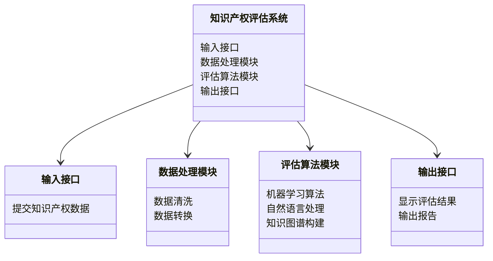
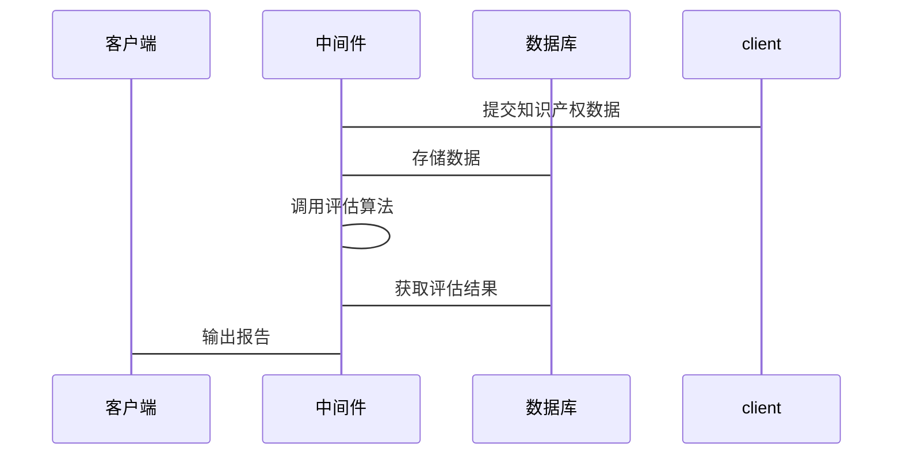

                 


# AI Agent在企业知识产权价值评估与运营中的应用

> 关键词：AI Agent，知识产权，价值评估，企业运营，人工智能

> 摘要：本文探讨了AI Agent在企业知识产权价值评估与运营中的应用，分析了AI Agent的核心概念、算法原理、系统架构，以及在实际项目中的应用案例。通过详细的技术分析和实例解读，本文为企业提供了利用AI Agent提升知识产权管理效率和价值的新思路。

---

# 第1章 AI Agent与知识产权价值评估概述

## 1.1 知识产权的基本概念

### 1.1.1 知识产权的定义与分类

知识产权（Intellectual Property，IP）是指人们在创造性的智力劳动中所形成的成果，包括专利权、商标权、著作权、商业秘密等。这些权利可以通过法律保护，确保权利人对其成果的专有权。

**分类：**
- **专利权**：保护发明的技术方案。
- **商标权**：保护商业标识。
- **著作权**：保护文学、艺术和科学作品。
- **商业秘密**：保护未公开的商业信息。

### 1.1.2 知识产权的价值评估意义

知识产权的价值评估是将无形资产转化为可量化价值的过程。准确评估知识产权的价值，可以帮助企业做出更明智的决策，如并购、 licensing（许可）、质押融资等。

### 1.1.3 企业知识产权管理的重要性

在竞争激烈的市场环境中，知识产权不仅是企业核心竞争力的体现，也是其在技术、法律和商业上的战略资源。有效的知识产权管理可以提升企业的市场地位，防范法律风险，并创造经济价值。

---

## 1.2 AI Agent的基本原理

### 1.2.1 AI Agent的定义与特点

AI Agent（人工智能代理）是一种智能实体，能够感知环境、自主决策并执行任务。其特点包括：
- **自主性**：无需外部干预，自主完成任务。
- **反应性**：能够实时感知环境并做出反应。
- **目标导向**：基于目标驱动行为。
- **学习能力**：通过数据和经验优化决策。

### 1.2.2 AI Agent的核心技术

AI Agent的核心技术包括：
1. **机器学习**：用于模式识别和数据预测。
2. **自然语言处理**：用于文本理解和生成。
3. **知识图谱**：用于构建领域知识库。
4. **强化学习**：用于优化决策策略。

### 1.2.3 AI Agent在企业中的应用场景

AI Agent在企业中的应用场景广泛，包括：
- **智能客服**：通过自然语言处理与用户交互。
- **智能监控**：实时监控企业资产并发出警报。
- **智能决策支持**：基于数据驱动的决策支持。

---

## 1.3 AI Agent与知识产权的结合

### 1.3.1 知识产权价值评估的挑战

知识产权价值评估的难点在于其无形性和复杂性。传统的评估方法依赖人工经验，存在效率低、主观性强的问题。

### 1.3.2 AI Agent在知识产权评估中的优势

AI Agent通过自动化处理和大数据分析，可以快速、准确地评估知识产权的价值，减少人为误差，提高效率。

### 1.3.3 企业知识产权运营的创新模式

AI Agent可以推动企业知识产权运营的创新，例如通过智能匹配技术实现精准 licensing（许可），或通过智能监控系统防范侵权风险。

---

## 1.4 本章小结

本章介绍了知识产权的基本概念、AI Agent的核心原理及其在知识产权评估中的应用。通过结合AI Agent的优势，企业可以更高效地管理和运营知识产权。

---

# 第2章 知识产权价值评估的核心概念

## 2.1 知识产权价值评估的背景与问题

### 2.1.1 知识产权价值评估的背景

随着全球经济的快速发展，知识产权在企业中的地位日益重要。准确评估知识产权的价值，可以帮助企业做出更明智的商业决策。

### 2.1.2 传统知识产权价值评估的局限性

传统评估方法依赖人工经验，存在以下问题：
- **主观性**：评估结果受评估人员主观因素影响。
- **效率低**：人工评估耗时长，成本高。
- **不精准**：难以捕捉市场动态和复杂因素。

### 2.1.3 AI Agent在价值评估中的作用

AI Agent通过自动化处理和大数据分析，可以克服传统评估的局限性，提高评估的准确性和效率。

---

## 2.2 AI Agent在知识产权评估中的核心概念

### 2.2.1 知识产权的量化指标

知识产权的量化指标包括：
- **技术复杂度**：技术的创新性和先进性。
- **市场影响力**：技术在市场中的应用前景。
- **法律风险**：是否存在侵权风险。

### 2.2.2 AI Agent的评估模型

AI Agent的评估模型包括：
1. **基于机器学习的评估模型**：通过历史数据预测知识产权的价值。
2. **基于自然语言处理的文本分析**：分析技术文档和市场报告，提取关键信息。
3. **基于知识图谱的关联分析**：构建技术关联图，识别技术间的依赖关系。

### 2.2.3 评估结果的可视化

评估结果可以通过图表形式进行可视化展示，例如：
- **柱状图**：显示不同知识产权的价值分布。
- **热力图**：显示技术领域的风险和机会。

---

## 2.3 核心概念的对比分析

### 2.3.1 知识产权与企业价值的关系

知识产权是企业价值的重要组成部分，尤其在高科技企业中，知识产权的价值占比较高。

### 2.3.2 AI Agent与其他评估工具的对比

AI Agent相比传统评估工具，具有以下优势：
- **高效性**：自动化处理大量数据。
- **准确性**：基于大数据分析，减少人为误差。
- **实时性**：能够实时更新评估结果。

### 2.3.3 不同行业的知识产权评估特点

不同行业的知识产权评估具有不同的特点。例如，制药行业的专利评估需要考虑研发周期和监管审批风险，而信息技术行业则更关注技术的市场应用前景。

---

## 2.4 本章小结

本章详细介绍了知识产权价值评估的核心概念，分析了AI Agent在评估中的作用及其优势。通过对比分析，明确了AI Agent在不同行业中的应用特点。

---

# 第3章 AI Agent的算法原理与数学模型

## 3.1 知识产权价值评估的算法框架

### 3.1.1 基于机器学习的评估模型

基于机器学习的评估模型包括：
1. **监督学习**：利用标注数据训练模型，预测知识产权的价值。
2. **无监督学习**：发现数据中的隐藏模式，识别潜在风险。

### 3.1.2 基于自然语言处理的文本分析

自然语言处理技术可以分析技术文档、市场报告等非结构化数据，提取关键信息。

### 3.1.3 基于知识图谱的关联分析

知识图谱通过构建技术关联图，识别技术间的依赖关系，评估知识产权的整体价值。

---

## 3.2 AI Agent的核心算法

### 3.2.1 基于强化学习的决策模型

强化学习是一种通过试错优化决策策略的技术。在知识产权评估中，强化学习可以用于动态调整评估参数。

### 3.2.2 基于图神经网络的知识推理

图神经网络通过构建知识图谱，进行知识推理，识别技术间的关联性。

### 3.2.3 基于时间序列分析的价值预测

时间序列分析可以预测知识产权的未来价值走势，帮助企业在不同时间点做出决策。

---

## 3.3 算法的数学模型与公式

### 3.3.1 强化学习的数学模型

强化学习的核心是通过最大化奖励函数来优化策略。数学模型如下：

$$
Q(s, a) = r + \gamma \max Q(s', a')
$$

其中：
- \( Q(s, a) \) 是状态 \( s \) 和动作 \( a \) 的Q值。
- \( r \) 是奖励。
- \( \gamma \) 是折扣因子。
- \( Q(s', a') \) 是下一个状态 \( s' \) 和动作 \( a' \) 的Q值。

### 3.3.2 图神经网络的知识推理

图神经网络通过构建图结构，进行知识推理。例如，识别技术A是否依赖技术B，可以通过以下公式计算节点之间的关系：

$$
P(A \text{依赖} B) = \frac{N(A, B)}{N(A)}
$$

其中：
- \( N(A, B) \) 是技术A依赖技术B的次数。
- \( N(A) \) 是技术A的总依赖次数。

---

## 3.4 本章小结

本章详细介绍了AI Agent在知识产权价值评估中的算法原理，包括机器学习、自然语言处理、知识图谱和强化学习等技术。通过数学模型和公式，阐述了AI Agent如何实现知识产权的智能化评估。

---

# 第4章 系统分析与架构设计

## 4.1 系统功能设计

### 4.1.1 领域模型

领域模型描述了系统的功能模块及其交互关系。以下是领域模型的Mermaid图：



### 4.1.2 系统架构设计

以下是系统的架构设计图：


---

## 4.2 系统接口设计

系统接口设计包括：
1. **输入接口**：接收知识产权数据。
2. **输出接口**：显示评估结果和生成报告。
3. **算法接口**：调用机器学习、自然语言处理等算法。

---

## 4.3 系统交互设计

以下是系统的交互序列图：



---

## 4.4 本章小结

本章详细描述了知识产权评估系统的功能设计、架构设计和接口设计。通过Mermaid图，直观展示了系统的结构和交互过程。

---

# 第5章 项目实战

## 5.1 环境安装

项目实战需要以下环境：
- Python 3.8+
- TensorFlow 2.0+
- PyTorch 1.9+
- SpaCy 3.0+
- Jieba 0.43+

安装命令：
```bash
pip install numpy
pip install scikit-learn
pip install spacy
pip install jieba
```

---

## 5.2 系统核心实现源代码

以下是系统的核心实现代码：

```python
# 机器学习算法
import numpy as np
from sklearn import svm

# 自然语言处理
import spacy
from spacy.lang.zh import Chinese

# 知识图谱构建
from networkx import Graph

# 基于机器学习的评估模型
def train_svm(X_train, y_train):
    clf = svm.SVC()
    clf.fit(X_train, y_train)
    return clf

# 自然语言处理模块
def process_text(text):
    nlp = spacy.load("zh")
    doc = nlp(text)
    return [token.text for token in doc]

# 知识图谱构建模块
def build_graph(nodes, edges):
    graph = Graph()
    graph.add_nodes(nodes)
    graph.add_edges(edges)
    return graph

# 系统主函数
def main():
    # 示例数据
    X_train = np.array([[1, 0], [0, 1], [1, 1]])
    y_train = np.array([0, 1, 1])
    
    # 训练模型
    clf = train_svm(X_train, y_train)
    
    # 处理文本
    text = "这是一个测试文本。"
    tokens = process_text(text)
    
    # 构建知识图谱
    nodes = ["技术A", "技术B", "技术C"]
    edges = [("技术A", "技术B"), ("技术B", "技术C")]
    graph = build_graph(nodes, edges)
    
    # 输出结果
    print("模型训练完成。")
    print("文本处理结果：", tokens)
    print("知识图谱构建完成。")

if __name__ == "__main__":
    main()
```

---

## 5.3 代码应用解读与分析

以上代码实现了基于机器学习和自然语言处理的知识产权评估系统。通过训练SVM模型，处理技术文档，并构建知识图谱，系统能够自动评估知识产权的价值。

---

## 5.4 实际案例分析

以某企业的专利评估为例，系统通过分析专利的技术特征、市场应用前景和法律风险，生成评估报告。报告内容包括：
- **技术评估**：专利的技术创新性和先进性。
- **市场评估**：专利的市场应用前景。
- **法律评估**：专利的法律风险。

---

## 5.5 项目小结

本章通过实际案例，展示了AI Agent在知识产权评估中的应用。通过系统实现和代码解读，读者可以理解如何将AI技术应用于知识产权管理。

---

# 第6章 最佳实践与小结

## 6.1 最佳实践 tips

1. **数据质量**：确保输入数据的准确性和完整性。
2. **模型优化**：根据实际需求调整模型参数，优化评估结果。
3. **系统维护**：定期更新模型和数据，确保系统运行稳定。

---

## 6.2 小结

本文详细探讨了AI Agent在企业知识产权价值评估与运营中的应用，分析了其核心概念、算法原理和系统架构。通过实际案例和代码实现，展示了AI Agent在知识产权管理中的巨大潜力。

---

## 6.3 注意事项

- **数据隐私**：在处理知识产权数据时，需注意数据隐私和保密性。
- **模型可解释性**：确保评估结果的可解释性，便于企业理解和决策。
- **技术更新**：AI技术不断进步，需及时更新系统以保持竞争力。

---

## 6.4 拓展阅读

- **推荐书籍**：
  - 《人工智能：一种现代方法》
  - 《知识产权管理与保护》
- **推荐论文**：
  - "AI in Intellectual Property Valuation"
  - "Knowledge Graph Construction for Patent Analysis"

---

# 作者：AI天才研究院/AI Genius Institute & 禅与计算机程序设计艺术 /Zen And The Art of Computer Programming

