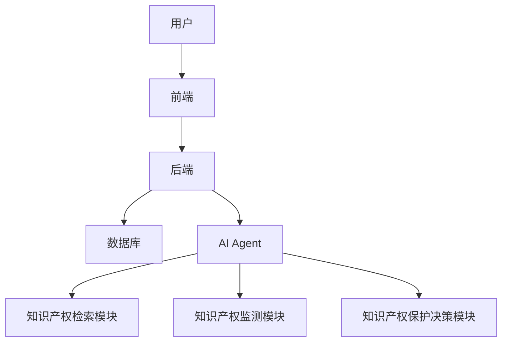
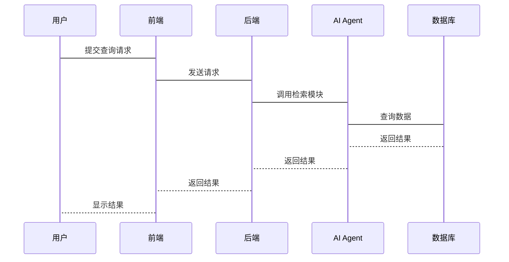

                 


# AI Agent在企业知识产权保护中的创新应用

> 关键词：AI Agent，知识产权保护，企业创新，技术应用，算法原理

> 摘要：本文详细探讨了AI Agent在企业知识产权保护中的创新应用，分析了其在知识产权管理、侵权检测、法律咨询等领域的核心作用，结合实际案例和数学模型，展示了AI Agent如何通过智能化手段提升企业知识产权保护效率和效果。

---

## 第1章 AI Agent与知识产权保护的背景介绍

### 1.1 AI Agent的基本概念

#### 1.1.1 AI Agent的定义
AI Agent（人工智能代理）是指具有感知环境、自主决策和执行任务能力的智能实体。它可以是一个软件程序，也可以是一个硬件设备，通过传感器和算法来实现特定目标。

#### 1.1.2 AI Agent的核心要素
- **感知能力**：通过传感器或数据输入获取环境信息。
- **决策能力**：基于感知信息，利用算法做出决策。
- **执行能力**：通过执行机构或输出模块完成任务。

#### 1.1.3 AI Agent的分类与特点
AI Agent可以根据功能和应用场景分为多种类型，包括：
- **简单反射型**：基于规则的简单决策。
- **基于模型的反应型**：利用环境模型进行决策。
- **目标驱动型**：以实现特定目标为导向。
- **效用驱动型**：以最大化效用函数为目标。

### 1.2 企业知识产权保护的背景与挑战

#### 1.2.1 知识产权的基本概念
知识产权是指法律保护的创造性成果，包括专利、商标、版权、商业秘密等。

#### 1.2.2 企业知识产权保护的现状
- **全球化竞争**：知识产权成为企业核心竞争力。
- **侵权风险**：知识产权被侵权的风险日益增加。
- **保护成本**：传统知识产权保护成本高、效率低。

#### 1.2.3 知识产权保护的主要挑战
- **复杂性**：知识产权涉及多个法律领域，保护过程复杂。
- **快速变化**：技术进步和市场变化要求保护策略不断调整。
- **资源限制**：企业往往缺乏足够的资源来应对复杂的知识产权问题。

### 1.3 AI Agent在知识产权保护中的应用价值

#### 1.3.1 提高知识产权保护效率
AI Agent可以通过自动化手段快速识别侵权行为，减少人工干预。

#### 1.3.2 降低知识产权保护成本
通过自动化处理和智能分析，AI Agent可以显著降低企业的知识产权保护成本。

#### 1.3.3 提升知识产权保护的精准性
AI Agent利用大数据分析和机器学习技术，可以提高知识产权保护的精准性和有效性。

### 1.4 本章小结
本章介绍了AI Agent的基本概念及其在知识产权保护中的应用价值，为后续章节的深入分析奠定了基础。

---

## 第2章 AI Agent与知识产权保护的核心概念

### 2.1 知识产权保护的核心要素

#### 2.1.1 知识产权的客体
知识产权的客体包括专利、商标、版权、商业秘密等。

#### 2.1.2 知识产权的保护范围
- **专利**：技术方案的保护。
- **商标**：品牌标识的保护。
- **版权**：作品的保护。
- **商业秘密**：未公开的商业信息的保护。

#### 2.1.3 知识产权的保护方式
- **法律手段**：通过诉讼、仲裁等法律途径保护知识产权。
- **技术手段**：利用技术手段防止知识产权被侵权。

### 2.2 AI Agent在知识产权保护中的角色

#### 2.2.1 AI Agent作为知识产权保护工具
AI Agent可以用于知识产权的检索、分析和监测。

#### 2.2.2 AI Agent作为知识产权保护的决策支持系统
AI Agent可以辅助企业制定知识产权保护策略。

#### 2.2.3 AI Agent作为知识产权保护的执行者
AI Agent可以执行知识产权保护任务，如监控侵权行为、自动发送警告函等。

### 2.3 AI Agent与知识产权保护的关系

#### 2.3.1 AI Agent如何辅助知识产权保护
- **自动化检索**：AI Agent可以快速检索专利、商标等信息。
- **智能监测**：AI Agent可以实时监测市场上的侵权行为。
- **决策支持**：AI Agent可以为企业提供知识产权保护的决策支持。

#### 2.3.2 知识产权保护对AI Agent的需求
- **高效性**：知识产权保护需要快速响应。
- **准确性**：知识产权保护需要精准的分析。
- **智能化**：知识产权保护需要智能化的解决方案。

#### 2.3.3 AI Agent在知识产权保护中的优势
- **24/7监控**：AI Agent可以全天候监控市场动态。
- **快速反应**：AI Agent可以快速识别侵权行为并采取行动。
- **成本低廉**：AI Agent可以降低企业的知识产权保护成本。

### 2.4 核心概念对比分析

#### 2.4.1 AI Agent与传统知识产权保护方式的对比
| 对比维度 | AI Agent | 传统方式 |
|----------|----------|----------|
| 效率     | 高       | 低       |
| 成本     | 低       | 高       |
| 准确性   | 高       | 中       |

#### 2.4.2 AI Agent在知识产权保护中的独特性
AI Agent的独特性在于其智能化和自动化能力，能够显著提高知识产权保护的效率和效果。

#### 2.4.3 知识产权保护对AI Agent的依赖性
随着技术的发展，知识产权保护越来越依赖AI Agent等智能化工具。

### 2.5 本章小结
本章分析了AI Agent在知识产权保护中的核心概念和其与知识产权保护的关系，强调了AI Agent在知识产权保护中的独特性和重要性。

---

## 第3章 AI Agent的算法原理

### 3.1 AI Agent的基本算法

#### 3.1.1 基于规则的AI Agent
- **定义**：基于预定义规则的AI Agent。
- **特点**：简单易实现，但灵活性差。

#### 3.1.2 基于模型的AI Agent
- **定义**：基于环境模型的AI Agent。
- **特点**：灵活性高，适应性强。

#### 3.1.3 基于学习的AI Agent
- **定义**：通过机器学习算法不断优化的AI Agent。
- **特点**：适应性强，但实现复杂。

### 3.2 知识产权保护中的AI Agent算法

#### 3.2.1 知识产权检索算法
- **关键词匹配**：基于关键词匹配的检索算法。
- **向量空间模型**：基于向量空间模型的检索算法。
- **深度学习模型**：基于深度学习模型的检索算法。

#### 3.2.2 知识产权侵权检测算法
- **相似度计算**：通过相似度计算判断是否存在侵权。
- **聚类分析**：通过聚类分析识别潜在侵权行为。
- **分类算法**：通过分类算法判断是否侵权。

### 3.3 算法原理的数学模型

#### 3.3.1 向量空间模型
$$ \text{相似度} = \frac{\vec{A} \cdot \vec{B}}{|\vec{A}| |\vec{B}|} $$

#### 3.3.2 深度学习模型
$$ \text{概率} = \sigma(w \cdot x + b) $$

#### 3.3.3 分类算法
$$ \text{类别} = \argmax_{i} P(y=i|x) $$

### 3.4 本章小结
本章详细介绍了AI Agent的基本算法及其在知识产权保护中的应用，展示了如何利用数学模型和算法实现知识产权保护的智能化。

---

## 第4章 知识产权保护的系统架构设计

### 4.1 系统功能设计

#### 4.1.1 知识产权检索模块
- **功能**：检索专利、商标等知识产权信息。
- **实现**：基于关键词匹配和向量空间模型。

#### 4.1.2 知识产权监测模块
- **功能**：实时监测市场上的侵权行为。
- **实现**：基于聚类分析和分类算法。

#### 4.1.3 知识产权保护决策模块
- **功能**：辅助企业制定知识产权保护策略。
- **实现**：基于深度学习模型和规则库。

### 4.2 系统架构设计

#### 4.2.1 系统架构图


#### 4.2.2 系统接口设计
- **输入接口**：用户输入关键词或查询请求。
- **输出接口**：系统输出检索结果、监测报告和保护策略建议。

#### 4.2.3 系统交互流程


### 4.3 本章小结
本章详细描述了知识产权保护系统的功能设计和架构设计，展示了如何利用AI Agent实现知识产权保护的智能化。

---

## 第5章 项目实战：基于AI Agent的知识产权保护系统实现

### 5.1 项目介绍

#### 5.1.1 项目背景
随着企业对知识产权保护的需求不断增加，开发基于AI Agent的知识产权保护系统成为必要。

#### 5.1.2 项目目标
实现一个能够自动检索、监测和保护知识产权的智能化系统。

### 5.2 环境安装

#### 5.2.1 系统要求
- **操作系统**：Linux/Windows/MacOS
- **编程语言**：Python 3.6+
- **框架**：Django/Flask
- **深度学习框架**：TensorFlow/PyTorch

#### 5.2.2 安装依赖
```bash
pip install django flask numpy tensorflow
```

### 5.3 核心实现

#### 5.3.1 知识产权检索模块
```python
def search_paten(keywords):
    # 实现基于关键词的检索算法
    pass
```

#### 5.3.2 知识产权监测模块
```python
def detect_infringement(content):
    # 实现基于深度学习的监测算法
    pass
```

#### 5.3.3 知识产权保护决策模块
```python
def generate_recommendation(data):
    # 实现基于规则的决策算法
    pass
```

### 5.4 代码实现与解读

#### 5.4.1 检索模块代码
```python
import numpy as np

def cosine_similarity(a, b):
    return np.dot(a, b) / (np.linalg.norm(a) * np.linalg.norm(b))
```

#### 5.4.2 监测模块代码
```python
import tensorflow as tf

model = tf.keras.Sequential([
    tf.keras.layers.Dense(128, activation='relu'),
    tf.keras.layers.Dense(1, activation='sigmoid')
])

model.compile(optimizer='adam', loss='binary_crossentropy', metrics=['accuracy'])
```

#### 5.4.3 决策模块代码
```python
import flask

app = Flask(__name__)

@app.route('/recommendation', methods=['POST'])
def get_recommendation():
    data = request.json
    # 实现基于规则的决策算法
    return jsonify({'result': 'success'})
```

### 5.5 案例分析

#### 5.5.1 实际案例
某企业使用基于AI Agent的知识产权保护系统，成功监测并阻止了一起专利侵权事件。

#### 5.5.2 案例分析
通过系统的监测模块，企业能够实时监测市场动态，快速发现侵权行为，并采取有效措施保护自身权益。

### 5.6 本章小结
本章通过实际项目展示了如何基于AI Agent实现知识产权保护系统，详细介绍了系统的核心模块和实现代码。

---

## 第6章 最佳实践与总结

### 6.1 本章小结
本文详细探讨了AI Agent在企业知识产权保护中的创新应用，分析了其在知识产权管理、侵权检测、法律咨询等领域的核心作用，结合实际案例和数学模型，展示了AI Agent如何通过智能化手段提升企业知识产权保护效率和效果。

### 6.2 注意事项
- **数据隐私**：在使用AI Agent进行知识产权保护时，需要注意数据隐私问题。
- **法律合规**：确保AI Agent的应用符合相关法律法规。
- **系统维护**：定期更新和维护AI Agent系统，确保其准确性和有效性。

### 6.3 拓展阅读
- **推荐书籍**：《人工智能：一种现代的方法》
- **推荐论文**：《基于深度学习的知识产权保护研究》
- **推荐网站**：知识产权保护相关的学术网站和论坛。

### 6.4 本章小结
本章总结了全文的主要内容，并提出了未来的研究方向和实践建议。

---

## 作者：AI天才研究院/AI Genius Institute & 禅与计算机程序设计艺术 /Zen And The Art of Computer Programming

---

**感谢您的阅读！如果对您有帮助，请分享给更多人！**

