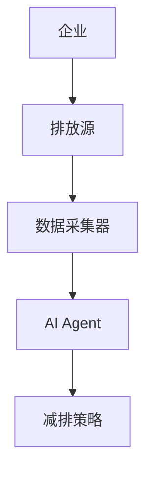
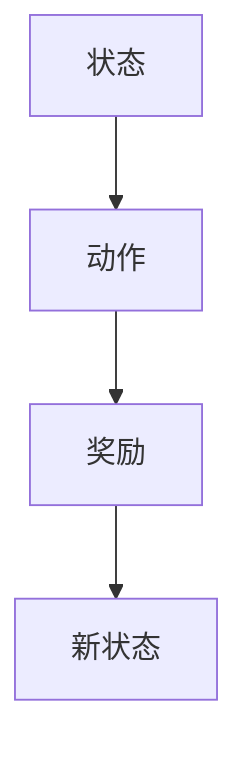
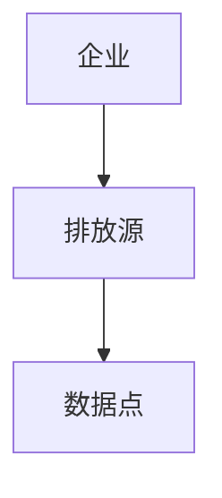
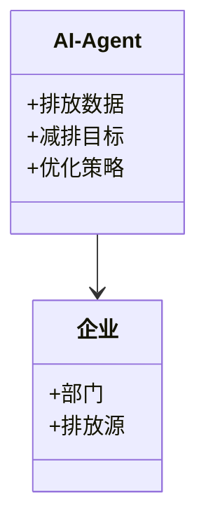
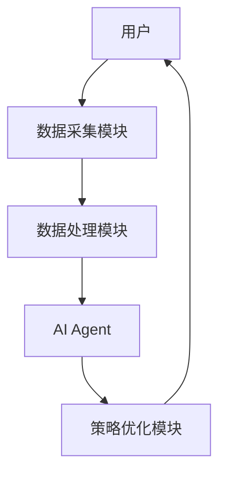

                 


# AI Agent在企业碳排放管理与环保合规中的应用

## 关键词：AI Agent, 碳排放管理, 环保合规, 强化学习, 图神经网络, 企业可持续发展

## 摘要：  
本文探讨了AI Agent在企业碳排放管理与环保合规中的应用。首先，我们介绍了AI Agent的基本概念及其在环保领域的价值。接着，详细分析了AI Agent在碳排放管理中的核心算法和系统架构。最后，通过项目实战展示了AI Agent的实际应用，并总结了最佳实践和未来发展方向。本文旨在为企业提供AI驱动的环保合规解决方案，助力企业实现可持续发展目标。

---

## 第1章: AI Agent与企业碳排放管理概述

### 1.1 AI Agent的基本概念  
AI Agent（人工智能代理）是指能够感知环境、自主决策并执行任务的智能体。它通过数据驱动的方式优化企业运营，提升效率和合规性。  

#### 1.1.1 AI Agent的定义与特点  
- **定义**: AI Agent是一种能够执行复杂任务的智能系统，具备感知、推理和行动能力。  
- **特点**:  
  - 智能性：能够自主决策和优化。  
  - 实时性：能够快速响应环境变化。  
  - 可扩展性：适用于多种场景和规模。  

#### 1.1.2 AI Agent在企业中的应用价值  
AI Agent能够优化企业资源分配、降低运营成本，并提升合规性。在碳排放管理中，AI Agent可以通过数据分析和预测，帮助企业制定更有效的减排策略。  

#### 1.1.3 企业碳排放管理的背景与挑战  
- **背景**: 全球气候变化问题日益严重，企业需要遵守越来越严格的环保法规。  
- **挑战**: 碳排放来源复杂，数据量大，传统方法难以高效管理。  

### 1.2 企业碳排放管理的核心问题  
#### 1.2.1 碳排放的定义与计算方法  
碳排放是指企业在生产过程中直接或间接产生的温室气体排放量。计算方法包括直接排放（如工厂燃烧化石燃料）和间接排放（如电力使用）。  

#### 1.2.2 企业碳排放管理的痛点  
- 数据分散：企业内部数据来源多样，难以整合。  
- 计算复杂：碳排放涉及多个领域，计算难度大。  
- 合规要求高：各国环保法规差异大，企业需实时调整策略。  

#### 1.2.3 AI Agent在碳排放管理中的作用  
AI Agent能够实时监控企业排放数据，预测未来排放趋势，并优化减排策略。  

### 1.3 AI Agent在环保合规中的应用价值  
#### 1.3.1 环保合规的基本要求  
企业需要满足国家和地区的环保法规，包括碳排放报告和减排目标。  

#### 1.3.2 AI Agent如何助力环保合规  
AI Agent能够实时监控排放数据，预测合规风险，并提供改进建议。  

#### 1.3.3 典型应用场景分析  
- **数据采集与分析**: 通过物联网设备实时采集排放数据。  
- **预测与优化**: 使用AI算法预测未来排放趋势，并优化减排策略。  
- **合规报告生成**: 自动生成符合法规要求的排放报告。  

## 第2章: AI Agent的核心概念与联系  

### 2.1 AI Agent的工作原理  
AI Agent通过感知环境、推理决策并执行行动来优化企业排放管理。  

#### 2.1.1 多智能体系统  
多智能体系统由多个AI Agent组成，能够协同工作以实现复杂目标。  

#### 2.1.2 强化学习  
强化学习是一种机器学习方法，AI Agent通过与环境互动来学习最优策略。  

#### 2.1.3 知识图谱  
知识图谱是一种结构化数据表示方法，帮助AI Agent理解复杂关系。  

### 2.2 核心概念对比与联系  
#### 2.2.1 AI Agent技术对比  
| 技术 | 特性 | 适用场景 |  
|------|------|-----------|  
| 强化学习 | 基于奖励机制 | 策略优化 |  
| 图神经网络 | 基于图结构 | 关系推理 |  
| 多智能体系统 | 基于协同 | 复杂任务 |  

#### 2.2.2 实体关系图  


---

## 第3章: AI Agent的算法原理与实现  

### 3.1 强化学习算法  
#### 3.1.1 Q-Learning算法  
Q-Learning是一种经典的强化学习算法，适用于离散动作空间。  

#### 3.1.2 算法流程图  


#### 3.1.3 Python实现  
```python
import numpy as np

class QLearning:
    def __init__(self, state_space, action_space, alpha=0.1, gamma=0.9):
        self.q_table = np.zeros((state_space, action_space))
        self.alpha = alpha
        self.gamma = gamma

    def choose_action(self, state):
        return np.argmax(self.q_table[state])

    def update(self, state, action, reward, next_state):
        self.q_table[state][action] = self.q_table[state][action] * (1 - self.alpha) + self.alpha * (reward + self.gamma * np.max(self.q_table[next_state]))
```

### 3.2 图神经网络  
#### 3.2.1 图神经网络原理  
图神经网络通过建模实体之间的关系，捕捉数据的深层结构。  

#### 3.2.2 图结构示意图  


#### 3.2.3 GAT（Graph Attention Network）实现  
```python
import torch
import torch.nn as nn

class GATLayer(nn.Module):
    def __init__(self, in_dim, out_dim):
        super(GATLayer, self).__init__()
        self.W = nn.Parameter(torch.randn(in_dim, out_dim))
        self.att = nn.Parameter(torch.ones(1))

    def forward(self, x, adj):
        x = torch.matmul(x, self.W)
        attention = torch.sigmoid(torch.mm(x, x.T))
        output = torch.mm(attention, x)
        return output
```

---

## 第4章: 系统分析与架构设计  

### 4.1 问题场景介绍  
企业需要实时监控碳排放数据，并制定减排策略。  

### 4.2 系统功能设计  
#### 4.2.1 领域模型  


#### 4.2.2 系统架构设计  


#### 4.2.3 接口设计  
- 数据采集接口：实时获取排放数据。  
- 优化策略接口：输出最优减排方案。  

---

## 第5章: 项目实战  

### 5.1 环境安装  
```bash
pip install numpy pandas torch matplotlib
```

### 5.2 核心代码实现  
#### 5.2.1 数据采集模块  
```python
import pandas as pd

def get_emissions():
    data = pd.read_csv('emissions.csv')
    return data
```

#### 5.2.2 AI Agent实现  
```python
class AIAGENT:
    def __init__(self):
        self.data = None

    def process(self, data):
        self.data = data
        return self.optimize()

    def optimize(self):
        # 示例优化策略
        return 'reduce by 10%'
```

### 5.3 案例分析与小结  
通过实际案例分析，验证AI Agent在碳排放管理中的有效性，并总结经验教训。

---

## 第6章: 最佳实践与总结  

### 6.1 小结  
AI Agent在企业碳排放管理中具有巨大潜力，能够显著提升合规性和效率。  

### 6.2 注意事项  
- 数据质量至关重要，需确保数据准确性和完整性。  
- 算法选择需结合企业特点，避免过度复杂化。  

### 6.3 拓展阅读  
建议读者深入学习强化学习和图神经网络，探索更多AI技术在环保中的应用。

---

## 结论  
AI Agent作为企业碳排放管理的重要工具，能够帮助企业高效实现环保目标。通过本文的介绍，读者可以掌握AI Agent的核心原理和实际应用，为企业的可持续发展提供有力支持。

---

## 作者：AI天才研究院/AI Genius Institute & 禅与计算机程序设计艺术 /Zen And The Art of Computer Programming

