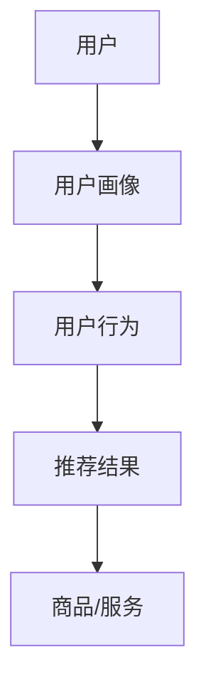
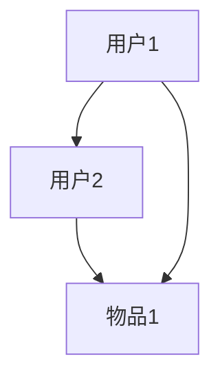
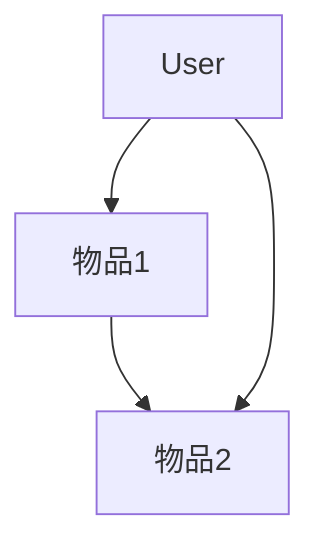
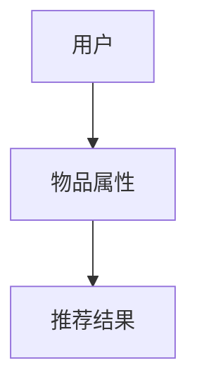
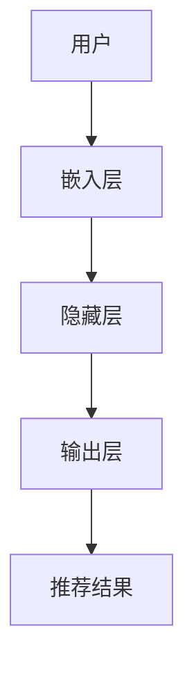
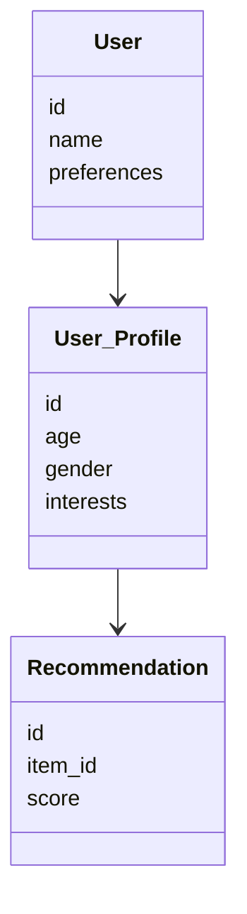
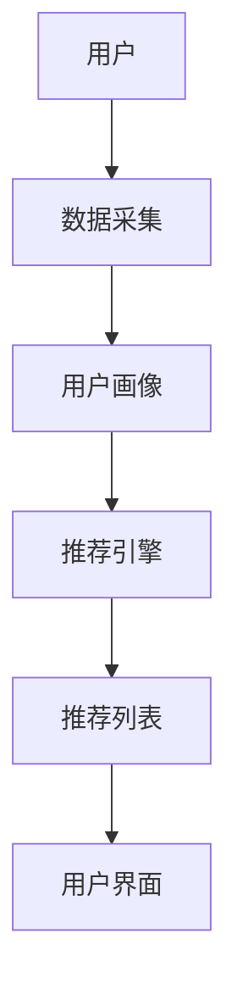
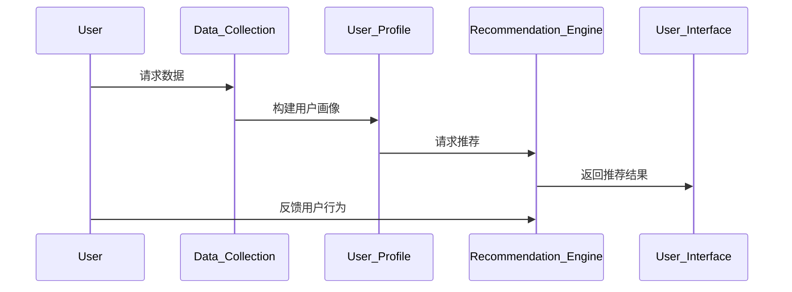

                 


# AI Agent在企业精准营销与个性化推荐中的深度应用

> 关键词：AI Agent，精准营销，个性化推荐，推荐系统，深度学习

> 摘要：本文深入探讨了AI Agent在企业精准营销与个性化推荐中的深度应用。从AI Agent的核心原理到推荐算法的实现，从系统架构设计到项目实战，再到最佳实践，全面解析AI Agent如何助力企业实现精准营销和个性化推荐。本文适合对AI Agent、推荐系统和精准营销感兴趣的读者阅读。

---

## 第一部分: 背景介绍

### 第1章: 背景介绍

#### 1.1 问题背景

精准营销与个性化推荐是企业提升客户满意度和销售额的重要手段。传统营销方式存在以下问题：

- **营销目标不精准**：传统营销往往基于粗放的用户分组，无法满足用户个性化需求。
- **营销成本高**：传统营销方式需要大量的人力和物力，且效果难以量化。
- **用户体验差**：传统营销方式难以实时捕捉用户需求，导致用户体验不佳。

AI Agent作为一种智能体，能够通过数据驱动的方式实现精准营销和个性化推荐，从而解决上述问题。

#### 1.2 问题描述

AI Agent在企业精准营销与个性化推荐中的应用主要解决以下问题：

- **精准识别用户需求**：通过分析用户行为数据，AI Agent能够实时捕捉用户的个性化需求。
- **动态调整推荐策略**：AI Agent可以根据用户行为和市场变化动态调整推荐策略。
- **提升营销效果**：通过精准推荐，AI Agent能够显著提高用户的点击率和购买转化率。

#### 1.3 问题解决

AI Agent通过以下方式实现精准营销和个性化推荐：

- **实时数据采集**：AI Agent能够实时采集用户行为数据，包括点击、浏览、购买等。
- **用户画像构建**：基于数据，AI Agent可以构建详细的用户画像，包括用户的兴趣、偏好和行为习惯。
- **动态推荐策略**：AI Agent可以根据用户画像和市场变化动态调整推荐策略，实时生成个性化推荐结果。

#### 1.4 边界与外延

AI Agent在精准营销和个性化推荐中的应用范围包括：

- **边界**：AI Agent主要应用于在线营销场景，如电商平台、社交媒体等。其应用范围不包括线下营销活动。
- **外延**：AI Agent的应用可以扩展到其他领域，如金融、教育、医疗等，实现跨领域的精准营销和个性化推荐。

#### 1.5 概念结构与核心要素

AI Agent在精准营销和个性化推荐中的核心要素包括：

- **用户数据**：包括用户的基本信息、行为数据、偏好数据等。
- **推荐算法**：包括协同过滤、基于内容的推荐、深度学习推荐等。
- **推荐结果**：基于算法生成的个性化推荐结果。
- **用户反馈**：用户对推荐结果的反馈，用于优化推荐算法。

---

## 第二部分: 核心概念与联系

### 第2章: 核心概念与联系

#### 2.1 AI Agent的核心原理

AI Agent的核心原理包括以下三个阶段：

1. **感知阶段**：AI Agent通过数据采集模块实时采集用户行为数据。
2. **决策阶段**：AI Agent通过推荐算法生成个性化推荐结果。
3. **执行阶段**：AI Agent通过推荐接口将推荐结果返回给用户。

#### 2.2 核心概念对比

以下是对精准营销、个性化推荐和AI Agent的对比分析：

| 对比维度 | 精准营销 | 个性化推荐 | AI Agent |
|----------|----------|------------|----------|
| 定义     | 基于用户特征的精准定位和营销活动 | 基于用户特征的个性化内容推荐 | 智能体，能够实现自主决策和行动 |
| 优势     | 提高营销效果 | 提高用户体验 | 提高营销效率和精准度 |
| 应用场景 | 适用于多种营销渠道 | 适用于推荐系统 | 适用于多种场景，如精准营销、个性化推荐等 |

#### 2.3 ER实体关系图



---

## 第三部分: 算法原理讲解

### 第3章: 算法原理讲解

#### 3.1 推荐系统算法

推荐系统是个性化推荐的核心技术。以下是两种常见的推荐算法：

##### 3.1.1 协同过滤算法

协同过滤算法基于用户相似性或物品相似性生成推荐结果。

- **基于用户的协同过滤**：



- **基于物品的协同过滤**：



##### 3.1.2 基于内容的推荐

基于内容的推荐算法通过分析物品的特征生成推荐结果。



#### 3.2 深度学习算法

深度学习算法在推荐系统中的应用越来越广泛。

##### 3.2.1 基于神经网络的推荐

基于神经网络的推荐算法通过构建深度学习模型生成推荐结果。



---

## 第四部分: 系统分析与架构设计

### 第4章: 系统分析与架构设计

#### 4.1 问题场景介绍

精准营销与个性化推荐系统的应用场景包括电商平台、社交媒体、视频网站等。

#### 4.2 项目介绍

本项目旨在通过AI Agent实现企业精准营销与个性化推荐。系统架构设计包括以下模块：

- **数据采集模块**：实时采集用户行为数据。
- **用户画像模块**：构建用户画像。
- **推荐引擎模块**：基于推荐算法生成推荐结果。
- **推荐接口模块**：将推荐结果返回给用户。

#### 4.3 系统功能设计

以下是系统的领域模型：



#### 4.4 系统架构设计

以下是系统的架构设计：



#### 4.5 系统接口设计

以下是系统的接口设计：

- **数据采集接口**：`/api/data/collection`
- **推荐结果接口**：`/api/recommendation/results`
- **用户画像接口**：`/api/user/profile`

#### 4.6 系统交互设计

以下是系统的交互设计：



---

## 第五部分: 项目实战

### 第5章: 项目实战

#### 5.1 环境配置

以下是项目环境配置：

- **编程语言**：Python
- **框架**：Flask
- **数据库**：MySQL
- **工具**：Jupyter Notebook

#### 5.2 系统核心实现

以下是推荐系统的核心代码：

```python
import numpy as np
from sklearn.metrics.pairwise import cosine_similarity

# 示例数据
users = ['User1', 'User2', 'User3']
items = ['Item1', 'Item2', 'Item3']
ratings = {
    'User1': {'Item1': 5, 'Item2': 4, 'Item3': 3},
    'User2': {'Item1': 4, 'Item2': 5, 'Item3': 2},
    'User3': {'Item1': 3, 'Item2': 2, 'Item3': 5}
}

# 计算用户-物品矩阵
user_item_matrix = np.zeros((len(users), len(items)))
for i, user in enumerate(users):
    for j, item in enumerate(items):
        user_item_matrix[i, j] = ratings[user].get(item, 0)

# 计算相似度
similarity = cosine_similarity(user_item_matrix)

# 推荐算法
def get_recommendations(user_index, similarity_matrix, user_item_matrix):
    recommended_items = []
    for i in range(len(similarity_matrix[user_index])):
        if similarity_matrix[user_index][i] > 0.8:
            recommended_items.append(items[i])
    return recommended_items

# 示例推荐
print(get_recommendations(0, similarity, user_item_matrix))
```

---

## 第六部分: 最佳实践

### 第6章: 最佳实践

#### 6.1 tips

- **数据质量**：确保数据的完整性和准确性。
- **模型优化**：定期优化推荐算法，提高推荐效果。
- **用户体验**：注重用户体验，避免过度推荐。

#### 6.2 小结

本文深入探讨了AI Agent在企业精准营销与个性化推荐中的深度应用。通过背景介绍、核心概念、算法原理、系统分析、项目实战和最佳实践，全面解析了AI Agent如何助力企业实现精准营销和个性化推荐。

#### 6.3 注意事项

- **数据隐私**：注意用户数据的隐私保护。
- **模型可解释性**：确保推荐结果的可解释性。
- **系统稳定性**：保证系统的稳定性和可用性。

#### 6.4 拓展阅读

- **推荐系统**：深入学习推荐系统的原理和实现。
- **AI Agent**：研究AI Agent在其他领域的应用。
- **深度学习**：学习深度学习在推荐系统中的应用。

---

## 作者

**作者：AI天才研究院/AI Genius Institute & 禅与计算机程序设计艺术/Zen And The Art of Computer Programming**

---

以上是《AI Agent在企业精准营销与个性化推荐中的深度应用》的完整目录和正文内容，希望对您有所帮助！

