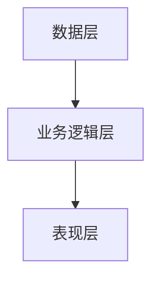
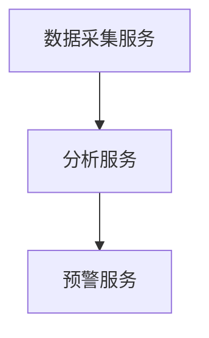
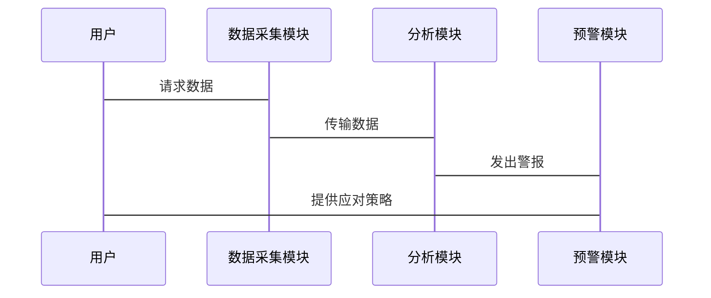

                 


# AI Agent在企业舆情危机预警与响应中的实时应用

**关键词**：AI Agent，企业舆情，实时预警，自然语言处理，机器学习，系统架构

**摘要**：本文探讨了AI Agent在企业舆情危机管理中的应用，详细分析了实时预警和响应的核心原理、系统架构设计以及实际项目案例。文章从背景介绍、核心概念、算法原理、系统架构到项目实战，层层深入，展示了AI Agent如何通过自然语言处理和机器学习技术，实现对企业舆情的实时监控和智能响应。

---

## 第1章 AI Agent与企业舆情危机管理概述

### 1.1 企业舆情危机的定义与特点

#### 1.1.1 企业舆情的定义
企业舆情指的是企业在经营过程中，通过各种媒体和社交平台传播的信息，反映了公众对企业及其产品、服务的态度和看法。

#### 1.1.2 舆情危机的形成机制
舆情危机通常由负面信息快速扩散引发，例如产品质量问题、管理不当或公关危机等，导致企业声誉受损，市场价值下降。

#### 1.1.3 舆情危机对企业的影响
- 品牌形象受损。
- 市场份额下降。
- 投资者信心动摇。

### 1.2 AI Agent的基本概念与功能

#### 1.2.1 AI Agent的定义
AI Agent是一种智能代理系统，能够感知环境、自主决策并执行任务，通常用于信息处理、数据分析和自动化操作。

#### 1.2.2 AI Agent的核心功能
- 数据采集与处理。
- 实时分析与预测。
- 自动化响应与反馈。

#### 1.2.3 AI Agent与传统舆情监控工具的区别
| 特性             | 传统舆情监控工具         | AI Agent                     |
|------------------|--------------------------|------------------------------|
| 数据处理能力     | 单一，依赖预设规则       | 智能化，支持深度学习         |
| 实时响应能力     | 较弱，依赖人工干预       | 强大，自动触发响应           |
| 分析深度         | 浅层，主要统计分析       | 深度，支持情感分析和意图识别 |

### 1.3 企业舆情危机预警与响应的必要性

#### 1.3.1 舆情危机对企业声誉的影响
负面舆情的快速扩散可能导致消费者信任度下降，进而影响企业的长期发展。

#### 1.3.2 实时预警与响应的重要性
- 快速识别潜在危机。
- 及时采取措施，减少负面影响。

#### 1.3.3 AI Agent在舆情管理中的优势
- **自动化监控**：24/7实时监测，确保不遗漏任何负面信息。
- **智能分析**：利用NLP和机器学习，准确识别舆情趋势。
- **快速响应**：自动化生成应对策略，缩短响应时间。

---

## 第2章 AI Agent的核心原理

### 2.1 自然语言处理技术

#### 2.1.1 NLP技术在舆情分析中的应用
- **分词**：将文本分割为词语或短语，便于后续处理。
- **实体识别**：识别文本中的关键实体，如人名、地名、组织名等。
- **情感分析**：判断文本的情感倾向，如正面、负面或中性。

#### 2.1.2 分词、实体识别与情感分析

**分词示例**：
- 输入文本：`"这个产品真的很好用，推荐给大家。"`
- 分词结果：`["这个", "产品", "真的", "很好用", "推荐", "给大家"]`

**实体识别示例**：
- 输入文本：`"苹果公司的新产品发布会在上海举行。"`
- 实体识别结果：`{"公司": "苹果公司", "地点": "上海"}`

**情感分析示例**：
- 输入文本：`"我对这个产品非常满意。"`
- 情感分析结果：`{"情感倾向": "正面", "强度": 0.95}`

#### 2.1.3 基于深度学习的文本理解
- 使用Transformer模型（如BERT）进行上下文理解，提升舆情分析的准确性。

### 2.2 机器学习与舆情分类

#### 2.2.1 常见的机器学习算法
- **支持向量机（SVM）**：适用于小规模数据的分类任务。
- **随机森林（Random Forest）**：适合处理高维数据。
- **深度学习模型（如LSTM、Transformer）**：适用于复杂文本分析。

#### 2.2.2 舆情分类的数学模型
**逻辑回归模型**：
$$ P(y=1|x) = \frac{1}{1 + e^{-\beta x}} $$
其中，$\beta$是模型参数，$x$是输入特征。

**训练过程**：
1. 数据预处理：文本分词、特征提取。
2. 模型训练：使用训练数据优化参数。
3. 模型评估：通过准确率、召回率等指标评估性能。

#### 2.2.3 舆情分类的实现流程
1. 数据采集：从社交媒体、新闻网站等渠道获取舆情数据。
2. 数据预处理：清洗、分词、去停用词。
3. 特征提取：提取文本的TF-IDF特征或词嵌入。
4. 模型训练：使用机器学习算法训练分类器。
5. 模型部署：实时接收输入数据，返回分类结果。

### 2.3 实时数据处理与事件触发机制

#### 2.3.1 实时数据流的处理方法
- 使用流处理框架（如Apache Kafka）接收实时数据。
- 采用滑动窗口技术处理时间序列数据。

#### 2.3.2 事件触发的规则引擎
- 设定阈值：当负面舆情的数量超过设定阈值时，触发警报。
- 规则引擎：基于关键词组合和情感强度触发不同级别的响应。

#### 2.3.3 基于阈值的异常检测
- 使用统计方法（如Z-score）或机器学习模型（如Isolation Forest）检测异常数据。

---

## 第3章 系统架构与设计

### 3.1 系统功能模块划分

#### 3.1.1 数据采集模块
- 负责从社交媒体、新闻网站等渠道采集舆情数据。
- 使用API接口或爬虫技术获取实时数据。

#### 3.1.2 数据分析模块
- 对采集到的数据进行清洗、分词、实体识别等预处理。
- 使用NLP和机器学习模型进行舆情分类和情感分析。

#### 3.1.3 预警与响应模块
- 根据分析结果触发警报，并生成应对策略。
- 自动发布澄清声明或调整营销策略。

#### 3.1.4 人机交互模块
- 提供可视化界面，方便用户查看舆情分析结果。
- 支持用户与AI Agent的交互，如查询历史数据、调整参数等。

### 3.2 系统架构设计

#### 3.2.1 分层架构设计
- **数据层**：存储原始数据和分析结果。
- **业务逻辑层**：处理数据和业务逻辑。
- **表现层**：提供用户界面和API接口。



#### 3.2.2 微服务架构设计
- **数据采集服务**：负责数据的采集和预处理。
- **分析服务**：负责舆情分析和分类。
- **预警服务**：负责实时预警和响应。



#### 3.2.3 系统交互流程
1. 数据采集模块接收实时数据。
2. 数据分析模块进行处理和分类。
3. 预警模块根据分类结果触发响应。
4. 人机交互模块展示结果并支持用户操作。



---

## 第4章 项目实战

### 4.1 环境安装

#### 4.1.1 安装Python环境
- 使用Anaconda安装Python 3.8及以上版本。

#### 4.1.2 安装依赖库
- `pip install numpy`
- `pip install scikit-learn`
- `pip install transformers`

### 4.2 系统核心实现源代码

#### 4.2.1 数据采集模块

```python
import requests

def fetch_data(url):
    response = requests.get(url)
    return response.text
```

#### 4.2.2 数据分析模块

```python
from sklearn.feature_extraction.text import TfidfVectorizer
from sklearn.svm import SVC

def preprocess(text):
    # 分词和预处理
    pass

def train_model(X, y):
    vectorizer = TfidfVectorizer()
    X_vec = vectorizer.fit_transform(X)
    model = SVC()
    model.fit(X_vec, y)
    return model, vectorizer
```

#### 4.2.3 预警与响应模块

```python
def trigger_alarm(threshold, count):
    if count > threshold:
        print("触发警报！")
    else:
        print("未触发警报。")

trigger_alarm(50, 60)
```

### 4.3 实际案例分析

#### 4.3.1 案例背景
某企业面临产品质量投诉激增的情况，利用AI Agent进行实时监控和分析。

#### 4.3.2 系统实现
- 数据采集：从社交媒体和新闻网站获取相关投诉信息。
- 数据分析：使用SVM模型进行舆情分类，识别负面评论。
- 预警与响应：当负面评论数量超过阈值时，自动发布澄清声明。

#### 4.3.3 应用效果
- 实时监控，及时发现潜在危机。
- 自动响应，减少人工干预，提高效率。

---

## 第5章 总结与展望

### 5.1 本章小结
本文详细介绍了AI Agent在企业舆情管理中的应用，从核心原理到系统架构，再到项目实战，全面展示了AI技术在舆情预警与响应中的优势。

### 5.2 注意事项
- 数据隐私问题需严格遵守相关法律法规。
- 系统需定期更新模型以应对舆情变化。

### 5.3 未来展望
- **技术改进**：引入更先进的NLP模型，如GPT-3，提升分析精度。
- **应用拓展**：扩展到更多领域，如金融风险预警、公共卫生事件管理。

### 5.4 拓展阅读
- 《自然语言处理实战》
- 《机器学习实战》
- 《微服务架构设计》

---

## 作者信息

作者：AI天才研究院/AI Genius Institute & 禅与计算机程序设计艺术 /Zen And The Art of Computer Programming

---

以上内容详细介绍了AI Agent在企业舆情管理中的应用，从理论到实践，层层深入，帮助读者全面理解AI技术在舆情预警与响应中的重要作用。

