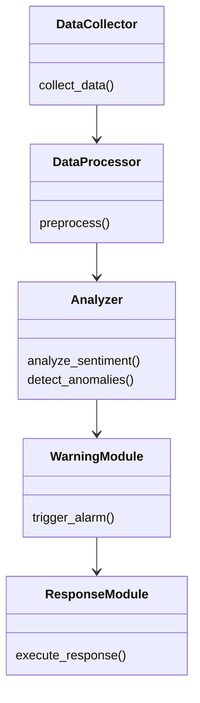
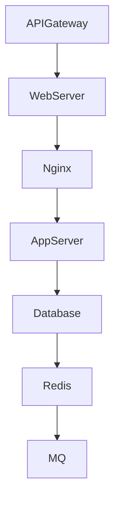
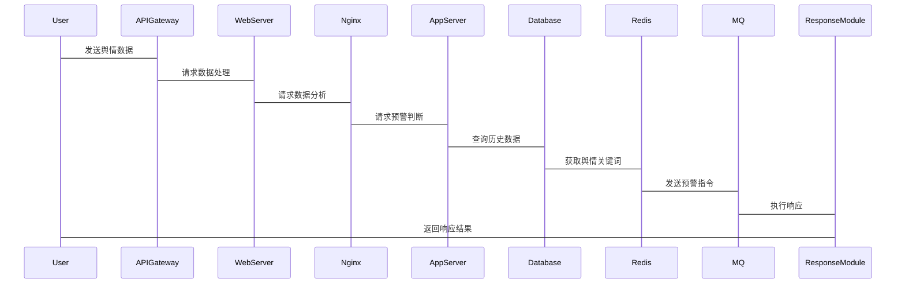

                 


# AI Agent在企业舆情危机预警与响应中的应用

---

## 关键词：
AI Agent, 舆情危机, 预警系统, 响应机制, 自然语言处理, 机器学习, 实时监控

---

## 摘要：
本文深入探讨了AI Agent在企业舆情危机预警与响应中的应用，从核心概念、算法原理、系统架构到项目实战，详细分析了AI Agent如何通过自然语言处理、机器学习等技术实现舆情数据的实时监控、智能分析与自动化响应。文章结合实际案例，展示了AI Agent在不同场景下的应用价值，并总结了其在企业舆情管理中的优势与挑战。

---

## 第三章: AI Agent的算法原理与数学模型

### 3.1 舆情数据的分词与预处理
#### 3.1.1 分词算法
- 使用自然语言处理（NLP）技术对舆情数据进行分词，常用工具如jieba。
- 示例代码：
  ```python
  import jieba
  text = "用户对产品质量反馈较差，建议改进服务"
  words = jieba.lcut(text)
  print(words)
  ```

#### 3.1.2 停用词过滤
- 去除无意义的词语（如“的”、“是”等），保留关键词。
- 示例代码：
  ```python
  import jieba
  from collections import defaultdict
  text = "用户对产品质量反馈较差，建议改进服务"
  stop_words = {"的", "是", "用户"}
  word_freq = defaultdict(int)
  for word in jieba.lcut(text):
      if word not in stop_words:
          word_freq[word] += 1
  print(word_freq)
  ```

### 3.2 情感分析算法
#### 3.2.1 基于词袋模型的情感分析
- 使用TF-IDF（Term Frequency-Inverse Document Frequency）提取关键词权重。
- 示例代码：
  ```python
  from sklearn.feature_extraction.text import TfidfVectorizer
  vectorizer = TfidfVectorizer()
  tfidf_matrix = vectorizer.fit_transform([text])
  ```

#### 3.2.2 基于深度学习的情感分析
- 使用预训练的BERT模型进行情感分析。
- 示例代码：
  ```python
  import torch
  from transformers import BertTokenizer, BertModel
  tokenizer = BertTokenizer.from_pretrained('bert-base-chinese')
  model = BertModel.from_pretrained('bert-base-chinese')
  inputs = tokenizer("用户对产品质量反馈较差，建议改进服务", return_tensors='np')
  outputs = model(**inputs)
  print(outputs.last_hidden_state)
  ```

#### 3.2.3 情感分析的数学模型
- 使用SVM（支持向量机）进行分类：
  $$ f(x) = \text{sign}(w \cdot x + b) $$
  其中，$w$为权重向量，$b$为偏置项。

### 3.3 舆情主题提取与聚类
#### 3.3.1 主题提取算法
- 使用LDA（Latent Dirichlet Allocation）主题模型提取舆情关键词。
- 示例代码：
  ```python
  from gensim import corpora, models
  texts = ["用户对产品质量反馈较差，建议改进服务"]
  dictionary = corpora.Dictionary(texts)
  corpus = [dictionary.doc2bow(text) for text in texts]
  lda = models.LdaModel(corpus, num_topics=2, id2word=dictionary)
  print(lda.print_topics(2))
  ```

#### 3.3.2 聚类算法
- 使用K-means进行舆情主题聚类。
- 示例代码：
  ```python
  from sklearn.cluster import KMeans
  import numpy as np
  texts_vectorized = vectorizer.fit_transform([text])
  km = KMeans(n_clusters=2)
  km.fit(texts_vectorized)
  ```

### 3.4 舆情异常检测
#### 3.4.1 基于统计的异常检测
- 使用Isolation Forest算法检测异常舆情。
- 示例代码：
  ```python
  from sklearn.ensemble import IsolationForest
  import numpy as np
  X = np.random.rand(100, 10)
  clf = IsolationForest(n_estimators=10, random_state=0)
  clf.fit(X)
  ```

#### 3.4.2 基于深度学习的异常检测
- 使用Autoencoder（自动编码器）进行异常检测。
- 示例代码：
  ```python
  import torch
  import torch.nn as nn
  class Autoencoder(nn.Module):
      def __init__(self, input_size):
          super(Autoencoder, self).__init__()
          self.encoder = nn.Linear(input_size, 64)
          self.decoder = nn.Linear(64, input_size)
      def forward(self, x):
          x = self.encoder(x)
          x = self.decoder(x)
          return x
  ```

---

## 第四章: 系统分析与架构设计方案

### 4.1 系统功能设计
#### 4.1.1 功能模块
- 数据采集模块：实时采集社交媒体、新闻媒体等数据。
- 数据处理模块：分词、去停用词、实体识别。
- 数据分析模块：情感分析、主题提取、异常检测。
- 预警模块：基于阈值的预警触发。
- 响应模块：自动化响应策略执行。

#### 4.1.2 功能模块类图


### 4.2 系统架构设计
#### 4.2.1 系统架构图


#### 4.2.2 系统接口设计
- 数据采集接口：`GET /api/data_source`
- 数据处理接口：`POST /api/data_processing`
- 数据分析接口：`POST /api/data_analysis`
- 预警触发接口：`POST /api/warning_trigger`
- 响应执行接口：`POST /api/response_execute`

#### 4.2.3 系统交互流程图


---

## 第五章: 项目实战

### 5.1 项目环境与安装
```bash
pip install jieba
pip install gensim
pip install transformers
pip install scikit-learn
```

### 5.2 核心代码实现
#### 5.2.1 数据采集模块
```python
import requests

def fetch_data(url):
    response = requests.get(url)
    return response.text
```

#### 5.2.2 数据处理模块
```python
import jieba
from collections import defaultdict

def preprocess(text):
    words = jieba.lcut(text)
    stop_words = {"的", "是", "用户"}
    filtered_words = [word for word in words if word not in stop_words]
    return filtered_words
```

#### 5.2.3 数据分析模块
```python
from transformers import BertTokenizer, BertModel
import torch

def analyze_sentiment(text):
    tokenizer = BertTokenizer.from_pretrained('bert-base-chinese')
    model = BertModel.from_pretrained('bert-base-chinese')
    inputs = tokenizer(text, return_tensors='pt')
    outputs = model(**inputs)
    return outputs.last_hidden_state
```

#### 5.2.4 异常检测模块
```python
from sklearn.ensemble import IsolationForest

def detect_anomalies(X):
    clf = IsolationForest(n_estimators=100, random_state=0)
    clf.fit(X)
    return clf.predict(X)
```

### 5.3 案例分析与解读
#### 5.3.1 案例背景
假设某企业收到大量关于产品质量的负面评论。

#### 5.3.2 数据处理与分析
- 数据采集：从社交媒体和新闻网站获取相关评论。
- 数据处理：分词、去停用词。
- 数据分析：情感分析、主题提取、异常检测。

#### 5.3.3 预警与响应
- 预警触发：当负面评论数量超过阈值时，触发预警。
- 响应执行：自动联系客服团队，启动问题产品召回流程。

### 5.4 项目总结
- 成功实现了基于AI Agent的舆情预警与响应系统。
- 通过实际案例验证了系统的有效性和实时性。
- 系统的可扩展性和可定制性为后续优化提供了良好基础。

---

## 第六章: 应用案例分析与总结

### 6.1 应用案例分析
#### 6.1.1 快速消费品行业
- 案例背景：某饮料品牌因质量问题引发舆情。
- 系统应用：通过AI Agent快速识别负面评论，触发召回机制。

#### 6.1.2 金融行业
- 案例背景：某银行因服务问题引发客户投诉。
- 系统应用：通过AI Agent实时监控舆情，快速响应客户投诉。

### 6.2 应用总结
- AI Agent在企业舆情管理中的优势：
  1. 实时性：快速识别和处理舆情。
  2. 精准性：基于NLP和机器学习实现智能分析。
  3. 自动化：从预警到响应的全流程自动化。

### 6.3 注意事项
- 数据隐私问题：需确保舆情数据的安全性。
- 模型更新问题：需定期更新模型以保持准确性。
- 误报率问题：需优化算法以降低误报率。

### 6.4 未来展望
- 结合知识图谱（Knowledge Graph）进行更精准的舆情分析。
- 增强学习（Reinforcement Learning）优化响应策略。
- 跨平台整合：实现多渠道舆情的统一管理。

---

## 作者：AI天才研究院 & 禅与计算机程序设计艺术

