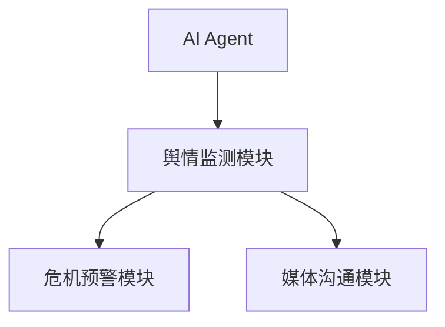

                 


# AI Agent在企业舆情监测与危机公关中的应用

> 关键词：AI Agent、企业舆情监测、危机公关、自然语言处理、机器学习、文本挖掘、情感分析

> 摘要：本文系统地探讨了AI Agent在企业舆情监测与危机公关中的应用，从基础概念到实际应用，详细分析了AI Agent如何利用自然语言处理、机器学习等技术实现舆情监测与危机应对。文章内容涵盖AI Agent的概述、舆情监测基础、AI Agent在舆情监测中的应用、危机公关中的应用、算法原理、系统架构设计、项目实战以及总结与展望。通过本文，读者将深入了解AI Agent在企业舆情监测与危机公关中的重要作用及其实际应用价值。

---

# 第1章: AI Agent的概述

## 1.1 AI Agent的基本概念

### 1.1.1 什么是AI Agent
AI Agent（人工智能代理）是指能够感知环境并采取行动以实现目标的智能实体。AI Agent可以是软件程序、机器人或其他智能系统，具备自主决策和问题解决能力。

### 1.1.2 AI Agent的类型
AI Agent可以根据智能水平、环境类型和任务类型进行分类：
- **反应式AI Agent**：基于当前感知做出反应，不依赖历史信息。
- **认知式AI Agent**：具备推理、规划和学习能力，能够处理复杂任务。
- **协作式AI Agent**：能够与其他AI Agent或人类协作完成任务。
- **监视式AI Agent**：专注于实时监测和数据收集。

### 1.1.3 AI Agent的核心功能
AI Agent的核心功能包括：
- **感知能力**：通过传感器或数据接口获取环境信息。
- **决策能力**：基于感知信息做出决策。
- **行动能力**：根据决策执行操作。
- **学习能力**：通过机器学习不断优化自身性能。

---

## 1.2 AI Agent在企业中的重要性

### 1.2.1 企业智能化转型的驱动力
随着企业数字化转型的推进，AI Agent成为提升企业效率和竞争力的重要工具。通过AI Agent，企业可以实现自动化监测、智能决策和快速响应。

### 1.2.2 AI Agent在企业中的应用场景
AI Agent在企业中的应用场景广泛，包括：
- **舆情监测**：实时监测社交媒体、新闻媒体等渠道的企业声誉。
- **客户关系管理**：通过分析客户行为和反馈，优化客户服务。
- **供应链管理**：实时监控供应链状态，预测和应对潜在风险。

### 1.2.3 AI Agent的优势与挑战
AI Agent的优势在于其高效性、准确性和实时性。然而，AI Agent的挑战包括数据隐私、模型复杂性和技术门槛。

---

## 1.3 本章小结

### 1.3.1 AI Agent的核心概念总结
AI Agent是具备感知、决策和行动能力的智能实体，能够通过自主学习优化自身性能。

### 1.3.2 AI Agent在企业中的潜力
AI Agent在企业中的应用潜力巨大，尤其是在舆情监测和危机公关领域，能够帮助企业实现智能化管理和快速响应。

### 1.3.3 未来发展趋势展望
未来，AI Agent将更加智能化和人性化，通过与人类的协作实现更复杂的任务。

---

# 第2章: 企业舆情监测的基础

## 2.1 舆情监测的定义与目标

### 2.1.1 舆情监测的定义
舆情监测是指通过收集和分析公众对某个品牌、产品或事件的言论，了解公众意见和态度的过程。

### 2.1.2 舆情监测的目标
舆情监测的目标包括：
- **识别公众情绪**：了解公众对企业的看法。
- **预警潜在风险**：及时发现负面舆情，避免危机扩大。
- **优化企业形象**：通过舆情分析，优化企业的公关策略。

### 2.1.3 舆情监测的重要性
舆情监测是企业在当今信息化社会中维护自身形象和声誉的重要手段。通过舆情监测，企业能够快速响应公众需求，提升品牌形象。

---

## 2.2 舆情监测的主要技术方法

### 2.2.1 自然语言处理技术
自然语言处理（NLP）技术是舆情监测的核心技术之一。通过NLP，可以对文本进行分词、情感分析、主题提取等操作。

### 2.2.2 数据挖掘与分析
数据挖掘技术用于从海量数据中提取有价值的信息。通过数据挖掘，可以发现舆情中的规律和趋势。

### 2.2.3 机器学习算法
机器学习算法（如支持向量机、随机森林）可以用于舆情分类、情感分析和预测。

---

## 2.3 舆情监测的挑战与解决方案

### 2.3.1 数据量大与实时性要求
舆情数据通常非常庞大，且要求实时处理。解决方案包括分布式计算和流数据处理技术。

### 2.3.2 数据多样性与准确性
舆情数据来源多样，且可能存在噪音。解决方案包括多模态数据融合和深度学习模型优化。

### 2.3.3 解决方案与优化策略
- **分布式计算**：使用Spark、Hadoop等技术处理海量数据。
- **深度学习模型**：使用BERT、GPT等预训练模型提升准确性。
- **实时处理技术**：采用流数据处理框架（如Apache Kafka、Flink）实现实时监测。

---

## 2.4 本章小结

### 2.4.1 舆情监测的核心技术总结
舆情监测的核心技术包括自然语言处理、数据挖掘和机器学习算法。

### 2.4.2 舆情监测的重要性
舆情监测是企业在信息化社会中维护形象和声誉的重要手段。

### 2.4.3 未来发展趋势展望
未来，舆情监测将更加智能化和实时化，深度学习和多模态数据处理技术将发挥重要作用。

---

# 第3章: AI Agent在舆情监测中的应用

## 3.1 信息收集与预处理

### 3.1.1 数据来源
AI Agent可以通过多种数据来源收集舆情信息，包括社交媒体、新闻网站、论坛等。

### 3.1.2 数据清洗与预处理
数据清洗包括去除噪音、去重和数据格式化。预处理包括分词、停用词去除和词干提取。

### 3.1.3 数据存储
数据可以存储在分布式数据库（如Hadoop、MongoDB）中，方便后续分析。

---

## 3.2 情感分析与舆情分类

### 3.2.1 情感分析算法
常用的情感分析算法包括：
- **基于规则的分类**：通过预定义规则判断文本情感。
- **机器学习分类**：使用SVM、随机森林等算法训练情感分类器。
- **深度学习模型**：使用LSTM、BERT等模型进行情感分析。

### 3.2.2 舆情分类
舆情分类包括将文本分为正面、负面、中性等类别。分类结果可用于后续的舆情预警和分析。

---

## 3.3 主题识别与热点事件预警

### 3.3.1 主题识别
主题识别通过聚类算法（如K-means、LDA）对舆情文本进行主题提取，识别当前热点事件。

### 3.3.2 热点事件预警
通过实时监测和主题识别，AI Agent可以及时发现潜在的热点事件，并发出预警。

---

## 3.4 本章小结

### 3.4.1 AI Agent在舆情监测中的应用总结
AI Agent通过信息收集、情感分析和主题识别等技术，能够高效地进行舆情监测。

### 3.4.2 技术实现的关键点
关键点包括数据清洗、情感分析算法选择和主题识别方法。

### 3.4.3 未来发展趋势
未来，AI Agent在舆情监测中的应用将更加智能化和实时化。

---

# 第4章: AI Agent在危机公关中的应用

## 4.1 危机预警与响应

### 4.1.1 危机预警
AI Agent可以通过实时监测舆情，识别潜在的危机信号，并发出预警。

### 4.1.2 危机响应策略
根据预警信息，企业可以制定相应的危机应对策略，包括媒体沟通、危机公关等。

---

## 4.2 危机公关中的媒体沟通

### 4.2.1 媒体分析
通过分析媒体报道，AI Agent可以帮助企业了解媒体态度，制定有效的沟通策略。

### 4.2.2 媒体沟通策略
根据舆情分析结果，企业可以制定积极的媒体沟通策略，提升品牌形象。

---

## 4.3 危机公关中的策略优化

### 4.3.1 危机应对策略
根据舆情分析结果，优化危机应对策略，减少负面影响。

### 4.3.2 媒体关系管理
通过AI Agent，企业可以实现媒体关系管理，提升媒体沟通效率。

---

## 4.4 本章小结

### 4.4.1 AI Agent在危机公关中的应用总结
AI Agent在危机公关中的应用包括危机预警、媒体分析和策略优化。

### 4.4.2 技术实现的关键点
关键点包括舆情分析、媒体关系管理和危机应对策略优化。

### 4.4.3 未来发展趋势
未来，AI Agent在危机公关中的应用将更加智能化和个性化。

---

# 第5章: AI Agent的算法原理

## 5.1 自然语言处理模型

### 5.1.1 词嵌入模型
词嵌入模型（如Word2Vec、GloVe）通过将词映射到低维向量空间，提升文本处理效率。

### 5.1.2 语言模型
语言模型（如RNN、LSTM、Transformer）用于生成和理解自然语言文本。

---

## 5.2 机器学习算法

### 5.2.1 分类算法
分类算法（如SVM、随机森林）用于舆情分类和主题识别。

### 5.2.2 聚类算法
聚类算法（如K-means、LDA）用于主题提取和热点事件识别。

---

## 5.3 情感分析的数学模型

### 5.3.1 情感分类模型
情感分类模型基于文本特征向量进行分类。常用的情感分类模型包括：
$$ P(y|x) = \frac{P(x|y)}{P(x)} $$
其中，$P(x|y)$是条件概率，$P(y)$是先验概率。

### 5.3.2 情感强度预测模型
情感强度预测模型（如LSTM）可以预测情感的强度：
$$ y = \text{LSTM}(x) $$

---

## 5.4 本章小结

### 5.4.1 AI Agent的算法原理总结
AI Agent的算法原理包括自然语言处理模型和机器学习算法。

### 5.4.2 算法实现的关键点
关键点包括词嵌入模型选择、分类算法优化和情感分析模型设计。

### 5.4.3 未来发展趋势
未来，深度学习模型（如BERT、GPT）将在AI Agent的算法中发挥更大作用。

---

# 第6章: AI Agent的系统架构设计

## 6.1 系统功能设计

### 6.1.1 舆情监测模块
舆情监测模块负责实时收集和分析舆情数据。

### 6.1.2 危机预警模块
危机预警模块负责识别潜在的危机信号，并发出预警。

### 6.1.3 媒体沟通模块
媒体沟通模块负责制定和优化媒体沟通策略。

---

## 6.2 系统架构设计

### 6.2.1 系统架构图
使用mermaid绘制系统架构图：



### 6.2.2 接口设计
系统接口设计包括：
- 数据接口：与数据源（如社交媒体、新闻网站）对接。
- 用户接口：提供用户查询和分析结果展示。

---

## 6.3 本章小结

### 6.3.1 系统架构设计总结
AI Agent的系统架构设计包括舆情监测模块、危机预警模块和媒体沟通模块。

### 6.3.2 系统实现的关键点
关键点包括模块划分、接口设计和系统交互流程优化。

### 6.3.3 未来发展趋势
未来，系统架构将更加模块化和分布式，便于扩展和维护。

---

# 第7章: 项目实战

## 7.1 环境安装

### 7.1.1 安装Python环境
使用Anaconda安装Python环境，并配置Jupyter Notebook。

### 7.1.2 安装依赖库
安装Numpy、Pandas、Scikit-learn等依赖库。

---

## 7.2 核心代码实现

### 7.2.1 数据收集
使用Twitter API收集社交媒体上的舆情数据。

### 7.2.2 数据清洗与预处理
使用Python代码对数据进行清洗和预处理：

```python
import pandas as pd
import numpy as np

data = pd.read_csv('tweets.csv')
data = data.dropna()
data['text'] = data['text'].apply(lambda x: x.lower())
```

### 7.2.3 情感分析
使用Scikit-learn训练情感分类器：

```python
from sklearn.feature_extraction.text import TfidfVectorizer
from sklearn.svm import SVC

vectorizer = TfidfVectorizer()
X = vectorizer.fit_transform(data['text'])
y = data['sentiment']

model = SVC()
model.fit(X, y)
```

---

## 7.3 实际案例分析

### 7.3.1 案例背景
以某企业负面舆情为例，分析AI Agent如何快速识别并应对危机。

### 7.3.2 分析结果
AI Agent识别出负面舆情后，触发危机预警，并生成应对策略。

---

## 7.4 本章小结

### 7.4.1 项目实战总结
通过项目实战，读者可以掌握AI Agent在舆情监测中的实际应用。

### 7.4.2 代码实现的关键点
关键点包括数据收集、数据清洗和情感分析模型训练。

### 7.4.3 未来发展趋势
未来，项目实战将更加注重数据可视化和系统优化。

---

# 第8章: 总结与展望

## 8.1 全文总结

### 8.1.1 AI Agent的核心作用
AI Agent在企业舆情监测与危机公关中发挥着重要作用，能够高效地进行舆情监测和危机应对。

### 8.1.2 技术实现的关键点
技术实现的关键点包括自然语言处理模型、机器学习算法和系统架构设计。

---

## 8.2 未来展望

### 8.2.1 技术发展趋势
未来，深度学习和多模态数据处理技术将进一步提升AI Agent的性能。

### 8.2.2 应用场景扩展
AI Agent将在更多领域（如金融、医疗）发挥重要作用。

---

## 8.3 最佳实践 Tips

### 8.3.1 数据隐私保护
在处理舆情数据时，必须注意数据隐私保护。

### 8.3.2 模型优化
通过不断优化模型参数和引入新的数据，提升AI Agent的性能。

### 8.3.3 人机协作
AI Agent与人类协作是未来的重要发展方向。

---

## 8.4 作者信息

**作者：AI天才研究院/AI Genius Institute & 禅与计算机程序设计艺术 /Zen And The Art of Computer Programming**

---

通过本文，读者可以系统地了解AI Agent在企业舆情监测与危机公关中的应用，从基础概念到实际应用，全面掌握其技术原理和实现方法。

