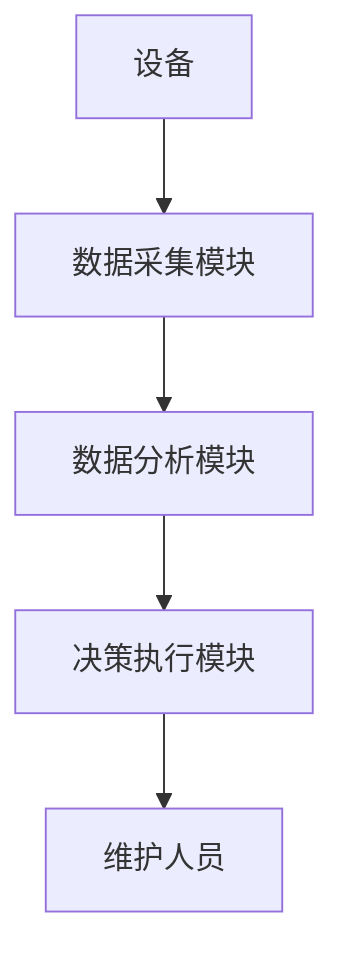
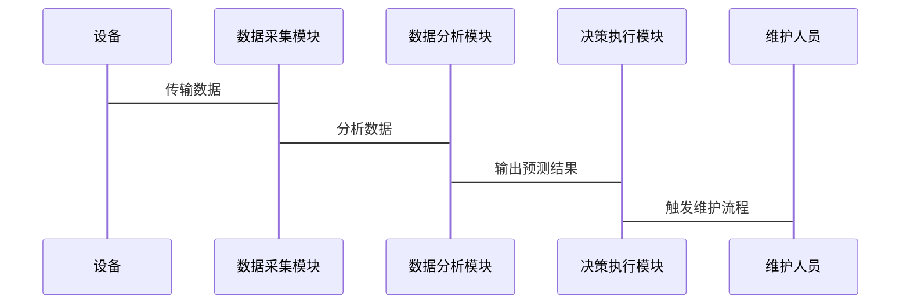

                 


# AI Agent在企业设备预测性维护中的应用

> 关键词：AI Agent，预测性维护，企业设备，智能维护，算法原理

> 摘要：本文详细探讨了AI Agent在企业设备预测性维护中的应用，从背景介绍、核心概念、算法原理到系统架构设计，再到项目实战和总结，全面分析了AI Agent在预测性维护中的作用和实现方法。文章内容丰富，结合理论与实践，为读者提供了深入的技术见解。

---

## 第一部分: AI Agent与预测性维护的背景与概念

### 第1章: AI Agent与预测性维护的背景介绍

#### 1.1 问题背景

##### 1.1.1 传统设备维护的痛点
企业设备的维护通常依赖于人工检查和定期维护，这种方式存在以下痛点：
- **高成本**：频繁的人工检查和维护需要大量的人力和时间。
- **低效率**：传统方法难以及时发现潜在故障，可能导致设备突然停机。
- **低精度**：人工检查可能存在疏漏，导致维护效果不佳。

##### 1.1.2 预测性维护的定义与目标
预测性维护（Predictive Maintenance）是一种通过收集和分析设备运行数据，预测设备未来状态的维护方法。其目标是通过提前发现潜在故障，减少设备停机时间，降低维护成本。

##### 1.1.3 AI Agent在预测性维护中的作用
AI Agent（人工智能代理）是一种能够感知环境、自主决策并执行任务的智能实体。在预测性维护中，AI Agent可以实时监控设备状态，分析数据，预测故障，并自动触发维护流程。

#### 1.2 问题描述

##### 1.2.1 设备故障对企业的影响
设备故障可能导致生产线中断，影响生产效率，甚至造成安全隐患和经济损失。

##### 1.2.2 预测性维护的核心问题
- 如何高效、准确地预测设备故障？
- 如何实现预测结果的实时应用？

##### 1.2.3 AI Agent如何解决这些问题
AI Agent通过实时数据分析和智能决策，能够快速响应设备状态变化，提前采取措施，减少设备故障带来的影响。

#### 1.3 解决方案与技术路线

##### 1.3.1 预测性维护的主要技术
- 数据采集与分析
- 机器学习模型训练
- AI Agent的智能决策

##### 1.3.2 AI Agent在预测性维护中的应用流程
1. 数据采集：通过传感器获取设备运行数据。
2. 数据分析：利用机器学习算法分析数据，预测设备状态。
3. 智能决策：AI Agent根据预测结果，决定是否需要维护。

##### 1.3.3 技术路线图与实施步骤
- 数据采集与预处理
- 模型训练与部署
- AI Agent的集成与应用

#### 1.4 概念结构与核心要素

##### 1.4.1 预测性维护的核心要素
- 设备状态数据
- 预测模型
- 维护决策系统

##### 1.4.2 AI Agent的构成与功能
- 数据采集模块
- 数据分析模块
- 决策执行模块

##### 1.4.3 预测性维护与AI Agent的关系
- 预测性维护是目标，AI Agent是实现这一目标的工具。

---

### 第2章: AI Agent与预测性维护的核心概念

#### 2.1 AI Agent的定义与特点

##### 2.1.1 AI Agent的基本定义
AI Agent是一种能够感知环境、自主决策并执行任务的智能实体。它具备以下特点：
- **自主性**：能够自主决策。
- **反应性**：能够实时响应环境变化。
- **学习能力**：能够通过数据不断优化自身的预测能力。

##### 2.1.2 AI Agent的核心特点
- **实时性**：能够快速响应。
- **准确性**：能够准确预测设备状态。
- **可扩展性**：能够适用于不同类型的设备。

##### 2.1.3 AI Agent与传统算法的区别
- **传统算法**：需要人工干预，缺乏自主性。
- **AI Agent**：具备自主决策能力，能够独立完成任务。

#### 2.2 预测性维护的原理与方法

##### 2.2.1 预测性维护的基本原理
通过分析设备运行数据，利用机器学习模型预测设备未来状态。

##### 2.2.2 基于数据的预测方法
- **时间序列分析**：基于历史数据预测未来状态。
- **异常检测**：通过检测数据中的异常值预测故障。

##### 2.2.3 基于模型的预测方法
- **物理模型**：基于设备物理特性建立模型。
- **机器学习模型**：基于数据训练模型进行预测。

#### 2.3 AI Agent在预测性维护中的核心作用

##### 2.3.1 AI Agent的核心作用
- **实时监控**：持续监测设备运行状态。
- **智能预测**：通过分析数据预测设备故障。
- **自动决策**：根据预测结果自动触发维护流程。

##### 2.3.2 AI Agent的优势
- **高效性**：能够快速处理大量数据。
- **准确性**：能够准确预测设备状态。
- **可扩展性**：能够适用于不同类型的设备。

##### 2.3.3 AI Agent与预测性维护的关系
AI Agent是实现预测性维护的核心工具，通过其智能决策能力，能够显著提高预测的准确性和效率。

---

## 第三部分: 算法原理与实现

### 第3章: AI Agent的算法原理

#### 3.1 算法原理概述

##### 3.1.1 算法原理的核心思想
通过分析设备运行数据，利用机器学习模型预测设备状态。

##### 3.1.2 算法流程
1. 数据采集与预处理
2. 数据分析与特征提取
3. 模型训练与优化
4. 模型部署与应用

#### 3.2 算法实现的步骤

##### 3.2.1 数据采集与预处理
- 数据采集：通过传感器获取设备运行数据。
- 数据清洗：去除异常值和噪声数据。
- 数据转换：将数据转换为适合模型训练的格式。

##### 3.2.2 数据分析与特征提取
- 特征提取：提取影响设备状态的关键特征。
- 数据可视化：通过图表展示数据分布。

##### 3.2.3 模型训练与优化
- 模型选择：选择适合的机器学习模型。
- 模型训练：利用训练数据训练模型。
- 模型优化：通过调整参数提高模型性能。

##### 3.2.4 模型部署与应用
- 模型部署：将模型部署到生产环境。
- 模型应用：通过模型预测设备状态。

#### 3.3 算法的数学模型与公式

##### 3.3.1 概率模型
- **概率模型**：用于预测设备故障的概率。
- **公式**：$$ P(Y|X) = \frac{P(Y)P(X|Y)}{P(X)} $$

##### 3.3.2 回归分析
- **线性回归**：用于预测设备的剩余寿命。
- **公式**：$$ y = \beta_0 + \beta_1x + \epsilon $$

##### 3.3.3 强化学习
- **强化学习**：用于优化AI Agent的决策策略。
- **公式**：$$ Q(s, a) = r + \gamma \max Q(s', a') $$

---

### 第4章: AI Agent的系统架构设计

#### 4.1 系统架构概述

##### 4.1.1 系统功能设计
- 数据采集模块：实时采集设备数据。
- 数据分析模块：分析数据并预测设备状态。
- 决策执行模块：根据预测结果触发维护流程。

##### 4.1.2 系统架构图


#### 4.2 系统接口设计

##### 4.2.1 数据接口
- 数据输入接口：接收设备数据。
- 数据输出接口：输出分析结果。

##### 4.2.2 模型接口
- 模型输入接口：接收特征数据。
- 模型输出接口：输出预测结果。

#### 4.3 系统交互流程

##### 4.3.1 交互流程图


---

## 第五部分: 项目实战与案例分析

### 第5章: 项目实战

#### 5.1 项目介绍

##### 5.1.1 项目背景
某制造企业希望利用AI Agent实现设备预测性维护。

##### 5.1.2 项目目标
通过AI Agent实时监控设备状态，提前预测故障，减少停机时间。

#### 5.2 环境安装

##### 5.2.1 环境要求
- 操作系统：Linux
- 程序语言：Python
- 开发工具：Jupyter Notebook
- 数据库：MySQL

##### 5.2.2 安装步骤
1. 安装Python和相关库（如NumPy、Pandas、Scikit-learn）。
2. 安装Jupyter Notebook。
3. 安装MySQL数据库。

#### 5.3 核心代码实现

##### 5.3.1 数据采集模块
```python
import pandas as pd
import numpy as np

# 数据采集模块
def collect_data():
    data = pd.read_csv('equipment_data.csv')
    return data
```

##### 5.3.2 数据分析模块
```python
from sklearn.model_selection import train_test_split
from sklearn.ensemble import RandomForestClassifier

# 数据分析模块
def train_model(data):
    X = data.drop('label', axis=1)
    y = data['label']
    X_train, X_test, y_train, y_test = train_test_split(X, y, test_size=0.2)
    model = RandomForestClassifier()
    model.fit(X_train, y_train)
    return model
```

##### 5.3.3 决策执行模块
```python
def execute_decision(model, data_point):
    prediction = model.predict(data_point)
    if prediction == 1:
        print("设备故障，需要维护！")
    else:
        print("设备正常运行。")
```

#### 5.4 案例分析与应用解读

##### 5.4.1 案例分析
通过训练模型，AI Agent能够准确预测设备故障，减少停机时间。

##### 5.4.2 应用解读
AI Agent的应用显著提高了设备维护效率，降低了维护成本。

---

## 第六部分: 总结与展望

### 第6章: 总结与展望

#### 6.1 全文总结

##### 6.1.1 核心内容回顾
本文详细介绍了AI Agent在企业设备预测性维护中的应用，从背景、概念、算法到系统架构和项目实战，全面分析了AI Agent的优势和实现方法。

##### 6.1.2 本文的创新点
提出了利用AI Agent实现预测性维护的新方法，结合了实时数据分析和智能决策。

#### 6.2 未来展望

##### 6.2.1 技术发展
随着AI技术的进步，AI Agent在预测性维护中的应用将更加广泛。

##### 6.2.2 应用领域
除了制造业，AI Agent还可以应用于其他领域，如能源、交通等。

##### 6.2.3 挑战与机遇
尽管AI Agent在预测性维护中具有巨大潜力，但仍需解决数据隐私和模型泛化等问题。

---

## 作者信息

作者：AI天才研究院/AI Genius Institute & 禅与计算机程序设计艺术 /Zen And The Art of Computer Programming

---

通过本文的详细阐述，我们全面了解了AI Agent在企业设备预测性维护中的应用，从理论到实践，为读者提供了丰富的技术见解。希望本文能够为相关领域的研究和实践提供有价值的参考。

