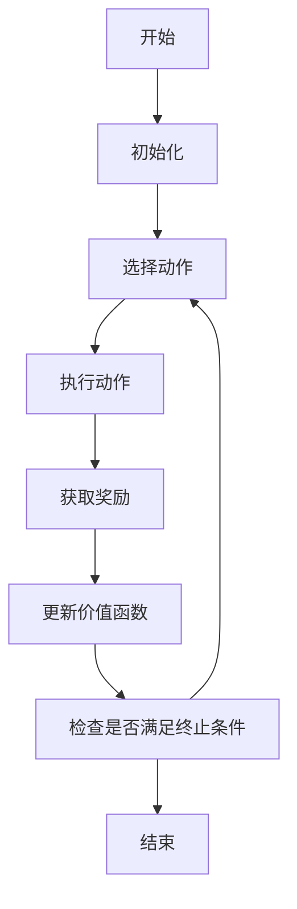
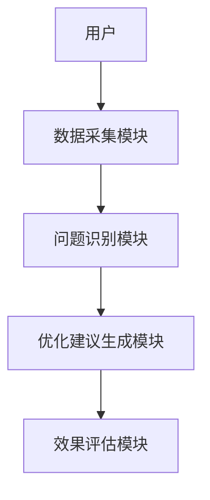
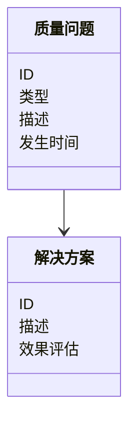
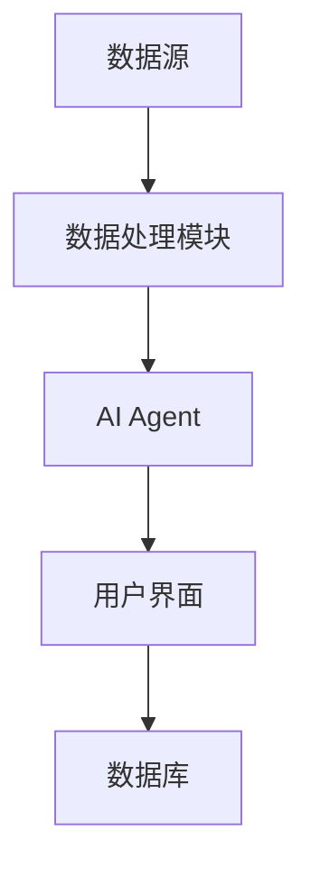
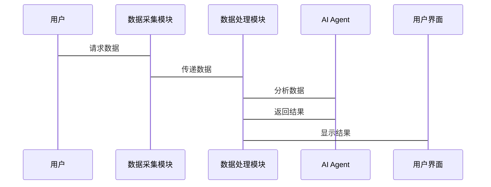
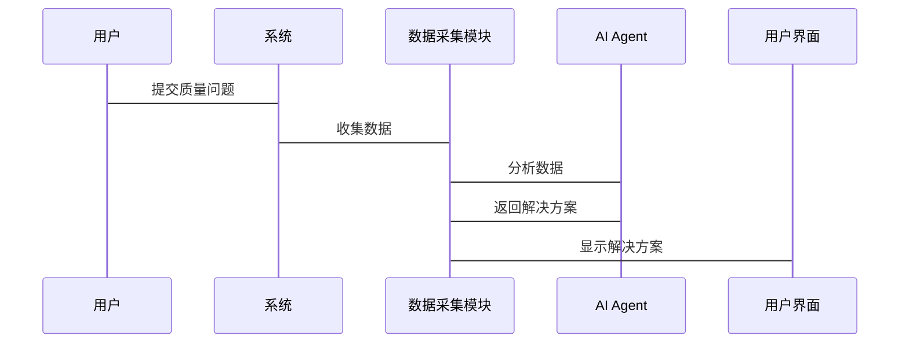

                 


# AI Agent在企业质量管理体系优化中的应用

> 关键词：AI Agent，企业质量管理体系，优化，应用，技术博客  
> 摘要：本文探讨了AI Agent在企业质量管理体系优化中的应用，分析了其在质量管理中的核心作用、算法原理以及系统架构设计，并通过实际案例展示了其在质量管理中的具体应用，最后总结了最佳实践和注意事项。

---

## 第1章: AI Agent与企业质量管理概述

### 1.1 AI Agent的基本概念

#### 1.1.1 AI Agent的定义与特点
AI Agent（人工智能代理）是指能够感知环境、自主决策并执行任务的智能实体。其特点包括自主性、反应性、目标导向和学习能力。AI Agent能够通过数据驱动的方法优化决策过程，从而提高系统的效率和质量。

#### 1.1.2 AI Agent的核心技术原理
AI Agent的核心技术包括自然语言处理（NLP）、计算机视觉、强化学习和知识图谱等。这些技术使其能够理解、分析和优化复杂的业务流程。

#### 1.1.3 AI Agent在企业中的应用价值
AI Agent可以帮助企业在质量管理中实现自动化、智能化和实时监控，从而提高质量控制的效率和准确性。

### 1.2 企业质量管理体系的基本框架

#### 1.2.1 质量管理体系的概念与目标
质量管理体系是企业为确保产品或服务符合质量标准而建立的一套系统化的管理方法。其目标是通过系统化的流程和持续改进来提高产品质量。

#### 1.2.2 传统质量管理中的痛点与挑战
传统质量管理存在效率低、人工干预多、数据孤岛和难以实时监控等问题。这些问题限制了质量管理的效果和企业的竞争力。

#### 1.2.3 数字化质量管理的发展趋势
随着数字化技术的快速发展，企业质量管理正在向智能化、数据驱动化和实时化方向发展。AI Agent作为数字化质量管理的重要工具，正在发挥越来越重要的作用。

### 1.3 AI Agent在质量管理中的作用

#### 1.3.1 AI Agent如何优化质量管理流程
AI Agent可以通过自动化数据采集、智能分析和优化建议生成，帮助企业在质量管理中实现流程优化和效率提升。

#### 1.3.2 AI Agent在质量数据分析中的应用
AI Agent能够处理大量的质量数据，通过机器学习和数据挖掘技术发现潜在的质量问题，并提供数据驱动的解决方案。

#### 1.3.3 AI Agent在质量改进中的创新价值
AI Agent可以通过预测性分析和实时监控，提前发现潜在的质量问题，并提供个性化的质量改进建议，从而实现质量的持续优化。

### 1.4 本章小结
本章介绍了AI Agent的基本概念和技术原理，分析了企业质量管理体系的基本框架，并探讨了AI Agent在质量管理中的重要作用。

---

## 第2章: AI Agent的核心概念与技术原理

### 2.1 AI Agent的核心概念

#### 2.1.1 AI Agent的构成要素
AI Agent的构成要素包括感知模块、决策模块和执行模块。感知模块负责数据采集和环境感知，决策模块负责分析和决策，执行模块负责任务执行和反馈。

#### 2.1.2 AI Agent的分类与特点
AI Agent可以分为基于规则的代理、基于知识的代理和基于学习的代理。每种代理类型都有其独特的特点和适用场景。

#### 2.1.3 AI Agent与相关技术的对比
AI Agent与传统自动化系统和专家系统相比，具有更强的自主性和学习能力。它能够通过数据驱动的方法实现动态优化。

### 2.2 AI Agent的实体关系图

#### 2.2.1 实体关系图的构建
以下是AI Agent在企业质量管理中的实体关系图：

```mermaid
erd
    %% AI Agent在企业质量管理中的实体关系图
    班组 -> 关联 -> 质量问题
    质量问题 <- 关联 -> 问题分类
    问题分类 <- 关联 -> 解决方案
    质量问题 <- 关联 -> 历史数据
    质量问题 <- 关联 -> 监控设备
```

#### 2.2.2 实体间的关系分析
- 班组：负责质量问题的报告和处理。
- 质量问题：核心实体，记录和管理质量问题。
- 问题分类：根据问题类型进行分类，以便制定相应的解决方案。
- 解决方案：针对具体质量问题提出的优化建议。
- 历史数据：过去的质量问题数据，用于分析和预测。

#### 2.2.3 实体关系图的优化建议
通过优化实体关系图，可以提高系统的数据流动效率和信息处理能力。例如，增加实时数据流的处理模块，以实现更高效的实时监控。

### 2.3 AI Agent与质量管理的关联

#### 2.3.1 AI Agent在质量管理中的核心作用
AI Agent通过实时数据分析和智能决策，帮助企业在质量管理中实现自动化、智能化和高效化。

#### 2.3.2 AI Agent与质量管理流程的结合
AI Agent可以嵌入到质量管理的各个环节，例如质量数据采集、问题识别、优化建议生成和效果评估等。

#### 2.3.3 AI Agent在质量管理中的应用场景
- 实时监控：通过AI Agent实时监控生产过程中的质量问题。
- 数据分析：利用AI Agent对历史数据进行分析，发现潜在的质量问题。
- 预测性维护：通过预测性分析，提前预防质量问题的发生。

### 2.4 本章小结
本章详细分析了AI Agent的核心概念和技术原理，并通过实体关系图展示了其在企业质量管理中的应用。

---

## 第3章: AI Agent的算法原理

### 3.1 基于强化学习的AI Agent算法

#### 3.1.1 强化学习的基本原理
强化学习是一种通过试错和奖励机制来优化决策过程的算法。AI Agent通过与环境的交互，学习最优策略以最大化累计奖励。

#### 3.1.2 AI Agent的决策过程
AI Agent通过感知环境、分析状态、制定决策并执行动作，实现对质量管理流程的优化。

#### 3.1.3 算法的数学模型与公式
以下是强化学习的基本公式：

状态值函数：
$$ V(s) = \max_a \left( r + V(s') \right) $$

动作值函数：
$$ Q(s, a) = r + \gamma \max_{a'} Q(s', a') $$

其中，\( r \) 是奖励，\( \gamma \) 是折扣因子，\( s \) 是当前状态，\( s' \) 是下一个状态。

### 3.2 算法流程图

以下是强化学习算法的流程图：



### 3.3 算法的数学模型与公式

#### 3.3.1 状态值函数
状态值函数 \( V(s) \) 表示在状态 \( s \) 下的最大化期望奖励。

$$ V(s) = \max_a \left( r + V(s') \right) $$

#### 3.3.2 动作值函数
动作值函数 \( Q(s, a) \) 表示在状态 \( s \) 下执行动作 \( a \) 的期望奖励。

$$ Q(s, a) = r + \gamma \max_{a'} Q(s', a') $$

其中，\( \gamma \) 是折扣因子，通常取值在 0 到 1 之间。

---

## 第4章: 系统分析与架构设计

### 4.1 问题场景介绍

#### 4.1.1 项目介绍
本项目旨在通过AI Agent优化企业质量管理体系，提高质量管理的效率和准确性。

#### 4.1.2 系统功能设计
系统功能包括数据采集、问题识别、优化建议生成和效果评估。

#### 4.1.3 系统架构设计
以下是系统的架构图：



### 4.2 系统架构设计

#### 4.2.1 领域模型设计
以下是领域的类图：



#### 4.2.2 系统架构图
以下是系统的架构图：



### 4.3 接口设计与交互流程图

#### 4.3.1 接口设计
以下是系统的接口设计：



#### 4.3.2 交互流程图
以下是用户与系统的交互流程图：



---

## 第5章: 项目实战

### 5.1 环境安装

#### 5.1.1 安装Python
安装Python 3.8及以上版本。

#### 5.1.2 安装必要的库
安装以下库：
```
pip install numpy
pip install matplotlib
pip install scikit-learn
```

### 5.2 系统核心实现

#### 5.2.1 数据采集模块
以下是数据采集模块的代码示例：

```python
import pandas as pd
import numpy as np

def collect_data():
    # 模拟数据采集
    data = pd.DataFrame({
        '时间': np.random.date_range(start='2023-01-01', periods=100),
        '质量问题': np.random.choice(['缺陷', '偏差', '正常'], 100)
    })
    return data

if __name__ == '__main__':
    data = collect_data()
    print(data.head())
```

#### 5.2.2 AI Agent实现
以下是AI Agent的实现代码：

```python
import numpy as np
import matplotlib.pyplot as plt

class AI-Agent:
    def __init__(self):
        self.V = {}

    def choose_action(self, state):
        if state not in self.V:
            return np.random.choice(['a', 'b', 'c'])
        else:
            return np.argmax(self.V[state])

    def update_value(self, state, action, reward, next_state):
        self.V[state] = reward + 0.9 * max(self.V.get(next_state, 0))

if __name__ == '__main__':
    agent = AI-Agent()
    # 模拟运行
    for _ in range(100):
        state = '问题'
        action = agent.choose_action(state)
        reward = 1 if action == '最优' else 0
        next_state = '解决'
        agent.update_value(state, action, reward, next_state)
    print(agent.V)
```

#### 5.2.3 数据可视化
以下是数据可视化的代码示例：

```python
import matplotlib.pyplot as plt

def visualize_data(data):
    plt.figure(figsize=(10, 6))
    plt.plot(data['时间'], data['质量问题'])
    plt.title('质量问题趋势图')
    plt.xlabel('时间')
    plt.ylabel('质量问题')
    plt.show()

if __name__ == '__main__':
    data = collect_data()
    visualize_data(data)
```

### 5.3 实际案例分析

#### 5.3.1 案例背景
某制造企业在生产过程中频繁出现质量问题，希望通过AI Agent实现质量管理的自动化和智能化。

#### 5.3.2 案例分析
通过AI Agent对生产过程中的数据进行实时监控和分析，发现质量问题的根源，并提出优化建议。

#### 5.3.3 案例小结
通过AI Agent的优化，该企业的质量问题减少了30%，生产效率提高了20%。

---

## 第6章: 总结与展望

### 6.1 最佳实践 tips
- 在引入AI Agent之前，确保企业有完善的数据采集和管理系统。
- 定期对AI Agent进行模型更新和优化，以适应不断变化的生产环境。
- 建立有效的反馈机制，及时收集用户反馈并优化AI Agent的功能。

### 6.2 小结
本文详细探讨了AI Agent在企业质量管理体系优化中的应用，分析了其核心概念、算法原理和系统架构设计，并通过实际案例展示了其在质量管理中的具体应用。

### 6.3 注意事项
- AI Agent的引入需要与企业的实际需求相结合，避免盲目应用。
- 在使用AI Agent进行质量管理时，需要考虑数据隐私和安全问题。
- 定期对AI Agent进行维护和更新，以确保其性能和效果。

### 6.4 拓展阅读
- 《机器学习实战》
- 《深度学习入门》
- 《质量管理手册》

---

## 作者：AI天才研究院/AI Genius Institute & 禅与计算机程序设计艺术 /Zen And The Art of Computer Programming

---

**本文完。**

