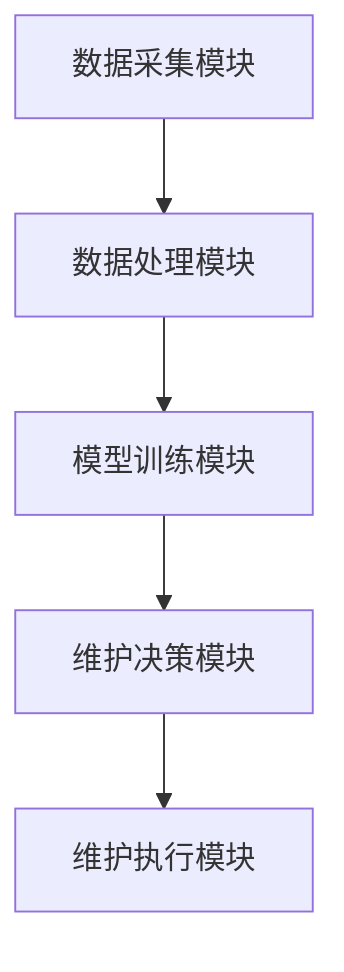

                 


# AI Agent在企业资产管理与预测性维护中的应用

## 关键词：AI Agent, 企业资产管理, 预测性维护, 机器学习, 深度学习, 时间序列分析

## 摘要：  
随着企业资产管理的复杂化和智能化需求的增加，AI Agent（人工智能代理）在企业资产管理与预测性维护中的应用越来越受到关注。本文详细探讨了AI Agent的核心概念、算法原理及其在预测性维护中的实际应用。通过分析企业资产管理的背景与挑战，结合AI Agent的技术优势，本文提出了基于机器学习和深度学习的预测性维护解决方案，并通过实际案例展示了AI Agent在提升企业资产管理效率和决策能力中的巨大潜力。

---

# 第一部分: AI Agent与企业资产管理概述

## 第1章: AI Agent与企业资产管理概述

### 1.1 企业资产管理的背景与挑战
#### 1.1.1 企业资产管理的基本概念  
企业资产管理（Enterprise Asset Management, EAM）是指对企业所有资产（包括设备、设施、技术等）进行规划、优化、维护和管理的过程。其目标是确保资产的高效利用、延长资产寿命并降低运营成本。  

#### 1.1.2 传统资产管理的痛点与不足  
传统资产管理模式存在以下问题：  
1. **数据孤岛**：各部门之间的数据分散，难以形成统一的资产视图。  
2. **维护滞后**：依赖人工检查和经验判断，导致维护效率低且可能出现突发故障。  
3. **成本高昂**：设备故障后的大修成本远高于预防性维护的成本。  
4. **数据利用率低**：缺乏对历史数据的深度分析，难以预测潜在问题。  

#### 1.1.3 AI Agent在资产管理中的潜在价值  
AI Agent（人工智能代理）是一种能够感知环境、自主决策并执行任务的智能系统。其在资产管理中的优势包括：  
1. **实时监控**：通过传感器和数据采集系统，实时分析设备状态。  
2. **预测性维护**：利用机器学习算法预测设备故障，提前安排维护计划。  
3. **优化资源分配**：基于数据分析，优化资产配置和维护资源的利用效率。  

---

### 1.2 预测性维护的基本概念  
#### 1.2.1 预测性维护的定义与特点  
预测性维护（Predictive Maintenance）是一种基于设备状态数据的维护策略，通过分析设备运行数据，预测设备的健康状态并提前采取维护措施，以避免设备故障。其特点包括：  
1. **数据驱动**：依赖传感器数据和历史维护记录。  
2. **预防性**：通过预测设备故障，减少突发故障的发生。  
3. **智能化**：结合AI技术，提高预测的准确性和效率。  

#### 1.2.2 预测性维护的实现方式  
预测性维护的主要实现方式包括：  
1. **基于机器学习的预测**：使用时间序列分析、回归分析等算法预测设备故障。  
2. **基于状态监测的实时分析**：通过传感器数据实时监控设备状态，触发维护警报。  
3. **基于规则的维护策略**：根据设备运行参数设置阈值，当参数超过阈值时触发维护。  

#### 1.2.3 预测性维护在企业中的应用现状  
当前，预测性维护已在制造业、能源行业等领域得到广泛应用。例如，制造业企业通过预测性维护减少了设备停机时间，提高了生产效率；能源行业通过预测性维护降低了设备故障率，保障了能源供应的稳定性。  

---

### 1.3 AI Agent在企业资产管理中的应用前景  
#### 1.3.1 AI Agent的核心能力与优势  
AI Agent在企业资产管理中的核心能力包括：  
1. **自主学习**：通过机器学习算法不断优化预测模型。  
2. **实时决策**：基于实时数据做出维护决策。  
3. **多任务处理**：能够同时处理多种任务，如设备监控、数据分析和维护调度。  

#### 1.3.2 预测性维护与AI Agent的结合  
AI Agent与预测性维护的结合主要体现在以下几个方面：  
1. **智能数据采集**：AI Agent通过传感器和物联网设备实时采集设备数据。  
2. **智能分析**：利用机器学习和深度学习算法分析设备数据，预测设备故障。  
3. **智能决策**：根据预测结果，自主触发维护任务或优化维护计划。  

#### 1.3.3 企业资产管理的智能化转型趋势  
随着AI技术的不断发展，企业资产管理的智能化转型已成为必然趋势。AI Agent作为智能化转型的核心技术之一，将在预测性维护、资产优化和决策支持等方面发挥越来越重要的作用。  

---

## 1.4 本章小结  
本章从企业资产管理的背景与挑战出发，介绍了AI Agent的核心概念和预测性维护的基本原理，分析了AI Agent在企业资产管理中的潜在价值和应用前景。通过本章的介绍，读者可以对AI Agent在企业资产管理中的作用有一个全面的认识。

---

# 第二部分: AI Agent的核心概念与原理

## 第2章: AI Agent的基本原理

### 2.1 AI Agent的定义与分类  
#### 2.1.1 AI Agent的定义  
AI Agent是一种能够感知环境、自主决策并执行任务的智能系统。它能够通过传感器、数据库或其他输入源获取信息，并根据目标和策略做出决策，从而实现特定的任务目标。  

#### 2.1.2 AI Agent的分类与特点  
AI Agent可以根据功能和应用场景分为以下几类：  
1. **基于规则的AI Agent**：通过预定义的规则进行决策，适用于任务简单、规则明确的场景。  
2. **基于机器学习的AI Agent**：通过机器学习算法学习历史数据，自适应地做出决策。  
3. **基于知识图谱的AI Agent**：通过知识图谱进行推理和决策，适用于复杂知识场景。  

#### 2.1.3 不同类型AI Agent的优缺点对比  
以下是不同类型AI Agent的优缺点对比：

| 类型          | 优点                            | 缺点                            |
|---------------|---------------------------------|---------------------------------|
| 基于规则的AI Agent | 实现简单，适用于规则明确的场景 | 灵活性差，难以应对复杂场景      |
| 基于机器学习的AI Agent | 灵活性高，能够自适应复杂场景   | 需要大量数据训练，计算资源消耗大 |
| 基于知识图谱的AI Agent | 知识推理能力强，适用于复杂场景 | 实现复杂，知识获取和维护成本高 |

---

### 2.2 AI Agent的核心技术  
#### 2.2.1 机器学习与深度学习  
机器学习和深度学习是AI Agent的核心技术之一，主要用于数据处理、模式识别和预测分析。例如，时间序列分析、回归分析和分类算法等技术广泛应用于预测性维护中。  

#### 2.2.2 自然语言处理  
自然语言处理（NLP）技术主要用于文本数据的分析和处理，例如从设备维护手册中提取知识。  

#### 2.2.3 计算机视觉  
计算机视觉技术主要用于图像和视频数据的分析，例如设备表面缺陷检测。  

---

### 2.3 AI Agent与预测性维护的关系  
#### 2.3.1 预测性维护中的数据处理  
预测性维护需要处理大量的设备运行数据，包括传感器数据、历史维护记录等。AI Agent通过数据清洗、特征提取和数据建模等步骤，对数据进行深度分析。  

#### 2.3.2 AI Agent在预测性维护中的角色  
AI Agent在预测性维护中扮演以下角色：  
1. **数据采集与处理**：实时采集设备数据并进行预处理。  
2. **模型训练与预测**：基于历史数据训练预测模型，并实时预测设备故障概率。  
3. **决策与执行**：根据预测结果，触发维护任务或优化维护计划。  

#### 2.3.3 预测性维护与企业资产管理的结合  
预测性维护通过AI Agent实现对企业资产的智能化管理，优化资产利用效率，降低维护成本，提升企业竞争力。  

---

### 2.4 本章小结  
本章详细介绍了AI Agent的基本原理和核心技术，分析了AI Agent在预测性维护中的角色和作用。通过本章的学习，读者可以理解AI Agent在企业资产管理中的技术基础和应用场景。

---

# 第三部分: AI Agent在预测性维护中的算法原理

## 第3章: 预测性维护的算法原理

### 3.1 预测性维护的常用算法  
#### 3.1.1 时间序列分析  
时间序列分析是一种基于历史数据预测未来趋势的方法。常用的时间序列模型包括ARIMA（自回归积分滑动平均模型）和LSTM（长短期记忆网络）。  

#### 3.1.2 基于机器学习的异常检测  
异常检测是一种通过识别数据中的异常值来发现潜在故障的方法。常用的算法包括Isolation Forest和One-Class SVM。  

#### 3.1.3 基于深度学习的故障预测  
深度学习模型（如LSTM和卷积神经网络）在故障预测中表现出色，能够捕捉设备运行中的复杂模式。  

---

### 3.2 时间序列分析的数学模型  
#### 3.2.1 ARIMA模型  
ARIMA模型是一种广泛应用于时间序列预测的线性模型。其基本公式为：  
$$ y_t = \phi y_{t-1} + \theta \epsilon_{t-1} + \epsilon_t $$  

#### 3.2.2 LSTM模型  
LSTM（长短期记忆网络）是一种特殊的RNN（循环神经网络），能够有效处理时间序列数据中的长距离依赖关系。其核心结构包括输入门、遗忘门和输出门。  

#### 3.2.3 Prophet模型  
Prophet模型是Facebook开源的一种时间序列预测模型，适用于业务时间序列数据的预测。其模型公式为：  
$$ y_t = \beta_t + \gamma_t + \delta_t $$  

---

### 3.3 机器学习算法的实现流程  
#### 3.3.1 数据预处理  
数据预处理是预测性维护的第一步，包括数据清洗、特征提取和数据标准化。  

#### 3.3.2 模型训练  
模型训练包括选择合适的算法、调整超参数和训练模型。  

#### 3.3.3 模型评估与优化  
模型评估通过交叉验证和性能指标（如准确率、召回率）进行，优化过程包括参数调优和模型集成。  

---

### 3.4 深度学习模型的实现流程  
#### 3.4.1 数据准备  
深度学习模型需要大量标注数据，数据准备包括数据清洗、增强和划分训练集和测试集。  

#### 3.4.2 模型构建  
模型构建包括选择网络结构（如LSTM）、定义损失函数（如交叉熵损失）和优化器（如Adam）。  

#### 3.4.3 模型训练与调优  
模型训练包括正则化、学习率调整和早停策略，以防止过拟合和优化性能。  

---

### 3.5 本章小结  
本章详细介绍了预测性维护中常用的算法及其数学模型，分析了机器学习和深度学习算法的实现流程。通过本章的学习，读者可以掌握预测性维护的核心技术及其在AI Agent中的应用。

---

# 第四部分: AI Agent在企业资产管理中的系统架构设计

## 第4章: 系统架构设计

### 4.1 系统功能设计  
#### 4.1.1 数据采集与管理  
系统需要实时采集设备运行数据，并进行数据清洗和存储。  

#### 4.1.2 模型训练与预测  
基于历史数据训练预测模型，并实时预测设备故障概率。  

#### 4.1.3 维护决策与执行  
根据预测结果，触发维护任务或优化维护计划。  

---

### 4.2 系统架构设计  
#### 4.2.1 系统功能模块  
系统主要功能模块包括：  
1. 数据采集模块：负责设备数据的采集和传输。  
2. 数据处理模块：进行数据清洗和特征提取。  
3. 模型训练模块：训练预测模型并实时预测。  
4. 维护决策模块：根据预测结果触发维护任务。  

#### 4.2.2 系统架构图  
以下是系统架构的Mermaid图：



---

### 4.3 系统接口设计  
#### 4.3.1 数据接口  
数据接口包括传感器接口和数据库接口，用于数据的采集和存储。  

#### 4.3.2 模型接口  
模型接口包括模型训练接口和预测接口，用于与外部系统的集成。  

---

### 4.4 系统交互流程  
#### 4.4.1 系统交互流程图  
以下是系统交互的Mermaid序列图：

```mermaid
sequenceDiagram
    participant 用户
    participant 系统
    participant 数据采集模块
    participant 维护决策模块
    用户->系统: 请求设备状态
    系统->数据采集模块: 获取设备数据
    数据采集模块->系统: 返回设备数据
    系统->维护决策模块: 分析设备数据
    维护决策模块->系统: 返回预测结果
    用户<-系统: 显示预测结果
```

---

### 4.5 本章小结  
本章从系统功能设计、架构设计和接口设计三个方面，详细介绍了AI Agent在企业资产管理中的系统架构设计。通过本章的学习，读者可以理解AI Agent在企业资产管理中的技术实现和系统结构。

---

# 第五部分: AI Agent在企业资产管理中的项目实战

## 第5章: 项目实战

### 5.1 项目背景与目标  
#### 5.1.1 项目背景  
某制造企业希望利用AI Agent实现设备的预测性维护，降低设备故障率和维护成本。  

#### 5.1.2 项目目标  
1. 实现设备运行数据的实时采集和分析。  
2. 基于机器学习算法预测设备故障。  
3. 自动触发维护任务并优化维护计划。  

---

### 5.2 核心代码实现  
#### 5.2.1 数据采集与处理  
以下是数据采集模块的Python代码示例：

```python
import pandas as pd
import numpy as np
import requests

def collect_data(api_url):
    try:
        response = requests.get(api_url)
        data = response.json()
        return pd.DataFrame(data)
    except Exception as e:
        print(f"数据采集失败：{e}")
        return None
```

#### 5.2.2 模型训练与预测  
以下是基于LSTM的预测模型代码示例：

```python
from tensorflow.keras.models import Sequential
from tensorflow.keras.layers import LSTM, Dense

model = Sequential()
model.add(LSTM(64, input_shape=(timesteps, features)))
model.add(Dense(1))
model.compile(loss='mean_squared_error', optimizer='adam')
model.fit(X_train, y_train, epochs=100, batch_size=32)
```

---

### 5.3 实际案例分析  
#### 5.3.1 案例背景  
某制造企业的设备运行数据如下：  

| 时间       | 设备A状态 | 设备B状态 | ... |
|------------|-----------|-----------|-----|
| 2023-01-01 | 正常       | 正常       | ... |
| 2023-01-02 | 正常       | 异常       | ... |
| ...         | ...        | ...        | ... |

#### 5.3.2 案例分析  
通过AI Agent对设备运行数据进行分析，预测设备B将在2023-01-10出现故障，并触发维护任务。  

---

### 5.4 项目小结  
通过本项目，读者可以掌握AI Agent在预测性维护中的实际应用，包括数据采集、模型训练和系统实现等关键步骤。  

---

# 第六部分: 总结与展望

## 第6章: 总结与展望

### 6.1 总结  
本文详细探讨了AI Agent在企业资产管理与预测性维护中的应用，介绍了AI Agent的核心概念、算法原理和系统架构设计，并通过实际案例展示了AI Agent在预测性维护中的应用价值。  

### 6.2 展望  
随着AI技术的不断发展，AI Agent在企业资产管理中的应用前景广阔。未来，AI Agent可以通过与物联网、区块链等技术的结合，进一步提升企业资产管理的智能化水平。  

---

## 作者：AI天才研究院/AI Genius Institute & 禅与计算机程序设计艺术 /Zen And The Art of Computer Programming

