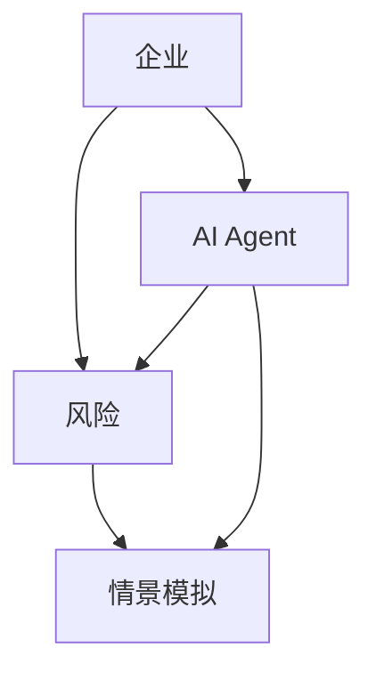
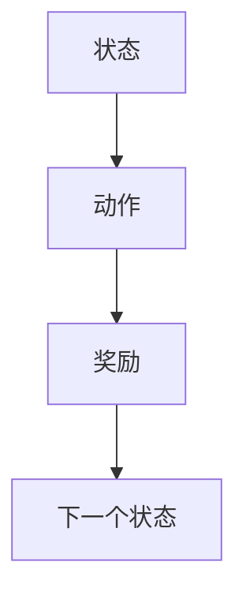
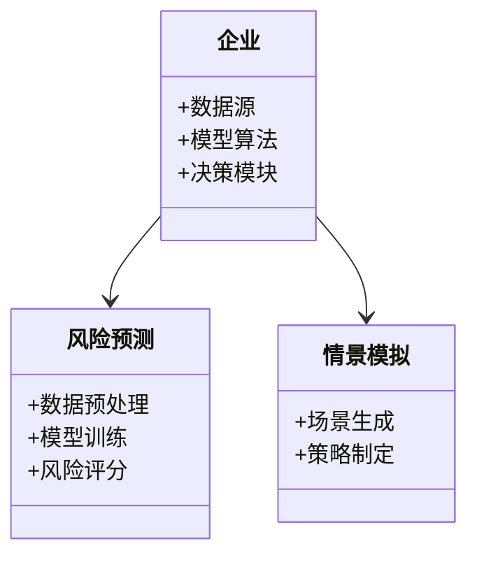
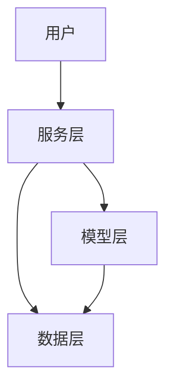
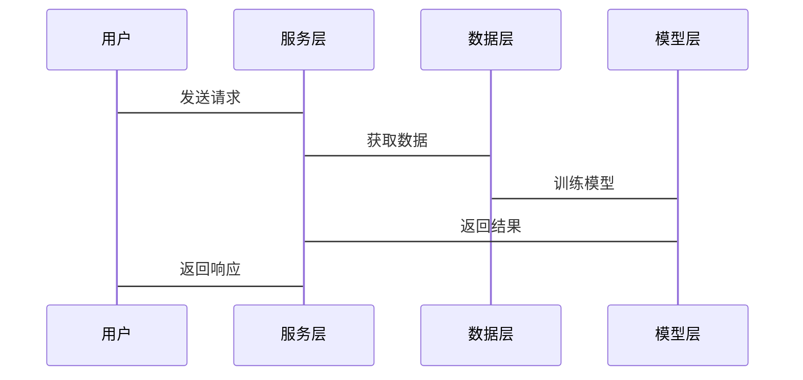

                 


# AI Agent在企业风险预测与情景模拟中的应用

## 关键词：AI Agent, 企业风险管理, 风险预测, 情景模拟, 人工智能, 加强学习, 数学模型

## 摘要：
本文深入探讨AI Agent在企业风险预测与情景模拟中的应用，从基础概念到算法原理，再到系统架构和项目实战，全面解析其在企业风险管理中的核心作用。通过详细的技术分析和实际案例，揭示AI Agent如何助力企业实现更高效、更精准的风险管理。

---

# 第一部分: AI Agent 的基础与核心概念

## 第1章: 企业风险预测与情景模拟的背景

### 1.1 问题背景与问题描述

#### 1.1.1 企业风险管理的传统挑战
企业在经营过程中面临诸多不确定性，如市场波动、供应链中断、政策变化等。传统风险管理方法依赖人工分析，存在效率低、覆盖面有限、预测精度不足等问题。

#### 1.1.2 AI Agent 在风险管理中的作用
AI Agent（人工智能代理）能够实时感知企业内外部环境变化，通过数据驱动的方式，帮助企业识别潜在风险并制定应对策略。

#### 1.1.3 风险预测与情景模拟的定义与外延
- **风险预测**：利用历史数据和机器学习模型，预测未来可能发生的风险事件及其概率。
- **情景模拟**：构建多种可能的未来场景，分析不同场景对企业的影响，并制定应对策略。

### 1.2 问题解决与边界

#### 1.2.1 AI Agent 在风险预测中的解决方案
AI Agent通过实时数据采集、分析和决策，帮助企业在风险发生前采取预防措施。

#### 1.2.2 AI Agent 的边界与应用范围
- **边界**：AI Agent主要用于数据驱动的决策支持，而非完全替代人类判断。
- **应用范围**：涵盖企业运营的各个环节，包括市场风险、信用风险、操作风险等。

#### 1.2.3 核心概念与要素组成
- 核心概念：实时数据采集、机器学习模型、决策优化。
- 要素组成：数据源、模型算法、决策模块、反馈机制。

## 第2章: AI Agent 的核心概念与联系

### 2.1 核心概念原理

#### 2.1.1 AI Agent 的定义与特征
AI Agent是一种能够感知环境并采取行动以实现目标的智能实体。其核心特征包括自主性、反应性、目标导向和学习能力。

#### 2.1.2 风险预测与情景模拟的核心要素
- 数据采集：实时收集企业内外部数据。
- 模型构建：基于机器学习算法构建风险预测模型。
- 情景生成：通过模拟生成多种可能的未来场景。

#### 2.1.3 AI Agent 在企业中的应用场景
- 市场风险预测：预测市场波动对企业的影响。
- 供应链优化：通过情景模拟优化供应链布局。
- 竞争对手分析：预测竞争对手的可能动作。

### 2.2 核心概念对比表

| 比较维度         | 传统算法             | AI Agent 模型          |
|------------------|----------------------|-----------------------|
| 数据需求         | 需大量标注数据       | 适应非结构化数据       |
| 决策方式         | 基于规则或统计模型   | 基于目标优化和学习     |
| 处理速度         | 较慢                | 实时响应               |

### 2.3 ER 实体关系图



---

# 第二部分: AI Agent 的算法原理与数学模型

## 第3章: AI Agent 的算法原理

### 3.1 强化学习算法

#### 3.1.1 算法流程
强化学习是一种通过试错机制来优化决策的算法。其基本流程如下：

1. 状态感知：AI Agent感知当前环境状态。
2. 动作选择：基于当前状态选择一个动作。
3. 奖励反馈：执行动作后，获得环境的奖励或惩罚。
4. 状态更新：进入下一个状态，并重复上述过程。



#### 3.1.2 Python 实现示例
```python
class Agent:
    def __init__(self, state_space, action_space):
        self.state_space = state_space
        self.action_space = action_space
        self.q_table = {}  # Q-learning 表

    def take_action(self, state):
        if state not in self.q_table:
            self.q_table[state] = 0
        # 根据当前状态选择动作
        action = self.action_space[0]  # 默认选择第一个动作
        return action

    def update_q_value(self, state, action, reward, next_state):
        # 更新Q值
        self.q_table[(state, action)] = reward + 0.95 * max(
            self.q_table.get((next_state, a), 0) for a in self.action_space
        )
```

#### 3.1.3 算法原理的数学模型
强化学习的核心是通过最大化累计奖励来优化策略。其数学模型如下：

$$ Q(s, a) = Q(s, a) + \alpha (r + \gamma \max Q(s', a') - Q(s, a)) $$

其中：
- \( Q(s, a) \)：状态 \( s \) 下采取动作 \( a \) 的价值。
- \( \alpha \)：学习率。
- \( \gamma \)：折扣因子。
- \( r \)：奖励。

---

## 第4章: 风险预测的数学模型

### 4.1 风险预测模型

#### 4.1.1 贝叶斯网络模型
贝叶斯网络是一种基于概率论的图形化模型，适用于风险因素之间的依赖关系分析。

$$ P(R | D) = \frac{P(D | R) P(R)}{P(D)} $$

其中：
- \( R \)：风险事件。
- \( D \)：相关数据。

#### 4.1.2 时间序列分析模型
时间序列分析模型（如ARIMA模型）适用于预测随时间变化的风险因素。

$$ ARIMA(p, d, q) $$

其中：
- \( p \)：自回归阶数。
- \( d \)：差分阶数。
- \( q \)：移动平均阶数。

---

# 第三部分: 系统分析与架构设计方案

## 第5章: 系统分析与架构设计方案

### 5.1 问题场景介绍

#### 5.1.1 企业风险管理场景
企业面临市场波动、供应链中断等风险，需要实时监测并制定应对策略。

### 5.2 系统功能设计

#### 5.2.1 领域模型


### 5.3 系统架构设计

#### 5.3.1 架构图


### 5.4 系统接口设计

#### 5.4.1 API 接口
- 风险预测接口：`POST /api/risk_prediction`
- 情景模拟接口：`POST /api情景_simulation`

### 5.5 系统交互流程图



---

# 第四部分: 项目实战

## 第6章: 项目实战

### 6.1 环境安装

#### 6.1.1 安装 Python 和相关库
- 安装 Python 3.8+
- 安装库：`numpy`, `pandas`, `scikit-learn`, `tensorflow`

#### 6.1.2 安装工具
- 安装 `mermaid-cli` 用于生成图表。

### 6.2 系统核心实现源代码

#### 6.2.1 风险预测模型实现
```python
import numpy as np
from sklearn.ensemble import RandomForestRegressor

class RiskPrediction:
    def __init__(self, features, target):
        self.features = features
        self.target = target
        self.model = RandomForestRegressor()

    def train(self, data):
        self.model.fit(data[self.features], data[self.target])
        return self.model

    def predict(self, new_data):
        return self.model.predict(new_data[self.features])
```

#### 6.2.2 情景模拟实现
```python
import numpy as np
import matplotlib.pyplot as plt

def scenario_simulation(initial_state, steps=100):
    states = [initial_state]
    for _ in range(steps):
        # 假设一个简单的随机波动模型
        next_state = states[-1] * 1.1 + np.random.normal(0, 0.1)
        states.append(next_state)
    plt.plot(states)
    plt.show()
```

### 6.3 代码应用解读与分析

#### 6.3.1 风险预测模型解读
- 使用随机森林回归模型进行风险预测。
- 输入：企业历史数据。
- 输出：风险评分。

#### 6.3.2 情景模拟解读
- 通过随机过程模拟未来可能的市场波动。
- 输出：多条可能的市场波动曲线。

### 6.4 实际案例分析

#### 6.4.1 案例分析
某企业使用AI Agent进行市场风险预测，通过历史数据分析预测出未来三个月内的市场波动，并模拟了三种可能的市场情况，制定了相应的应对策略。

#### 6.4.2 数据分析与优化
通过分析模型预测结果与实际风险事件的匹配度，不断优化模型参数，提升预测精度。

### 6.5 项目小结

#### 6.5.1 项目总结
通过AI Agent实现企业风险预测与情景模拟，显著提升了企业的风险管理能力。

#### 6.5.2 经验总结
- 数据质量对模型性能影响重大。
- 模型需要不断更新以适应新的数据和环境变化。

---

# 第五部分: 最佳实践

## 第7章: 最佳实践

### 7.1 小结

#### 7.1.1 核心内容总结
本文详细介绍了AI Agent在企业风险预测与情景模拟中的应用，从算法原理到系统架构，再到项目实战，全面解析了其在企业风险管理中的重要作用。

### 7.2 注意事项

#### 7.2.1 数据隐私与安全
在使用AI Agent进行风险预测时，需注意数据隐私和安全问题。

#### 7.2.2 模型解释性
复杂的模型可能难以解释，需在模型选择时考虑其可解释性。

### 7.3 拓展阅读

#### 7.3.1 推荐书籍
- 《强化学习：理论与应用》
- 《贝叶斯网络：原理与实践》

#### 7.3.2 推荐博客
- [AI Agent 技术博客](https://example.com)
- [风险管理与机器学习](https://example.com/risk-management)

---

# 作者

**作者：AI天才研究院/AI Genius Institute & 禅与计算机程序设计艺术 /Zen And The Art of Computer Programming**

