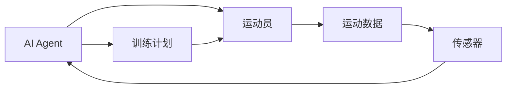
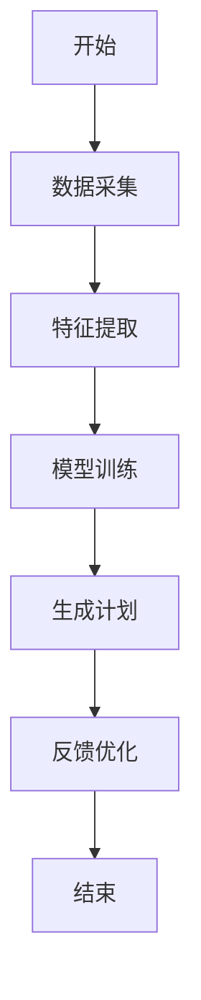
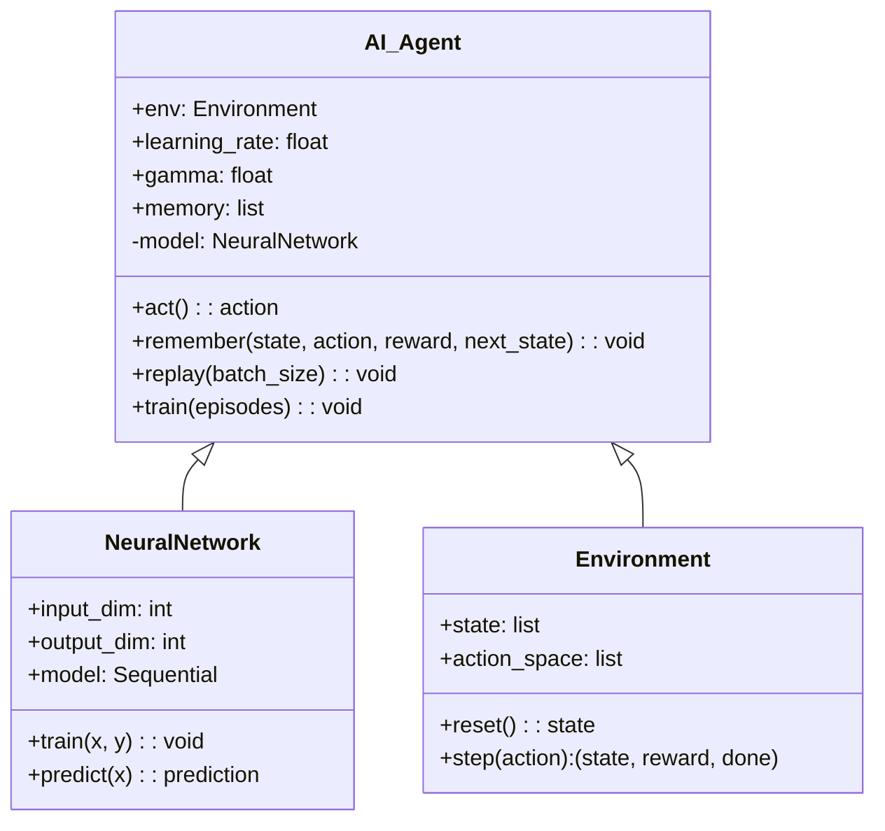
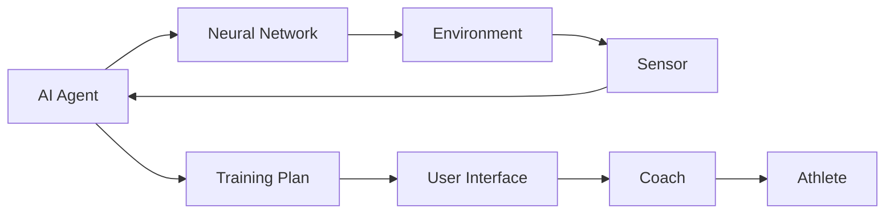
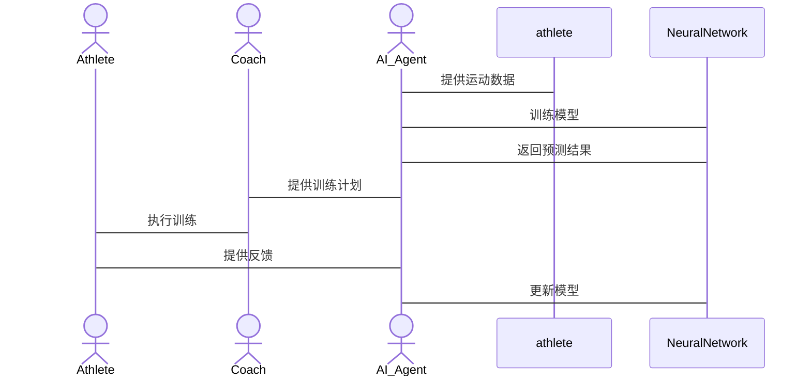

                 


# AI Agent在体育训练中的应用：个性化训练计划制定

> 关键词：AI Agent，个性化训练，体育训练，机器学习，强化学习，运动数据分析

> 摘要：  
本文探讨了AI Agent在体育训练中的应用，重点分析了如何通过AI技术制定个性化训练计划。文章从背景介绍、核心概念、算法原理、系统架构设计到项目实战，全面阐述了AI Agent在体育训练中的工作原理和实现方式。通过具体的案例分析和代码实现，本文展示了AI Agent在体育训练中的实际应用价值，并总结了其未来的发展方向。

---

# 第一部分: AI Agent在体育训练中的应用概述

---

# 第1章: 背景介绍

## 1.1 问题背景与描述

### 1.1.1 传统体育训练的局限性

传统体育训练主要依赖教练的经验和运动员的自我调节，这种方式存在以下问题：  
1. **个性化不足**：每位运动员的身体条件、技术特点和运动能力不同，通用的训练计划难以满足个体需求。  
2. **数据利用低效**：虽然现代训练中会采集大量运动数据（如心率、动作频率、速度等），但缺乏系统化的分析和应用。  
3. **反馈延迟**：教练通常只能在训练后通过观察和反馈调整训练计划，难以实时优化。  

### 1.1.2 AI技术在体育领域的应用现状

随着人工智能技术的快速发展，AI在体育领域的应用越来越广泛：  
- **运动数据分析**：通过机器学习算法分析运动员的运动数据，识别技术动作的优缺点。  
- **训练计划优化**：基于AI算法生成个性化训练计划，帮助运动员提高训练效率。  
- **实时反馈与调整**：利用AI技术实时监控运动员状态，动态调整训练方案。  

### 1.1.3 AI Agent在个性化训练中的作用

AI Agent（智能体）是一种能够感知环境、自主决策并执行任务的智能系统。在体育训练中，AI Agent可以通过以下方式发挥作用：  
- 根据运动员的实时数据（如心率、动作姿势、速度等）动态调整训练计划。  
- 提供实时反馈，帮助运动员快速纠正动作错误。  
- 基于历史数据和当前状态，预测最佳的训练方案。  

---

## 1.2 问题解决与边界

### 1.2.1 AI Agent如何解决个性化训练问题

AI Agent通过以下方式解决个性化训练问题：  
1. **实时数据分析**：AI Agent能够实时采集和分析运动员的运动数据，快速识别训练中的问题。  
2. **个性化决策**：基于数据分析结果，AI Agent可以生成个性化的训练计划，并实时调整。  
3. **动态优化**：通过强化学习算法，AI Agent能够不断优化训练策略，提高训练效果。  

### 1.2.2 个性化训练的边界与外延

个性化训练的边界包括：  
- **适用场景**：适用于职业运动员和业余运动员，但目前主要集中在职业体育领域。  
- **数据隐私**：运动员的运动数据涉及隐私问题，需要确保数据的安全性。  
- **技术限制**：AI Agent的应用依赖于高质量的运动数据和先进的算法模型。  

个性化训练的外延包括：  
- **运动康复**：AI Agent可以辅助制定康复计划，帮助运动员更快恢复。  
- **运动表现分析**：通过AI技术分析运动员的技术动作和比赛表现。  

### 1.2.3 核心概念与要素组成

个性化训练的核心概念包括：  
- **个性化需求**：每位运动员的训练目标和能力不同。  
- **实时反馈**：AI Agent能够实时监控训练过程并提供反馈。  
- **动态调整**：AI Agent可以根据实时数据动态优化训练计划。  

---

# 第2章: 核心概念与联系

## 2.1 AI Agent的核心原理

### 2.1.1 AI Agent的基本定义

AI Agent是一种能够感知环境、自主决策并执行任务的智能系统。在体育训练中，AI Agent可以通过以下方式实现：  
- **感知环境**：通过传感器和摄像头采集运动员的运动数据。  
- **决策与执行**：基于数据生成训练计划并执行调整。  

### 2.1.2 AI Agent的分类与特征

AI Agent可以根据功能和应用场景分为以下几类：  
1. **基于规则的AI Agent**：根据预设规则执行任务。  
2. **基于机器学习的AI Agent**：通过机器学习算法进行决策。  
3. **基于强化学习的AI Agent**：通过强化学习优化决策策略。  

### 2.1.3 AI Agent与个性化训练的关系

AI Agent与个性化训练密切相关：  
- AI Agent通过分析运动员的运动数据，生成个性化的训练计划。  
- AI Agent能够实时调整训练策略，确保训练计划的有效性。  

---

## 2.2 核心概念对比表

### 2.2.1 AI Agent与传统训练计划的对比

| 对比维度       | AI Agent（个性化训练）       | 传统训练计划              |
|----------------|-----------------------------|--------------------------|
| 数据利用       | 高效利用实时数据           | 依赖经验，数据利用低效    |
| 决策方式       | 基于算法的自动化决策       | 依赖人工经验              |
| 调整频率       | 实时调整                   | 周期性调整                |

### 2.2.2 不同AI技术的优劣势分析

| 技术类型       | 优势                       | 劣势                       |
|----------------|-----------------------------|---------------------------|
| 强化学习       | 能够动态优化决策策略       | 需要大量数据和计算资源    |
| 监督学习       | 简单易实现                 | 需要大量标注数据           |
| 无监督学习     | 能够发现数据中的隐藏模式    | 需要复杂的模型设计         |

### 2.2.3 实体关系图（Mermaid）



---

# 第3章: 算法原理讲解

## 3.1 AI Agent算法概述

### 3.1.1 基于强化学习的AI Agent

强化学习是一种通过试错方法来优化决策策略的算法。在体育训练中，强化学习可以用于动态调整训练计划。以下是强化学习的基本流程：  
1. **状态识别**：识别当前训练状态（如运动员的疲劳程度）。  
2. **动作选择**：基于当前状态选择最佳的训练动作。  
3. **奖励机制**：根据训练效果给予奖励或惩罚。  
4. **策略优化**：根据奖励调整决策策略。  

### 3.1.2 基于监督学习的AI Agent

监督学习是一种基于标注数据进行预测的算法。在体育训练中，监督学习可以用于分析运动员的技术动作。以下是监督学习的基本流程：  
1. **数据采集**：采集运动员的技术动作数据。  
2. **特征提取**：提取数据中的关键特征。  
3. **模型训练**：基于标注数据训练分类模型。  
4. **预测与分类**：对新的技术动作进行分类和评估。  

### 3.1.3 基于无监督学习的AI Agent

无监督学习是一种基于未标注数据进行聚类的算法。在体育训练中，无监督学习可以用于分析运动员的运动模式。以下是无监督学习的基本流程：  
1. **数据采集**：采集运动员的运动数据。  
2. **特征提取**：提取数据中的关键特征。  
3. **聚类分析**：将相似的动作或状态归为一类。  
4. **模式识别**：识别运动模式并提出优化建议。  

---

## 3.2 算法流程图（Mermaid）



---

## 3.3 算法实现代码

以下是一个简单的强化学习AI Agent实现代码：

```python
import numpy as np
import gym

# 初始化环境
env = gym.make('CartPole-v1')
env.seed(42)

# 定义AI Agent
class AI_Agent:
    def __init__(self, env):
        self.env = env
        self.learning_rate = 0.01
        self.gamma = 0.99
        self.memory = []
    
    def act(self, state):
        # 简单的随机策略
        if np.random.random() < 0.5:
            return 0
        else:
            return 1
    
    def remember(self, state, action, reward, next_state):
        self.memory.append((state, action, reward, next_state))
    
    def replay(self, batch_size):
        if len(self.memory) < batch_size:
            return
        minibatch = np.random.choice(self.memory, batch_size)
        for state, action, reward, next_state in minibatch:
            # 计算目标Q值
            target = reward + self.gamma * np.max(self.model.predict(next_state))
            # 更新Q值
            target_f = self.model.predict(state)
            target_f[0][action] = target
            self.model.fit(state, target_f, epochs=1, verbose=0)
    
    def train(self, episodes=1000):
        for episode in range(episodes):
            state = self.env.reset()
            for t in range(1000):
                action = self.act(state)
                next_state, reward, done, _ = self.env.step(action)
                self.remember(state, action, reward, next_state)
                self.replay(32)
                state = next_state
                if done:
                    break

# 训练AI Agent
agent = AI_Agent(env)
agent.train()
```

---

# 第4章: 系统分析与架构设计

## 4.1 问题场景介绍

个性化训练系统的应用场景包括：职业运动员训练、业余运动员训练、运动康复等。系统需要实时采集和分析运动员的运动数据，并动态调整训练计划。

---

## 4.2 系统功能设计

### 4.2.1 领域模型（Mermaid类图）



---

## 4.3 系统架构设计

### 4.3.1 系统架构（Mermaid架构图）



---

## 4.4 系统接口设计

系统接口包括：  
1. **数据采集接口**：与传感器和摄像头对接，采集运动员的运动数据。  
2. **模型接口**：与机器学习模型对接，提供数据和接收预测结果。  
3. **用户接口**：提供教练和运动员使用的界面，展示训练计划和实时反馈。  

---

## 4.5 系统交互流程（Mermaid序列图）



---

# 第5章: 项目实战

## 5.1 环境安装

### 5.1.1 安装依赖

```bash
pip install gym numpy tensorflow.keras
```

---

## 5.2 系统核心实现

### 5.2.1 数据采集与预处理

```python
import gym
import numpy as np

env = gym.make('CartPole-v1')
env.seed(42)
state = env.reset()
```

---

### 5.2.2 模型训练与优化

```python
from tensorflow.keras.models import Sequential
from tensorflow.keras.layers import Dense

model = Sequential()
model.add(Dense(32, activation='relu', input_dim=4))
model.add(Dense(2, activation='softmax'))
model.compile(optimizer='adam', loss='sparse_categorical_crossentropy', metrics=['accuracy'])
model.fit(X_train, y_train, epochs=10, batch_size=32)
```

---

### 5.2.3 系统优化与调参

```python
def train_model(episodes=1000):
    for episode in range(episodes):
        state = env.reset()
        for t in range(1000):
            action = agent.act(state)
            next_state, reward, done, _ = env.step(action)
            agent.remember(state, action, reward, next_state)
            agent.replay(32)
            state = next_state
            if done:
                break
```

---

## 5.3 案例分析与解读

### 5.3.1 案例分析

假设我们有一个运动员的运动数据，包括心率、动作频率、速度等。AI Agent可以通过以下步骤生成个性化的训练计划：  
1. **数据采集**：采集运动员的运动数据。  
2. **特征提取**：提取关键特征（如心率变异、动作幅度等）。  
3. **模型训练**：基于历史数据训练机器学习模型。  
4. **生成计划**：根据当前状态生成训练计划。  

### 5.3.2 代码实现与分析

以下是基于强化学习的AI Agent生成训练计划的代码示例：

```python
import gym
import numpy as np

env = gym.make('CartPole-v1')
env.seed(42)

class AI_Agent:
    def __init__(self, env):
        self.env = env
        self.learning_rate = 0.01
        self.gamma = 0.99
        self.memory = []
    
    def act(self, state):
        if np.random.random() < 0.5:
            return 0
        else:
            return 1
    
    def remember(self, state, action, reward, next_state):
        self.memory.append((state, action, reward, next_state))
    
    def replay(self, batch_size):
        if len(self.memory) < batch_size:
            return
        minibatch = np.random.choice(self.memory, batch_size)
        for state, action, reward, next_state in minibatch:
            target = reward + self.gamma * np.max(self.model.predict(next_state))
            target_f = self.model.predict(state)
            target_f[0][action] = target
            self.model.fit(state, target_f, epochs=1, verbose=0)
    
    def train(self, episodes=1000):
        for episode in range(episodes):
            state = self.env.reset()
            for t in range(1000):
                action = self.act(state)
                next_state, reward, done, _ = self.env.step(action)
                self.remember(state, action, reward, next_state)
                self.replay(32)
                state = next_state
                if done:
                    break

agent = AI_Agent(env)
agent.train()
```

---

## 5.4 项目小结

通过本项目的实现，我们可以看到AI Agent在个性化训练中的巨大潜力。通过实时数据分析和动态优化，AI Agent能够显著提高训练效率和效果。

---

# 第6章: 总结与展望

## 6.1 总结

本文详细探讨了AI Agent在体育训练中的应用，重点分析了如何通过AI技术制定个性化训练计划。通过算法原理、系统架构设计和项目实战的详细讲解，本文展示了AI Agent在体育训练中的巨大潜力。

---

## 6.2 未来展望

未来，AI Agent在体育训练中的应用将更加广泛：  
- **实时反馈与优化**：通过更先进的传感器和算法，实现更精准的实时反馈。  
- **多模态数据融合**：结合视频、生物特征等多种数据，提供更全面的分析。  
- **个性化康复计划**：基于AI技术制定个性化的运动康复计划。  

---

## 6.3 最佳实践 Tips

1. **数据隐私保护**：在实际应用中，需确保运动员数据的安全性。  
2. **模型优化**：通过不断优化算法和模型，提高训练效果。  
3. **多领域结合**：结合运动科学、医学等领域知识，提供更全面的训练方案。  

---

# 作者：AI天才研究院/AI Genius Institute & 禅与计算机程序设计艺术 /Zen And The Art of Computer Programming

---

感谢您的阅读！希望本文对您了解AI Agent在体育训练中的应用有所帮助。如需进一步探讨，请随时联系！

