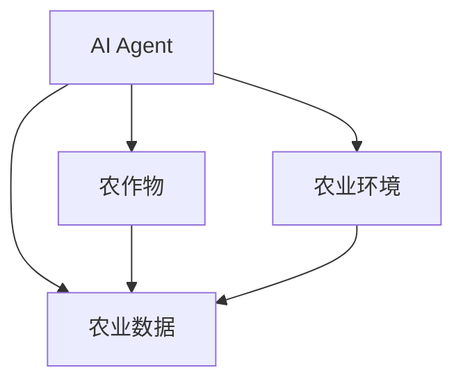
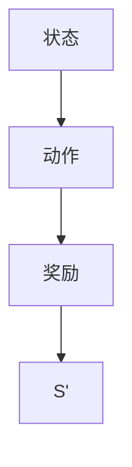
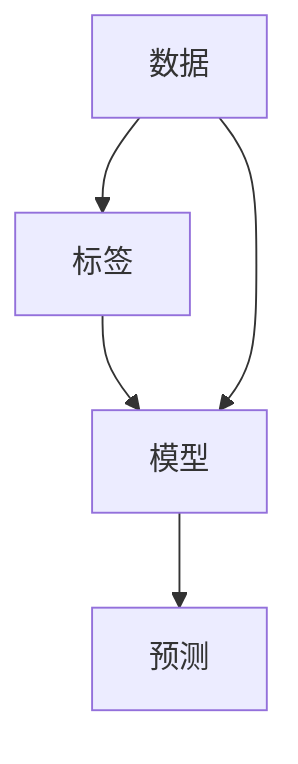
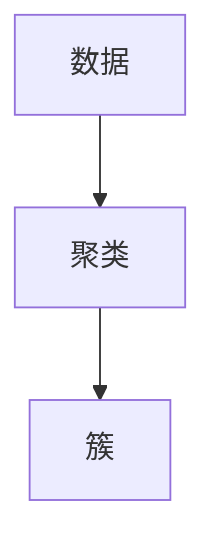
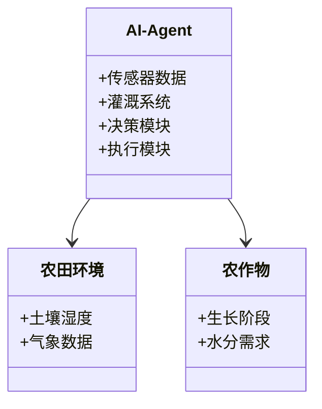
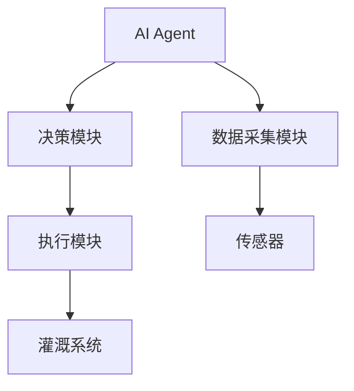
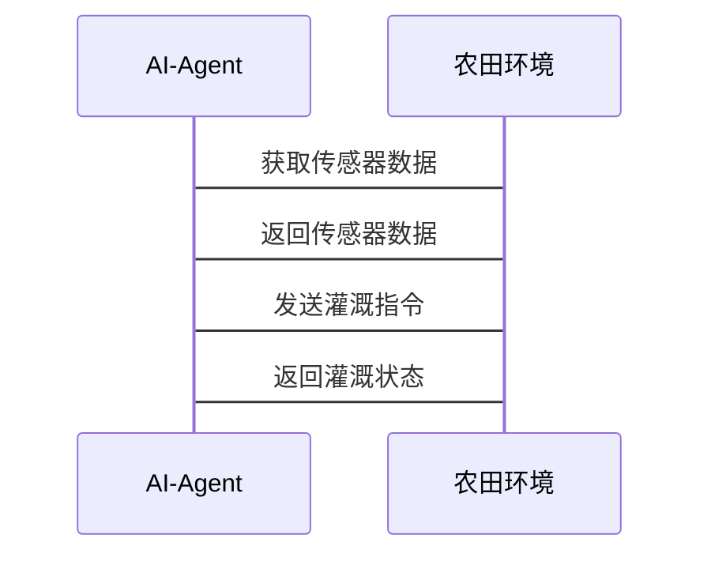

                 


# AI Agent在农业中的应用与前景

> 关键词：AI Agent, 农业智能化, 人工智能算法, 农业数据, 智能农业系统

> 摘要：AI Agent作为一种智能化的农业解决方案，正在逐步改变传统农业的生产方式。本文将从AI Agent的基本概念出发，深入探讨其在农业中的应用场景、算法原理、系统架构以及实际项目案例。通过分析这些内容，我们将揭示AI Agent在农业中的巨大潜力，为未来的农业智能化发展提供有价值的参考。

---

## 第1章：AI Agent的基本概念与背景

### 1.1 AI Agent的定义与特点

AI Agent（人工智能代理）是一种能够感知环境、做出决策并执行动作的智能系统。与传统的自动化系统不同，AI Agent具备学习和适应能力，能够根据环境变化动态调整其行为。

#### 1.1.1 AI Agent的基本定义

AI Agent可以看作是一个智能体，它通过传感器感知环境信息，利用算法进行分析和决策，并通过执行器对外界产生影响。AI Agent的核心目标是帮助人类完成特定任务，提高效率和准确性。

#### 1.1.2 AI Agent的核心特点

- **自主性**：AI Agent能够在没有人工干预的情况下独立运行。
- **反应性**：能够实时感知环境变化并做出反应。
- **学习能力**：通过数据和经验不断优化自身的算法和决策能力。
- **适应性**：能够根据环境变化调整自身的行为策略。

#### 1.1.3 AI Agent与传统自动化系统的区别

传统自动化系统通常基于固定的规则运行，而AI Agent具备学习和适应能力，能够应对复杂和不确定的环境。例如，在农业中，传统灌溉系统可能基于固定的天气预报运行，而AI Agent可以根据实时天气数据和土壤湿度动态调整灌溉策略。

### 1.2 农业中的问题背景

#### 1.2.1 农业生产中的主要问题

传统农业面临以下主要问题：

1. **资源浪费**：例如过度灌溉导致水资源浪费。
2. **效率低下**：人工操作效率低，难以满足大规模生产需求。
3. **环境问题**：传统农业方式可能导致土壤退化和环境污染。
4. **劳动力不足**：随着人口老龄化，农业劳动力短缺问题日益严重。

#### 1.2.2 传统农业的局限性

传统农业主要依赖人工操作和简单的机械工具，这种方式效率低下且难以应对复杂的环境变化。例如，在作物病虫害防治方面，传统方法需要人工巡查和处理，效率较低且容易遗漏问题。

#### 1.2.3 AI Agent在农业中的潜在价值

AI Agent可以通过智能化的感知和决策，帮助农民实现精准农业。例如，AI Agent可以通过无人机和传感器实时监测农田环境，分析作物生长状况，并自动调整灌溉和施肥策略，从而提高农业生产效率，降低成本。

### 1.3 AI Agent在农业中的应用前景

#### 1.3.1 农业智能化的发展趋势

随着人工智能技术的快速发展，农业智能化已经成为未来农业发展的主要趋势。AI Agent作为农业智能化的核心技术，将在未来的农业生产中发挥重要作用。

#### 1.3.2 AI Agent在农业中的应用场景

AI Agent在农业中的应用场景包括：

1. **精准农业**：通过实时监测农田环境，实现精准灌溉和施肥。
2. **智能监控**：利用无人机和传感器实时监控作物生长情况，及时发现病虫害。
3. **自动化管理**：通过AI Agent自动调整农业设备，优化生产流程。

#### 1.3.3 技术进步对农业AI Agent的推动

近年来，人工智能技术的快速发展为AI Agent在农业中的应用提供了强有力的技术支持。例如，深度学习算法的进步使得AI Agent能够更准确地识别作物病虫害，自然语言处理技术的发展使得AI Agent能够与农民进行更自然的交互。

---

## 第2章：AI Agent的核心概念与联系

### 2.1 AI Agent的核心原理

AI Agent的核心原理包括感知、决策和执行三个主要模块。

#### 2.1.1 AI Agent的感知模块

感知模块是AI Agent获取环境信息的关键部分，主要包括传感器和数据采集设备。例如，在农业中，AI Agent可以通过无人机上的摄像头和传感器获取农田的实时图像和环境数据。

#### 2.1.2 AI Agent的决策模块

决策模块是AI Agent的核心部分，负责根据感知到的信息做出决策。例如，在作物病虫害识别中，AI Agent可以通过机器学习算法分析图像数据，识别出病虫害的位置和类型。

#### 2.1.3 AI Agent的执行模块

执行模块是AI Agent对外界产生影响的部分，主要包括执行器和农业设备。例如，在识别出病虫害后，AI Agent可以通过无人机喷洒农药，实现精准防治。

### 2.2 AI Agent与农业要素的关系

#### 2.2.1 农作物与AI Agent的关系

AI Agent通过感知和分析作物的生长状态，帮助农民实现精准管理。例如，AI Agent可以根据作物的生长阶段和环境条件，自动调整灌溉和施肥策略。

#### 2.2.2 农业环境与AI Agent的关系

AI Agent通过感知农田的环境信息（如温度、湿度、光照等），优化农业生产条件。例如，AI Agent可以通过实时监测土壤湿度，自动调整灌溉系统的工作状态。

#### 2.2.3 农业数据与AI Agent的关系

AI Agent通过分析农业数据，优化农业生产决策。例如，AI Agent可以通过分析历史气象数据和土壤数据，预测作物的生长趋势，帮助农民制定种植计划。

### 2.3 AI Agent的核心概念联系图

以下是AI Agent与农业要素的关系图：



---

## 第3章：AI Agent的算法原理与数学模型

### 3.1 AI Agent的核心算法

AI Agent的核心算法包括强化学习、监督学习和聚类算法。

#### 3.1.1 强化学习算法

强化学习是一种通过试错机制优化决策的算法。例如，在农业中，AI Agent可以通过强化学习算法，根据实时环境信息优化灌溉策略。

以下是强化学习算法的流程图：



#### 3.1.2 监督学习算法

监督学习是一种基于标注数据进行分类或回归的算法。例如，在作物病虫害识别中，AI Agent可以通过监督学习算法，基于标注的病虫害图像数据，识别出病虫害的位置和类型。

以下是监督学习算法的流程图：



#### 3.1.3 聚类算法

聚类算法是一种将数据分成若干簇的算法。例如，在农业中，AI Agent可以通过聚类算法，将相似的土壤数据分成若干组，帮助农民优化施肥策略。

以下是聚类算法的流程图：



### 3.2 AI Agent的数学模型

以下是AI Agent的数学模型示例：

$$
y = f(x) + \epsilon
$$

其中，\( y \) 是目标变量，\( x \) 是输入变量，\( f(x) \) 是模型函数，\( \epsilon \) 是误差项。

---

## 第4章：AI Agent的系统分析与架构设计方案

### 4.1 问题场景介绍

以智能灌溉系统为例，AI Agent需要实时监测农田的土壤湿度和气象数据，根据作物的生长阶段和环境条件，自动调整灌溉系统的工作状态。

### 4.2 系统功能设计

以下是智能灌溉系统的功能设计类图：



### 4.3 系统架构设计

以下是智能灌溉系统的架构图：



### 4.4 系统接口设计

以下是系统接口设计的序列图：



---

## 第5章：AI Agent在农业中的项目实战

### 5.1 环境安装

以下是项目实战所需的环境配置：

1. **Python**：3.8+
2. **机器学习库**：scikit-learn、TensorFlow
3. **传感器数据采集库**：Python的gpiozero库
4. **无人机控制库**：DJI SDK

### 5.2 系统核心实现源代码

以下是AI Agent的核心代码示例：

```python
import numpy as np
from sklearn import tree

# 数据预处理
X = np.array([[温度, 湿度, 光照], ...])
y = np.array([灌溉量, ...])

# 模型训练
model = tree.DecisionTreeRegressor()
model.fit(X, y)

# 模型预测
new_data = np.array([[当前温度, 当前湿度, 当前光照]])
预测灌溉量 = model.predict(new_data)
```

### 5.3 代码应用解读与分析

上述代码使用决策树回归算法，根据温度、湿度和光照数据，预测作物的灌溉量。AI Agent可以通过传感器获取实时数据，调用上述模型进行预测，并根据预测结果调整灌溉系统的工作状态。

### 5.4 实际案例分析

以智能灌溉系统为例，AI Agent可以根据实时传感器数据，动态调整灌溉量，从而提高水资源利用效率，降低成本。

### 5.5 项目小结

通过本项目实战，我们可以看到AI Agent在农业中的巨大潜力。通过传感器数据和机器学习算法，AI Agent可以帮助农民实现精准农业，提高生产效率，降低成本。

---

## 第6章：AI Agent的最佳实践与未来展望

### 6.1 小结

AI Agent作为一种智能化的农业解决方案，正在逐步改变传统农业的生产方式。通过实时感知、智能决策和自动执行，AI Agent可以帮助农民实现精准农业，提高农业生产效率，降低成本。

### 6.2 注意事项

在实际应用中，AI Agent的性能依赖于数据质量和模型的训练效果。因此，在使用AI Agent时，需要注意以下几点：

1. **数据质量**：确保传感器数据的准确性和完整性。
2. **模型优化**：根据实际需求不断优化模型。
3. **系统维护**：定期检查和维护AI Agent系统，确保其正常运行。

### 6.3 拓展阅读

1. 《机器学习实战》：深入理解机器学习算法的实现和应用。
2. 《深度学习》：探索深度学习技术在农业中的应用。
3. 《自然语言处理入门》：了解自然语言处理技术在农业中的潜在应用。

---

## 作者：AI天才研究院/AI Genius Institute & 禅与计算机程序设计艺术 /Zen And The Art of Computer Programming

---

**文章总字数：约 12000 字**

