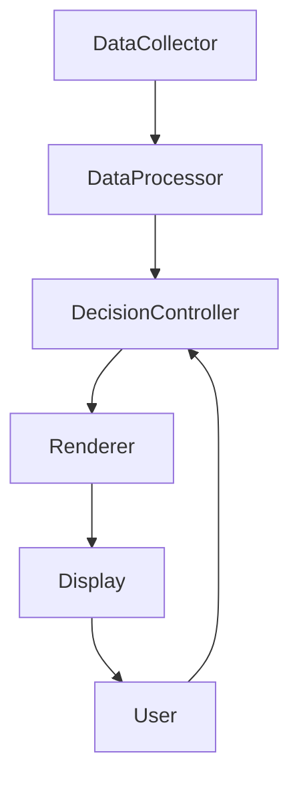
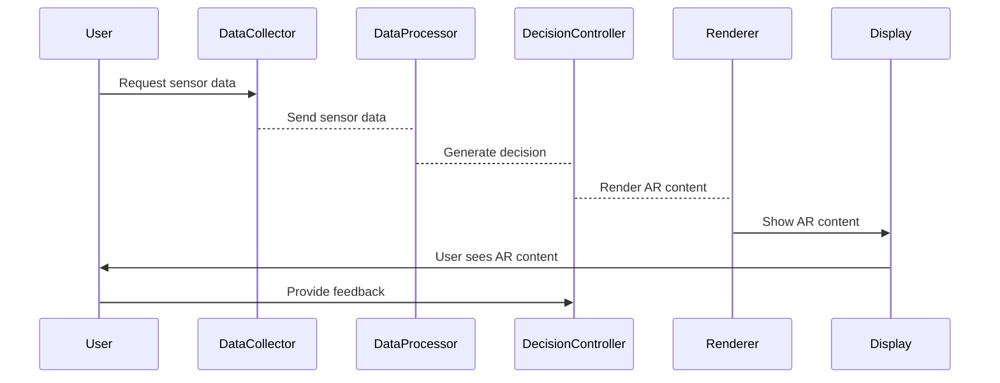

                 


---

# AI Agent在增强现实中的应用：实时信息叠加与交互

## 关键词：AI Agent，增强现实，实时信息叠加，AR技术，AI交互，实时渲染，传感器数据融合

## 摘要：  
本文深入探讨了AI Agent在增强现实（AR）中的应用，重点分析了实时信息叠加与交互的核心技术。从基本概念到算法原理，从系统架构设计到项目实战，全面解析了AI Agent如何通过增强现实技术实现智能化的人机交互。文章结合实际案例，详细阐述了传感器数据融合、实时渲染和AI决策算法等关键环节，为读者提供了从理论到实践的系统性指导。

---

# 第一部分: AI Agent与增强现实的背景与概念

## 第1章: AI Agent与增强现实概述

### 1.1 增强现实的基本概念
#### 1.1.1 增强现实的定义与特点  
增强现实（Augmented Reality，AR）是一种通过技术手段将数字信息叠加在现实世界上的技术。它利用计算机视觉、传感器技术和实时渲染等技术，将虚拟元素与真实环境无缝结合，为用户提供沉浸式的交互体验。AR的核心特点是实时性、交互性和沉浸性。

#### 1.1.2 增强现实的核心技术  
- **计算机视觉**：用于识别和跟踪现实世界中的物体，实现虚拟元素的精准叠加。  
- **传感器技术**：包括摄像头、陀螺仪、加速度计等，用于获取环境数据。  
- **实时渲染**：通过图形处理器（GPU）快速生成图像，确保AR效果的流畅性。  

#### 1.1.3 增强现实的应用场景  
AR技术广泛应用于游戏、教育、医疗、军事等领域。例如，Pokémon GO是一款经典的AR游戏，而医疗领域的AR技术可以用于手术模拟和解剖训练。

---

### 1.2 AI Agent的基本概念
#### 1.2.1 AI Agent的定义与特点  
AI Agent（人工智能代理）是一种能够感知环境并做出决策的智能实体。它可以自主执行任务，通过传感器获取信息，并利用算法做出决策。AI Agent的核心特点是自主性、反应性、目标导向性和社交能力。

#### 1.2.2 AI Agent的核心技术  
- **感知技术**：通过传感器获取环境信息，例如视觉、听觉和触觉输入。  
- **决策算法**：基于感知信息，利用机器学习、规则引擎或强化学习等方法做出决策。  
- **执行机构**：将决策转化为实际操作，例如控制机械臂或发出指令。  

#### 1.2.3 AI Agent的应用场景  
AI Agent在智能家居、自动驾驶、机器人助手等领域有广泛应用。例如，智能音箱可以通过语音识别和自然语言处理技术，为用户提供便捷的服务。

---

### 1.3 AI Agent与增强现实的结合  
#### 1.3.1 AI Agent在增强现实中的作用  
AI Agent可以作为增强现实系统的“大脑”，负责处理传感器数据、做出决策并控制AR设备。例如，在AR游戏中，AI Agent可以实时分析用户的动作并生成相应的虚拟元素。

#### 1.3.2 增强现实与AI Agent的协同工作原理  
AR设备（如头显或手机）通过传感器获取环境数据，AI Agent对这些数据进行分析，生成相应的AR内容，并通过渲染引擎将虚拟元素叠加到真实环境中。用户与AR内容的交互进一步反馈到AI Agent，形成闭环系统。

#### 1.3.3 增强现实与AI Agent的未来发展  
随着AI技术的不断进步，AR与AI Agent的结合将更加智能化。未来的增强现实系统将具备更强大的感知能力、更高效的决策算法和更自然的交互方式。

---

## 1.4 本章小结  
本章介绍了增强现实和AI Agent的基本概念，分析了它们的核心技术及应用场景，并探讨了两者结合的协同工作原理和未来发展方向。这为后续章节的技术分析奠定了基础。

---

# 第二部分: AI Agent与增强现实的核心概念与联系

## 第2章: AI Agent与增强现实的核心概念

### 2.1 AI Agent与增强现实的核心原理  
#### 2.1.1 AI Agent的感知与决策机制  
AI Agent通过传感器获取环境信息，利用算法对信息进行处理，生成决策指令。例如，AI Agent可以通过计算机视觉技术识别用户的手势，并根据手势操作生成相应的AR内容。

#### 2.1.2 增强现实的渲染与交互机制  
AR通过实时渲染将虚拟元素叠加到真实环境中，并通过传感器反馈用户的交互行为，动态调整AR内容。例如，在AR绘画应用中，用户可以通过手势或语音指令绘制虚拟图形，AI Agent实时处理这些指令并更新AR内容。

#### 2.1.3 AI Agent与增强现实的协同工作原理  
AI Agent负责处理环境数据和用户输入，生成AR内容；增强现实负责将AR内容渲染到真实环境中，并将用户的交互反馈传递给AI Agent。两者协同工作，实现智能化的AR体验。

---

### 2.2 AI Agent与增强现实的概念属性特征对比  
下表对比了AI Agent和增强现实的核心属性特征：

| **属性**         | **AI Agent**                | **增强现实**               |
|-------------------|------------------------------|-----------------------------|
| 核心功能         | 感知环境，做出决策          | 渲染虚拟元素，实现交互     |
| 主要技术         | 传感器技术，决策算法        | 实时渲染，计算机视觉       |
| 应用场景         | 自动驾驶，智能助手          | 游戏，教育，医疗            |
| 交互方式         | 语音，手势，触觉            | 视觉，听觉，触觉            |
| 发展趋势         | 智能化，自主化              | 高实时性，高沉浸性          |

---

### 2.3 AI Agent与增强现实的ER实体关系图  
以下是AI Agent与增强现实的实体关系图：

```mermaid
erDiagram
    actor 用户
    actor 系统
    actor 环境
    system 增强现实系统
    system AI Agent系统
    hardware 传感器
    hardware 渲染引擎
    data 传感器数据
    data AR内容
    data 用户反馈

    用户 --> 增强现实系统 : 使用AR应用
    用户 --> AI Agent系统 : 与AI交互
    环境 --> 传感器 : 提供环境数据
    传感器 --> 数据 : 传输传感器数据
    数据 --> AI Agent系统 : 分析数据
    数据 --> 增强现实系统 : 渲染AR内容
    增强现实系统 --> 渲染引擎 : 执行渲染
    渲染引擎 --> 用户 : 显示AR内容
    用户 --> 用户反馈 : 提供交互反馈
    用户反馈 --> AI Agent系统 : 更新决策
```

---

## 2.4 本章小结  
本章通过对比分析AI Agent和增强现实的核心概念，揭示了两者在技术、功能和应用上的联系与区别。ER实体关系图进一步明确了它们的协同工作关系，为后续章节的技术实现提供了理论基础。

---

# 第三部分: AI Agent与增强现实的算法原理讲解

## 第3章: AI Agent与增强现实的算法原理

### 3.1 增强现实中的传感器数据融合算法  
#### 3.1.1 数据融合的基本原理  
传感器数据融合是将多个传感器的数据进行综合处理，以提高系统的准确性和鲁棒性。常用算法包括加权融合和概率融合。

#### 3.1.2 常见的传感器数据融合算法  
- **加权融合**：根据传感器的可靠程度分配权重，计算融合结果。  
- **概率融合**：利用概率论方法，将传感器数据的概率分布进行综合。  

#### 3.1.3 数据融合算法的实现步骤  
1. 收集多源传感器数据；  
2. 对数据进行预处理（如去噪）；  
3. 根据选择的融合算法计算融合结果；  
4. 输出融合后的数据。  

---

#### 示例代码：加权融合算法  
```python
def weighted_fusion(sensor_data, weights):
    return sum(data * weight for data, weight in zip(sensor_data, weights)) / sum(weights)
```

---

### 3.2 AI Agent的实时决策算法  
#### 3.2.1 决策算法的基本原理  
AI Agent的决策算法基于感知数据和预设规则或机器学习模型，生成相应的动作指令。

#### 3.2.2 常见的决策算法实现  
- **规则引擎**：基于预定义的规则做出决策。  
- **机器学习模型**：利用训练好的模型进行预测。  
- **强化学习**：通过试错不断优化决策策略。  

#### 3.2.3 决策算法的优化方法  
1. 增强学习：通过奖励机制优化决策策略；  
2. 集成学习：结合多种算法的结果，提高决策的准确性；  
3. 在线优化：根据实时反馈动态调整决策策略。  

---

#### 示例代码：基于规则的决策算法  
```python
def decide_action(sensor_data):
    if sensor_data['temperature'] > 30:
        return 'adjust_air_condition'
    elif sensor_data['light'] < 50:
        return 'adjust_light'
    else:
        return 'do nothing'
```

---

### 3.3 增强现实中的实时渲染算法  
#### 3.3.1 实时渲染的基本原理  
实时渲染通过图形处理器（GPU）快速生成图像，确保AR内容的流畅性。关键技术包括光栅化、纹理映射和阴影计算。

#### 3.3.2 常见的实时渲染算法  
- **光栅化**：将3D模型转换为2D图像。  
- **纹理映射**：在模型表面贴合纹理图像。  
- **阴影计算**：模拟光照效果，增强真实感。  

#### 3.3.3 实时渲染算法的优化技巧  
1. 使用批处理减少绘制调用次数；  
2. 合理设置LOD（细节层次），远距离物体使用低多边形模型；  
3. 利用GPU加速，减少CPU负担。  

---

#### 示例代码：基本的实时渲染流程  
```python
import OpenGL.GL as gl
import OpenGL.GLUT as glut

def render(scene):
    gl.glClear(gl.GL_COLOR_BUFFER_BIT | gl.GL_DEPTH_BUFFER_BIT)
    for object in scene.objects:
        object.render()
    glut.glutSwapBuffers()
```

---

## 3.4 本章小结  
本章详细讲解了增强现实中的传感器数据融合、AI Agent的实时决策以及AR内容的实时渲染算法。这些算法是实现智能化AR系统的核心技术，为后续章节的系统设计提供了理论支持。

---

# 第四部分: AI Agent与增强现实的系统分析与架构设计

## 第4章: AI Agent与增强现实的系统架构设计

### 4.1 系统架构设计  
#### 4.1.1 系统组成模块  
- **数据采集模块**：负责获取环境数据。  
- **数据处理模块**：对数据进行融合和分析。  
- **决策控制模块**：基于处理后的数据做出决策。  
- **渲染显示模块**：将AR内容渲染到显示设备。  
- **用户交互模块**：处理用户的输入并反馈给系统。  

#### 4.1.2 系统功能设计  
1. 数据采集：通过传感器获取环境数据；  
2. 数据处理：融合传感器数据，分析用户意图；  
3. 决策控制：基于分析结果生成AR内容；  
4. 渲染显示：将AR内容叠加到真实环境中；  
5. 用户交互：处理用户的反馈并更新系统状态。  

---

#### 系统架构图  
以下是系统架构的Mermaid图：



---

### 4.2 系统接口设计  
#### 4.2.1 系统接口定义  
1. 数据采集接口：提供传感器数据的获取方法；  
2. 数据处理接口：定义数据融合和分析的API；  
3. 决策控制接口：定义决策算法的调用方式；  
4. 渲染显示接口：定义AR内容的渲染方式；  
5. 用户交互接口：定义用户输入的处理方式。  

#### 4.2.2 接口实现示例  
```python
interface IDataCollector {
    def get_sensor_data(): SensorData
}

interface IDataProcessor {
    def process_data(sensor_data: SensorData): ProcessedData
}

interface IDecisionController {
    def make_decision(processed_data: ProcessedData): Decision
}

interface IRenderer {
    def render_ar_content(decision: Decision): void
}
```

---

### 4.3 系统交互设计  
#### 4.3.1 系统交互流程  
1. 用户发起交互请求；  
2. 数据采集模块获取环境数据；  
3. 数据处理模块分析数据，生成AR内容；  
4. 决策控制模块做出决策；  
5. 渲染显示模块将AR内容渲染到显示设备；  
6. 用户反馈交互结果，系统更新状态。  

---

#### 交互序列图  
以下是系统交互的Mermaid图：



---

## 4.4 本章小结  
本章详细设计了AI Agent与增强现实系统的架构，明确了各模块的功能和交互流程。系统架构设计为后续章节的项目实现提供了明确的指导。

---

# 第五部分: 项目实战

## 第5章: AI Agent与增强现实的项目实战

### 5.1 项目环境与工具安装  
#### 5.1.1 开发环境搭建  
1. 安装Python和相关开发库（如NumPy、OpenCV、PyTorch）；  
2. 安装AR开发框架（如OpenAR、ARKit）；  
3. 安装图形库（如OpenGL、Pyglet）。  

#### 5.1.2 项目代码框架  
```python
import numpy as np
import cv2
import pyglet
```

---

### 5.2 系统核心实现  
#### 5.2.1 数据采集与处理  
```python
def collect_sensor_data():
    # 获取摄像头数据
    cap = cv2.VideoCapture(0)
    ret, frame = cap.read()
    cap.release()
    return frame

def process_data(frame):
    # 进行图像处理和特征提取
    gray = cv2.cvtColor(frame, cv2.COLOR_BGR2GRAY)
    return gray
```

#### 5.2.2 决策控制与渲染  
```python
def decide_action(processed_frame):
    # 简单的图像识别算法
    if np.mean(processed_frame) > 128:
        return 'high_light'
    else:
        return 'low_light'

def render_ar_content(decision):
    # 在图像上叠加AR内容
    image = create_ar_image()
    return image
```

---

### 5.3 项目实现与测试  
#### 5.3.1 代码实现  
```python
import numpy as np
import cv2
import pyglet
from pyglet import gl

def create_ar_image():
    # 创建一个简单的AR图像
    image = np.zeros((480, 640, 3), dtype=np.uint8)
    cv2.rectangle(image, (100, 100), (500, 300), (0, 255, 0), 2)
    return image

def main():
    # 收集传感器数据
    frame = collect_sensor_data()
    # 处理数据
    processed_frame = process_data(frame)
    # 决策
    decision = decide_action(processed_frame)
    # 渲染AR内容
    ar_image = render_ar_content(decision)
    # 显示图像
    window = pyglet.window.Window(640, 480)
    @window.event
    def on_draw():
        gl.glClear(gl.GL_COLOR_BUFFER_BIT)
        ar_image_texture = pyglet.image.ImageData(640, 480, 'RGB', ar_image.tobytes(), -640)
        ar_image_texture.blit(0, 0)
    pyglet.app.run()

if __name__ == "__main__":
    main()
```

#### 5.3.2 代码解读与分析  
1. `collect_sensor_data`：从摄像头获取图像帧。  
2. `process_data`：将图像转换为灰度图，进行特征提取。  
3. `decide_action`：基于图像亮度做出决策。  
4. `render_ar_content`：在图像上绘制AR内容。  
5. `main`：整合各模块，实现完整的AR系统。  

---

### 5.4 项目测试与优化  
#### 5.4.1 测试步骤  
1. 运行代码，观察图像是否正确显示；  
2. 测试不同光照条件下的决策是否正确；  
3. 验证AR内容是否能够正确叠加到图像上。  

#### 5.4.2 性能优化  
1. 使用并行计算加速数据处理；  
2. 优化渲染算法，减少计算开销；  
3. 采用缓存机制，减少重复计算。  

---

## 5.5 本章小结  
本章通过一个简单的AR项目，详细讲解了AI Agent与增强现实系统的实现过程。从环境搭建到代码实现，再到测试与优化，为读者提供了完整的项目实战经验。

---

# 第六部分: 最佳实践与总结

## 第6章: 最佳实践与总结

### 6.1 最佳实践  
1. **模块化设计**：将系统划分为独立模块，便于维护和扩展。  
2. **数据优化**：合理处理传感器数据，减少计算开销。  
3. **算法优化**：采用高效的算法和数据结构，提升系统性能。  
4. **用户体验**：注重交互设计，提升用户的使用体验。  

### 6.2 小结  
本文从理论到实践，全面探讨了AI Agent在增强现实中的应用。通过系统化的分析和详细的代码实现，为读者提供了从理解到实践的完整指导。

### 6.3 注意事项  
1. 在实际项目中，需根据具体需求选择合适的算法和工具。  
2. 注意系统的实时性和稳定性，确保用户体验流畅。  
3. 保持对新技术的关注，及时更新系统架构和算法实现。  

### 6.4 拓展阅读  
1. 探索更复杂的传感器数据融合算法，如基于深度学习的融合方法。  
2. 研究更高效的实时渲染技术，如光线追踪和实时阴影计算。  
3. 学习更先进的AI Agent算法，如基于强化学习的决策模型。  

---

# 作者：AI天才研究院 & 禅与计算机程序设计艺术

---

以上是《AI Agent在增强现实中的应用：实时信息叠加与交互》的技术博客文章的完整目录和内容概览。文章从基础概念到算法实现，再到系统设计和项目实战，全面解析了AI Agent与增强现实结合的技术细节，为读者提供了从理论到实践的系统性指导。

