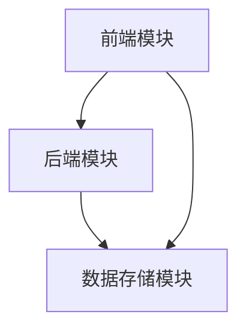
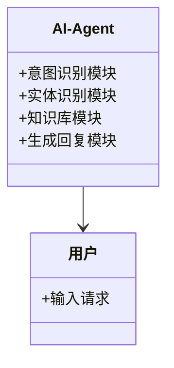
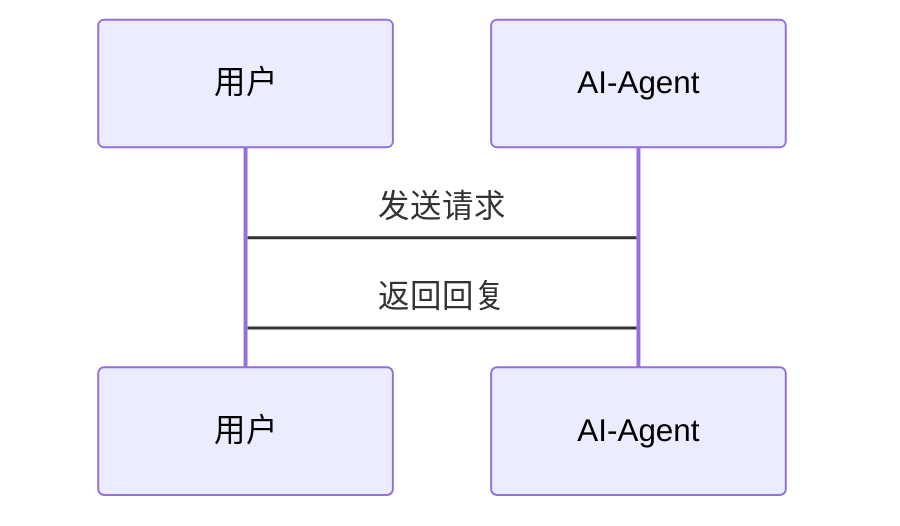
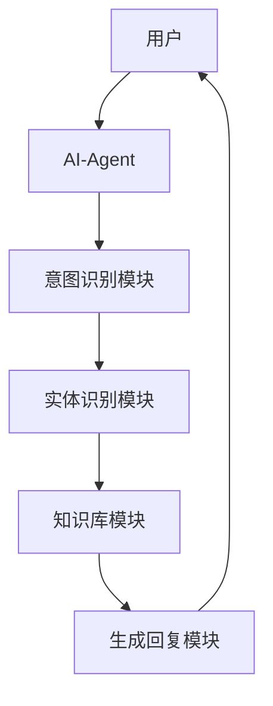

                 


```markdown
# AI Agent在客户服务中的应用

> 关键词：AI Agent, 客户服务, 自然语言处理, 机器学习, 对话系统, 情感分析

> 摘要：本文深入探讨了AI Agent在客户服务中的应用，从基本概念到核心技术，再到实际应用场景和系统设计，全面解析了AI Agent如何提升客户服务的效率和质量。通过详细的算法实现和项目实战，本文为读者提供了从理论到实践的完整指导。

---

# 第一部分: AI Agent在客户服务中的应用基础

# 第1章: AI Agent的基本概念与背景

## 1.1 AI Agent的定义与特点
### 1.1.1 AI Agent的定义
AI Agent（人工智能代理）是指能够感知环境、自主决策并执行任务的智能实体。它通过与用户的交互，理解和解决用户的问题，提供个性化的服务。

### 1.1.2 AI Agent的核心特点
- **自主性**：能够自主决策和执行任务。
- **反应性**：能够实时感知环境并做出反应。
- **学习能力**：通过数据和经验不断优化自身的性能。
- **适应性**：能够根据环境变化调整行为。

### 1.1.3 AI Agent与传统客服系统的区别
- **智能化**：AI Agent能够理解上下文和情感，提供更智能的服务。
- **效率**：AI Agent可以同时处理多个请求，显著提高效率。
- **7x24小时可用**：AI Agent可以全天候为用户提供服务，无需休息。

## 1.2 客户服务中的问题背景
### 1.2.1 客户服务的主要挑战
- **人力成本高**：传统客服需要大量人工，成本高昂。
- **响应时间长**：用户等待时间长，影响体验。
- **服务质量不稳定**：人工客服可能因情绪或知识不足影响服务质量。

### 1.2.2 传统客服的局限性
- **效率低下**：人工客服处理速度慢，难以应对大量请求。
- **知识依赖**：依赖客服人员的知识储备，难以覆盖所有问题。
- **情绪波动**：人工客服的情绪可能影响服务质量。

### 1.2.3 AI Agent的解决方案
- **自动化处理**：AI Agent可以快速响应用户请求，提高效率。
- **7x24小时服务**：AI Agent可以全天候为用户提供服务，无需休息。
- **个性化服务**：通过分析用户行为和偏好，提供个性化服务。

## 1.3 AI Agent在客户服务中的优势
### 1.3.1 提高效率
AI Agent可以同时处理多个请求，显著提高客户服务的响应速度。

### 1.3.2 降低成本
通过自动化处理，AI Agent可以减少对人工客服的依赖，降低人力成本。

### 1.3.3 提升客户体验
AI Agent可以通过分析用户情绪和偏好，提供更贴心的服务，提升客户满意度。

## 1.4 本章小结
本章介绍了AI Agent的基本概念和特点，分析了客户服务中的主要挑战和传统客服的局限性，并阐述了AI Agent在客户服务中的优势。

---

# 第2章: AI Agent的核心技术基础

## 2.1 自然语言处理（NLP）基础
### 2.1.1 NLP的基本概念
自然语言处理（NLP）是研究如何让计算机理解和生成人类语言的学科。

### 2.1.2 常见的NLP技术
- **分词**：将文本分割成词语或短语。
- **词性标注**：对每个词语进行词性分类。
- **句法分析**：分析句子的语法结构。
- **情感分析**：判断文本的情感倾向。

### 2.1.3 NLP在客服中的应用
- **意图识别**：通过分析用户的语言，识别用户的意图。
- **实体识别**：从文本中提取关键信息，如日期、地点、人名等。

## 2.2 机器学习与深度学习
### 2.2.1 机器学习的基本原理
机器学习是通过数据训练模型，使其能够从数据中学习规律并进行预测或分类。

### 2.2.2 深度学习的核心技术
- **神经网络**：模拟人脑的神经网络，用于处理复杂的数据。
- **卷积神经网络（CNN）**：常用于图像处理。
- **循环神经网络（RNN）**：适用于序列数据处理。

### 2.2.3 机器学习在AI Agent中的应用
- **意图分类**：通过机器学习模型，识别用户的意图。
- **情感分析**：通过机器学习模型，判断用户的情感倾向。

## 2.3 对话系统与意图识别
### 2.3.1 对话系统的定义
对话系统是指能够与用户进行自然语言对话的系统，通常包括意图识别、实体识别和生成回复等模块。

### 2.3.2 意图识别的原理
意图识别是通过分析用户的语言，确定用户的需求或意图的过程。

### 2.3.3 意图识别在客服中的应用
- **问题分类**：将用户的问题分类到预定义的类别中。
- **任务处理**：根据用户的意图，执行相应的任务。

## 2.4 本章小结
本章介绍了AI Agent的核心技术基础，包括自然语言处理、机器学习和对话系统，以及它们在客服中的应用。

---

# 第3章: AI Agent在客户服务中的应用场景

## 3.1 常见问题处理
### 3.1.1 常见问题的分类
- **产品咨询**：用户询问产品的功能、价格等信息。
- **技术支持**：用户报告技术问题，寻求解决方案。
- **订单查询**：用户查询订单状态、物流信息等。

### 3.1.2 AI Agent如何处理常见问题
- **意图识别**：通过分析用户的语言，识别用户的意图。
- **实体识别**：提取关键信息，如订单号、产品型号等。
- **生成回复**：根据识别的意图和实体，生成合适的回复。

### 3.1.3 案例分析
案例1：用户询问产品的功能，AI Agent通过意图识别确定用户的需求，然后提取相关的产品信息，生成详细的回复。

## 3.2 复杂问题支持
### 3.2.1 复杂问题的定义
复杂问题是指需要多步推理或涉及多个模块的问题。

### 3.2.2 AI Agent如何处理复杂问题
- **多轮对话**：通过多轮对话，逐步明确用户的需求。
- **上下文管理**：保持对话的上下文，确保回复的连贯性。
- **知识库调用**：根据问题调用相关知识库，提供准确的信息。

### 3.2.3 案例分析
案例2：用户报告技术问题，AI Agent通过多轮对话确定问题的具体原因，然后调用知识库提供解决方案。

## 3.3 多轮对话与上下文管理
### 3.3.1 多轮对话的定义
多轮对话是指用户和AI Agent之间进行的多次交互，通常涉及上下文的保持。

### 3.3.2 上下文管理的重要性
- **连贯性**：确保对话的连贯性，避免重复或混乱。
- **准确性**：通过上下文管理，提高回复的准确性。

### 3.3.3 案例分析
案例3：用户询问订单状态，AI Agent通过上下文管理，确认用户的订单信息，然后提供最新的物流信息。

## 3.4 情感分析与客户情绪管理
### 3.4.1 情感分析的定义
情感分析是通过分析文本，判断文本的情感倾向，如正面、负面或中性。

### 3.4.2 情感分析在客服中的应用
- **情绪识别**：识别用户的情绪，如愤怒、喜悦、焦虑等。
- **情绪管理**：根据用户的情绪，调整回复的语气和内容，以缓解用户的不满或增强用户的满意度。

### 3.4.3 案例分析
案例4：用户因订单延迟而情绪不满，AI Agent通过情感分析识别用户的情绪，然后调整回复的语气，提供解决方案，以缓解用户的不满。

## 3.5 本章小结
本章通过案例分析，展示了AI Agent在常见问题处理、复杂问题支持、多轮对话和情感分析等场景中的应用。

---

# 第4章: AI Agent的系统设计与架构

## 4.1 系统架构设计
### 4.1.1 系统架构概述
AI Agent的系统架构通常包括前端、后端和数据存储三部分。

### 4.1.2 系统架构的模块划分
- **前端模块**：负责与用户的交互，接收用户的输入，并将请求发送到后端。
- **后端模块**：负责处理用户的请求，包括意图识别、实体识别、知识库调用等。
- **数据存储模块**：存储用户数据、知识库等信息。

### 4.1.3 系统架构的Mermaid图


## 4.2 系统功能设计
### 4.2.1 系统功能概述
AI Agent的系统功能包括意图识别、实体识别、知识库调用、生成回复等。

### 4.2.2 系统功能的Mermaid类图


## 4.3 系统接口设计
### 4.3.1 系统接口概述
系统接口包括用户与AI Agent的交互接口、后端模块与数据存储模块的接口等。

### 4.3.2 系统接口的Mermaid序列图


## 4.4 系统交互设计
### 4.4.1 系统交互流程
1. 用户发送请求到AI Agent。
2. AI Agent通过意图识别模块确定用户的需求。
3. AI Agent通过实体识别模块提取关键信息。
4. AI Agent调用知识库模块获取相关信息。
5. AI Agent通过生成回复模块生成回复。
6. AI Agent将回复返回给用户。

### 4.4.2 系统交互的Mermaid流程图


## 4.5 本章小结
本章详细介绍了AI Agent的系统设计与架构，包括系统架构设计、功能设计、接口设计和交互设计。

---

# 第5章: AI Agent的算法实现与优化

## 5.1 意图识别算法
### 5.1.1 意图识别算法的原理
意图识别算法通常基于机器学习或深度学习模型，通过训练数据学习用户的意图。

### 5.1.2 意图识别算法的实现步骤
1. 数据预处理：清洗数据，提取特征。
2. 模型训练：使用训练数据训练意图识别模型。
3. 模型预测：将用户输入的数据输入模型，得到意图标签。

### 5.1.3 意图识别算法的优化
- **特征工程**：选择合适的特征，提高模型性能。
- **模型调优**：调整模型参数，优化模型性能。

### 5.1.4 意图识别算法的Python代码示例
```python
from sklearn.feature_extraction.text import TfidfVectorizer
from sklearn.svm import SVC

# 数据预处理
texts = ["我需要帮助", "请告诉我产品价格"]
labels = [0, 1]

# 特征提取
vectorizer = TfidfVectorizer()
X = vectorizer.fit_transform(texts)

# 模型训练
model = SVC()
model.fit(X, labels)

# 模型预测
new_text = ["请提供技术支持"]
new_X = vectorizer.transform([new_text[0]])
prediction = model.predict(new_X)
print(prediction)
```

## 5.2 实体识别算法
### 5.2.1 实体识别算法的原理
实体识别算法通常基于正则表达式、条件随机场（CRF）或深度学习模型。

### 5.2.2 实体识别算法的实现步骤
1. 数据预处理：清洗数据，提取特征。
2. 模型训练：使用训练数据训练实体识别模型。
3. 模型预测：将用户输入的数据输入模型，提取实体。

### 5.2.3 实体识别算法的优化
- **特征选择**：选择合适的特征，提高模型性能。
- **模型调优**：调整模型参数，优化模型性能。

### 5.2.4 实体识别算法的Python代码示例
```python
import spacy

# 加载模型
nlp = spacy.load("en_core_web_sm")

# 实体识别
text = "我的订单号是12345"
doc = nlp(text)
for ent in doc.ents:
    print(ent.text, ent.label_)
```

## 5.3 情感分析算法
### 5.3.1 情感分析算法的原理
情感分析算法通常基于机器学习或深度学习模型，通过训练数据学习情感倾向。

### 5.3.2 情感分析算法的实现步骤
1. 数据预处理：清洗数据，提取特征。
2. 模型训练：使用训练数据训练情感分析模型。
3. 模型预测：将用户输入的数据输入模型，判断情感倾向。

### 5.3.3 情感分析算法的优化
- **特征工程**：选择合适的特征，提高模型性能。
- **模型调优**：调整模型参数，优化模型性能。

### 5.3.4 情感分析算法的Python代码示例
```python
from sklearn.feature_extraction.text import TfidfVectorizer
from sklearn.svm import SVC

# 数据预处理
texts = ["我非常喜欢这个产品", "我对这个产品不满意"]
labels = [1, 0]

# 特征提取
vectorizer = TfidfVectorizer()
X = vectorizer.fit_transform(texts)

# 模型训练
model = SVC()
model.fit(X, labels)

# 模型预测
new_text = ["这个产品很差"]
new_X = vectorizer.transform([new_text[0]])
prediction = model.predict(new_X)
print(prediction)
```

## 5.4 本章小结
本章详细介绍了AI Agent的算法实现与优化，包括意图识别、实体识别和情感分析算法的实现步骤和优化方法。

---

# 第6章: AI Agent的项目实战与案例分析

## 6.1 项目实战
### 6.1.1 项目背景
本项目旨在开发一个基于AI Agent的客户服务系统，能够处理用户的问题和请求。

### 6.1.2 项目环境配置
- **编程语言**：Python
- **框架**：Flask
- **依赖库**：spaCy、scikit-learn、tensorflow

### 6.1.3 项目核心代码实现
```python
from flask import Flask
import spacy
from sklearn.feature_extraction.text import TfidfVectorizer
from sklearn.svm import SVC

# 加载模型
nlp = spacy.load("en_core_web_sm")
vectorizer = TfidfVectorizer()
model = SVC()

# 训练模型
texts = ["我需要帮助", "请告诉我产品价格"]
labels = [0, 1]
X = vectorizer.fit_transform(texts)
model.fit(X, labels)

# 定义API接口
app = Flask(__name__)

@app.route('/query', methods=['POST'])
def query():
    data = request.json['text']
    new_X = vectorizer.transform([data])
    prediction = model.predict(new_X)
    return str(prediction)

if __name__ == '__main__':
    app.run()
```

### 6.1.4 项目实现解读与分析
- **代码功能**：上述代码实现了基于Flask的AI Agent系统，能够接收用户的请求，通过模型进行预测，并返回结果。
- **代码优势**：代码简洁易懂，适合初学者学习和实践。

## 6.2 案例分析
### 6.2.1 案例背景
某电商平台希望通过AI Agent提升客户服务的效率和质量。

### 6.2.2 案例实现
1. **数据收集**：收集用户的问题和请求，标注意图和实体。
2. **模型训练**：使用训练数据训练意图识别和实体识别模型。
3. **系统部署**：将模型部署到电商平台，提供客户服务。

### 6.2.3 案例分析
- **效果评估**：通过评估指标（如准确率、召回率）评估系统的性能。
- **优化建议**：根据评估结果，优化模型和系统设计。

## 6.3 本章小结
本章通过项目实战和案例分析，展示了AI Agent在客户服务中的实际应用，帮助读者更好地理解和掌握AI Agent的实现与优化。

---

# 第7章: 总结与展望

## 7.1 本章总结
本文全面探讨了AI Agent在客户服务中的应用，从基本概念到核心技术，再到实际应用场景和系统设计，为读者提供了从理论到实践的完整指导。

## 7.2 未来展望
随着AI技术的不断发展，AI Agent在客户服务中的应用将更加广泛和深入。未来的研究方向包括：
- **多模态交互**：结合视觉、听觉等多模态信息，提供更丰富的交互体验。
- **自适应学习**：通过自适应学习，提升AI Agent的智能性和灵活性。
- **隐私保护**：在AI Agent的设计中，加强隐私保护，确保用户数据的安全。

## 7.3 最佳实践 tips
- **数据质量**：确保训练数据的质量，提高模型的性能。
- **模型优化**：通过特征工程和模型调优，优化模型的性能。
- **用户体验**：注重用户体验设计，提供更贴心的服务。

## 7.4 本章小结
本章总结了全文的主要内容，并展望了AI Agent在客户服务中的未来发展方向，同时提供了一些最佳实践的建议。

---

# 作者：AI天才研究院/AI Genius Institute & 禅与计算机程序设计艺术 /Zen And The Art of Computer Programming
```

