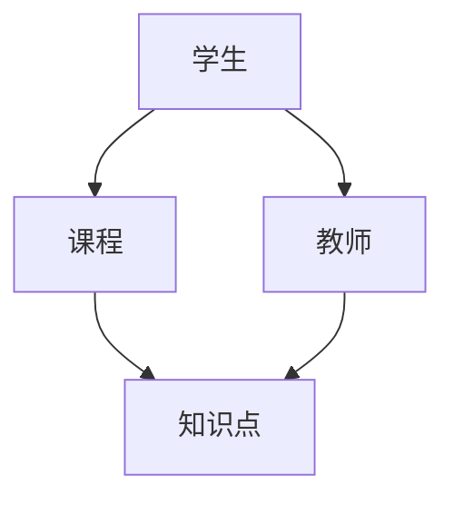

                 


# AI Agent在教育领域的创新应用

> 关键词：AI Agent, 教育创新, 人工智能, 知识点生成, 智能推荐, 教学辅助

> 摘要：本文深入探讨了AI Agent在教育领域的创新应用，从核心概念、算法原理到系统架构、项目实战，详细分析了AI Agent如何通过生成式AI、强化学习和推荐系统等技术，实现教育场景中的智能知识点生成与个性化教学推荐，构建高效、智能的教育系统。

---

## 第一部分: AI Agent在教育领域的背景与核心概念

### 第1章: AI Agent的基本概念与教育应用背景

#### 1.1 AI Agent的定义与核心特征

- **1.1.1 AI Agent的基本定义**
  AI Agent（人工智能代理）是指能够感知环境并采取行动以实现目标的智能实体。它通过与用户的交互和环境数据的处理，提供实时、个性化的服务。

- **1.1.2 AI Agent的核心特征**
  - **自主性**：AI Agent能够自主决策，无需人工干预。
  - **反应性**：能够实时感知环境并做出反应。
  - **目标导向**：基于预设目标执行任务。
  - **学习能力**：通过数据和反馈不断优化自身。

- **1.1.3 AI Agent与传统AI的区别**
  AI Agent不仅是一个静态的模型或算法，而是一个动态的、能够主动与环境交互的实体，具有更强的适应性和自主性。

#### 1.2 教育领域的AI Agent应用背景

- **1.2.1 当前教育领域的技术挑战**
  - 教学资源分散，难以个性化推荐。
  - 学生学习进度不一，难以实现差异化教学。
  - 教师工作量大，难以高效管理教学内容。

- **1.2.2 AI Agent在教育中的潜在价值**
  - 提供个性化的学习建议和资源推荐。
  - 动态调整教学内容，适应学生学习进度。
  - 自动化管理教学资源，减轻教师负担。

- **1.2.3 教育场景中的AI Agent应用场景与边界**
  - 应用场景：知识点生成、学习路径规划、个性化推荐、教学辅助。
  - 边界：不涉及学生隐私侵犯，不替代教师的人际互动功能。

### 第2章: 教育领域的AI Agent核心概念与联系

#### 2.1 核心概念原理

- **2.1.1 AI Agent的核心原理**
  AI Agent通过感知环境、分析数据、生成决策并执行动作，实现教育场景中的智能服务。

- **2.1.2 教育场景中的AI Agent模型**
  - 基于大语言模型的知识点生成：AI Agent可以生成符合教学大纲的课程内容。
  - 基于强化学习的个性化推荐：通过学生行为数据优化推荐策略。

#### 2.2 核心概念属性对比

- **2.2.1 AI Agent与传统教育技术的对比**
  | 特性                | 传统教育技术              | AI Agent                     |
  |---------------------|---------------------------|------------------------------|
  | 自主性              | 依赖人工操作              | 自主决策                     |
  | 反应性              | 响应速度较慢              | 实时响应                     |
  | 学习能力            | 无法自适应                | 可以通过数据优化性能         |

- **2.2.2 不同AI Agent模型的性能对比**
  - 基于规则的AI Agent：简单易实现，但灵活性差。
  - 基于机器学习的AI Agent：学习能力强，但需要大量数据。
  - 基于大语言模型的AI Agent：生成能力强，但训练成本高。

#### 2.3 ER实体关系图



---

## 第二部分: AI Agent的算法原理与数学模型

### 第3章: AI Agent算法原理与数学模型

#### 3.1 生成式AI算法原理

- **3.1.1 大语言模型的基本原理**
  大语言模型通过预训练和微调，能够生成与上下文相关的文本。

- **3.1.2 基于Transformer的生成机制**
  Transformer模型通过自注意力机制捕捉文本中的长距离依赖关系。

- **3.1.3 案例分析：文本生成模型**
  以GPT为例，AI Agent可以生成符合教学大纲的课程内容。

#### 3.2 强化学习算法

- **3.2.1 强化学习的基本概念**
  强化学习通过智能体与环境的交互，学习最优策略。

- **3.2.2 在教育场景中的应用**
  AI Agent可以通过强化学习优化推荐策略，提高学生的学习效果。

- **3.2.3 案例分析：智能推荐系统**
  AI Agent可以根据学生的学习行为，推荐适合的学习资源。

#### 3.3 推荐系统算法

- **3.3.1 基于协同过滤的推荐算法**
  通过用户行为数据，找到相似用户的推荐。

- **3.3.2 基于内容的推荐算法**
  通过分析内容特征，推荐相似内容。

- **3.3.3 混合推荐算法**
  结合协同过滤和内容推荐，提高推荐准确率。

#### 3.4 数学模型与公式

- **3.4.1 生成式AI的数学模型**
  $$ P(\text{output} | \text{input}) = \text{模型预测概率} $$

- **3.4.2 强化学习的奖励函数**
  $$ R(s, a) = \text{状态s下动作a的奖励} $$

---

## 第三部分: 教育AI Agent的系统架构与设计

### 第4章: 教育AI Agent的系统架构与设计

#### 4.1 系统架构设计

- **4.1.1 分层架构设计**
  - 数据层：存储学生数据、课程数据等。
  - 业务逻辑层：处理AI Agent的逻辑。
  - 表现层：展示结果。

- **4.1.2 微服务架构设计**
  - 学生服务：处理学生相关请求。
  - 课程服务：处理课程相关请求。
  - 知识点服务：处理知识点相关请求。

- **4.1.3 案例分析：教育平台架构**
  使用分层架构设计一个教育平台，包括前端、后端和数据库。

#### 4.2 功能模块设计

- **4.2.1 学生端功能模块**
  - 学习资源推荐。
  - 学习进度跟踪。

- **4.2.2 教师端功能模块**
  - 教学资源管理。
  - 学生学习情况分析。

- **4.2.3 管理端功能模块**
  - 系统管理。
  - 数据分析。

#### 4.3 接口设计

- **4.3.1 API接口定义**
  - GET /students：获取学生信息。
  - POST /courses：提交课程信息。

- **4.3.2 接口调用流程**
  - 调用API获取学生数据。
  - 处理数据并返回结果。

- **4.3.3 接口安全设计**
  - 使用JWT进行身份验证。
  - 设置访问权限。

---

## 第四部分: 项目实战

### 第5章: 项目实战：智能辅导系统开发

#### 5.1 项目介绍

- **项目目标**
  开发一个基于AI Agent的智能辅导系统，实现知识点生成和个性化推荐。

- **项目需求**
  - 生成符合教学大纲的知识点。
  - 根据学生学习情况推荐学习资源。

#### 5.2 环境配置

- **安装Python**
  ```bash
  python --version
  ```

- **安装依赖库**
  ```bash
  pip install numpy torch transformers
  ```

#### 5.3 核心代码实现

- **知识点生成代码**
  ```python
  import torch
  from transformers import AutoTokenizer, AutoModelForCausalLM

  tokenizer = AutoTokenizer.from_pretrained("gpt2")
  model = AutoModelForCausalLM.from_pretrained("gpt2")

  input_text = "生成关于数学的课程内容："
  inputs = tokenizer(input_text, return_tensors="pt")
  outputs = model.generate(inputs.input_ids, max_length=500)
  print(tokenizer.decode(outputs[0], skip_special_tokens=True))
  ```

- **个性化推荐代码**
  ```python
  def recommend_resources(student_id):
      # 获取学生数据
      student = get_student(student_id)
      # 生成推荐资源
      resources = generate_recommendations(student)
      return resources
  ```

#### 5.4 系统功能解读与分析

- **功能解读**
  - 知识点生成：AI Agent生成符合教学大纲的知识点。
  - 个性化推荐：根据学生学习情况推荐资源。

- **实际效果分析**
  - 提高学习效率。
  - 个性化学习体验。

---

## 第五部分: 总结与扩展

### 第6章: 总结与扩展

#### 6.1 文章总结

- AI Agent在教育领域的应用具有巨大的潜力。
- 通过生成式AI和推荐系统，可以实现个性化的教学服务。

#### 6.2 最佳实践 tips

- **技术实现**
  - 使用大语言模型生成知识点。
  - 通过强化学习优化推荐策略。

- **项目开发**
  - 分模块开发，逐步完善系统功能。

#### 6.3 注意事项

- 数据隐私问题需要特别注意。
- 系统的可扩展性和安全性需要保证。

#### 6.4 拓展阅读

- 《大语言模型在教育中的应用》
- 《基于强化学习的个性化推荐系统》

---

## 附录

- **附录A: AI Agent相关技术术语表**
  - AI Agent：人工智能代理。
  - 强化学习：通过奖励机制优化策略。

- **附录B: AI Agent开发工具推荐**
  - Hugging Face：开源AI模型库。
  - TensorFlow：深度学习框架。

---

作者：AI天才研究院/AI Genius Institute & 禅与计算机程序设计艺术 /Zen And The Art of Computer Programming

---

# END

