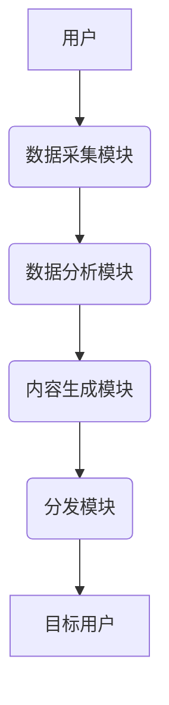

                 


# AI Agent在新闻媒体中的应用：自动写作与内容分发

> 关键词：AI Agent，新闻媒体，自动写作，内容分发，自然语言处理，机器学习，数据挖掘

> 摘要：随着人工智能技术的飞速发展，AI Agent（人工智能代理）在新闻媒体领域的应用日益广泛。本文将深入探讨AI Agent在新闻媒体中的应用，特别是自动写作与内容分发方面。文章从AI Agent的基本概念出发，分析其在新闻写作中的自然语言处理技术，探讨AI Agent在内容分发中的算法原理和系统架构设计，最后通过实际案例展示AI Agent在新闻媒体中的应用场景和优势。通过本文，读者将全面了解AI Agent在新闻媒体中的应用潜力和实现方法。

---

# 第一部分: AI Agent与新闻媒体的结合

## 第1章: AI Agent的基本概念与新闻媒体的应用

### 1.1 AI Agent的核心特征

AI Agent是一种能够感知环境、自主决策并执行任务的智能系统。其核心特征包括：

1. **自主性**：能够在没有人工干预的情况下独立运行。
2. **反应性**：能够实时感知环境并做出反应。
3. **目标导向**：具有明确的目标，能够优化决策以实现目标。
4. **学习能力**：通过数据和经验不断优化自身的性能。

### 1.2 AI Agent在新闻媒体中的应用场景

AI Agent在新闻媒体中的应用主要集中在以下几个方面：

1. **自动化新闻写作**：通过自然语言处理技术，AI Agent能够自动生成新闻稿。
2. **内容分发与推荐**：根据用户偏好，AI Agent能够个性化推荐新闻内容。
3. **数据分析与洞察**：利用数据挖掘技术，AI Agent能够分析新闻数据并提取有价值的信息。

### 1.3 AI Agent的优势

AI Agent在新闻媒体中的应用带来了显著的优势：

1. **提高效率**：自动化处理新闻内容，减少人工干预。
2. **降低成本**：降低新闻生产的成本，节省人力资源。
3. **增强个性化体验**：通过个性化推荐，提升用户体验。

---

## 第2章: 自然语言处理技术在新闻写作中的应用

### 2.1 自然语言处理的基本原理

自然语言处理（NLP）是AI Agent实现新闻写作的核心技术。NLP通过分析和理解自然语言文本，生成符合语法和语义的新闻内容。以下是NLP的基本步骤：

1. **文本预处理**：包括分词、去除停用词等。
2. **语义分析**：理解文本的含义和情感。
3. **文本生成**：基于语义分析结果生成新闻稿。

### 2.2 常见的自然语言处理模型

目前，有许多优秀的NLP模型可以应用于新闻写作：

1. **GPT模型**：通过大规模预训练，能够生成连贯的新闻内容。
2. **BERT模型**：擅长上下文理解，适合新闻标题生成。
3. **Fine-tuned Models**：针对特定领域（如新闻）进行微调的模型。

### 2.3 自然语言生成技术

自然语言生成技术是AI Agent实现自动化写作的关键。以下是几种常见的生成方法：

1. **基于规则的生成**：通过预定义的规则生成文本。
2. **基于统计的生成**：利用统计模型预测下一个词。
3. **基于深度学习的生成**：使用神经网络生成高质量的文本。

### 2.4 自然语言处理在新闻写作中的应用案例

以下是一个简单的新闻写作案例：

**输入**：一组关键词和事件描述。
**输出**：自动生成一篇新闻稿。

通过NLP技术，AI Agent能够根据输入的信息生成符合要求的新闻内容，大大提高了新闻生产的效率。

---

## 第3章: AI Agent的算法原理与系统架构

### 3.1 AI Agent的算法原理

AI Agent的核心算法包括感知、决策和行动三个部分。以下是具体的步骤：

1. **感知环境**：通过传感器或API获取新闻数据。
2. **信息处理**：利用NLP和机器学习技术分析数据。
3. **决策制定**：基于分析结果生成新闻内容或推荐分发策略。
4. **执行行动**：发布新闻内容或推荐给目标用户。

### 3.2 AI Agent的系统架构设计

AI Agent的系统架构通常包括以下几个部分：

1. **数据采集模块**：负责获取新闻数据。
2. **数据分析模块**：对数据进行处理和分析。
3. **内容生成模块**：生成新闻稿或推荐列表。
4. **分发模块**：将内容分发给目标用户。

### 3.3 系统架构图

以下是AI Agent的系统架构图：



---

## 第4章: 项目实战——AI Agent新闻写作系统

### 4.1 环境安装与配置

要实现AI Agent新闻写作系统，首先需要安装必要的库和工具：

1. **Python**：推荐使用Python 3.8及以上版本。
2. **库**：包括TensorFlow、Keras、NLTK等。
3. **工具**：如Jupyter Notebook用于开发和调试。

### 4.2 核心代码实现

以下是AI Agent新闻写作系统的核心代码示例：

```python
import numpy as np
import tensorflow as tf
from tensorflow.keras.layers import Dense, Input, LSTM, Bidirectional
from tensorflow.keras.models import Model

# 定义模型输入
input_layer = Input(shape=(max_length,))

# 双向LSTM层
lstm_layer = Bidirectional(LSTM(64))(input_layer)

# 全连接层
dense_layer = Dense(128, activation='relu')(lstm_layer)

# 输出层
output_layer = Dense(vocabulary_size, activation='softmax')(dense_layer)

# 定义模型
model = Model(inputs=input_layer, outputs=output_layer)
model.compile(optimizer='adam', loss='sparse_categorical_crossentropy', metrics=['accuracy'])
```

### 4.3 代码解读与分析

1. **输入层**：定义新闻文本的输入。
2. **LSTM层**：用于处理序列数据，捕捉文本的时序信息。
3. **全连接层**：将LSTM的输出映射到词表空间。
4. **输出层**：生成每个词的概率分布，选择概率最高的词作为生成结果。

### 4.4 实际案例分析

以下是一个简单的新闻写作案例：

**输入**：用户提供的新闻标题和关键词。
**输出**：自动生成一篇新闻稿。

通过模型的训练和优化，AI Agent能够生成高质量的新闻内容，满足用户的个性化需求。

---

## 第5章: 最佳实践与未来展望

### 5.1 最佳实践

1. **数据质量**：确保训练数据的多样性和高质量，以提高生成内容的准确性。
2. **模型优化**：通过微调和迁移学习，提升模型的生成效果。
3. **用户体验**：设计友好的用户界面，提升用户的使用体验。

### 5.2 未来展望

AI Agent在新闻媒体中的应用前景广阔。随着技术的不断进步，AI Agent将更加智能化和个性化，能够实现更复杂的新闻生产和分发任务。未来，AI Agent可能会在新闻审核、事件预测等领域发挥更大的作用。

---

## 作者

作者：AI天才研究院/AI Genius Institute & 禅与计算机程序设计艺术 /Zen And The Art of Computer Programming

---

### 参考文献与拓展阅读

1. Goodfellow, I., Bengio, Y., & Courville, A. (2016). Deep Learning.
2. Vaswani, A., et al. (2017). Attention Is All You Need.
3. Radford, A., et al. (2019). Language Models are Few-Shot Learners.

---

通过本文，读者可以全面了解AI Agent在新闻媒体中的应用，包括技术原理、系统设计和实际案例。希望本文能够为相关领域的研究和实践提供有价值的参考。

