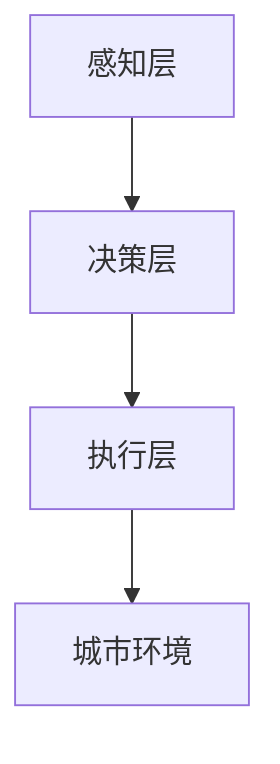
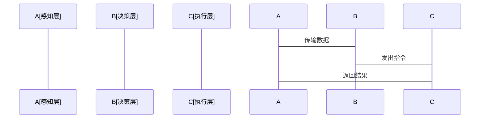

                 


# AI Agent在智慧城市中的应用前景

## 关键词：
- AI Agent
- 智慧城市
- 人工智能
- 智能交通
- 数据分析
- 智能决策

## 摘要：
本文深入探讨了AI Agent在智慧城市建设中的应用前景。通过分析AI Agent的核心原理、算法机制、系统架构以及实际应用场景，结合智能交通、智能能源管理、智能安防等领域的具体案例，揭示了AI Agent如何提升城市管理效率和居民生活质量。文章还展望了AI Agent在智慧城市建设中的未来发展方向及挑战。

---

# 第1章: 智慧城市的基本概念

## 1.1 智慧城市的发展历程

### 1.1.1 从传统城市到智慧城市的演进
城市的演进经历了从传统城市到智慧城市的多个阶段。传统城市以工业生产为核心，依赖人工管理，资源利用效率低下，环境污染严重。随着信息技术的快速发展，城市逐渐向智能化方向转型，智慧城市的建设成为全球关注的焦点。

**关键转折点**：
- **20世纪末**：互联网技术的应用，推动了城市管理的数字化转型。
- **21世纪初**：物联网技术的应用，实现了城市设备的互联互通。
- **近年来**：人工智能技术的突破，推动了城市智能化管理的快速发展。

### 1.1.2 智慧城市的定义与特点
智慧城市建设的目标是通过技术创新，实现城市资源的优化配置和高效管理，提升居民生活质量。以下是智慧城市的核心特点：
- **数据驱动**：利用大数据技术进行城市运行的实时监测和分析。
- **智能化决策**：通过人工智能技术实现城市管理的自动化和智能化。
- **可持续发展**：注重资源的高效利用和环境保护。
- **以人为本**：以居民的需求为核心，提供个性化的服务。

### 1.1.3 智慧城市的核心技术与应用场景
智慧城市建设的核心技术包括：
- **大数据技术**：用于城市数据的采集、存储和分析。
- **人工智能技术**：用于城市管理的智能化决策。
- **物联网技术**：用于城市设备的互联互通。
- **云计算技术**：用于城市数据的存储和计算。

应用场景包括智能交通管理、智能能源管理、智能安防监控等。

---

## 1.2 AI Agent的基本概念

### 1.2.1 AI Agent的定义与特点
AI Agent（人工智能代理）是指具有感知环境、做出决策并执行行动的智能实体。AI Agent的核心特点包括：
- **自主性**：能够在没有外部干预的情况下自主运行。
- **反应性**：能够实时感知环境变化并做出相应的反应。
- **学习能力**：能够通过学习不断提升自身的智能水平。
- **协作性**：能够与其他AI Agent或人类进行协作。

### 1.2.2 AI Agent在智慧城市中的作用
AI Agent在智慧城市建设中扮演着重要角色。其主要作用包括：
- **数据采集与处理**：通过传感器和摄像头等设备，实时采集城市环境数据。
- **智能决策**：基于采集的数据，利用人工智能算法进行分析和决策。
- **执行行动**：根据决策结果，执行相应的行动，如调整交通信号灯、优化能源分配等。

---

## 1.3 智慧城市与AI Agent的结合

### 1.3.1 AI Agent在智慧城市中的应用场景
AI Agent在智慧城市中的应用场景非常广泛，主要包括：
- **智能交通管理**：通过AI Agent实时监测交通流量，优化交通信号灯控制，减少交通拥堵。
- **智能能源管理**：通过AI Agent实时监测能源消耗情况，优化能源分配，降低能源浪费。
- **智能安防监控**：通过AI Agent实时监测城市安防系统，及时发现并处理异常情况。

### 1.3.2 AI Agent在智慧城市中的核心价值
AI Agent在智慧城市中的核心价值体现在以下几个方面：
- **提高城市管理效率**：通过智能化的决策和执行，减少人工干预，提高城市管理效率。
- **优化资源配置**：通过实时数据分析，优化资源配置，降低资源浪费。
- **提升居民生活质量**：通过智能化服务，提升居民的生活质量，例如智能交通可以减少通勤时间。

---

# 第2章: AI Agent的核心原理与算法

## 2.1 AI Agent的核心原理

### 2.1.1 AI Agent的感知与决策机制
AI Agent的感知与决策机制包括以下几个步骤：
1. **数据采集**：通过传感器、摄像头等设备采集城市环境数据。
2. **数据处理**：对采集到的数据进行清洗、转换和存储。
3. **数据分析**：利用大数据技术对数据进行分析，提取有用的信息。
4. **智能决策**：基于分析结果，利用人工智能算法进行决策。

### 2.1.2 AI Agent的算法原理
AI Agent的算法原理主要包括以下几个方面：
- **强化学习**：通过奖励机制，训练AI Agent做出最优决策。
- **监督学习**：通过标注数据训练AI Agent，使其能够准确识别和分类数据。
- **无监督学习**：通过聚类分析等技术，发现数据中的潜在模式。

---

## 2.2 AI Agent的数学模型与公式

### 2.2.1 基于强化学习的AI Agent算法
强化学习是一种常用的人工智能算法，其数学模型如下：
$$ Q(s, a) = r + \gamma \max_{a'} Q(s', a') $$
其中：
- \( Q(s, a) \) 表示在状态 \( s \) 下采取行动 \( a \) 的期望回报值。
- \( r \) 表示立即回报值。
- \( \gamma \) 表示折扣因子，用于权衡当前回报与未来回报的重要性。
- \( \max_{a'} Q(s', a') \) 表示在下一状态 \( s' \) 下，选择能够使期望回报值最大的行动 \( a' \)。

---

## 2.3 AI Agent的系统架构设计

### 2.3.1 系统功能设计
AI Agent的系统功能设计包括以下几个模块：
1. **感知层**：负责采集城市环境数据。
2. **决策层**：负责对采集到的数据进行分析和决策。
3. **执行层**：负责根据决策结果执行相应的行动。

### 2.3.2 系统架构图
以下是一个简单的AI Agent系统架构图：



---

## 2.4 AI Agent的接口设计与交互流程

### 2.4.1 系统接口设计
AI Agent的系统接口设计包括以下几个部分：
1. **数据接口**：用于与传感器、摄像头等设备进行数据交互。
2. **控制接口**：用于与交通信号灯、能源设备等进行控制交互。
3. **用户接口**：用于与城市管理人员和居民进行交互。

### 2.4.2 系统交互流程
以下是一个AI Agent的系统交互流程图：



---

# 第3章: AI Agent在智慧城市中的应用实例

## 3.1 智能交通管理

### 3.1.1 项目背景
随着城市化进程的加快，交通拥堵问题日益严重。AI Agent可以通过实时监测交通流量，优化交通信号灯控制，减少交通拥堵。

### 3.1.2 项目实现
以下是智能交通管理系统的实现代码：

```python
import numpy as np

class AI_Agent:
    def __init__(self):
        self.state = 0  # 0表示正常，1表示拥堵
        self.reward = 0
        self.action = 0  # 0表示绿灯，1表示红灯

    def perceive(self, environment):
        # 根据环境数据更新状态
        if environment['traffic'] > 100:
            self.state = 1
        else:
            self.state = 0

    def decide(self):
        # 根据当前状态决定行动
        if self.state == 1:
            self.action = 1
        else:
            self.action = 0

    def execute(self):
        # 执行行动
        return self.action

# 模拟环境数据
environment = {'traffic': 150}
agent = AI_Agent()
agent.perceive(environment)
agent.decide()
action = agent.execute()
print("Action:", action)
```

### 3.1.3 实例分析
通过上述代码，AI Agent能够根据交通流量的变化，自动调整交通信号灯的状态，从而优化交通流量，减少交通拥堵。

---

## 3.2 智能能源管理

### 3.2.1 项目背景
能源消耗是城市运行的重要组成部分。通过AI Agent实时监测能源消耗情况，优化能源分配，降低能源浪费。

### 3.2.2 项目实现
以下是智能能源管理系统的实现代码：

```python
import numpy as np

class AI_Agent:
    def __init__(self):
        self.state = 0  # 0表示正常，1表示能源过剩
        self.reward = 0
        self.action = 0  # 0表示正常分配，1表示减少分配

    def perceive(self, environment):
        # 根据环境数据更新状态
        if environment['energy'] > 100:
            self.state = 1
        else:
            self.state = 0

    def decide(self):
        # 根据当前状态决定行动
        if self.state == 1:
            self.action = 1
        else:
            self.action = 0

    def execute(self):
        # 执行行动
        return self.action

# 模拟环境数据
environment = {'energy': 120}
agent = AI_Agent()
agent.perceive(environment)
agent.decide()
action = agent.execute()
print("Action:", action)
```

### 3.2.3 实例分析
通过上述代码，AI Agent能够根据能源消耗情况，自动调整能源分配策略，从而优化能源利用效率。

---

## 3.3 智能安防监控

### 3.3.1 项目背景
城市安防监控是智慧城市的重要组成部分。通过AI Agent实时监测城市安防系统，及时发现并处理异常情况。

### 3.3.2 项目实现
以下是智能安防监控系统的实现代码：

```python
import numpy as np

class AI_Agent:
    def __init__(self):
        self.state = 0  # 0表示正常，1表示异常
        self.reward = 0
        self.action = 0  # 0表示正常监控，1表示报警

    def perceive(self, environment):
        # 根据环境数据更新状态
        if environment['security'] > 90:
            self.state = 1
        else:
            self.state = 0

    def decide(self):
        # 根据当前状态决定行动
        if self.state == 1:
            self.action = 1
        else:
            self.action = 0

    def execute(self):
        # 执行行动
        return self.action

# 模拟环境数据
environment = {'security': 95}
agent = AI_Agent()
agent.perceive(environment)
agent.decide()
action = agent.execute()
print("Action:", action)
```

### 3.3.3 实例分析
通过上述代码，AI Agent能够根据安防系统的运行状态，自动发出报警信号，从而及时发现并处理异常情况。

---

# 第4章: 未来展望与挑战

## 4.1 未来发展方向
随着人工智能技术的不断进步，AI Agent在智慧城市建设中的应用前景将更加广阔。未来的发展方向包括：
- **多Agent协作**：通过多个AI Agent的协作，实现更复杂的城市管理任务。
- **强化学习优化**：通过强化学习算法的优化，提升AI Agent的决策能力。
- **边缘计算**：通过边缘计算技术，提升AI Agent的实时性和响应速度。

## 4.2 当前面临的挑战
尽管AI Agent在智慧城市建设中具有广阔的应用前景，但当前仍面临一些挑战：
- **数据隐私问题**：如何保护城市居民的隐私数据，是一个重要的问题。
- **技术瓶颈**：当前的人工智能技术仍存在一些瓶颈，例如算法的可解释性问题。
- **系统集成问题**：如何实现不同AI Agent之间的协同工作，仍是一个挑战。

---

# 作者：AI天才研究院 & 禅与计算机程序设计艺术

