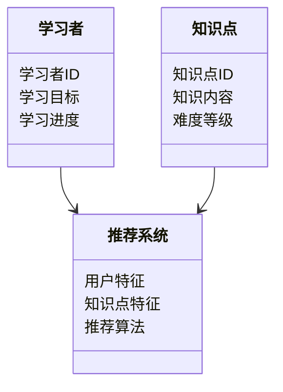
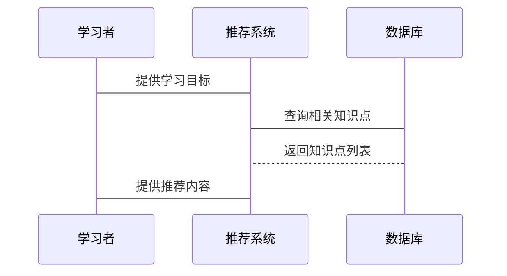

                 


---

# AI Agent在智能个性化学习中的应用

> 关键词：AI Agent, 智能个性化学习, 人工智能教育, 自适应学习系统, 机器学习算法

> 摘要：本文深入探讨了AI Agent在智能个性化学习中的应用，分析了AI Agent的核心原理、个性化学习的理论基础、推荐算法、系统架构设计及实际案例。文章结合理论与实践，详细阐述了AI Agent在教育领域的潜力与挑战，为教育技术的未来发展提供了新的视角。

---

## 第一章: AI Agent与智能个性化学习概述

### 1.1 AI Agent的基本概念

#### 1.1.1 AI Agent的定义
AI Agent（人工智能代理）是指能够感知环境并采取行动以实现目标的智能实体。AI Agent可以通过传感器获取信息，利用计算模型进行决策，并通过执行器与环境互动。AI Agent的核心在于其自主性、反应性和社会性。

**公式示例：**
$$
\text{AI Agent的目标} = f(\text{感知}, \text{决策}, \text{执行})
$$

#### 1.1.2 AI Agent的核心特征
| 特征 | 描述 |
|------|------|
| 自主性 | 能够自主决策和行动 |
| 反应性 | 能够实时感知并响应环境变化 |
| 社会性 | 能够与其他系统或用户进行交互 |

#### 1.1.3 AI Agent与传统算法的区别
传统算法通常需要明确的规则和输入，而AI Agent具有自主性和学习能力，能够根据环境动态调整策略。

### 1.2 智能个性化学习的背景与需求

#### 1.2.1 个性化学习的定义与特点
个性化学习是指根据学习者的个体差异，提供定制化的学习内容和路径。其特点是灵活性、针对性和高效性。

#### 1.2.2 当前教育中的个性化学习挑战
传统教育模式难以满足每个学习者的个性化需求，主要挑战包括学习资源的多样性不足、教师精力有限、学习者需求差异大等。

#### 1.2.3 AI Agent在个性化学习中的作用
AI Agent可以通过分析学习者的行为、偏好和知识水平，提供实时反馈和个性化建议，帮助学习者优化学习路径。

### 1.3 AI Agent在教育领域的应用前景

#### 1.3.1 教育智能化的趋势
随着技术的进步，教育智能化已成为趋势，AI Agent在教育中的应用越来越广泛。

#### 1.3.2 AI Agent在教育中的潜在应用场景
- 智能辅导系统
- 自适应学习平台
- 学习者行为分析与反馈

#### 1.3.3 未来发展趋势与挑战
未来，AI Agent在教育中的应用将更加普及，但同时也面临数据隐私、算法偏见等挑战。

---

## 第二章: AI Agent的核心原理

### 2.1 AI Agent的感知机制

#### 2.1.1 数据采集与处理
AI Agent通过传感器或API接口获取数据，例如学习者的行为数据、环境数据等。

#### 2.1.2 知识表示与推理
知识表示是AI Agent理解世界的关键。常用的知识表示方法包括知识图谱、逻辑推理等。

#### 2.1.3 用户行为分析
通过分析学习者的行为数据，AI Agent可以预测其学习偏好和需求。

### 2.2 AI Agent的决策机制

#### 2.2.1 基于规则的决策
基于预定义的规则进行决策，适用于简单场景。

#### 2.2.2 基于机器学习的决策
利用机器学习模型（如决策树、随机森林）进行预测和决策。

#### 2.2.3 基于强化学习的决策
通过奖励机制优化决策策略，适用于复杂动态环境。

### 2.3 AI Agent的执行机制

#### 2.3.1 动作规划与执行
根据决策结果，AI Agent规划并执行具体动作。

#### 2.3.2 反馈机制与优化
通过反馈不断优化AI Agent的行为策略。

#### 2.3.3 多目标优化策略
在多个目标之间进行权衡，以实现最优决策。

---

## 第三章: 个性化学习的理论与方法

### 3.1 学习者模型构建

#### 3.1.1 学习者特征分析
分析学习者的认知水平、学习风格、兴趣爱好等特征。

#### 3.1.2 学习者知识状态建模
通过知识图谱构建学习者的知识状态模型。

#### 3.1.3 学习者行为预测
基于历史数据预测学习者的未来行为。

### 3.2 知识表示与学习内容推荐

#### 3.2.1 知识图谱构建
构建知识图谱以表示学习内容之间的关系。

#### 3.2.2 内容特征提取
提取学习内容的特征，如主题、难度、相关性等。

#### 3.2.3 基于知识图谱的推荐算法
结合知识图谱和推荐算法，提供个性化学习内容。

### 3.3 学习效果评估与优化

#### 3.3.1 学习效果评估指标
常用的评估指标包括学习时间、正确率、知识点掌握程度等。

#### 3.3.2 基于反馈的优化策略
根据学习者反馈调整推荐策略。

#### 3.3.3 动态调整学习路径
根据学习者进步情况动态调整学习计划。

---

## 第四章: AI Agent在个性化学习中的算法实现

### 4.1 个性化推荐算法

#### 4.1.1 协同过滤推荐算法
协同过滤是一种基于用户相似性推荐内容的算法。

#### 4.1.2 基于内容的推荐算法
基于内容特征进行推荐。

#### 4.1.3 混合推荐算法
结合协同过滤和基于内容的推荐方法，提高推荐效果。

---

## 第五章: 系统架构设计

### 5.1 问题场景介绍
介绍智能个性化学习系统的应用场景和目标。

### 5.2 系统功能设计

#### 5.2.1 领域模型设计
使用Mermaid绘制领域模型类图。



### 5.3 系统架构设计

#### 5.3.1 系统架构图
使用Mermaid绘制系统架构图。


### 5.4 系统交互设计

#### 5.4.1 系统交互图
使用Mermaid绘制交互序列图。



---

## 第六章: 项目实战

### 6.1 环境安装
安装必要的开发环境和工具，如Python、TensorFlow等。

### 6.2 核心实现源代码

#### 6.2.1 推荐算法实现
实现协同过滤推荐算法的Python代码示例。

```python
import numpy as np

def collaborative_filtering(user_ratings, user_id):
    # 假设user_ratings是用户评分矩阵，user_id是目标用户ID
    # 找出与目标用户评分相似的其他用户
    similarities = np.corrcoef(user_ratings.T)
    similar_users = similarities[user_id]
    # 计算目标用户的推荐评分
    recommendations = np.dot(similar_users, user_ratings)
    recommendations = recommendations / np.sum(similar_users)
    return recommendations.argsort()[::-1]
```

#### 6.2.2 知识点特征提取
提取知识点特征的代码示例。

```python
from sklearn.feature_extraction.text import TfidfVectorizer

vectorizer = TfidfVectorizer()
features = vectorizer.fit_transform(知识点内容)
```

### 6.3 实际案例分析

#### 6.3.1 案例介绍
介绍一个具体的智能学习助手项目，分析其系统设计和实现。

#### 6.3.2 代码实现
详细解读核心代码，分析其实现逻辑。

### 6.4 项目测试与优化

#### 6.4.1 测试用例设计
设计测试用例，验证系统功能。

#### 6.4.2 性能优化
优化算法性能，提高推荐效率。

---

## 第七章: 总结与展望

### 7.1 核心总结
总结本文的主要内容和结论，强调AI Agent在智能个性化学习中的重要性。

### 7.2 未来研究方向

#### 7.2.1 更复杂的推荐算法
探索基于深度学习的推荐模型。

#### 7.2.2 多模态数据融合
结合文本、图像、语音等多种数据源，提升推荐精度。

### 7.3 实践中的注意事项

#### 7.3.1 数据隐私保护
重视学习者数据的隐私保护，遵守相关法律法规。

#### 7.3.2 算法公平性
避免算法偏见，确保推荐结果的公平性。

### 7.4 拓展阅读
推荐相关领域的书籍和论文，供读者深入学习。

---

## 作者：AI天才研究院/AI Genius Institute & 禅与计算机程序设计艺术 /Zen And The Art of Computer Programming

---

**注**：本文是一个结构化的技术博客大纲，实际撰写时需要根据具体需求填充更多细节和内容。每个章节可以根据实际需要进一步扩展，添加更多的解释、例子和代码示例。

