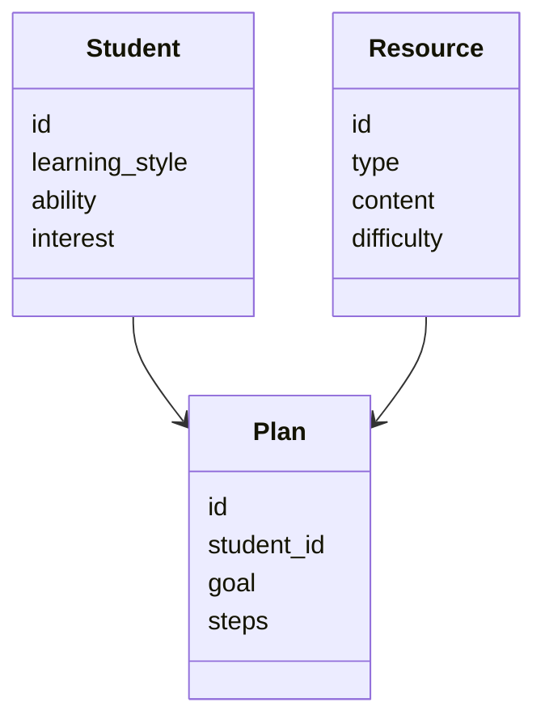

                 


# AI Agent在智能个性化教育规划中的应用

> 关键词：AI Agent，智能个性化教育，教育规划，机器学习，知识图谱，教育技术

> 摘要：本文探讨了AI Agent在智能个性化教育规划中的应用，分析了其核心概念、算法原理、系统架构，并通过案例展示了其在教育领域的实际应用。文章旨在为教育科技从业者、研究人员和学生提供深入的技术见解。

---

## 第一章: AI Agent与智能个性化教育规划概述

### 1.1 AI Agent的基本概念

#### 1.1.1 AI Agent的定义与特点
AI Agent（人工智能代理）是指能够感知环境、自主决策并采取行动以实现目标的智能实体。其特点包括：
- **自主性**：无需外部干预，自主完成任务。
- **反应性**：能够实时感知环境并做出反应。
- **目标导向**：所有行为都以实现特定目标为导向。
- **学习能力**：通过数据和经验不断优化自身的决策能力。

#### 1.1.2 AI Agent的核心功能与分类
AI Agent的核心功能包括感知、推理、学习和行动。根据应用场景的不同，可以分为：
- **简单反射型Agent**：基于规则做出反应，适用于简单任务。
- **基于模型的反射型Agent**：利用内部模型进行推理和决策。
- **目标驱动型Agent**：以明确目标为导向，优化行动路径。

#### 1.1.3 AI Agent在教育领域的应用背景
教育领域的AI Agent主要用于个性化学习、教学辅助和教育管理。通过AI Agent，教育系统能够实时分析学生的学习状态，提供个性化的学习建议和资源推荐。

---

### 1.2 智能个性化教育规划的背景与需求

#### 1.2.1 个性化教育的定义与重要性
个性化教育是指根据学生的兴趣、能力和发展需求，制定个性化的学习计划和教学策略。其重要性体现在：
- 提高学习效率。
- 满足学生的个性化需求。
- 促进学生的全面发展。

#### 1.2.2 当前教育规划中的痛点与挑战
- 教育资源分配不均。
- 教学策略单一，难以满足个性化需求。
- 教育数据分散，难以有效整合和利用。

#### 1.2.3 AI Agent在教育规划中的角色与价值
AI Agent能够通过分析学生数据，优化教育资源的分配，制定个性化的学习计划，并实时调整教学策略，从而提高教育效率和质量。

---

### 1.3 AI Agent在智能个性化教育规划中的应用前景

#### 1.3.1 智能教育规划的核心目标
智能教育规划的核心目标是通过AI技术，实现教育资源的智能化分配和个性化教学。

#### 1.3.2 AI Agent在教育规划中的优势
- **数据驱动**：能够充分利用学生数据，实现精准分析。
- **实时调整**：根据学生的学习状态，实时优化教学策略。
- **高效决策**：通过AI算法，快速做出最优决策。

#### 1.3.3 应用场景与典型案例分析
- **个性化学习路径推荐**：根据学生的学习情况，推荐适合的学习资源和路径。
- **智能教学助手**：辅助教师制定教学计划和课堂管理。
- **教育管理决策支持**：帮助学校优化资源配置和管理策略。

---

## 第二章: AI Agent的核心概念与原理

### 2.1 AI Agent的基本原理

#### 2.1.1 AI Agent的感知与决策机制
AI Agent通过传感器或数据输入接口感知环境，利用算法进行推理和决策，最终输出行动指令。

#### 2.1.2 AI Agent的学习与自适应能力
AI Agent通过机器学习算法，从数据中学习规律，不断优化自身的决策模型。

#### 2.1.3 AI Agent的推理与规划能力
AI Agent利用逻辑推理和规划算法，制定最优的行动方案。

---

### 2.2 智能个性化教育规划的核心要素

#### 2.2.1 学生特征分析
分析学生的兴趣、能力、学习风格和认知特点，为个性化教育提供数据支持。

#### 2.2.2 教育目标与资源匹配
根据学生的特征和教育目标，匹配合适的教育资源和教学策略。

#### 2.2.3 教育规划的动态调整机制
根据学生的学习反馈，动态调整教育规划，确保学习效果的最大化。

---

### 2.3 AI Agent与教育规划的关联性分析

#### 2.3.1 AI Agent在教育规划中的关键作用
- 数据分析与处理。
- 个性化推荐与决策支持。
- 实时反馈与动态调整。

#### 2.3.2 教育规划中的数据流与信息处理
数据流包括学生数据、教育资源数据和教学反馈数据。信息处理包括数据清洗、特征提取、模型训练和结果输出。

#### 2.3.3 AI Agent与教育规划的协同优化
AI Agent通过优化算法，协同教育规划中的各个要素，实现整体效果的提升。

---

## 第三章: AI Agent的算法原理与实现

### 3.1 基于机器学习的教育规划算法

#### 3.1.1 监督学习在教育规划中的应用
- **回归算法**：预测学生的学习成绩。
- **分类算法**：识别学生的学习风格。

#### 3.1.2 非监督学习在教育规划中的应用
- **聚类算法**：将学生分成不同的学习群体。

#### 3.1.3 强化学习在教育规划中的应用
- **Q-Learning**：优化教学策略。

---

### 3.2 基于知识图谱的教育规划算法

#### 3.2.1 知识图谱的构建与表示
通过知识抽取、图构建和知识融合，构建教育领域的知识图谱。

#### 3.2.2 基于知识图谱的推理算法
- **路径推理**：推理出学生需要学习的知识点。

#### 3.2.3 知识图谱在教育规划中的应用
- **个性化推荐**：根据学生的学习情况，推荐相关知识点。

---

### 3.3 基于规则的教育规划算法

#### 3.3.1 规则的制定与优化
根据教育专家的经验，制定教学规则，并通过数据反馈不断优化规则。

#### 3.3.2 规则的应用与实现
通过规则引擎，实现规则的自动化应用。

---

## 第四章: 数学模型与公式解析

### 4.1 基于机器学习的数学模型

#### 4.1.1 线性回归模型
$$ y = \beta_0 + \beta_1x + \epsilon $$

#### 4.1.2 支持向量机模型
$$ \text{目标函数}：\max(\frac{1}{2}\|w\|^2) $$
$$ \text{约束条件}：y_i(w\cdot x_i + b) \geq 1 $$

---

## 第五章: 系统分析与架构设计

### 5.1 系统功能设计

#### 5.1.1 领域模型设计


---

## 第六章: 项目实战

### 6.1 环境安装与代码实现

#### 6.1.1 环境安装
```bash
pip install numpy
pip install scikit-learn
pip install networkx
```

#### 6.1.2 核心代码实现
```python
from sklearn.linear_model import LinearRegression
import numpy as np

# 示例数据
X = np.array([[1], [2], [3], [4]])
y = [1, 2, 3, 4]

# 模型训练
model = LinearRegression()
model.fit(X, y)

# 预测
print(model.predict(np.array([[5]])))
```

---

## 第七章: 总结与展望

### 7.1 本章总结
本文详细探讨了AI Agent在智能个性化教育规划中的应用，分析了其核心概念、算法原理和系统架构，并通过案例展示了其实际应用。

### 7.2 未来展望
未来，随着AI技术的不断发展，AI Agent在教育规划中的应用将更加广泛和深入，教育个性化将得到进一步提升。

---

**作者：AI天才研究院 & 禅与计算机程序设计艺术**

