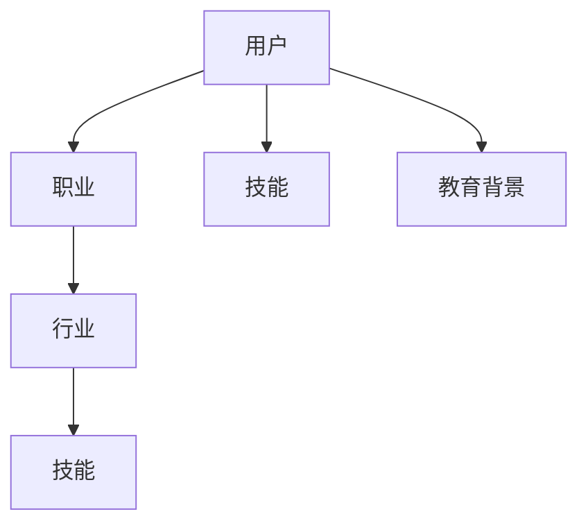
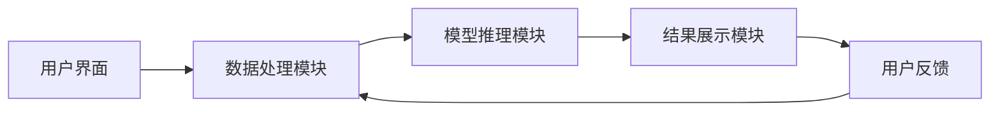

                 


# 《AI Agent在智能个性化职业规划中的应用》

## 关键词：AI Agent, 智能职业规划, 个性化, 算法原理, 系统架构

## 摘要：  
AI Agent（人工智能代理）在智能个性化职业规划中的应用，通过数据分析、机器学习和自然语言处理等技术，为用户提供精准的职业建议和动态调整的职业路径。本文从背景、算法原理、系统架构到项目实战，详细探讨AI Agent在职业规划中的创新应用，为读者提供理论与实践相结合的深度解析。

---

# 第一部分: AI Agent在智能个性化职业规划中的背景

## 第1章: AI Agent与智能职业规划的背景

### 1.1 AI Agent的基本概念  
#### 1.1.1 AI Agent的定义  
AI Agent是一种能够感知环境、自主决策并执行任务的智能实体。它通过数据驱动的方式，帮助用户实现特定目标。  

#### 1.1.2 AI Agent的核心特征  
- **自主性**：能够自主决策和行动。  
- **反应性**：能够实时感知环境变化并做出反应。  
- **学习性**：通过数据和反馈不断优化自身能力。  

#### 1.1.3 AI Agent与传统职业规划工具的区别  
传统职业规划工具通常基于静态的数据分析，而AI Agent能够动态调整职业建议，提供更个性化的服务。

---

### 1.2 智能个性化职业规划的背景  

#### 1.2.1 当前职业规划的痛点与挑战  
- **信息不对称**：用户难以获取全面的职业信息。  
- **个性化不足**：传统职业规划工具难以满足个体差异需求。  
- **动态变化**：职业市场快速变化，需要实时调整建议。  

#### 1.2.2 AI技术在职业规划中的应用潜力  
- **数据驱动**：通过大数据分析，精准匹配职业方向。  
- **智能推荐**：基于机器学习算法，提供个性化的职业建议。  
- **动态调整**：实时跟踪职业市场的变化，优化职业路径。  

#### 1.2.3 智能个性化职业规划的目标与价值  
- **目标**：帮助用户制定个性化的职业发展计划，提升职业竞争力。  
- **价值**：通过AI技术，提高职业规划的效率和精准度，降低职业风险。

---

## 第2章: AI Agent在职业规划中的核心问题  

### 2.1 职业规划中的关键问题  

#### 2.1.1 个性化需求分析  
- 用户的职业目标、兴趣爱好、技能优势等。  

#### 2.1.2 职业路径预测  
- 基于市场趋势和用户能力，预测未来的职业发展方向。  

#### 2.1.3 职业技能提升建议  
- 根据职业需求，推荐相关的技能培训和学习资源。  

---

### 2.2 AI Agent解决这些问题的思路  

#### 2.2.1 数据驱动的个性化分析  
- 收集用户数据，构建用户画像。  

#### 2.2.2 智能推荐算法的应用  
- 使用协同过滤、聚类等算法，推荐职业方向。  

#### 2.2.3 动态调整与反馈机制  
- 根据用户反馈和市场变化，实时优化职业建议。

---

## 第3章: AI Agent的核心概念与联系  

### 3.1 AI Agent的核心概念  

#### 3.1.1 知识图谱构建  
- 将职业信息结构化，构建知识图谱。  

#### 3.1.2 用户画像建模  
- 基于用户数据，构建个性化的职业需求模型。  

#### 3.1.3 职业路径网络  
- 基于知识图谱，构建职业路径网络，展示职业之间的关联关系。

---

### 3.2 核心概念的属性对比  

#### 3.2.1 知识图谱与用户画像的对比分析  
| 特性 | 知识图谱 | 用户画像 |
|------|---------|----------|
| 数据来源 | 职业信息、行业数据 | 用户简历、技能测试 |
| 目标 | 描述职业关系 | 描述用户需求 |
| 应用 | 推荐职业方向 | 动态调整职业建议 |

---

#### 3.2.2 职业路径网络的特征与优势  
- **特征**：基于知识图谱构建，能够展示职业之间的关联关系。  
- **优势**：通过网络分析，可以发现潜在的职业机会和路径。

---

### 3.3 ER实体关系图架构  



---

# 第二部分: AI Agent的算法原理与数学模型

## 第4章: AI Agent的算法原理

### 4.1 基于强化学习的决策模型  

#### 4.1.1 强化学习的基本原理  
- **定义**：通过智能体与环境的交互，学习最优策略。  
- **三要素**：状态、动作、奖励。  

#### 4.1.2 在职业规划中的应用  
- **状态**：当前的职业阶段。  
- **动作**：职业选择或技能提升。  
- **奖励**：职业发展的成功概率。  

#### 4.1.3 算法流程图  


---

### 4.2 基于监督学习的分类算法  

#### 4.2.1 算法原理  
- **逻辑回归**：用于职业匹配的二分类问题。  
- **随机森林**：用于职业路径的多分类问题。  

#### 4.2.2 数学公式  
- **逻辑回归**：  
  $$ P(y=1|x) = \frac{1}{1 + e^{-\beta x}} $$  

---

### 4.3 基于聚类分析的用户分群  

#### 4.3.1 算法原理  
- **K-means**：将用户分为不同的职业发展方向。  

#### 4.3.2 数学公式  
- **目标函数**：  
  $$ \text{目标} = \sum_{i=1}^{n} \min_{k} (x_i - c_k)^2 $$  

---

## 第5章: 算法实现与案例分析

### 5.1 算法实现  

#### 5.1.1 环境配置  
- **工具**：Python、TensorFlow、Scikit-learn。  

#### 5.1.2 核心代码实现  

```python
import numpy as np
from sklearn.linear_model import LogisticRegression

# 示例数据
X = np.array([[2, 3], [4, 5], [6, 7], [8, 9]])
y = np.array([0, 1, 1, 0])

# 训练模型
model = LogisticRegression()
model.fit(X, y)

# 预测
print(model.predict([[5, 6]]))  # 输出：[1]
```

---

### 5.2 案例分析  

#### 5.2.1 案例背景  
- 用户：25岁，本科毕业，计算机专业，希望从事AI相关职业。  

#### 5.2.2 算法应用  
- 使用逻辑回归算法，预测用户的职业方向。  

#### 5.2.3 结果解读  
- 输出结果：1，代表推荐AI工程师方向。  

---

## 第6章: 系统架构与接口设计

### 6.1 系统架构设计  



---

### 6.2 接口设计  

#### 6.2.1 RESTful API  
- **GET /api/v1/planner**：获取职业规划建议。  
- **POST /api/v1/skills**：提交技能测试结果。  

---

### 6.3 交互流程图  


---

## 第7章: 项目实战与最佳实践

### 7.1 项目实战  

#### 7.1.1 环境配置  
- 安装依赖：`pip install numpy scikit-learn`。  

#### 7.1.2 核心代码实现  

```python
from sklearn.datasets import make_classification
from sklearn.model_selection import train_test_split
from sklearn.metrics import accuracy_score

# 示例数据集
X, y = make_classification(n_samples=100, n_features=2, n_classes=2, random_state=42)

# 划分训练集与测试集
X_train, X_test, y_train, y_test = train_test_split(X, y, test_size=0.2, random_state=42)

# 训练模型
model = LogisticRegression()
model.fit(X_train, y_train)

# 验证
print("Accuracy:", accuracy_score(y_test, model.predict(X_test)))
```

---

### 7.2 最佳实践  

#### 7.2.1 数据质量的重要性  
- 数据越全面，结果越精准。  

#### 7.2.2 模型迭代的必要性  
- 定期更新模型，适应市场变化。  

#### 7.2.3 用户隐私的保护  
- 确保用户数据的安全性，遵守相关法律法规。

---

## 第8章: 总结与展望

### 8.1 总结  
AI Agent在智能个性化职业规划中的应用，通过数据分析、机器学习等技术，为用户提供了高效、精准的职业建议。  

### 8.2 展望  
随着AI技术的不断发展，未来的智能职业规划将更加个性化、动态化和智能化。

---

# 作者：AI天才研究院/AI Genius Institute & 禅与计算机程序设计艺术 /Zen And The Art of Computer Programming

