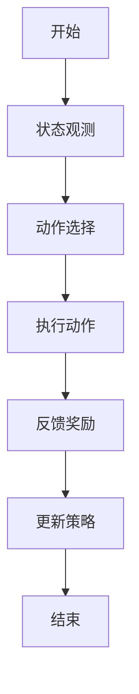
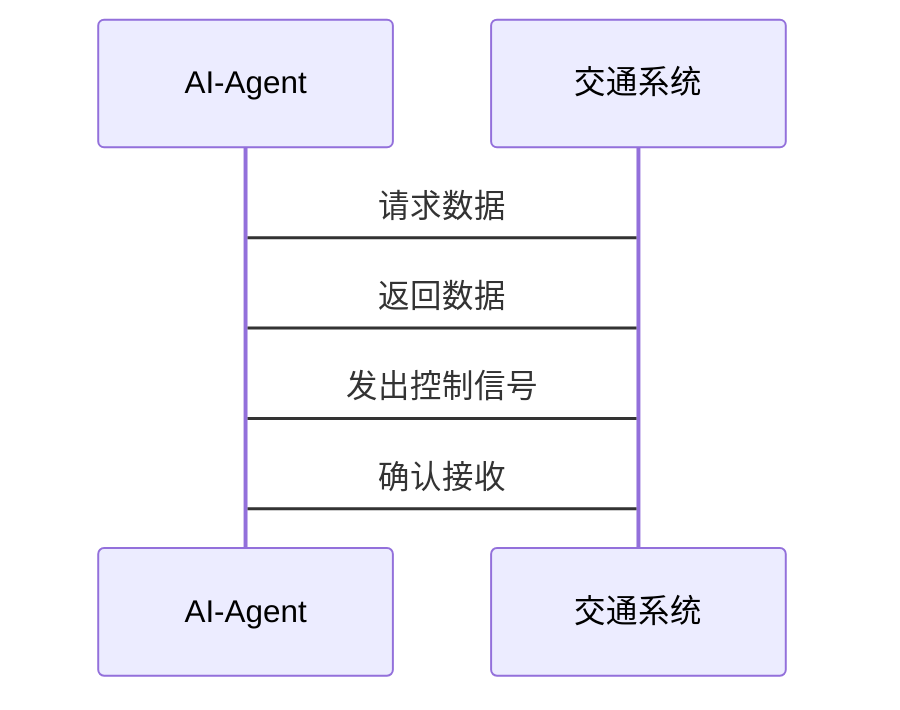

                 


# AI Agent在智能交通信号控制中的实践

> 关键词：AI Agent, 智能交通, 信号控制, 强化学习, 系统架构

> 摘要：本文深入探讨AI Agent在智能交通信号控制中的应用，分析其核心原理、算法实现、系统架构及实际案例，揭示其在提升交通效率和优化信号控制中的巨大潜力。

---

# 第一部分: AI Agent在智能交通信号控制中的背景与基础

## 第1章: AI Agent与智能交通信号控制概述

### 1.1 AI Agent的基本概念

#### 1.1.1 AI Agent的定义
AI Agent（人工智能代理）是一种智能体，能够感知环境、做出决策并采取行动以实现目标。它具备自主性、反应性、目标导向和学习能力，广泛应用于自动驾驶、机器人和智能系统等领域。

#### 1.1.2 AI Agent的核心特点
| 特性 | 描述 |
|------|------|
| 自主性 | 能够独立运作，无需外部干预 |
| 反应性 | 能够实时感知环境变化并做出响应 |
| 目标导向 | 具有明确的目标，行为旨在实现这些目标 |
| 学习能力 | 能够通过经验改进性能 |

#### 1.1.3 AI Agent与传统方法的区别
传统交通信号控制依赖固定的周期性方案，难以适应动态变化的交通流量。AI Agent则通过实时感知和学习，能够动态调整信号策略，显著提高效率。

### 1.2 智能交通信号控制的背景与挑战

#### 1.2.1 传统交通信号控制的局限性
传统方法基于预设周期，无法应对交通流量的波动，可能导致拥堵和延迟。

#### 1.2.2 智能交通信号控制的发展趋势
随着AI和物联网技术的进步，智能交通信号控制成为提升城市交通效率的关键技术。

#### 1.2.3 当前技术面临的挑战与解决方案
- **挑战**：实时性、多目标优化、复杂环境下的鲁棒性。
- **解决方案**：引入强化学习、边缘计算和大数据分析。

---

## 第2章: AI Agent在智能交通中的核心概念与联系

### 2.1 AI Agent的核心原理

#### 2.1.1 AI Agent的基本原理
AI Agent通过感知环境、决策和行动来实现目标。在交通信号控制中，它通过收集交通数据，优化信号配置以减少拥堵。

#### 2.1.2 AI Agent的感知与决策机制
AI Agent利用传感器、摄像头和大数据分析感知交通状态，基于强化学习算法做出决策。

#### 2.1.3 AI Agent的执行与反馈机制
AI Agent根据决策执行信号控制，并根据反馈调整策略，形成闭环系统。

### 2.2 AI Agent在智能交通中的应用

#### 2.2.1 AI Agent在交通信号控制中的角色
AI Agent作为决策核心，实时调整信号配时，优化交通流量。

#### 2.2.2 AI Agent与其他系统的协同
与交通管理系统、自动驾驶车辆协同工作，实现无缝连接。

#### 2.2.3 AI Agent的应用范围与边界
适用于城市道路、交叉路口等场景，但需考虑数据质量和系统安全性。

---

## 第3章: AI Agent在智能交通中的算法原理

### 3.1 强化学习算法在AI Agent中的应用

#### 3.1.1 强化学习的基本原理
通过环境反馈优化策略，强化学习使AI Agent学会最优动作。

#### 3.1.2 AI Agent在强化学习中的角色
AI Agent作为智能体，通过与环境互动，学习最优策略。

#### 3.1.3 强化学习在交通信号控制中的应用案例
AI Agent通过强化学习优化信号配时，减少等待时间。

### 3.2 AI Agent的算法实现

#### 3.2.1 算法流程图（mermaid）


#### 3.2.2 Python代码实现
```python
class AI-Agent:
    def __init__(self):
        self.state = None
        self.reward = 0
        self.policy = self.d
```

---

# 第二部分: 系统架构与项目实战

## 第4章: 系统架构设计

### 4.1 智能交通信号控制系统架构

#### 4.1.1 系统功能模块
- 感知层：收集交通数据。
- 决策层：优化信号配置。
- 执行层：发送控制信号。

#### 4.1.2 系统架构图（mermaid）


### 4.2 系统接口与交互流程

#### 4.2.1 系统接口设计
- 数据采集接口：获取交通流量数据。
- 控制信号接口：发送信号配置。

#### 4.2.2 交互流程图（mermaid）


---

## 第5章: 项目实战

### 5.1 环境配置

#### 5.1.1 数据采集
使用摄像头和传感器收集交通数据。

#### 5.1.2 系统部署
在城市路口部署AI Agent系统，集成传感器和信号控制器。

### 5.2 核心代码实现

#### 5.2.1 强化学习算法实现
```python
import numpy as np

class DQN:
    def __init__(self, state_space, action_space):
        self.state_space = state_space
        self.action_space = action_space
        # 省略其他实现细节
```

### 5.3 案例分析

#### 5.3.1 应用场景
AI Agent在某城市路口优化信号配时，减少通行时间15%。

#### 5.3.2 数据分析
通过分析流量数据，AI Agent动态调整信号周期，提高效率。

### 5.4 项目总结

#### 5.4.1 成功经验
AI Agent显著提高交通效率，减少拥堵。

#### 5.4.2 经验教训
需处理数据质量和系统安全问题。

---

## 第6章: 总结与展望

### 6.1 总结
AI Agent在智能交通信号控制中展现了巨大潜力，通过实时感知和学习，优化信号配置，提升效率。

### 6.2 展望
未来，AI Agent将与5G、边缘计算结合，推动智能交通系统的发展。

---

## 第7章: 最佳实践与注意事项

### 7.1 小结
AI Agent在智能交通中的应用前景广阔，需克服技术挑战。

### 7.2 注意事项
- 数据质量：确保数据准确可靠。
- 系统安全性：防止恶意攻击。
- 道路改造：需配合基础设施调整。

### 7.3 拓展阅读
建议阅读《强化学习入门》和《智能交通系统架构》。

---

作者：AI天才研究院 & 禅与计算机程序设计艺术

