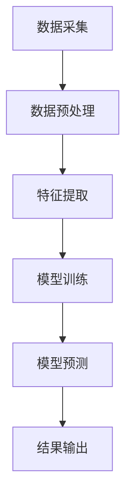
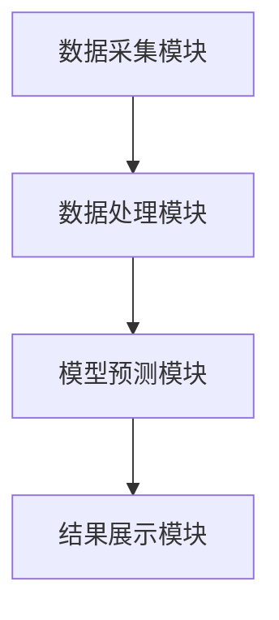

                 


# 《AI Agent在智能交通拥堵预测中的实践》

> 关键词：AI Agent, 智能交通, 交通拥堵预测, 机器学习, 深度学习

> 摘要：本文详细探讨了AI Agent在智能交通拥堵预测中的实践应用，从问题背景、核心概念、算法原理、系统架构到项目实战，全面解析了AI Agent如何助力智能交通拥堵预测。通过理论与实践的结合，本文旨在为交通管理部门和研究人员提供一种高效、智能的解决方案。

---

# 第1章: 智能交通拥堵预测的背景与问题描述

## 1.1 交通拥堵问题的背景

### 1.1.1 城市交通拥堵的现状与挑战

随着城市化进程的加快，交通拥堵问题日益严重。根据统计，全球每年因交通拥堵造成的经济损失高达数千亿美元。交通拥堵不仅浪费时间，还增加了燃料消耗和污染物排放，对环境和公共健康造成负面影响。

### 1.1.2 交通拥堵对社会经济的影响

- **经济成本**：交通拥堵导致物流效率下降，企业成本增加。
- **时间成本**：通勤时间延长，影响个人生活和工作效率。
- **环境成本**：尾气排放增加，加剧空气污染。

### 1.1.3 智能交通管理的发展趋势

智能交通系统（ITS）通过大数据、人工智能等技术，实现交通管理的智能化和高效化。AI Agent作为 ITS 的重要组成部分，能够实时感知交通状态，优化交通流量。

## 1.2 AI Agent在交通系统中的应用前景

### 1.2.1 AI Agent的基本概念与特点

AI Agent是一种智能体，能够感知环境、自主决策并执行任务。其特点包括：

- **自主性**：无需外部干预，自主完成任务。
- **反应性**：能够实时感知环境变化并做出反应。
- **学习能力**：通过机器学习不断优化性能。

### 1.2.2 AI Agent在智能交通中的优势

- **实时性**：能够快速处理交通数据，实时预测拥堵情况。
- **准确性**：通过机器学习算法，提高预测的准确性。
- **可扩展性**：能够适应不同规模的交通网络。

### 1.2.3 智能交通拥堵预测的核心问题

智能交通拥堵预测的核心问题是通过历史数据和实时数据，预测未来某一时刻的交通状态，并制定相应的优化策略。

## 1.3 本章小结

本章从交通拥堵的现状、影响以及智能交通管理的发展趋势入手，介绍了AI Agent的基本概念和特点，分析了其在智能交通中的优势，并明确了智能交通拥堵预测的核心问题。

---

# 第2章: AI Agent与智能交通系统的概念解析

## 2.1 AI Agent的基本原理

### 2.1.1 AI Agent的定义与分类

AI Agent可以分为两类：

- **简单反射型Agent**：基于当前感知做出反应，适用于简单的决策任务。
- **基于模型的反射型Agent**：具有内部状态，能够根据环境信息和内部模型做出决策。

### 2.1.2 AI Agent的核心功能与特性

- **感知能力**：通过传感器或数据源获取环境信息。
- **决策能力**：基于感知信息做出决策。
- **执行能力**：通过执行器或接口执行决策。

### 2.1.3 AI Agent与传统算法的区别

传统算法依赖于规则和固定的逻辑，而AI Agent能够通过学习不断优化性能，适应环境变化。

## 2.2 智能交通系统（ITS）的概念与架构

### 2.2.1 ITS的基本概念

智能交通系统（ITS）是一种利用先进的信息技术，提高交通系统效率和安全性的系统。

### 2.2.2 ITS的主要组成部分

- **数据采集模块**：包括交通传感器、摄像头等。
- **数据处理模块**：对采集到的数据进行清洗、特征提取等处理。
- **预测模型**：基于机器学习或深度学习算法，预测交通状态。
- **优化模块**：根据预测结果优化交通信号灯、路线等。

### 2.2.3 ITS与AI Agent的结合

AI Agent作为ITS的核心组件，能够实时感知交通状态，优化交通流量。

## 2.3 AI Agent在交通拥堵预测中的作用

### 2.3.1 AI Agent在数据采集与处理中的应用

- **数据采集**：通过传感器、摄像头等设备实时采集交通数据。
- **数据预处理**：清洗数据，提取特征。

### 2.3.2 AI Agent在交通流预测中的作用

- **实时预测**：基于历史数据和实时数据，预测未来交通状态。
- **模型优化**：通过机器学习算法不断优化预测模型。

### 2.3.3 AI Agent在优化交通信号灯控制中的应用

- **信号灯优化**：根据交通流量动态调整信号灯配时，缓解拥堵。

## 2.4 本章小结

本章详细介绍了AI Agent的基本原理、ITS的概念与架构，以及AI Agent在交通拥堵预测中的作用。

---

# 第3章: 交通拥堵预测的核心算法原理

## 3.1 交通流量预测的基本方法

### 3.1.1 时间序列分析法

时间序列分析法通过分析历史数据，预测未来趋势。常用的方法包括ARIMA（自回归积分滑动平均模型）和GARCH（广义自回归条件异方差模型）。

#### ARIMA模型

ARIMA模型通过自回归和滑动平均部分拟合数据，适用于具有趋势和季节性的数据。模型公式为：

$$ ARIMA(p, d, q) $$

其中，$p$ 是自回归阶数，$d$ 是差分阶数，$q$ 是滑动平均阶数。

### 3.1.2 机器学习算法

机器学习算法通过训练数据，学习交通流量的模式。常用算法包括线性回归、支持向量机（SVM）和随机森林（Random Forest）。

#### 支持向量机（SVM）

SVM通过构建超平面，将数据分为不同类别。对于回归问题，SVM可以使用$\epsilon$-Insensitive SVM。

### 3.1.3 深度学习算法

深度学习算法通过多层神经网络，学习复杂的交通流量模式。常用模型包括卷积神经网络（CNN）、循环神经网络（RNN）和长短期记忆网络（LSTM）。

#### LSTM网络

LSTM通过记忆单元和遗忘门，有效处理时间序列数据。模型结构包括输入门、遗忘门和输出门。

$$ i = \sigma(W_i x + U_i h_{prev}) $$
$$ f = \sigma(W_f x + U_f h_{prev}) $$
$$ o = \sigma(W_o x + U_o h_{prev}) $$
$$ g = tanh(W_g x + U_g h_{prev}) $$
$$ h = h_{prev} \circ f + g \circ o $$

## 3.2 基于AI Agent的交通拥堵预测模型

### 3.2.1 模型的基本架构

AI Agent交通拥堵预测模型通常包括数据采集、数据处理、模型训练和预测四个部分。

### 3.2.2 模型的输入与输出

- **输入**：交通流量数据、天气数据、事件数据等。
- **输出**：交通拥堵概率、拥堵位置、建议的优化策略。

### 3.2.3 模型的训练与优化

- **训练数据**：历史交通数据。
- **优化目标**：最小化预测误差，通常使用均方误差（MSE）或交叉熵损失。

## 3.3 算法的数学模型与公式

### 3.3.1 时间序列分析的数学模型

ARIMA模型的数学表达式为：

$$ y_t = \phi y_{t-1} + \theta \epsilon_{t-1} + \epsilon_t $$

其中，$\phi$ 是自回归系数，$\theta$ 是滑动平均系数，$\epsilon_t$ 是白噪声。

### 3.3.2 机器学习算法的核心公式

支持向量回归（SVR）的目标是最小化经验风险和正则化项：

$$ \min_{w, b, \xi} \frac{1}{2}||w||^2 + C \sum_{i=1}^n \xi_i $$

约束条件：

$$ |y_i - w^T x_i - b| \leq \xi_i $$

### 3.3.3 深度学习模型的数学基础

LSTM单元的输出门公式：

$$ o = \sigma(W_o x + U_o h_{prev} + b_o) $$

其中，$\sigma$ 是sigmoid函数，$W_o$ 和 $U_o$ 是权重矩阵，$b_o$ 是偏置项。

## 3.4 算法流程图（Mermaid）



## 3.5 本章小结

本章介绍了交通流量预测的基本方法，包括时间序列分析、机器学习和深度学习算法，并详细讲解了AI Agent交通拥堵预测模型的数学模型和算法流程。

---

# 第4章: 交通拥堵预测系统的系统架构设计

## 4.1 系统整体架构

### 4.1.1 系统的功能模块划分

- **数据采集模块**：负责采集交通流量、天气等数据。
- **数据处理模块**：对数据进行清洗、特征提取等处理。
- **模型预测模块**：基于机器学习或深度学习算法，预测交通拥堵情况。
- **结果展示模块**：将预测结果可视化，提供优化建议。

### 4.1.2 系统的分层架构

- **数据层**：存储原始数据和处理后的数据。
- **计算层**：负责数据处理和模型训练。
- **应用层**：提供用户界面和优化建议。

### 4.1.3 系统的可扩展性设计

通过模块化设计，系统可以方便地扩展功能，例如增加新的数据源或优化算法。

## 4.2 系统功能设计

### 4.2.1 数据采集模块

- **功能**：实时采集交通流量数据。
- **输入**：传感器数据、摄像头数据等。
- **输出**：清洗后的数据。

### 4.2.2 数据处理模块

- **功能**：对数据进行特征提取和标准化处理。
- **输入**：原始数据。
- **输出**：处理后的数据。

### 4.2.3 模型预测模块

- **功能**：基于机器学习或深度学习算法，预测交通拥堵情况。
- **输入**：处理后的数据。
- **输出**：预测结果。

### 4.2.4 结果展示模块

- **功能**：将预测结果可视化，并提供优化建议。
- **输入**：预测结果。
- **输出**：可视化界面和优化策略。

## 4.3 系统架构图（Mermaid）



## 4.4 本章小结

本章详细介绍了交通拥堵预测系统的整体架构和功能模块设计，展示了系统的可扩展性和模块化设计。

---

# 第5章: 交通拥堵预测系统的项目实战

## 5.1 项目介绍

### 5.1.1 项目背景

本项目旨在通过AI Agent技术，实现对城市交通拥堵的实时预测和优化。

### 5.1.2 项目目标

- 实时采集交通流量数据。
- 基于机器学习算法，预测交通拥堵情况。
- 提供优化建议，缓解交通拥堵。

## 5.2 系统实现

### 5.2.1 环境安装

- **Python**：3.8及以上版本。
- **机器学习库**：scikit-learn、Keras、TensorFlow。
- **数据处理库**：Pandas、NumPy。

### 5.2.2 核心代码实现

#### 数据采集模块

```python
import pandas as pd
import requests

def collect_data():
    # 从API获取交通数据
    response = requests.get('http://localhost:8000/api/traffic')
    data = pd.json_normalize(response.json())
    return data
```

#### 数据处理模块

```python
import pandas as pd
from sklearn.preprocessing import StandardScaler

def preprocess_data(data):
    # 删除缺失值
    data = data.dropna()
    # 标准化处理
    scaler = StandardScaler()
    data[['speed', 'volume']] = scaler.fit_transform(data[['speed', 'volume']])
    return data
```

#### 模型预测模块

```python
from sklearn.ensemble import RandomForestRegressor
import joblib

def train_model(data):
    # 训练随机森林模型
    model = RandomForestRegressor(n_estimators=100, random_state=42)
    model.fit(data[['speed', 'volume']], data['label'])
    # 保存模型
    joblib.dump(model, 'traffic_model.pkl')
    return model

def predict_traffic(model):
    # 预测交通拥堵情况
    new_data = pd.DataFrame({'speed': [10, 20, 30], 'volume': [50, 60, 70]})
    predictions = model.predict(new_data)
    return predictions
```

#### 结果展示模块

```python
import matplotlib.pyplot as plt

def visualize_predictions(predictions):
    plt.plot(predictions)
    plt.xlabel('Time')
    plt.ylabel('Traffic Congestion Level')
    plt.title('Traffic Congestion Prediction')
    plt.show()
```

## 5.3 项目总结

### 5.3.1 项目小结

本项目通过AI Agent技术，实现了对城市交通拥堵的实时预测和优化。通过数据采集、处理、建模和可视化，展示了AI Agent在智能交通管理中的应用潜力。

### 5.3.2 最佳实践 tips

- 数据预处理是关键，确保数据质量。
- 选择合适的算法，根据数据特性进行调整。
- 模型优化需要不断迭代，尝试不同的超参数和模型结构。

## 5.4 本章小结

本章通过一个实际项目，详细讲解了AI Agent在交通拥堵预测中的应用，展示了系统的实现过程和最佳实践。

---

# 第6章: 总结与展望

## 6.1 总结

本文详细探讨了AI Agent在智能交通拥堵预测中的实践应用，从问题背景、核心概念、算法原理到系统架构和项目实战，全面解析了AI Agent如何助力智能交通管理。

## 6.2 展望

随着人工智能技术的不断发展，AI Agent在智能交通中的应用将更加广泛。未来的研究方向包括：

- 更高效的算法优化。
- 更精准的交通状态预测。
- 更智能的交通管理策略。

## 6.3 本章小结

本文总结了AI Agent在智能交通拥堵预测中的应用，并展望了未来的发展方向。

---

# 作者：AI天才研究院/AI Genius Institute & 禅与计算机程序设计艺术 /Zen And The Art of Computer Programming

