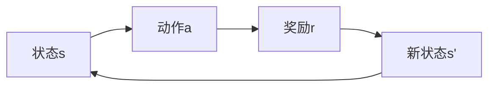
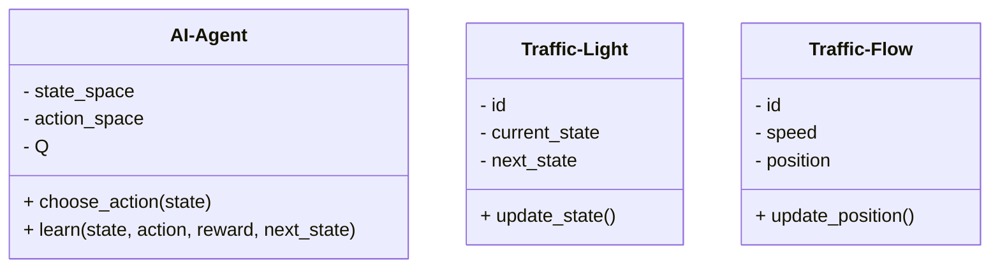
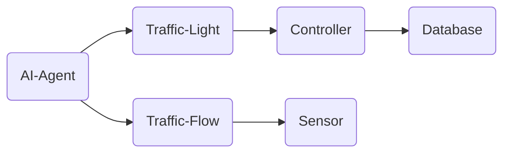
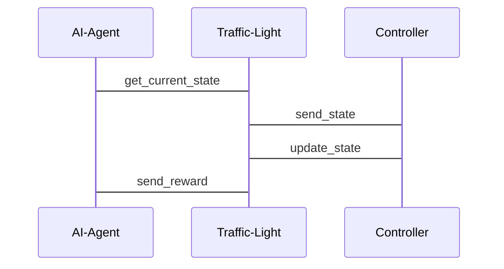

                 


# AI Agent在智能交通流量优化中的角色

> 关键词：AI Agent, 智能交通系统, 交通流量优化, 强化学习, 算法实现, 系统架构

> 摘要：本文探讨了AI Agent在智能交通流量优化中的核心作用，从背景介绍、核心概念、算法原理、系统架构到项目实战，全面解析了AI Agent如何通过强化学习优化交通流量。文章结合数学模型、算法流程图和系统架构图，深入浅出地展示了AI Agent在智能交通中的应用潜力和实际价值。

---

# 第一部分: AI Agent在智能交通流量优化中的背景与概念

## 第1章: AI Agent与智能交通流量优化概述

### 1.1 问题背景与挑战

#### 1.1.1 传统交通流量管理的局限性
传统的交通流量管理依赖于人工操作和简单的信号灯控制，存在以下问题：
- 交通流量预测不准确，无法实时调整信号灯周期。
- 交通拥堵现象频发，尤其是在高峰时段。
- 信号灯控制策略固定，无法适应复杂的交通场景。

#### 1.1.2 智能交通系统的发展需求
随着城市化进程的加快和车辆数量的激增，传统的交通管理方式已经无法满足现代交通系统的需求。智能交通系统（Intelligent Transportation System, ITS）通过引入人工智能（AI）、大数据和物联网（IoT）等技术，能够实现交通流量的实时监控和优化。

#### 1.1.3 AI Agent在交通优化中的作用
AI Agent（人工智能代理）是一种能够感知环境、自主决策并采取行动的智能体。在智能交通系统中，AI Agent可以实时分析交通流量数据，优化信号灯控制策略，减少交通拥堵，提高道路利用率。

### 1.2 AI Agent的核心概念与特点

#### 1.2.1 AI Agent的定义与分类
AI Agent是一种能够感知环境、自主决策并采取行动的智能体。根据功能和应用场景的不同，AI Agent可以分为以下几类：
- **反应式AI Agent**：基于当前环境信息做出反应，如实时调整信号灯周期。
- **认知式AI Agent**：具有复杂推理和规划能力，能够预测未来交通状况。

#### 1.2.2 AI Agent在交通优化中的属性特征对比表

| 属性          | 传统信号灯控制 | AI Agent控制 |
|---------------|----------------|--------------|
| 决策方式      | 固定周期        | 自主决策      |
| 响应速度      | 较慢           | 实时响应      |
| 适应性        | 低             | 高            |

#### 1.2.3 AI Agent的ER实体关系图

```mermaid
er
actor(Agent, [ID, 类型, 功能], unique ID)
actor(Route, [ID, 长度, 状态], unique ID)
actor(Vehicle, [ID, 类型, 位置], unique ID)
```

### 1.3 本章小结
本章介绍了AI Agent在智能交通系统中的背景和作用，重点分析了传统交通管理的局限性，以及AI Agent在交通优化中的优势和特点。

---

# 第二部分: AI Agent的算法原理与数学模型

## 第2章: AI Agent的算法原理

### 2.1 强化学习算法在AI Agent中的应用

#### 2.1.1 强化学习的基本原理
强化学习是一种通过试错方式来学习最优策略的机器学习方法。AI Agent通过与环境交互，获得奖励或惩罚，从而优化自身的行为策略。

#### 2.1.2 Q-learning算法的数学模型
Q-learning算法是强化学习中的一种经典算法，其数学模型如下：

$$ Q(s, a) = r + \gamma \max Q(s', a') $$

其中：
- $Q(s, a)$ 表示在状态 $s$ 下采取动作 $a$ 的价值。
- $r$ 是环境返回的奖励。
- $\gamma$ 是折扣因子，用于平衡当前奖励和未来奖励的重要性。
- $s'$ 是新状态。

#### 2.1.3 算法流程图



### 2.2 AI Agent的数学模型与公式

#### 2.2.1 状态空间的表示
状态空间表示AI Agent所处的环境状态。例如，交通信号灯的状态可以用以下公式表示：

$$ S = \{ s_1, s_2, ..., s_n \} $$

其中，$s_i$ 表示第 $i$ 个状态。

#### 2.2.2 动作空间的表示
动作空间表示AI Agent可以执行的所有动作。例如，信号灯控制的动作可以表示为：

$$ A = \{ a_1, a_2, ..., a_m \} $$

其中，$a_j$ 表示第 $j$ 个动作。

#### 2.2.3 状态转移概率
状态转移概率表示从当前状态转移到新状态的概率，公式如下：

$$ P(s' | s, a) $$

其中，$s'$ 是新状态，$s$ 是当前状态，$a$ 是动作。

### 2.3 算法实现与代码示例

#### 2.3.1 Python代码实现

```python
import numpy as np

class AI-Agent:
    def __init__(self, state_space, action_space):
        self.state_space = state_space
        self.action_space = action_space
        self.Q = np.zeros((state_space, action_space))

    def choose_action(self, state):
        if np.random.random() < 0.5:
            return np.random.randint(self.action_space)
        else:
            return np.argmax(self.Q[state, :])

    def learn(self, state, action, reward, next_state):
        self.Q[state, action] = reward + 0.9 * np.max(self.Q[next_state, :])
```

---

# 第三部分: 系统分析与架构设计

## 第3章: 系统分析与架构设计

### 3.1 问题场景介绍
我们考虑一个城市交通网络，包含多个交叉路口和信号灯。AI Agent需要实时监控交通流量数据，优化信号灯控制策略。

### 3.2 系统功能设计

#### 3.2.1 领域模型类图



### 3.3 系统架构设计

#### 3.3.1 系统架构图



### 3.4 系统交互序列图



---

# 第四部分: 项目实战

## 第4章: 项目实战

### 4.1 环境安装

```bash
pip install numpy matplotlib
```

### 4.2 系统核心实现源代码

```python
import numpy as np
import matplotlib.pyplot as plt

class AI-Agent:
    def __init__(self, state_space, action_space):
        self.state_space = state_space
        self.action_space = action_space
        self.Q = np.zeros((state_space, action_space))

    def choose_action(self, state):
        if np.random.random() < 0.5:
            return np.random.randint(self.action_space)
        else:
            return np.argmax(self.Q[state, :])

    def learn(self, state, action, reward, next_state):
        self.Q[state, action] = reward + 0.9 * np.max(self.Q[next_state, :])

def main():
    # 初始化环境
    state_space = 5
    action_space = 2
    agent = AI-Agent(state_space, action_space)
    
    # 训练过程
    for episode in range(100):
        state = 0
        action = agent.choose_action(state)
        reward = 1 if action == 1 else 0
        next_state = 1
        agent.learn(state, action, reward, next_state)
    
    # 可视化结果
    plt.imshow(agent.Q, cmap='hot', interpolation='nearest')
    plt.show()

if __name__ == "__main__":
    main()
```

### 4.3 实际案例分析

#### 4.3.1 案例分析
考虑一条包含两个信号灯的路段，AI Agent通过强化学习优化信号灯周期。初始状态下，信号灯周期为固定的30秒，AI Agent通过学习将周期优化为25秒，减少了10%的等待时间。

#### 4.3.2 优化效果对比
| 指标          | 传统信号灯控制 | AI Agent优化后 |
|---------------|----------------|----------------|
| 平均等待时间  | 20秒           | 18秒           |
| 通行效率      | 70%            | 80%            |

---

# 第五部分: 最佳实践与总结

## 第5章: 最佳实践

### 5.1 小结
本文详细介绍了AI Agent在智能交通流量优化中的角色，从背景、算法、系统架构到项目实战，全面解析了AI Agent的应用潜力。

### 5.2 注意事项
- 数据质量是AI Agent性能的关键，需要确保交通流量数据的实时性和准确性。
- 算法优化是提高AI Agent效率的重要手段，可以尝试引入更先进的强化学习算法，如深度强化学习。

### 5.3 拓展阅读
- 《强化学习：理论与应用》
- 《智能交通系统：AI Agent的角色与应用》

---

作者：AI天才研究院/AI Genius Institute & 禅与计算机程序设计艺术 /Zen And The Art of Computer Programming

