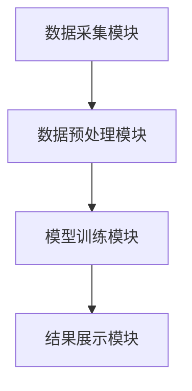
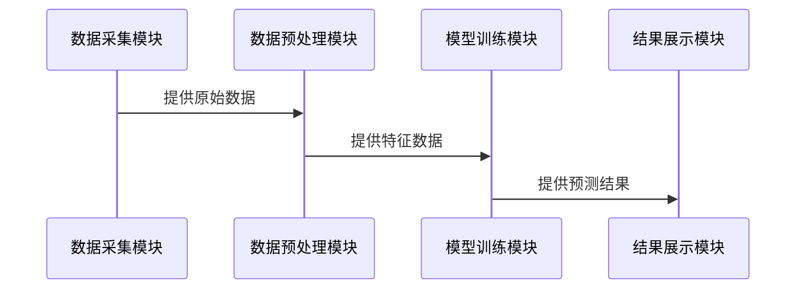

                 


# 《AI Agent在智能交通流量预测中的实践》

> **关键词**：AI Agent, 交通流量预测, 智能交通系统, 时间序列分析, 深度学习, LSTM, CNN

> **摘要**：随着城市化进程的加快和汽车保有量的增加，交通拥堵问题日益严重。传统的交通流量预测方法在面对复杂的城市交通环境时，难以满足实时性和准确性要求。本文将探讨AI Agent在交通流量预测中的应用，分析其核心算法、系统架构，并通过实际案例展示其在智能交通管理中的实践价值。文章首先介绍AI Agent的基本概念及其在交通领域的应用潜力，然后深入分析基于LSTM和CNN的交通流量预测模型，接着讨论系统的整体架构设计，最后通过一个完整的项目实战，详细阐述AI Agent在交通流量预测中的实现过程和实际效果。

---

# 第一部分：AI Agent与智能交通流量预测的背景与基础

## 第1章：AI Agent与智能交通流量预测概述

### 1.1 AI Agent的基本概念与特点

#### 1.1.1 AI Agent的定义
AI Agent（人工智能代理）是指能够感知环境、做出决策并执行操作的智能实体。它通过与环境交互，利用感知数据进行分析，从而做出最优决策，并通过执行模块实现目标。

#### 1.1.2 AI Agent的核心特点
- **自主性**：能够在没有外部干预的情况下自主运行。
- **反应性**：能够实时感知环境变化并做出反应。
- **学习能力**：能够通过经验改进自身的决策能力。
- **协作性**：能够与其他AI Agent或系统协同工作。

#### 1.1.3 AI Agent在交通领域的应用潜力
- **实时监控**：通过传感器和摄像头实时采集交通数据。
- **智能决策**：基于历史数据和实时信息，预测交通流量并优化信号灯配时。
- **应急处理**：在交通事故或极端天气条件下快速调整交通流量。

---

### 1.2 交通流量预测的背景与挑战

#### 1.2.1 交通流量预测的背景
随着城市交通的日益复杂化，传统的交通流量预测方法（如统计模型）难以应对非线性关系和突发性事件。AI Agent的引入为交通流量预测提供了新的解决方案。

#### 1.2.2 传统交通流量预测方法的局限性
- **模型假设过于简化**：传统模型难以捕捉复杂的交通模式。
- **实时性不足**：基于统计的方法通常需要较长时间的计算。
- **缺乏灵活性**：难以适应交通环境的快速变化。

#### 1.2.3 智能化交通管理的需求
- **提高预测精度**：通过AI技术实现更高精度的交通流量预测。
- **实现实时监控**：快速响应交通变化，减少拥堵。
- **优化资源配置**：通过智能调度减少能源浪费。

---

### 1.3 AI Agent在交通流量预测中的应用价值

#### 1.3.1 提高预测精度
AI Agent可以通过深度学习模型（如LSTM和CNN）捕捉复杂的交通模式，显著提高预测精度。

#### 1.3.2 实现实时监控与决策
AI Agent能够实时感知交通数据，并快速做出决策，实现交通流量的实时预测和优化。

#### 1.3.3 优化交通资源配置
通过AI Agent的智能决策，可以优化信号灯配时、路线规划等，减少交通拥堵和能源浪费。

---

## 第2章：AI Agent的核心概念与原理

### 2.1 AI Agent的核心概念

#### 2.1.1 感知模块
- **数据采集**：通过传感器、摄像头等设备采集交通流量、车速等数据。
- **特征提取**：从原始数据中提取有意义的特征，如时间特征、空间特征等。

#### 2.1.2 决策模块
- **规则驱动决策**：基于预定义的规则做出决策。
- **机器学习决策**：通过训练好的模型进行预测和决策。
- **强化学习决策**：通过与环境的交互学习最优策略。

#### 2.1.3 执行模块
- **信号灯控制**：根据预测结果调整信号灯配时。
- **路线规划**：为驾驶员提供最优路线建议。
- **应急处理**：在异常情况下采取紧急措施。

---

### 2.2 AI Agent的感知机制

#### 2.2.1 数据采集与处理
- **数据来源**：交通传感器、摄像头、GPS数据等。
- **数据预处理**：去噪、归一化、特征提取等。

#### 2.2.2 感知模型的选择
- **时间序列模型**：如ARIMA、LSTM。
- **图像识别模型**：如CNN。

#### 2.2.3 感知结果的特征提取
- **时间特征**：如小时、星期、节假日等。
- **空间特征**：如路段、交叉口等。

---

### 2.3 AI Agent的决策机制

#### 2.3.1 基于规则的决策
- **简单规则**：如“高峰期信号灯保持红灯15秒”。
- **复杂规则**：如“根据车流量动态调整信号灯配时”。

#### 2.3.2 基于机器学习的决策
- **监督学习**：如随机森林、支持向量机（SVM）。
- **无监督学习**：如聚类分析。

#### 2.3.3 基于强化学习的决策
- **Q-learning**：通过奖励机制优化决策。
- **Deep Q-Network (DQN)**：结合深度学习和强化学习。

---

### 2.4 AI Agent的执行机制

#### 2.4.1 执行策略的选择
- **实时调整**：根据预测结果动态调整策略。
- **预设策略**：在特定条件下执行预设策略。

#### 2.4.2 执行效果的评估
- **预测精度**：预测值与实际值的误差。
- **响应时间**：决策到执行的时间间隔。

#### 2.4.3 执行结果的反馈
- **闭环反馈**：将执行结果反馈到感知模块，形成闭环系统。

---

## 第3章：AI Agent在交通流量预测中的核心算法

### 3.1 常见的交通流量预测算法

#### 3.1.1 时间序列分析
- **ARIMA模型**：适用于线性时间序列预测。
- **Prophet模型**：由Facebook开源，适合时间序列预测。

#### 3.1.2 机器学习算法
- **线性回归**：适用于简单线性关系。
- **支持向量回归（SVR）**：适合非线性关系。

#### 3.1.3 深度学习算法
- **LSTM**：适合时间序列数据。
- **CNN**：适合空间特征提取。

---

### 3.2 基于LSTM的交通流量预测模型

#### 3.2.1 LSTM的基本原理
LSTM（长短期记忆网络）通过门控机制解决传统RNN的梯度消失问题，能够有效捕捉时间序列中的长-term依赖关系。

#### 3.2.2 LSTM在时间序列预测中的优势
- **记忆能力**：能够记住长期的信息。
- **捕捉模式**：适合非线性时间序列预测。

#### 3.2.3 LSTM模型的构建与训练
- **模型结构**：输入层 → LSTM层 → 全连接层 → 输出层。
- **训练方法**：使用反向传播训练模型。

---

### 3.3 基于CNN的交通流量预测模型

#### 3.3.1 CNN的基本原理
CNN（卷积神经网络）通过卷积操作提取空间特征，适合图像和空间数据的处理。

#### 3.3.2 CNN在交通流量预测中的应用
- **图像数据**：如交通监控图像。
- **空间特征**：如路段之间的关联性。

#### 3.3.3 CNN模型的构建与训练
- **模型结构**：输入层 → 卷积层 → 池化层 → 全连接层 → 输出层。
- **训练方法**：使用反向传播训练模型。

---

### 3.4 混合模型与优化策略

#### 3.4.1 混合模型的概念
- **LSTM-CNN混合模型**：结合时间序列和空间特征的预测。
- **模型融合**：将多个模型的结果进行融合，提高预测精度。

#### 3.4.2 混合模型的构建方法
- **并行结构**：同时处理时间序列和空间特征。
- **串行结构**：先处理时间序列，再处理空间特征。

#### 3.4.3 模型优化策略
- **超参数调优**：如学习率、批量大小等。
- **正则化**：如L2正则化，防止过拟合。

---

## 第4章：AI Agent的系统架构与设计

### 4.1 系统架构设计

#### 4.1.1 系统功能模块
- **数据采集模块**：负责采集交通数据。
- **数据预处理模块**：对数据进行清洗和特征提取。
- **模型训练模块**：训练AI Agent的感知和决策模型。
- **结果展示模块**：将预测结果可视化。

#### 4.1.2 系统架构图


#### 4.1.3 系统交互流程图


---

## 第5章：项目实战——AI Agent在交通流量预测中的实现

### 5.1 环境搭建

#### 5.1.1 安装必要的库
- **TensorFlow**：用于深度学习模型的训练。
- **Keras**：用于模型构建。
- **scikit-learn**：用于传统机器学习算法。
- **Pandas**：用于数据处理。

#### 5.1.2 数据集获取
- **来源**：公开数据集（如UCI数据集）或自采数据。

---

### 5.2 核心实现

#### 5.2.1 数据预处理
```python
import pandas as pd
import numpy as np

# 读取数据
data = pd.read_csv('traffic_data.csv')

# 去除缺失值
data = data.dropna()

# 标准化处理
from sklearn.preprocessing import StandardScaler
scaler = StandardScaler()
scaled_data = scaler.fit_transform(data)
```

#### 5.2.2 模型训练
```python
from tensorflow.keras.models import Sequential
from tensorflow.keras.layers import LSTM, Dense

# 构建LSTM模型
model = Sequential()
model.add(LSTM(64, input_shape=(timesteps, features)))
model.add(Dense(1))
model.compile(optimizer='adam', loss='mean_squared_error')

# 训练模型
model.fit(x_train, y_train, epochs=100, batch_size=32)
```

#### 5.2.3 模型评估
```python
# 预测结果
y_pred = model.predict(x_test)

# 计算误差
from sklearn.metrics import mean_squared_error
mse = mean_squared_error(y_test, y_pred)
print(f'MSE: {mse}')
```

---

## 第6章：总结与展望

### 6.1 本章小结
本文详细介绍了AI Agent在交通流量预测中的应用，从核心概念到算法实现，再到系统设计，全面探讨了AI Agent在智能交通管理中的价值。

### 6.2 最佳实践
- **数据质量**：确保数据的完整性和准确性。
- **模型选择**：根据具体场景选择合适的算法。
- **系统优化**：通过超参数调优和模型融合提高预测精度。

### 6.3 未来展望
- **多模态数据融合**：结合交通图像、天气数据等多种信息。
- **边缘计算**：在边缘设备上实现AI Agent，减少云端依赖。
- **自适应学习**：模型能够自适应地更新，应对交通环境的变化。

---

# 作者：AI天才研究院/AI Genius Institute & 禅与计算机程序设计艺术 /Zen And The Art of Computer Programming

