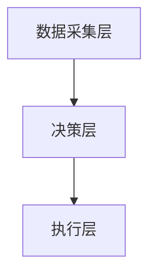

                 


# AI Agent在智能交通管理中的实践

> 关键词：AI Agent, 智能交通管理, 强化学习, 车路协同, 交通优化

> 摘要：AI Agent在智能交通管理中的应用是当前技术发展的热点之一。本文详细探讨了AI Agent在交通流量预测、交通事故处理、车路协同及自动驾驶等领域的实践应用。通过分析AI Agent的核心概念、算法原理、系统架构及项目案例，本文为读者提供了全面的技术视角，展示了如何利用AI Agent提升交通管理的智能化水平。

---

## 第一章: AI Agent的基本概念与应用背景

### 1.1 AI Agent的定义与特点

AI Agent（人工智能代理）是一种能够感知环境、自主决策并执行任务的智能体。在智能交通管理中，AI Agent通常被设计为能够处理实时数据、优化交通流量、协调车辆与道路资源的关键组件。

#### AI Agent的特点：
- **自主性**：AI Agent能够独立决策，无需人工干预。
- **反应性**：能够实时感知环境变化并做出响应。
- **学习能力**：通过强化学习等方法不断优化决策策略。
- **协作性**：能够在多智能体环境中与其他AI Agent或系统协同工作。

### 1.2 智能交通管理的背景与挑战

传统交通管理系统依赖于固定规则和预先设定的逻辑，难以应对复杂多变的交通场景。随着城市化进程的加快，交通流量剧增，道路资源紧张，传统的管理方式已难以满足需求。

#### 传统交通管理系统的局限性：
- 难以实时优化交通流量。
- 缺乏灵活性，难以应对突发情况。
- 无法与自动驾驶车辆协同工作。

### 1.3 AI Agent在智能交通管理中的应用价值

AI Agent通过实时数据分析和自主决策，能够显著提升交通管理的效率和安全性。其在交通流量预测、事故处理、车路协同等方面的应用，为智能交通管理提供了新的解决方案。

---

## 第二章: AI Agent在智能交通管理中的核心概念

### 2.1 AI Agent的核心概念

在智能交通管理中，AI Agent的核心概念包括状态空间、动作空间、奖励函数等。

#### 状态空间与动作空间：
- **状态空间**：表示AI Agent所处的环境状态，例如交通流量、道路状况等。
- **动作空间**：表示AI Agent可以执行的动作，例如调整信号灯周期、改变车道分配等。

#### 奖励函数：
- 用于评估AI Agent的动作效果。例如，减少交通拥堵可以带来更高的奖励值。

### 2.2 AI Agent的决策机制

AI Agent的决策机制是其核心部分，通常基于强化学习、监督学习或规则系统。

#### 基于强化学习的决策：
- AI Agent通过与环境交互，学习最优策略，以最大化累计奖励。

#### 基于监督学习的决策：
- 通过训练数据，AI Agent学习如何根据输入状态选择最优动作。

#### 基于规则的决策：
- 预先设定规则，AI Agent根据当前状态匹配规则执行动作。

### 2.3 AI Agent的通信与协作

在智能交通管理中，AI Agent通常需要与其他Agent或系统协作。

#### 多AI Agent协作：
- 通过通信协议，AI Agent之间可以共享信息，协同完成复杂任务。

---

## 第三章: AI Agent的算法原理

### 3.1 强化学习算法原理

强化学习是AI Agent的核心算法之一。

#### 强化学习流程：
1. **状态感知**：AI Agent感知当前环境状态。
2. **动作选择**：基于当前状态，选择一个动作。
3. **执行动作**：AI Agent执行选择的动作。
4. **奖励反馈**：环境对AI Agent的动作给予奖励或惩罚。
5. **策略更新**：基于奖励，更新决策策略。

#### 强化学习的数学模型：
- **价值函数**：$V(s) = \max_{a} Q(s, a)$
- **Q-learning算法**：$Q(s, a) = Q(s, a) + \alpha [r + \gamma \max Q(s', a') - Q(s, a)]$

---

## 第四章: AI Agent的系统架构设计

### 4.1 系统功能设计

AI Agent在智能交通管理系统中的功能包括：
- **交通流量预测**：基于历史数据和实时信息，预测未来交通状况。
- **信号灯优化**：动态调整信号灯周期，减少拥堵。
- **事故处理**：在发生事故时，快速调整交通信号，疏导车辆。

### 4.2 系统架构设计

#### 系统架构：
1. **数据采集层**：收集交通数据，如摄像头、传感器等。
2. **决策层**：AI Agent基于数据做出决策。
3. **执行层**：执行决策，如调整信号灯。

#### 系统架构图：



---

## 第五章: 项目实战——AI Agent在交通信号灯优化中的应用

### 5.1 项目背景

城市交通信号灯优化是智能交通管理的重要组成部分。通过AI Agent优化信号灯周期，可以显著提高交通效率。

### 5.2 环境搭建

#### 环境安装：
- **Python**：安装Python 3.8及以上版本。
- **深度强化学习框架**：如TensorFlow、PyTorch。
- **交通模拟工具**：如SUMO（Simulation of Urban Mobility）。

### 5.3 系统实现

#### AI Agent的实现：
- 使用强化学习算法，训练AI Agent动态调整信号灯周期。

#### 代码示例：

```python
import numpy as np
import gym

class AIAgent:
    def __init__(self, state_space, action_space):
        self.state_space = state_space
        self.action_space = action_space
        self.q_table = np.zeros((state_space, action_space))

    def get_action(self, state):
        return np.argmax(self.q_table[state])

    def update_q_table(self, state, action, reward, next_state):
        self.q_table[state, action] += 0.1 * (reward + 0.9 * np.max(self.q_table[next_state]) - self.q_table[state, action])

# 初始化环境
env = gym.make('TrafficLightOptimization-v0')
agent = AIAgent(env.observation_space, env.action_space)

# 训练过程
for episode in range(1000):
    state = env.reset()
    while True:
        action = agent.get_action(state)
        next_state, reward, done, _ = env.step(action)
        agent.update_q_table(state, action, reward, next_state)
        if done:
            break
```

### 5.4 实际案例分析

通过训练AI Agent，我们可以显著优化交通信号灯周期，减少拥堵时间，提高道路利用率。

---

## 第六章: 最佳实践与小结

### 6.1 小结

AI Agent在智能交通管理中的应用前景广阔，其在交通流量预测、信号灯优化等方面的优势已经得到验证。

### 6.2 注意事项

- 数据质量：AI Agent的性能依赖于高质量的数据。
- 算法选择：选择合适的算法对系统性能至关重要。
- 系统安全性：确保系统的安全性和可靠性。

### 6.3 未来展望

随着技术的发展，AI Agent在智能交通管理中的应用将更加广泛和深入。未来的研究方向包括多智能体协作、边缘计算等。

---

## 作者

**作者：AI天才研究院/AI Genius Institute & 禅与计算机程序设计艺术 /Zen And The Art of Computer Programming**

