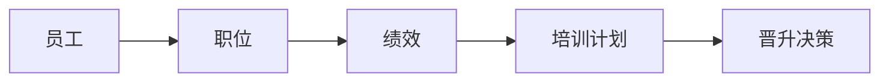
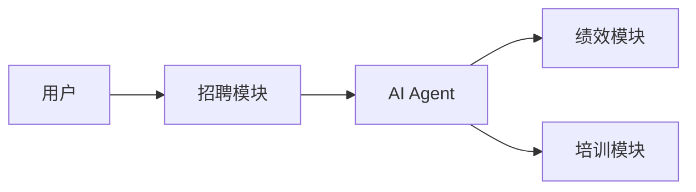
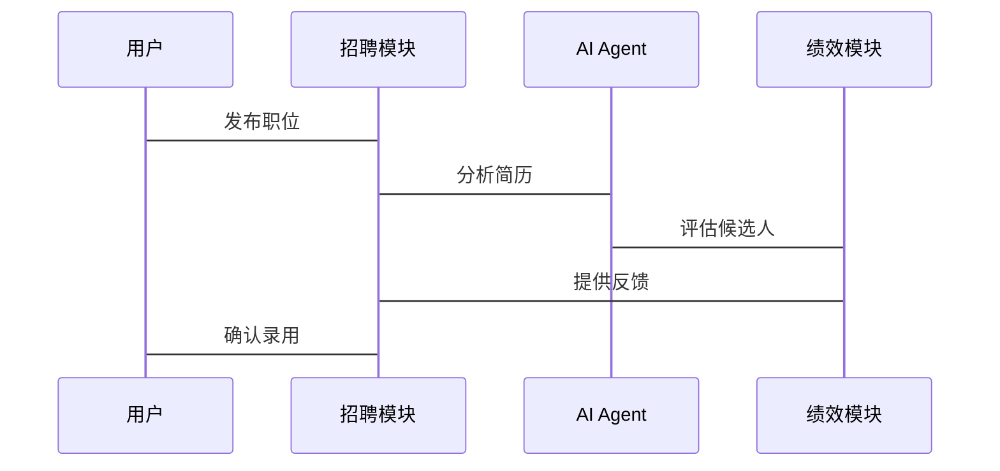

                 


# 目录大纲：《AI Agent在智能人力资源管理中的实践》

---

## 第一部分：AI Agent与智能人力资源管理的背景

### 第1章：AI Agent与智能人力资源管理概述

#### 1.1 AI Agent的基本概念
- 1.1.1 AI Agent的定义与特点
  - 定义：AI Agent（人工智能代理）是一种能够感知环境并采取行动以实现目标的智能实体。
  - 特点：自主性、反应性、目标导向、社交能力。
- 1.1.2 AI Agent与传统AI的区别
  - 传统AI：专注于特定任务，如语音识别或图像分类。
  - AI Agent：具备自主决策和行动的能力，能够在动态环境中适应变化。
- 1.1.3 AI Agent在智能系统中的作用
  - 案例：智能助手、自动驾驶汽车。

#### 1.2 智能人力资源管理的背景
- 1.2.1 传统人力资源管理的局限性
  - 简单的事务处理，缺乏智能化和个性化。
- 1.2.2 智能化转型的必要性
  - 数据驱动的决策、个性化员工体验的需求。
- 1.2.3 AI Agent在智能HR中的定位
  - 作为智能系统的核心组件，实现自动化和智能化的人力资源管理。

#### 1.3 AI Agent在智能HR中的应用背景
- 1.3.1 数据驱动的决策需求
  - 利用大数据分析优化招聘策略。
- 1.3.2 个性化员工体验的实现
  - 根据员工行为和绩效提供个性化反馈。
- 1.3.3 高效招聘与员工管理的挑战
  - 提高招聘效率，降低管理成本。

---

## 第二部分：AI Agent的核心概念与原理

### 第2章：AI Agent的核心概念与联系

#### 2.1 AI Agent的核心原理
- 2.1.1 感知层：数据采集与分析
  - 通过传感器或API接口获取环境数据。
- 2.1.2 决策层：基于数据的智能决策
  - 使用机器学习模型进行预测和决策。
- 2.1.3 执行层：自动化操作与反馈
  - 根据决策结果执行动作，并收集反馈。

#### 2.2 AI Agent与相关概念的对比
- 2.2.1 AI Agent与传统AI的对比
  | 特性         | AI Agent                     | 传统AI                     |
  |--------------|------------------------------|-----------------------------|
  | 自主性       | 高                           | 低                         |
  | 适应性       | 强                           | 弱                         |
- 2.2.2 AI Agent与规则引擎的对比
  - 规则引擎：基于预定义规则进行决策，缺乏灵活性。
  - AI Agent：基于机器学习模型，能够自适应和优化。
- 2.2.3 AI Agent与机器学习模型的对比
  - 机器学习模型：专注于数据预测和分类。
  - AI Agent：具备决策和执行能力，形成闭环。

#### 2.3 AI Agent的实体关系图


---

## 第三部分：AI Agent的算法原理讲解

### 第3章：AI Agent的算法原理

#### 3.1 基于强化学习的决策模型
- 3.1.1 强化学习简介
  - 强化学习：通过试错机制，学习最优策略。
- 3.1.2 算法流程
  ```mermaid
  graph LR
      S[状态] --> A[动作]
      A --> R[奖励]
      R --> S[新状态]
  ```

#### 3.2 算法实现
- 3.2.1 Python代码实现
  ```python
  import numpy as np

  class AI-Agent:
      def __init__(self, state_space, action_space):
          self.state_space = state_space
          self.action_space = action_space
          self.q_table = np.zeros((state_space, action_space))

      def act(self, state, epsilon=0.1):
          if np.random.random() < epsilon:
              return np.random.randint(self.action_space)
          return np.argmax(self.q_table[state])

      def learn(self, state, action, reward, next_state):
          self.q_table[state, action] = self.q_table[state, action] * 0.8 + reward * 0.2
  ```

- 3.2.2 数学模型
  - 状态转移概率：$P(next\_state | state, action)$
  - 奖励函数：$R(state, action)$
  - Q-learning更新规则：$Q(state, action) = Q(state, action) * \alpha + (R + \gamma \max Q(next\_state, action)) * (1 - \alpha)$，其中$\alpha$是学习率，$\gamma$是折扣因子。

---

## 第四部分：AI Agent的系统分析与架构设计

### 第4章：AI Agent的系统分析与架构设计

#### 4.1 应用场景
- 智能招聘系统：自动筛选简历、安排面试。
- 员工绩效管理系统：实时监控绩效，提供反馈。
- 培训管理系统：根据员工需求推荐培训课程。

#### 4.2 系统功能设计
- 招聘模块：职位发布、简历筛选、面试安排。
- 绩效模块：目标设定、绩效评估、反馈优化。
- 培训模块：课程推荐、学习进度跟踪。

#### 4.3 系统架构设计


#### 4.4 接口设计
- REST API：用于模块间通信，如`/api/post_job`, `/api/apply_job`。

#### 4.5 交互流程图


---

## 第五部分：AI Agent的项目实战

### 第5章：AI Agent在智能HR中的实战

#### 5.1 环境安装
- 安装Python和相关库：`pip install numpy scikit-learn`

#### 5.2 核心代码实现
- 数据预处理：清洗和归一化。
- 模型训练：使用强化学习训练Q-learning模型。
- API接口开发：提供RESTful API供其他模块调用。

#### 5.3 实际案例分析
- 案例：智能招聘系统。
  - 数据输入：职位描述和简历。
  - 模型处理：分析简历，匹配职位要求。
  - 输出结果：推荐候选人或拒绝。

#### 5.4 项目小结
- 成功实现了AI Agent在智能招聘中的应用。
- 验证了算法的有效性，提高了招聘效率。

---

## 第六部分：AI Agent的最佳实践与小结

### 第6章：AI Agent的最佳实践

#### 6.1 数据隐私与安全
- 确保员工数据的安全，遵守相关法律法规。

#### 6.2 模型迭代与优化
- 定期更新模型，保持其适应性。

#### 6.3 人机协作
- AI Agent辅助决策，但最终决策权在人类。

#### 6.4 小结
- AI Agent在智能HR中的应用前景广阔。
- 结合数据驱动和人机协作，将推动人力资源管理的智能化转型。

---

## 附录

- 附录A：相关术语表
- 附录B：常用工具与库
- 附录C：参考文献

---

**作者：AI天才研究院/AI Genius Institute & 禅与计算机程序设计艺术 /Zen And The Art of Computer Programming**

---

**摘要：**  
本文系统地探讨了AI Agent在智能人力资源管理中的应用，从理论基础到实际应用，详细介绍了AI Agent的核心概念、算法原理、系统架构设计及项目实战。通过案例分析和最佳实践，展示了AI Agent如何提升人力资源管理的效率和智能化水平。

