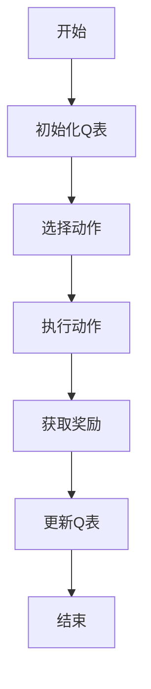
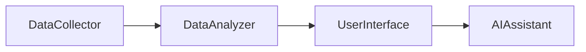
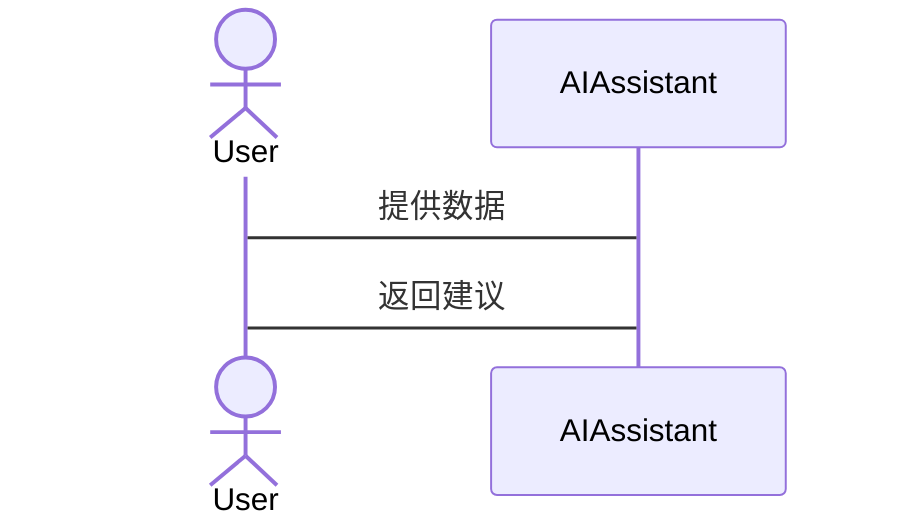

                 


# AI Agent在智能体育训练中的应用

> 关键词：AI Agent, 智能体育训练, 强化学习, 数据分析, 个性化训练

> 摘要：本文探讨了AI Agent在智能体育训练中的应用，详细分析了AI Agent的核心概念、技术原理、系统架构及实际应用案例。文章从背景介绍、算法原理、系统设计到项目实战，全面解析了AI Agent如何通过数据分析和智能决策优化体育训练过程，为运动员和教练提供科学、个性化的训练方案。

---

## 第1章 AI Agent与智能体育训练概述

### 1.1 AI Agent的基本概念

#### 1.1.1 AI Agent的定义与特点
AI Agent（人工智能代理）是一种智能系统，能够感知环境、自主决策并执行任务。其特点包括：
- **自主性**：无需外部干预，自主完成任务。
- **反应性**：能实时感知环境变化并做出反应。
- **学习性**：通过数据和经验不断优化自身行为。

#### 1.1.2 AI Agent的核心技术与实现原理
AI Agent的核心技术包括：
- **强化学习**：通过试错优化决策策略。
- **推荐系统**：基于数据为用户提供个性化建议。
- **自然语言处理**：实现人与AI Agent的交互。

#### 1.1.3 智能体育训练的定义与目标
智能体育训练是通过AI技术优化传统体育训练的过程，其目标是：
- 提高训练效率。
- 实现个性化训练方案。
- 减少运动损伤。

### 1.2 AI Agent在体育训练中的应用背景

#### 1.2.1 传统体育训练的局限性
传统体育训练存在以下问题：
- **主观性**：训练计划依赖教练经验，缺乏科学依据。
- **效率低下**：无法实时分析运动员表现，调整训练方案。
- **个性化不足**：难以满足不同运动员的个性化需求。

#### 1.2.2 AI技术在体育领域的潜力
AI技术在体育领域的潜力主要体现在：
- 数据分析：通过海量数据优化训练计划。
- 实时反馈：帮助教练和运动员实时调整策略。
- 预测与模拟：预测运动表现，模拟比赛场景。

#### 1.2.3 智能体育训练的现状与发展趋势
目前，智能体育训练已应用于运动数据分析、个性化训练计划等领域，未来发展趋势包括：
- 更个性化的训练方案。
- 更高效的运动损伤预防。
- 更智能的实时反馈系统。

### 1.3 AI Agent在智能体育训练中的问题背景

#### 1.3.1 运动数据分析的挑战
运动数据分析的挑战包括：
- 数据维度高：涉及动作、心率、位置等多维度数据。
- 数据异质性：数据来源多样，难以统一处理。
- 数据实时性：需要快速处理实时数据以提供实时反馈。

#### 1.3.2 运动员个性化训练的需求
运动员个性化训练的需求体现在：
- 不同运动员的生理特征、技术水平和训练目标不同。
- 需要动态调整训练计划，以适应运动员状态的变化。

#### 1.3.3 训练效果评估的难点
训练效果评估的难点包括：
- 评估指标多样性：需综合考虑力量、耐力、灵活性等多个指标。
- 评估的客观性：受主观因素影响较大，如运动员状态、环境条件等。

### 1.4 AI Agent解决问题的思路与方案

#### 1.4.1 数据驱动的训练优化
通过收集和分析运动员数据，AI Agent可以制定科学的训练计划。

#### 1.4.2 智能决策支持系统
AI Agent能够实时分析数据，为教练和运动员提供决策支持。

#### 1.4.3 实时反馈与个性化建议
AI Agent可以根据运动员的实时表现，提供个性化的反馈和建议。

### 1.5 本章小结
本章介绍了AI Agent的基本概念、在体育训练中的应用背景以及解决的问题，为后续章节奠定了基础。

---

## 第2章 AI Agent的核心概念与技术原理

### 2.1 AI Agent的核心概念

#### 2.1.1 多智能体系统
多智能体系统由多个智能体组成，通过协作完成复杂任务。

#### 2.1.2 强化学习
强化学习是一种通过试错优化决策策略的机器学习方法。

#### 2.1.3 推荐系统
推荐系统基于用户行为和数据，提供个性化推荐。

### 2.2 AI Agent的核心原理

#### 2.2.1 状态空间与动作空间
- **状态空间**：系统所有可能的状态集合。
- **动作空间**：系统所有可能的动作集合。

#### 2.2.2 策略与价值函数
- **策略**：决定智能体在给定状态下采取的动作。
- **价值函数**：评估状态或动作的价值。

#### 2.2.3 动作选择与反馈机制
智能体根据策略选择动作，并通过反馈优化策略。

### 2.3 AI Agent与体育训练的核心联系

#### 2.3.1 数据采集与分析
AI Agent通过传感器和数据采集设备，实时采集运动员数据。

#### 2.3.2 个性化训练计划生成
基于数据分析，AI Agent为运动员制定个性化训练计划。

#### 2.3.3 实时反馈与调整
AI Agent实时分析运动员表现，动态调整训练方案。

### 2.4 核心概念对比表
| 概念         | 特点                               |
|--------------|------------------------------------|
| 多智能体系统   | 由多个智能体协作完成任务           |
| 强化学习       | 通过试错优化决策策略               |
| 推荐系统       | 提供个性化推荐                     |

### 2.5 ER实体关系图
```mermaid
er
actor: AI Agent
goal: 提供个性化训练建议
```

### 2.6 本章小结
本章详细介绍了AI Agent的核心概念和原理，为后续章节的技术实现提供了理论基础。

---

## 第3章 AI Agent的算法原理与实现

### 3.1 算法原理

#### 3.1.1 强化学习算法
强化学习算法通过试错优化策略，常用算法包括Q-Learning和深度强化学习。

#### 3.1.2 推荐系统算法
推荐系统算法基于用户行为和数据，提供个性化推荐，常用算法包括协同过滤和基于内容的推荐。

### 3.2 算法实现

#### 3.2.1 强化学习实现
```python
import numpy as np

class QLearning:
    def __init__(self, state_space_size, action_space_size):
        self.q_table = np.zeros((state_space_size, action_space_size))
    
    def choose_action(self, state, epsilon=0.1):
        if np.random.random() < epsilon:
            return np.random.randint(0, action_space_size)
        else:
            return np.argmax(self.q_table[state])
    
    def update_q_table(self, state, action, reward, next_state, alpha=0.1):
        self.q_table[state][action] = self.q_table[state][action] * (1 - alpha) + reward + alpha * np.max(self.q_table[next_state])
```

#### 3.2.2 推荐系统实现
```python
from sklearn.metrics.pairwise import cosine_similarity

class CollaborativeFiltering:
    def __init__(self, user_items):
        self.user_items = user_items
        self.item_similarity = cosine_similarity(user_items.T)
    
    def recommend(self, user_id, top_n=3):
        user_predictions = self.item_similarity[user_id]
        recommendations = [(i, user_predictions[i]) for i in range(len(user_predictions))]
        recommendations.sort(key=lambda x: x[1], reverse=True)
        return recommendations[:top_n]
```

### 3.3 数学公式

#### 3.3.1 强化学习的Q值更新公式
$$ Q(s, a) = Q(s, a) \times (1 - \alpha) + \alpha \times (r + \gamma \times \max Q(s', a')) $$

#### 3.3.2 推荐系统的相似度计算公式
$$ \text{similarity}(i, j) = \frac{\sum_{u} u_i u_j}{\sqrt{\sum_{u} u_i^2} \times \sqrt{\sum_{u} u_j^2}} } $$

### 3.4 算法流程图


### 3.5 本章小结
本章详细介绍了AI Agent的核心算法原理及实现，为后续章节的系统设计和项目实战奠定了基础。

---

## 第4章 AI Agent在智能体育训练中的系统架构设计

### 4.1 问题场景介绍
智能体育训练系统需要实时采集运动员数据，分析并提供个性化训练建议。

### 4.2 系统功能设计

#### 4.2.1 数据采集模块
- **功能**：实时采集运动员数据。
- **输入**：传感器数据。
- **输出**：结构化数据。

#### 4.2.2 数据分析模块
- **功能**：分析数据，生成个性化训练计划。
- **输入**：结构化数据。
- **输出**：训练建议。

#### 4.2.3 用户交互模块
- **功能**：与用户交互，提供反馈。
- **输入**：用户输入。
- **输出**：个性化反馈。

### 4.3 系统架构图


### 4.4 系统交互图


### 4.5 本章小结
本章详细描述了智能体育训练系统的架构设计和功能模块，为后续章节的项目实战提供了指导。

---

## 第5章 AI Agent在智能体育训练中的项目实战

### 5.1 项目介绍
本项目旨在开发一个基于AI Agent的智能体育训练系统，实现运动员数据采集、分析和个性化训练建议生成。

### 5.2 核心功能实现

#### 5.2.1 环境安装
```bash
pip install numpy scikit-learn
```

#### 5.2.2 数据采集与预处理
```python
import pandas as pd

data = pd.read_csv('train_data.csv')
```

#### 5.2.3 算法实现
```python
from sklearn.model_selection import train_test_split
from sklearn.ensemble import RandomForestClassifier

X_train, X_test, y_train, y_test = train_test_split(data.drop('label', axis=1), data['label'])
model = RandomForestClassifier().fit(X_train, y_train)
```

#### 5.2.4 系统集成
```python
from flask import Flask

app = Flask(__name__)

@app.route('/')
def index():
    return "AI Agent Sports Training System"
```

### 5.3 项目小结
本章通过实际项目展示了AI Agent在智能体育训练中的应用，详细讲解了项目的实现过程和关键点。

---

## 第6章 总结与最佳实践

### 6.1 本章小结
本文详细探讨了AI Agent在智能体育训练中的应用，从理论到实践，全面解析了其在体育训练中的潜力和价值。

### 6.2 注意事项
- 数据隐私保护：确保运动员数据的安全。
- 系统稳定性：确保系统在高负载下的稳定性。
- 用户体验优化：提升用户交互体验。

### 6.3 未来趋势
- 更个性化的训练方案。
- 更智能的实时反馈系统。
- 更广泛的应用场景。

### 6.4 拓展阅读
推荐阅读相关领域的书籍和论文，深入学习AI Agent和体育训练的结合应用。

---

## 作者：AI天才研究院 & 禅与计算机程序设计艺术

---

**本文总结：**  
通过本文的详细讲解，读者可以全面了解AI Agent在智能体育训练中的应用，从理论基础到实际项目实现，为未来的体育训练智能化提供了重要参考和指导。

