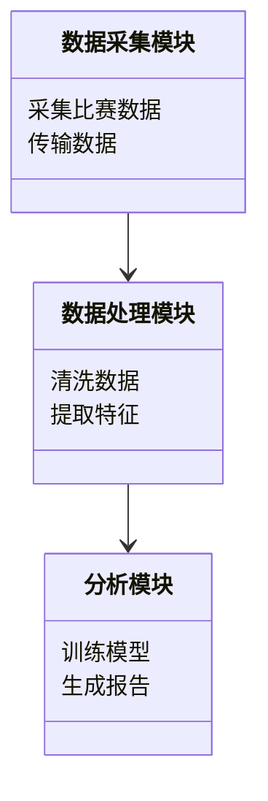
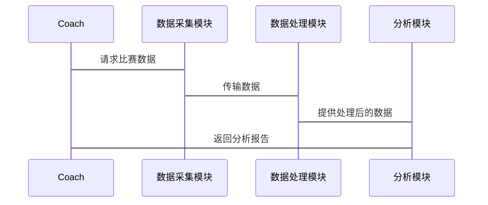

                 


# AI Agent在智能体育赛事分析中的角色

> 关键词：AI Agent，智能体育，赛事分析，机器学习，数据挖掘，体育决策支持

> 摘要：AI Agent在智能体育赛事分析中扮演着越来越重要的角色，通过机器学习、数据挖掘和自然语言处理等技术，能够帮助教练和运动员做出更科学的决策。本文将详细探讨AI Agent在体育赛事分析中的核心概念、算法原理、系统架构以及实际应用案例，帮助读者全面了解其在智能体育中的角色和价值。

---

## 第1章 AI Agent与智能体育赛事分析概述

### 1.1 AI Agent的基本概念

AI Agent（人工智能代理）是指能够感知环境、自主决策并采取行动的智能实体。在体育赛事分析中，AI Agent可以通过处理海量数据，提供实时分析和决策支持。

#### 1.1.1 AI Agent的定义与特点

- **定义**：AI Agent是一种能够执行任务的智能系统，具备感知、推理、学习和行动的能力。
- **特点**：
  - **自主性**：能够在没有人工干预的情况下独立运作。
  - **反应性**：能够实时感知环境变化并做出反应。
  - **学习能力**：通过机器学习算法不断优化自身的分析和决策能力。

#### 1.1.2 AI Agent在体育赛事分析中的应用背景

随着体育行业的数字化转型，数据量的激增使得传统的分析方法难以应对复杂的决策需求。AI Agent通过整合多种技术手段，能够高效地处理和分析数据，为体育赛事提供智能化的支持。

#### 1.1.3 AI Agent与传统体育数据分析的区别

| 特性                | AI Agent分析 | 传统数据分析 |
|---------------------|--------------|-------------|
| 数据处理速度        | 实时处理      | 周期性处理    |
| 决策能力            | 自主决策      | 依赖人工      |
| 学习能力            | 可自适应优化  | 需人工调整    |

### 1.2 智能体育赛事分析的背景与意义

#### 1.2.1 体育数据分析的发展历程

- **传统阶段**：依赖人工记录和分析数据。
- **数据化阶段**：引入传感器和数据库，开始数字化处理。
- **智能化阶段**：利用AI技术进行深度分析和预测。

#### 1.2.2 智能化体育赛事分析的需求与趋势

- **需求**：教练和运动员需要实时、精准的分析结果来优化训练和比赛策略。
- **趋势**：AI技术的应用越来越广泛，推动体育分析向智能化、个性化发展。

#### 1.2.3 AI Agent在智能体育赛事分析中的角色定位

AI Agent作为智能体育分析的核心工具，能够实时采集、处理和分析数据，提供决策支持，帮助教练和运动员制定最优策略。

---

## 第2章 AI Agent的核心概念与原理

### 2.1 AI Agent的基本原理

#### 2.1.1 知识表示与推理

- **知识表示**：将体育赛事中的数据（如球员位置、战术布局）转化为结构化的知识表示。
- **推理机制**：利用逻辑推理或机器学习模型，从数据中提取有用的信息。

#### 2.1.2 行为选择与决策

- **行为选择**：AI Agent根据分析结果选择最优行动方案。
- **决策机制**：基于概率模型或强化学习，做出决策。

#### 2.1.3 人机交互与反馈机制

- **人机交互**：通过自然语言处理技术，与教练或运动员进行实时交流。
- **反馈机制**：根据用户反馈调整分析模型，优化决策结果。

### 2.2 AI Agent在体育赛事分析中的应用原理

#### 2.2.1 数据采集与处理

- **数据采集**：通过传感器、摄像头等设备实时采集比赛数据。
- **数据预处理**：清洗数据，提取特征，处理缺失值。

#### 2.2.2 智能分析与决策

- **智能分析**：利用机器学习模型进行数据分析，识别模式和趋势。
- **决策支持**：生成决策建议，如最佳战术安排、球员替换策略。

#### 2.2.3 结果反馈与优化

- **结果反馈**：将分析结果实时反馈给教练和运动员。
- **模型优化**：根据反馈调整模型参数，提高分析精度。

### 2.3 AI Agent的核心算法与技术

#### 2.3.1 机器学习算法

- **监督学习**：用于分类和回归任务，如预测比赛结果。
- **无监督学习**：用于聚类分析，如识别球员风格。

#### 2.3.2 自然语言处理技术

- **文本分析**：分析教练的战术指令，生成相应的策略建议。

#### 2.3.3 计算机视觉技术

- **图像识别**：识别球员位置和动作，分析战术执行情况。

### 2.4 本章小结

本章详细介绍了AI Agent的核心概念和基本原理，包括知识表示、行为选择、人机交互等方面，并探讨了其在体育赛事分析中的应用。

---

## 第3章 AI Agent的算法原理与实现

### 3.1 数据预处理与特征提取

#### 3.1.1 数据清洗与标准化

- **数据清洗**：去除噪声数据，处理异常值。
- **标准化**：将数据归一化，便于模型训练。

#### 3.1.2 特征选择与降维

- **特征选择**：筛选对结果影响较大的特征。
- **降维技术**：如主成分分析（PCA），减少数据维度。

#### 3.1.3 时间序列数据分析

- **时间序列分析**：利用ARIMA模型预测比赛走势。

### 3.2 机器学习模型的构建与训练

#### 3.2.1 线性回归模型

- **线性回归**：用于预测比赛结果，如胜率预测。

#### 3.2.2 支持向量机（SVM）

- **SVM**：用于分类任务，如胜负预测。

#### 3.2.3 神经网络模型

- **深度学习**：如LSTM网络，用于时间序列预测。

### 3.3 模型的训练与优化

#### 3.3.1 模型训练

- 使用训练数据训练模型，调整参数以优化性能。

#### 3.3.2 模型评估

- 使用测试数据评估模型性能，计算准确率、召回率等指标。

#### 3.3.3 模型优化

- 调整超参数，如学习率、正则化参数，提高模型性能。

### 3.4 本章小结

本章详细讲解了AI Agent在体育赛事分析中的算法实现，包括数据预处理、特征提取、模型训练和优化等内容。

---

## 第4章 系统分析与架构设计方案

### 4.1 项目介绍与场景描述

- **项目背景**：开发一个智能体育赛事分析系统，帮助教练制定训练和比赛策略。

### 4.2 系统功能设计

#### 4.2.1 领域模型设计



#### 4.2.2 系统架构设计

```mermaid
container 容器 {
    数据采集模块
    数据处理模块
    分析模块
}
```

### 4.3 系统接口设计

- **数据接口**：提供API接口，供其他系统调用数据。
- **用户接口**：提供图形化界面，供教练查看分析结果。

### 4.4 系统交互流程



### 4.5 本章小结

本章详细描述了智能体育赛事分析系统的架构设计和交互流程，为后续的实现奠定了基础。

---

## 第5章 项目实战

### 5.1 环境安装与配置

- **工具安装**：安装Python、TensorFlow、Pandas等库。
- **数据准备**：收集比赛数据，清洗和预处理。

### 5.2 系统核心代码实现

#### 5.2.1 数据预处理代码

```python
import pandas as pd
from sklearn.model_selection import train_test_split

# 读取数据
data = pd.read_csv('sports_data.csv')

# 数据清洗
data.dropna(inplace=True)

# 特征提取
X = data.drop('result', axis=1)
y = data['result']

# 划分训练集和测试集
X_train, X_test, y_train, y_test = train_test_split(X, y, test_size=0.2)
```

#### 5.2.2 模型训练代码

```python
from sklearn.linear_model import LogisticRegression

# 初始化模型
model = LogisticRegression()

# 训练模型
model.fit(X_train, y_train)

# 预测结果
y_pred = model.predict(X_test)
```

### 5.3 代码解读与分析

- **数据预处理**：清洗数据，提取特征，确保模型输入的数据质量。
- **模型训练**：使用逻辑回归模型训练，分类比赛结果。

### 5.4 实际案例分析

- **案例分析**：以足球比赛为例，分析球队的战术执行情况，提供改进建议。

### 5.5 项目总结

- **总结**：AI Agent在体育赛事分析中的应用价值，未来的发展方向。

---

## 第6章 最佳实践、小结与注意事项

### 6.1 最佳实践

- **数据质量**：确保数据的准确性和完整性。
- **模型调优**：定期更新模型，优化性能。
- **用户体验**：提供友好的用户界面，方便教练和运动员使用。

### 6.2 小结

本文详细探讨了AI Agent在智能体育赛事分析中的角色和应用，从理论到实践，全面介绍了其在体育分析中的价值。

### 6.3 注意事项

- **数据隐私**：保护球员和球队的隐私信息。
- **模型局限性**：AI Agent的决策仅供参考，最终决策需结合人类的判断。

### 6.4 拓展阅读

- 推荐相关书籍和论文，供读者深入学习。

---

## 作者信息

作者：AI天才研究院（AI Genius Institute） & 禅与计算机程序设计艺术（Zen And The Art of Computer Programming）

---

感谢您的阅读，希望本文能为您提供有价值的信息，帮助您更好地理解AI Agent在智能体育赛事分析中的角色。

