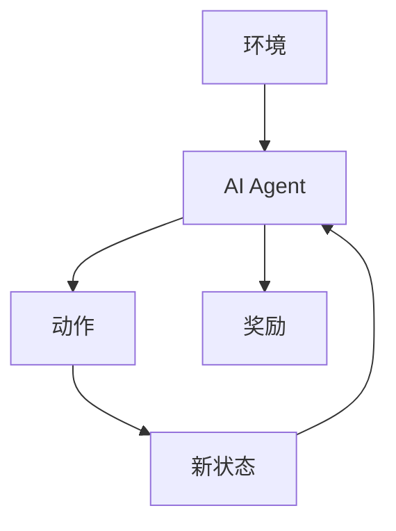
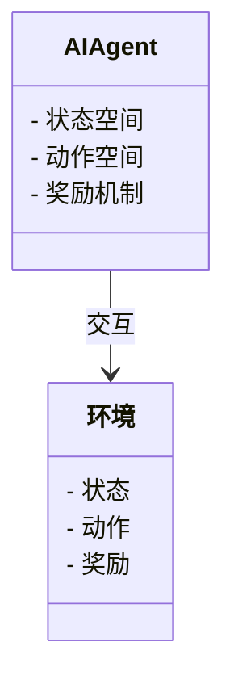
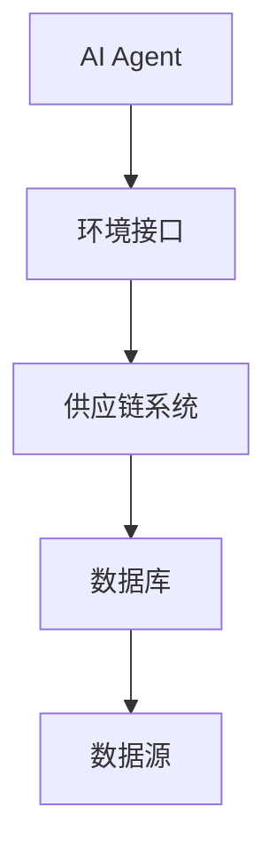
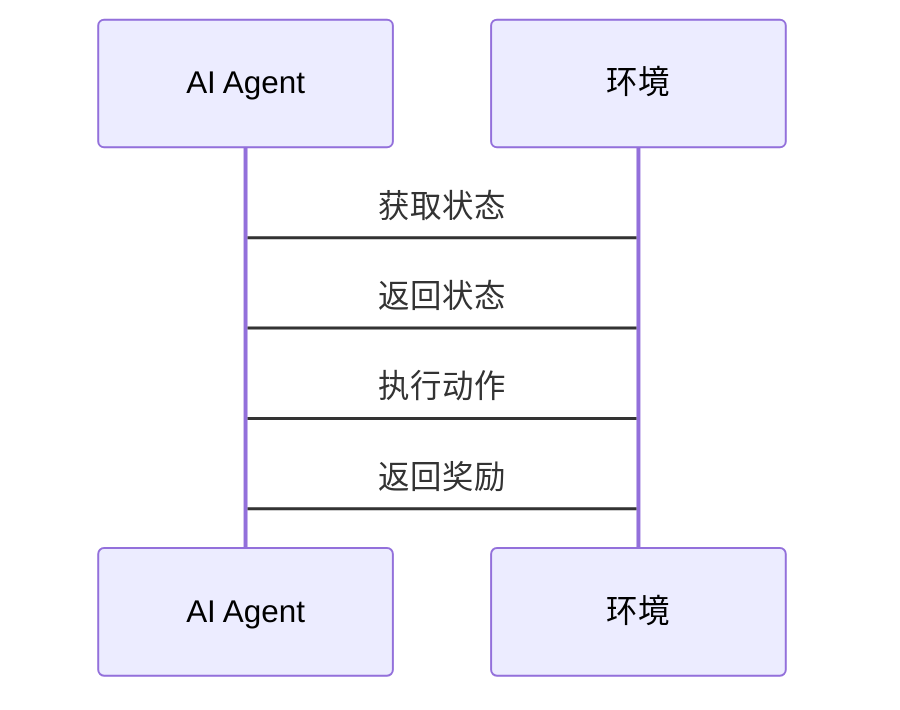

                 


# 《AI Agent在智能供应链优化中的应用》

---

## 关键词
AI Agent, 供应链优化, 智能算法, 强化学习, 供应链管理, 物流优化

---

## 摘要
本文深入探讨了AI Agent在智能供应链优化中的应用，从理论基础到实际应用，系统性地分析了AI Agent如何通过强化学习、生成对抗网络等算法优化供应链的库存管理、采购与生产计划、物流与配送等关键环节。文章结合实际案例，详细讲解了AI Agent在供应链优化中的算法原理、系统架构设计以及项目实战，为读者提供了全面的技术指导和实践参考。

---

# 第一部分: AI Agent与智能供应链优化的背景

## 第1章: AI Agent与供应链优化的背景介绍

### 1.1 AI Agent的基本概念与核心原理

#### 1.1.1 AI Agent的定义与分类
AI Agent（智能代理）是指能够感知环境、自主决策并执行任务的智能系统。根据功能和应用场景的不同，AI Agent可以分为以下几类：
- **简单反射型Agent**：基于当前输入直接生成输出，适用于规则明确的任务。
- **基于模型的反射型Agent**：利用内部状态模型进行决策，适用于复杂任务。
- **目标驱动型Agent**：以特定目标为导向，主动规划和执行任务。
- **效用驱动型Agent**：通过最大化效用函数来优化决策。

#### 1.1.2 供应链优化的核心问题
供应链优化的核心问题包括：
- **库存管理**：如何在满足需求的前提下最小化库存成本。
- **采购与生产计划**：如何优化采购和生产计划以降低整体成本。
- **物流与配送**：如何优化物流网络以提高效率和降低成本。

#### 1.1.3 AI Agent在供应链优化中的应用价值
AI Agent通过其自主决策和优化能力，能够显著提升供应链的效率和降低成本。例如：
- **库存管理**：AI Agent可以根据历史数据和预测需求，动态调整库存水平。
- **采购与生产计划**：AI Agent可以基于市场波动和供应商交货时间，优化采购和生产计划。
- **物流与配送**：AI Agent可以实时优化配送路径，降低物流成本。

### 1.2 智能供应链的演进与挑战

#### 1.2.1 传统供应链的局限性
传统供应链管理通常依赖人工经验和静态规则，存在以下问题：
- **效率低**：人工决策效率低下，难以应对复杂的市场变化。
- **成本高**：由于缺乏实时优化，库存和物流成本较高。
- **灵活性差**：难以快速响应市场需求的变化。

#### 1.2.2 智能供应链的定义与特点
智能供应链是指通过智能化技术（如AI、大数据、物联网等）实现供应链各环节的智能化管理和优化。其特点包括：
- **数据驱动**：基于实时数据进行决策。
- **自主优化**：通过AI算法自动优化供应链各环节。
- **动态调整**：能够快速响应市场变化。

#### 1.2.3 供应链优化的关键问题与挑战
供应链优化的关键问题包括：
- **数据获取与处理**：如何高效获取和处理多源异构数据。
- **算法优化**：如何设计高效的算法以解决复杂的优化问题。
- **系统集成**：如何将AI Agent与现有的供应链系统无缝集成。

---

# 第二部分: AI Agent的核心概念与原理

## 第3章: AI Agent的核心概念与原理

### 3.1 AI Agent的任务分解与优化机制

#### 3.1.1 任务分解的基本原理
AI Agent的任务分解是指将复杂的任务分解为多个子任务，并通过子任务的协同完成整体任务。例如，在供应链优化中，AI Agent可以将库存管理任务分解为预测需求、调整库存水平和监控执行情况等子任务。

#### 3.1.2 基于AI Agent的优化算法
AI Agent的优化算法通常包括强化学习、遗传算法等。以下是强化学习的基本原理：
- **状态空间**：表示环境中的状态。
- **动作空间**：表示AI Agent可以执行的动作。
- **奖励机制**：通过奖励函数引导AI Agent学习最优策略。

#### 3.1.3 多目标优化的实现方法
在供应链优化中，通常需要在多个目标之间进行权衡，例如成本最小化与服务最大化的平衡。多目标优化可以通过以下方法实现：
- **加权和法**：将多个目标权重化为一个综合目标。
- **帕累托最优**：寻找一组最优解，使得无法在不牺牲一个目标的情况下改善另一个目标。

### 3.2 AI Agent的学习机制与决策模型

#### 3.2.1 基于强化学习的决策模型
强化学习是一种通过试错学习来优化决策的算法。以下是强化学习的基本流程：
1. **环境感知**：AI Agent感知当前环境状态。
2. **动作选择**：基于当前状态选择一个动作。
3. **执行动作**：AI Agent执行选择的动作。
4. **奖励反馈**：根据动作的结果获得奖励或惩罚。
5. **策略更新**：根据奖励更新策略。

#### 3.2.2 基于监督学习的任务优化
监督学习是一种通过标注数据进行学习的算法。在供应链优化中，监督学习可以用于需求预测和库存管理。

#### 3.2.3 基于生成对抗网络的优化方法
生成对抗网络（GAN）是一种通过对抗训练生成数据的算法。在供应链优化中，GAN可以用于生成模拟数据和优化决策。

---

# 第三部分: AI Agent的算法原理与数学模型

## 第4章: 强化学习在AI Agent中的应用

### 4.1 强化学习的基本原理

#### 4.1.1 状态空间与动作空间
- **状态空间**：表示环境中的状态。
- **动作空间**：表示AI Agent可以执行的动作。

#### 4.1.2 奖励机制
奖励机制是强化学习的核心，通过奖励函数引导AI Agent学习最优策略。

#### 4.1.3 常见强化学习算法
- **Q-Learning**：基于Q值表的强化学习算法。
- **DQN（Deep Q-Network）**：基于深度神经网络的强化学习算法。

### 4.2 基于强化学习的供应链优化算法

#### 4.2.1 算法流程图


#### 4.2.2 数学模型与公式
- **Q值更新公式**：
  $$ Q(s, a) = Q(s, a) + \alpha (r + \gamma \max Q(s', a') - Q(s, a)) $$
- **DQN损失函数**：
  $$ \text{损失} = \mathbb{E}[(r + \gamma Q(s', a') - Q(s, a))^2] $$

---

## 第5章: 基于生成对抗网络的供应链优化

### 5.1 生成对抗网络的基本原理

#### 5.1.1 GAN的组成部分
- **生成器**：生成数据的网络。
- **判别器**：判别数据是否真实的网络。

#### 5.1.2 GAN的训练过程
1. **生成器生成数据**。
2. **判别器判断数据真伪**。
3. **更新生成器和判别器参数**。

### 5.2 基于GAN的供应链优化

#### 5.2.1 生成模拟数据
通过GAN生成模拟数据，用于训练和优化供应链模型。

#### 5.2.2 优化决策
通过GAN生成最优决策，例如优化库存水平和配送路径。

---

# 第四部分: AI Agent的系统架构设计

## 第6章: 供应链优化系统的架构设计

### 6.1 系统功能设计

#### 6.1.1 领域模型


#### 6.1.2 系统架构


### 6.2 系统接口设计

#### 6.2.1 API接口
- **输入接口**：接收环境状态和动作。
- **输出接口**：输出优化决策和奖励反馈。

#### 6.2.2 数据接口
- **数据输入**：接收实时数据。
- **数据输出**：输出优化结果。

### 6.3 系统交互设计

#### 6.3.1 交互流程


---

# 第五部分: AI Agent的项目实战

## 第7章: 供应链优化项目的实战

### 7.1 环境安装

#### 7.1.1 安装Python环境
```bash
python --version
pip install numpy
pip install tensorflow
pip install matplotlib
```

#### 7.1.2 安装依赖库
```bash
pip install gym
pip install scikit-learn
pip install pandas
```

### 7.2 核心实现

#### 7.2.1 强化学习实现
```python
import gym
import numpy as np

class AIAgent:
    def __init__(self, env):
        self.env = env
        self.q_table = np.zeros([env.observation_space.shape[0], env.action_space.n])
    
    def act(self, state):
        action = np.argmax(self.q_table[state])
        return action
    
    def learn(self, state, action, reward):
        self.q_table[state][action] += reward

# 初始化环境
env = gym.make('SupplyChain-v0')
agent = AIAgent(env)

# 训练过程
for episode in range(100):
    state = env.reset()
    total_reward = 0
    while True:
        action = agent.act(state)
        next_state, reward, done, _ = env.step(action)
        agent.learn(state, action, reward)
        total_reward += reward
        state = next_state
        if done:
            break
    print(f"Episode {episode}, Total Reward: {total_reward}")
```

#### 7.2.2 生成对抗网络实现
```python
import tensorflow as tf
from tensorflow.keras import layers

# 定义生成器
def generator():
    model = tf.keras.Sequential([
        layers.Dense(128, activation='relu'),
        layers.Dense(64, activation='relu'),
        layers.Dense(32, activation='sigmoid')
    ])
    return model

# 定义判别器
def discriminator():
    model = tf.keras.Sequential([
        layers.Dense(32, activation='relu'),
        layers.Dense(16, activation='relu'),
        layers.Dense(1, activation='sigmoid')
    ])
    return model

# 初始化GAN
g = generator()
d = discriminator()
```

### 7.3 实际案例分析

#### 7.3.1 库存管理优化
通过AI Agent优化库存管理，降低库存成本和缺货率。

#### 7.3.2 物流优化
通过AI Agent优化物流路径，降低配送成本和时间。

---

## 第8章: 应用案例分析

### 8.1 电商行业的应用
AI Agent在电商供应链中的应用，例如库存管理和物流优化。

### 8.2 制造业的应用
AI Agent在制造业供应链中的应用，例如采购与生产计划优化。

---

## 第9章: 总结与展望

### 9.1 总结
本文详细介绍了AI Agent在智能供应链优化中的应用，包括理论基础、算法原理、系统设计和项目实战。

### 9.2 展望
未来，AI Agent在供应链优化中的应用将更加广泛，尤其是在动态环境和复杂场景中的优化能力。

---

## 作者：AI天才研究院/AI Genius Institute & 禅与计算机程序设计艺术 /Zen And The Art of Computer Programming

